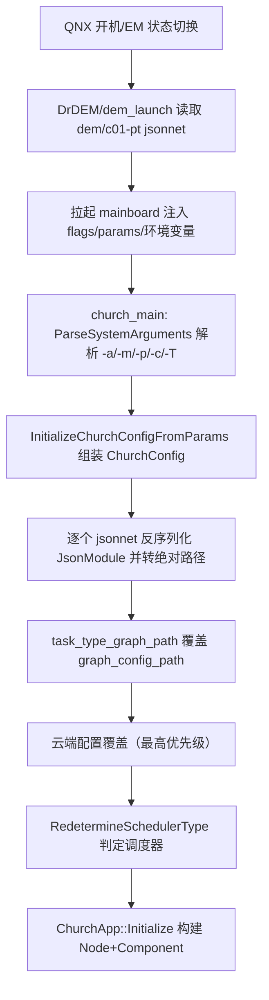
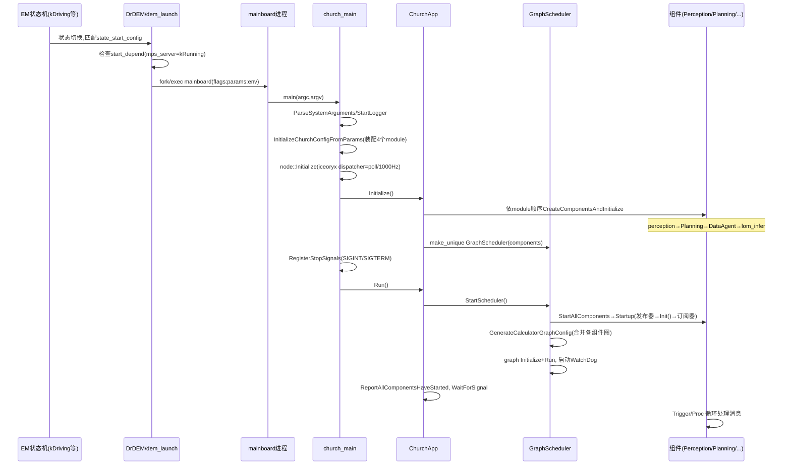

# 01 进程启动与 Church 框架初始化链路（C01 / orinx）

> **读者对象**：具备 C/C++ 基础、了解自动驾驶基本概念、不熟悉本仓库的开发者。  
> **仓库基准**：perception / planning / driver 检出于 `Stable_Master_4.0_new`；`/sandbox/platform/church`**无该分支，本文基于其 dev_master**（差异已经项目组确认）。全文文件路径均为仓库工作区绝对路径。  
> **名词表**：**Church**＝车端中间件框架（组件化 + 图调度 + 消息传输）；**DEM**＝DrDEM/dem_launch 进程守护启动器（QNX 侧）；**graphpipe**＝mediapipe 风格有向图执行引擎（`CalculatorGraph`）；**EM 状态**＝整车功能状态机（kFullFunction/kDriving 等）。  
> **核心问题索引**：A 单进程 E2E→§3.4/§4.2；B 启动入口→§1；C 组件注册→§2.3；D 初始化全链路→§2.2/§4；E 退出与重启→§4.4。

---

## 1. 进程入口与启动参数

### 1.1 可执行文件：mainboard

> 文件路径：/sandbox/driver/integration/BUILD  
> 函数名：driver_cc_binary  
> 核心逻辑：
> 
> ```python
> driver_cc_binary(
>     name = "mainboard",
>     srcs = ["mainboard.cc"],
>     linkopts = select({
>         "@platforms//os:qnx": [],
>         "//conditions:default": ["-export-dynamic"],   # 导出符号供 dlopen 注册
>     }),
>     deps = ["@platform//church/mainboard:church_main", "@glog//:glog", "@gflags//:gflags"],
>     linkstatic = True,
> )
> ```
> 
> 逻辑说明：车端主进程二进制名为 **mainboard**，静态链接 church_main，非 QNX 平台加 `-export-dynamic` 以支持组件 so 的注册符号查找。

> 文件路径：/sandbox/driver/integration/mainboard.cc  
> 函数名：main()  
> 核心逻辑：
> 
> ```cpp
> #include "church/mainboard/church_main.h"
> int main(int argc, char** argv) {
>   return deeproute::church::church_main(argc, argv);
> }
> ```
> 
> 逻辑说明：入口仅一行，全部逻辑下沉到 church 框架（§2.2）。

### 1.2 谁拉起 mainboard：DrDEM/dem_launch（证据：部署脚本与守护配置）

车端（orinx＝QNX + Drive Orin）由 **DrDEM** 守护进程拉起业务进程：

> 文件路径：/sandbox/.flamecraft-cleanup-20260910/drivers/opt/deeproute/start_dem.sh（车端 /opt/usr/oem/opt/deeproute/ 的部署快照，来自实车抓取）  
> 函数名：start_dem.sh  
> 核心逻辑：
> 
> ```bash
> if pidin |grep DrDEM >/dev/null 2>&1; then   # pidin 为 QNX 进程查看工具
>   echo "DrDEM is already running, cannot start"; exit 1
> fi
> /opt/usr/oem/opt/deeproute/dem/bin/DrDEM /opt/usr/oem/opt/deeproute/dem/config/dr_dem_config_manual.json
> ```
> 
> 逻辑说明：系统启动脚本先防重入再启动 DrDEM。`dem/config/dr_dem_config_manual.json` 定义 `start_cmd = "/ifs/bin/on -p 20r .../dem/bin/dem_launch --onboard"`、`DEEPROUTE_PATH=/opt/usr/oem/opt/deeproute`、pre/post 脚本与 `restart_times: 0`。dem/bin 下有 `DrDEM`、`dem_launch`、`dem_launch.par`（QNX 打包二进制，**源码不在工作区，其内部解析逻辑未验证**）。

每个业务进程由 dem 车型目录下的 jsonnet 描述。C01 的 perception 进程（**即 E2E 主进程**）：

> 文件路径：/sandbox/driver/config/dem/c01-pt/perception.jsonnet  
> 函数名：（配置文件，无函数）  
> 核心逻辑：
> 
> ```json
> { "node_name": "perception", "node_type": "church_node",
>   "function_group_name": "IDriverFG",
>   "state_start_config": [ {
>     "state": ["kFullFunction","kControlCalib","kDriving","kParking","kDataCollectorParking"],
>     "start_config": {
>       "start_depend": { "process": [{"process_name": "mps_server", "execution_state": "kRunning"}] },
>       "binary_path": "${DEEPROUTE_PATH}/perception/bin/mainboard",
>       "orin_flags": {
>         "module_conf": [
>           "${DEEPROUTE_PATH}/perception/config/perception_orin.jsonnet",
>           "${DEEPROUTE_PATH}/planning/config/planning.jsonnet",
>           "${DEEPROUTE_PATH}/data-agent-rt/config/data_agent_rt.jsonnet",
>           "${DEEPROUTE_PATH}/map-engine/config/lock_on_road/lom_infer/config/lom_infer.jsonnet"],
>         "max_logfile_num": "200", "dispatcher_mode": "poll", "dispatcher_poll_hz": "1000" },
>       "params": { "/task/task_type": "L2_driving" },
>       "recovery_method": "RECOVERY_RESET", "stop_timeout_sec": 5, ...
> ```
> 
> 逻辑说明：进程名 perception、类型 church_node；依赖 `mps_server`（NVIDIA MPS 服务）先 kRunning；`orin_flags` 是 orin 平台专用命令行覆盖；`recovery_method=RECOVERY_RESET` 描述崩溃恢复策略（§4.4）。jsonnet 经 `jsonnet_to_json` 规则编译（dem/c01-pt/BUILD），由 dem_launch 加载执行。

dem `flags` 的键与 church 命令行长选项一一对应：`module_conf→-m/--module_conf`、`params→-p/--parameter`、`dispatcher_mode→-M`、`dispatcher_poll_hz→-H`、`max_logfile_num→-n`（对照 §1.3 选项表）。**该映射由键名对照得出（推断）；dem_launch 无源码，未直接验证**。等价的完整实车命令行形如：`mainboard -m perception_orin.jsonnet -m planning.jsonnet -m data_agent_rt.jsonnet -m lom_infer.jsonnet -p /task/task_type=L2_driving -M poll -H 1000 -n 200`（推断）。

### 1.3 命令行参数全集与配置加载顺序

> 文件路径：/sandbox/platform/church/common/arg_parser.cc  
> 函数名：DisplayUsage / ParseSystemArguments  
> 核心逻辑：
> 
> ```cpp
> // 关键长选项（getopt_long）
> {"all_modules_conf", 'a'} {"module_conf", 'm'} {"parameter", 'p'}
> {"channel_type", 'c'}      // INTRA_PROCESS/SHM/ICEORYX/ROS，默认 ROS
> {"scheduler_type", 'T'} {"ddl_grpc_port", 'D'} {"ddl_grpc_size", 'z'}
> {"dispatcher_mode", 'M'} {"dispatcher_poll_hz", 'H'}
> {"log_dir", 'd'} {"max_log_size", 's'} {"max_logfile_num", 'n'} {"trace_mode", 't'} ...
> ```
> 
> 逻辑说明：`-a` 加载"全模块清单"（一个 jsonnet 含多个 module），`-m` 可重复加载多个单模块 jsonnet（C01 主进程即此形态），`-p key=value` 注入进程级参数（如 `/task/task_type`）。

**配置加载顺序**（详细机制见 §3）：



---

## 2. Church 框架核心机制

### 2.1 代码布局与核心类

`/sandbox/platform/church/` 目录职责：`mainboard`（church_main/ChurchApp/配置装配）、`node`（Node 与传输层 iceoryx/intra/ros）、`component`（Component 基类/触发器/监控）、`graph`（GraphScheduler/watch_dog，graphpipe）、`scheduler`（DDLScheduler 等）、`task`（ComponentTask）、`module`（就绪/崩溃上报）、`streaming`、`cache`。

核心类：`ChurchApp`（进程内应用骨架）、`Component`（组件基类）、`Node`（组件的消息收发上下文）、`Trigger`（触发器）、`ComponentRegistry`（组件工厂注册表）、`GraphScheduler`/`DDLScheduler`/`ConditionalScheduler`（三种调度器）。

### 2.2 初始化全流程（church_main → ChurchApp）

> 文件路径：/sandbox/platform/church/mainboard/church_main.cc  
> 函数名：deeproute::church::church_main()  
> 核心逻辑：
> 
> ```cpp
> int church_main(int argc, char** argv) {
>   InitParams init_params; init_params.system_argc = argc; init_params.system_argv = argv;
>   deeproute::church::ParseSystemArguments(init_params);          // 1) 解析命令行
>   if (!init_params.run) return 0;
>   EnableSignalHook(init_params);                                 // 2) 信号钩子
>   StartLogger(init_params);                                      // 3) 异步日志
>   SetAllowBreakingOrderMessage(init_params);
>   StartCommonTrace(init_params);                                 // 4) trace（可选）
>   ChurchConfig church_config;
>   MCHECK(InitializeChurchConfigFromParams(init_params, church_config)); // 5) 配置装配
>   deeproute::church::node::Initialize(GenerateTransportConfigFromChurchConfig(church_config)); // 6) 传输层(iceoryx等)
>   g_church_app = std::`make_unique<ChurchApp>`(std::move(church_config));
>   MCHECK(g_church_app->Initialize());                            // 7) 加载组件
>   RegisterStopSignals();                                         // 8) SIGINT/SIGTERM
>   deeproute::base::logger::InstallFailureResourceReclaimer(
>       RequestChurchAppReclaim, WaitForChurchAppReclaimed);       // 9) 崩溃前资源回收钩子
>   bool result = g_church_app->Run();                             // 10) 启动调度并阻塞
>   g_church_app->Stop(); g_church_app.reset(nullptr);
>   deeproute::church::node::Shutdown();                           // 11) 传输层关闭
>   ...
>   return (result == true ? 0 : -1);
> }
> ```
> 
> 逻辑说明：初始化顺序固定为 **参数→日志/信号→配置→传输层→组件加载→信号注册→Run 阻塞等待退出信号**；`Run()` 内部流程见 §4.1。

`ChurchApp::Initialize()` 逐 module 加载组件；`Run()` 启动监控器与调度器后 `WaitForSignal()` 信号量阻塞：

> 文件路径：/sandbox/platform/church/mainboard/church_app.cc  
> 函数名：ChurchApp::Initialize / ChurchApp::Run  
> 核心逻辑：
> 
> ```cpp
> bool ChurchApp::Initialize() {
>   for (const auto& module : church_config_.json_module()) {
>     if (!LoadModule(module)) return false;              // 顺序加载每个 module
>   }
>   if (SchedulerType::GRAPH == scheduler_type()) {
>     graph_scheduler_ = std::`make_unique<GraphScheduler>`(MakeComponentPointerVector());
>     schedule_monitor_->InstallOnGraph(*graph_scheduler_);
>   } else {
>     schedule_monitor_->InstallOnNodes(MakeNodePointerVector());
>   }
>   schedule_monitor_->InstallOnComponents(MakeComponentPointerVector());
>   anomaly_monitor_->Initialize(...);  return true;
> }
> bool ChurchApp::Run() {
>   schedule_monitor_->Start(); event_reporter_->Start(); anomaly_monitor_->Start();
>   if (!StartScheduler()) { ...ReportAllComponentsStartFailed(); return false; }
>   deeproute::church::module_report::Init(global_channel_type_);
>   deeproute::church::module_report::ReportAllComponentsHaveStarted();
>   module_readiness_reporter_->ReportModulesSupervisedTopics(church_config_);
>   module_crash_reporter_->Start();
>   WaitForSignal();  return true;    // 信号量阻塞，直到 RequestStop
> }
> ```
> 
> 逻辑说明：C01 主进程调度器为 GRAPH（判定见 §3.3），故组件挂入 GraphScheduler；调度器启动失败会向模块上报并使进程退出。

### 2.3 组件注册机制（问题 C 答案）

**注册发生在编译期符号的静态初始化阶段**，组件 so/mainboard 被加载后即自注册；实例化由框架按 jsonnet 的 `class_name` 查注册表完成：

> 文件路径：/sandbox/platform/church/component/component.h  
> 函数名：CHURCH_REGISTER_COMPONENT（宏）/ ComponentRegistry  
> 核心逻辑：
> 
> ```cpp
> class ComponentRegistry {
>  public:
>   static void Register(const std::string& name,
>                        std::function<std::`shared_ptr<Component>`()> func);
>   static std::`shared_ptr<Component>` Create(const std::string& name);
> };
> #define CHURCH_REGISTER_FACTORY_FUNCTION_INTERNAL2(name, var_name, ...) \
>   namespace { struct ComponentRegistry_##var_name {                     \
>     ComponentRegistry_##var_name() {                                    \
>       deeproute::church::ComponentRegistry::Register(#name, __VA_ARGS__);} \
>   }; } static ComponentRegistry_##var_name component_registry_##var_name;
> #define CHURCH_REGISTER_COMPONENT(name) \
>   CHURCH_REGISTER_FACTORY_FUNCTION(name, std::`make_unique<name>`)
> ```
> 
> 逻辑说明：`CHURCH_REGISTER_COMPONENT(PerceptionComponent)` 生成一个全局静态对象，**动态库被 dlopen（或 mainboard 静态链接）时其构造函数执行，把"类名→工厂函数"写入全局注册表**。

实例化与初始化入口：

> 文件路径：/sandbox/platform/church/mainboard/church_app.cc  
> 函数名：ChurchApp::CreateComponentsAndInitialize  
> 核心逻辑：
> 
> ```cpp
> for (auto& component : module_config.components()) {
>   const std::string& class_name = component.class_name();      // 如 "PlanningComponent"
>   const std::string& component_name = component.config().name();
>   auto node = std::`make_unique<Node>`(component_name, kLatencyWarnThreshold);
>   std::optional<std::`shared_ptr<Component>`> component_optional =
>       ::deeproute::church::ComponentRegistry::Create(class_name);   // 工厂实例化
>   if (!component_optional.has_value() || !component_optional.value()) return false;
>   std::`shared_ptr<Component>` base = std::move(component_optional.value());
>   for (auto& param : church_config_.param()) base->SetParam(param.key(), param.value()); // -p 参数注入
>   if (!base->Initialize(node.get(), component.config())) return false;
>   base->SetParam(kChannelTypeKey, ChannelType_Name(global_channel_type_));
>   ComponentContext component_context{component_name, std::move(node), base};
>   component_contexts_.emplace_back(std::move(component_context));
> }
> ```
> 
> 逻辑说明：**每个组件配一个专属 Node**；组件按 jsonnet 数组顺序创建；命令行 `-p` 参数注入所有组件的 params（组件内 `GetParam("/task/task_type",...)` 即来源于此）。`LoadModule` 先 `LoadLibrary`（dlopen 组件 so，路径由 `module_library` 字段指定并可缺省）再创建组件。

两个具体组件的注册位置：perception 在 perception_component.cc 末行 `CHURCH_REGISTER_COMPONENT(PerceptionComponent)`（/sandbox/driver/integration/components/perception_component.cc:313）；planning 在 planning_component.h 末尾 `CHURCH_REGISTER_COMPONENT(PlanningComponent)`（/sandbox/driver/integration/components/planning_component.h:34，注意在**头文件**中，随 include 传播）。

### 2.4 组件生命周期

> 文件路径：/sandbox/platform/church/component/component.cc  
> 函数名：Component::Initialize / Component::Startup  
> 核心逻辑：
> 
> ```cpp
> bool Component::Initialize(Node* node, const ComponentConfig& config) {
>   Check_Component_Version(); config_ = config; node_ = node; name_ = config.name();
>   LoadParamsFromCloudConfig();                       // 云端参数下发
>   context_manager_ = std::`make_unique<ContextManager>`();
>   if (config.task().has_context_config()) { ...RegisterDumpPolicy(...); }
>   InitChannelCaches();  InitializeTrigger();         // 输入缓存 + 触发器
>   return true;
> }
> bool Component::Startup() {
>   RegisterAllPublishers();                           // 注册输出通道
>   bool status = Init();                              // 子类业务初始化
>   RegisterAllSubscribers();                          // 订阅输入通道
>   return status;
> }
> ```
> 
> 逻辑说明：生命周期为 `Initialize`（框架侧装配）→ `Startup`（注册发布器→Init→注册订阅器）→ 运行期反复 `Proc()`（由触发器/图调度驱动）→ `Shutdown`/`Clear`。触发器实现于 component/ 下 `framesync_trigger.h`、`immediate_trigger.h`、`periodic_trigger.h`、`notrigger_trigger.h`，对应 jsonnet 中 `trigger_policy: FRAMESYNC/IMMEDIATE/PERIODIC`。

业务组件示例——**PerceptionComponent::Init() 并不起感知算法**，而是构造伪命令行解析 gflags，真正的感知初始化在图计算 calculator 中调用 `InitPerceptionStream`（同样走 `CreateGraphManager`，与独立进程 main.cpp 完全共用一套核心，见 /sandbox/perception/perception/church_component/perception_component_api.cpp:39）：

> 文件路径：/sandbox/driver/integration/components/perception_component.cc  
> 函数名：PerceptionComponent::Init  
> 核心逻辑：
> 
> ```cpp
> // 伪命令行：perception -launch_mode=church -perception_config_filename=
> //           /opt/deeproute/perception/share/perception/perception_{arch}_{mode}.cfg
> std::string fake_command_line = BuildPerceptionCommandLine(config_filename);
> int errcode = wordexp(fake_command_line.c_str(), &fake_cmd_argv_, 0);   // QNX 用 wordexp_compat
> google::ParseCommandLineFlags(&fake_argc, &fake_argv, true);
> ...
> AddInputSidePacket("dtu_response_publish_handle", handler);             // 传给图内 calculator
> ```
> 
> 逻辑说明：`launch_mode=church` 使感知核心以库形态运行在 mainboard 内；感知模式优先级：**云端 `/config/perception_mode` > task_type 映射 > 默认 l2avp**；配置文件名按 `perception_{arch}_{mode}.cfg` 拼接并检查存在性。

---

## 3. 配置加载流程

### 3.1 两层配置体系

| 层 | 文件 | 消费者 | 作用 |
|-|-|-|-|
| 进程层（DEM） | driver/config/dem/<车型>/\*.jsonnet | dem_launch（DrDEM） | 定义进程二进制、命令行、状态机、调度/CGROUP、恢复策略 |
| 模块层（component） | driver/config/component/\*.jsonnet | mainboard（church） | 定义组件 class_name、输入输出通道、触发策略、图配置路径 |

部署映射已被实车快照证实：`driver/config/component/planning.jsonnet` → 部署为 `${DEEPROUTE_PATH}/planning/config/planning.jsonnet`；`driver/config/component/perception_orin.jsonnet` → `${DEEPROUTE_PATH}/perception/config/perception_orin.jsonnet`（对照部署快照 planning/config/、perception/config/ 目录内容）。

### 3.2 jsonnet → ChurchConfig 的解析

> 文件路径：/sandbox/platform/church/mainboard/config_utils.cc  
> 函数名：ReadAllJsonModuleConfig  
> 核心逻辑：
> 
> ```cpp
> if (init_params.component.all_modules_conf != "") {          // -a：单文件多模块
>   JsonConfig json_config;
>   base::GetProtoFromJsonnetFile(all_modules_conf_file, &json_config);
>   for (auto& module : json_config.module_config()) { church_config.add_json_module(); ... }
> }
> for (auto& module_conf : init_params.component.module_conf_list) {  // -m：多文件
>   auto* json_module = church_config.add_json_module();
>   base::GetProtoFromJsonnetFile(module_path, json_module);
>   UpdateLibraryPathToAbsolutePath(*json_module);   // 库路径转 ${work_root}/bazel-bin 绝对路径
> }
> UpdateComponentChannelTypeIfNotSet(church_config);   // 未指定 channel_type 用全局值
> TryOverrideGraphPathWithTaskTypeGraphPath(church_config); // task_type 匹配 graph_path
> ApplyCloudComponentConfig(church_config);            // 云端覆盖，注释：Cloud config has highest priority
> UpdateGraphPathToAbsolutePath(church_config);
> ```
> 
> 逻辑说明：**module 顺序＝命令行 `-m` 顺序**（§4.2 的加载顺序据此确定）。jsonnet 经 protobuf 反序列化（`JsonConfig/JsonModule`），组件库路径与图配置路径补全为绝对路径。

### 3.3 配置优先级链（高→低）

1. **云端配置**：`ApplyCloudComponentConfig` 用 `CloudConfigManager` 覆盖组件的 `graph_config_path`；云端参数还会在 `Component::Initialize→LoadParamsFromCloudConfig()` 下发。云端文件查找顺序（/sandbox/platform/church/common/cloud_config_manager.h）：`${DR_CACHE_DIR}/common/config/driver/${DR_VERSION_SHORTNAME}/functions_cloud_config.json` → 默认 `${DEEPROUTE_PATH}/driver/config/cloud_config_default/functions_cloud_config.json`（对应仓库 `driver/config/cloud_config_default/C01-PT/`）。
2. **task_type 条件图**：`task_type_graph_path` 按 `-p /task/task_type` 命中后覆盖 `graph_config_path`（如 `L2_driving_vision` 切到 `perception_graph_vision_orin.cfg`，见 /sandbox/driver/config/component/perception_orin.jsonnet:21-30）。
3. **车型/架构 jsonnet 本体**（c01-pt/orin 变体、orin_flags）。
4. 命令行 `-p` 与全局默认（channel_type 默认 ROS 等）。

调度器类型判定（同一文件 `RedetermineSchedulerType`）：组件带 `graph_config_path` → **SchedulerType::GRAPH**；存在 `PERIODIC/IMMEDIATE` 触发策略 → CONDITIONAL；`LEGACY` 不支持（FATAL）。C01 主进程 perception/Planning 均有 graph_config_path，且仓库默认 `--config=with_graphpipe`（perception/.bazelrc:48、planning/.bazelrc:46），故运行 GRAPH 调度器。

车型选择机制：dem 与 thread/stream 配置经 **bazel config_setting（如 `@deeproute_build_tools//:C01-PT_setting`）在构建期选入 `config/dem/c01-pt`**（/sandbox/driver/config/dem/BUILD:10-12），即车型差异在打包期固化，运行期不切换。

### 3.4 问题 A 结论：C01 下 perception 与 planning 同进程（已验证）

证据链（均可复查）：

- dem/c01-pt/perception.jsonnet 的同一 `binary_path=${DEEPROUTE_PATH}/perception/bin/mainboard`，其 `orin_flags.module_conf`**同时包含**`perception/config/perception_orin.jsonnet` 与 `planning/config/planning.jsonnet`（§1.2 代码片段）；
- `env_config.MLOG_modules: "perception,planning"`、`THREAD_CONFIG_PATH=driver/config/thread_config/perception.json` 单文件同时定义 `t_perception` 与 `t_Planning`、`plan_main/plan_worker` 等线程（§5.2）；
- dem/c01-pt 目录下**不存在** planning/control 独立进程 jsonnet；
- 仓库默认启用 graphpipe：perception/.bazelrc:48、planning/.bazelrc:46 `build --config=with_graphpipe`。

同进程内还挂载 **data-agent-rt**（数据回传）与 **lom_infer**（map-engine 的 lock-on-road 推理；dem/c01-pt/BUILD 注释"lom_infer 默认在 perception 中，通过 --config=do_lom_infer_in_map_engine 交换到 map_engine"）。**差异**：`driver/config/component/drvla_orin.jsonnet` 定义了单组件 E2E 形态（DrvlaComponent，触发 `/perception/ras_map_nn`，输出 `/vla/vla_output`），但 C01 的 dem 中未配置 drvla 进程——C01 走 perception+planning 同进程形态，drvla 形态为其他车型/演进方案。

---

## 4. 模块启动时序

### 4.1 端到端启动时序图



### 4.2 组件加载与初始化顺序（已验证）

顺序由两个层面决定：

1. **创建顺序**＝`-m` 传参顺序＝jsonnet 内 components 数组顺序：`perception_orin.jsonnet(PerceptionComponent) → planning.jsonnet(PlanningComponent) → data_agent_rt.jsonnet → lom_infer.jsonnet`（ChurchApp::Initialize 的 for 循环）。
2. **启动顺序**＝`GraphScheduler::StartAllComponents` 按同一列表逐个 `component->Startup()`（RegisterAllPublishers→Init→RegisterAllSubscribers，/sandbox/platform/church/graph/graph_scheduler.cc:636-645），随后**合并各组件 CalculatorGraphConfig 为一张图**再 `graph_->Initialize/Run`（graph_scheduler.cc:91-121）。

DDL 调度器路径（非 C01 主进程，但组件失败语义一致）：`StartAllTasks→CreateAndStartTask(ComponentTaskDDL)→WaitAllTasksStartSuccess`，任一组件 `Init()/RegisterAllSubscribers()` 失败即整体启动失败并上报（church_app.cc:288-325）。

### 4.3 停止流程

`RegisterStopSignals` 注册 SIGINT/SIGTERM → `SignalHandler→g_church_app->RequestStop()`（`module_report::SetExiting + stop_semaphore_.Post()`）→ `Run()` 返回 → `ChurchApp::Stop()`：`module_crash_reporter_->Stop() → StopScheduler()（清 observers→StopAllTasks/图停止→等任务退出）→ anomaly/event/schedule_monitor 停止 → component_contexts_.clear()（析构组件）→ module_report::Finish`，最后 `node::Shutdown()`、停日志、`ShutdownProtobufLibrary`（church_main.cc:218-232）。

### 4.4 异常监控与重启（问题 E 答案）

进程内（不重启，只告警/上报）：

- **graph_watch_dog**：每秒检查图内节点有无新帧，超 1s 打 WARN "There is no incoming frame"（/sandbox/platform/church/graph/watch_dog.h:46-65）；ChannelSuspendAlarm 监控订阅通道长时间无数据并告警。
- **崩溃上报**：`InstallFailureResourceReclaimer(RequestChurchAppReclaim, WaitForChurchAppReclaimed)` 挂接 glog failure signal handler；致命信号/崩溃发生时先回收并上报 `ReportAllComponentsAbnormalExit()`（module_crash_reporter.cc:69-80），随后进程退出。
- anomaly_monitor / schedule_monitor 周期上报组件调度异常事件。

进程间重启：由 **DrDEM/dem_launch 按 `recovery_method: RECOVERY_RESET` 拉起（§1.2）。重启的具体退避/联动策略未验证**（dem_launch 无源码）；可证实的配置事实：`stop_timeout_sec: 5`、cgroup 内存 `limit 11264MB/soft 7496MB、oom_control 0`（OOM Killer 打开）。

---

## 5. 线程模型

### 5.1 线程配置加载机制

> 文件路径：/sandbox/common/base/thread/thread_manager.cc  
> 函数名：ThreadManager::ThreadManager  
> 核心逻辑：
> 
> ```cpp
> const char kThreadConfigEnv[] = "THREAD_CONFIG_PATH";
> ThreadManager::ThreadManager() {
>   cfg_file_path_ = GetEnv(kThreadConfigEnv);          // 由 DEM env_config 注入
>   if (PathExists(cfg_file_path_) && GetJsonFromASCIIFile(cfg_file_path_, cfg)) {
>     for (const auto& process_conf : cfg.process_conf) {
>       default_thread_cpuset_ = process_conf.default_thread_task_cpuset;
>       default_thread_policy_ = process_conf.default_thread_policy; ...
>       for (const auto& thread_conf : process_conf.threads)
>         inner_thr_confs_[thread_conf.name] = thread_conf;   // 按线程名匹配
>     }
>   }
> }
> ```
> 
> 逻辑说明：进程内线程库按**线程名**匹配调度策略/优先级/cpuset，未命中的用默认值。该文件由 dem env_config 的 `THREAD_CONFIG_PATH=${DEEPROUTE_PATH}/driver/config/thread_config/perception.json` 指定。

### 5.2 C01 主进程线程划分（driver/config/thread_config/C01/perception.json）

进程默认：`default_thread_task_cpuset: 0-10`、`SCHED_OTHER`、优先级 0。关键命名线程（节选）：

| 线程名 | 策略/优先级 | cpuset | 职责 |
|-|-|-|-|
| t_perception | SCHED_RR / 6 | 1-5 | 感知组件任务线程（task 名与 jsonnet `task.name` 一致） |
| t_Planning | SCHED_RR / 5 | 1-5 | 规划组件任务线程 |
| pp / nn_pre / mediapipe / nn_internal_designated | SCHED_RR / 6 | 1-5 | 感知图内后处理/前处理/图执行/NN 线程 |
| plan_main / plan_worker / plan_stitch / planning_executor / open_space_worker | SCHED_RR / 5 | 1-5 | planning 内部线程池 |
| t_lom_infer | SCHED_RR / 4 | 6-8 | lock-on-road 推理（独占 6-8 核） |
| data_agent_executor / desen_dispatch / boxsender_dispatch | SCHED_RR / 1 | 0,9-10 | 数据回传 |
| iceoryx_dispatch / graph_timer | SCHED_RR / 6 | 1-5 | 框架消息分发/图定时线程（perception.json L59-63/L71-75） |
| async_logger / sched_monitor / c_anomaly_monit 等监控类 | SCHED_OTHER / -10 | 0-10 | 日志/监控线程 |

规划线程与感知线程共存于同一进程线程表，是问题 A 的补充证据。

### 5.3 图执行器线程

> 文件路径：/sandbox/driver/config/component/perception_graph_l2avp_orin.cfg  
> 函数名：（graphpipe 文本协议图配置）  
> 核心逻辑：
> 
> ```text
> max_queue_size: 15
> num_threads: 5
> executor { name: "nn_internal_designated"
>   options { [mediapipe.ThreadPoolExecutorOptions.ext] { num_threads: 4
>             thread_name_prefix: "nn_" } } }
> node { name: "perception_assemble"  calculator: "FrameSyncCalculator"
>   input_stream: "FRAMESYNC:0:sensors__lidar__combined_point_cloud_proto" ... }
> ```
> 
> 逻辑说明：C01 感知图为 **FrameSyncCalculator 帧同步**（帧基 100ms，lidar+多路 camera）驱动的 mediapipe 图；church 在建图时把 mediapipe 默认执行器替换为 common 线程池实现（`UpdateExecutor`，注释"Change mediapipe executor to thread pool in common repo"）。进程级还受 DEM `scheduling {cpuset 1-5, SCHED_OTHER, nice -10}` 与内存 cgroup 约束。

---

## 6. 启动链路代码溯源

| # | 步骤 | 文件（绝对路径） | 函数/位置 |
|-|-|-|-|
| 1 | 守护拉起 | /sandbox/.flamecraft-cleanup-20260910/drivers/opt/deeproute/start_dem.sh；dem/config/dr_dem_config_manual.json | start_dem.sh；service_config.start_cmd |
| 2 | 进程定义 | /sandbox/driver/config/dem/c01-pt/perception.jsonnet | state_start_config[0].start_config |
| 3 | main 入口 | /sandbox/driver/integration/mainboard.cc；BUILD | main()；driver_cc_binary "mainboard" |
| 4 | 参数解析 | /sandbox/platform/church/common/arg_parser.cc | ParseSystemArguments() |
| 5 | 配置装配 | /sandbox/platform/church/mainboard/config_utils.cc | InitializeChurchConfigFromParams()/ReadAllJsonModuleConfig() |
| 6 | 传输层初始化 | /sandbox/platform/church/node/init.cc；iceoryx_dispatcher.cc | node::Initialize()→Transport 单例 |
| 7 | 组件加载 | /sandbox/platform/church/mainboard/church_app.cc | ChurchApp::Initialize()→LoadModule()→CreateComponentsAndInitialize() |
| 8 | 注册表工厂 | /sandbox/platform/church/component/component.h/.cc | CHURCH_REGISTER_COMPONENT 宏；ComponentRegistry::Create() |
| 9 | 组件生命周期 | /sandbox/platform/church/component/component.cc | Component::Initialize()/Startup()/Shutdown() |
| 10 | 业务组件 | /sandbox/driver/integration/components/perception_component.cc、planning_component.cc/.h | PerceptionComponent::Init()；PlanningComponent::Init() |
| 11 | 图调度启动 | /sandbox/platform/church/graph/graph_scheduler.cc | GraphScheduler::Start()/StartAllComponents()/GenerateCalculatorGraphConfig() |
| 12 | 信号与退出 | /sandbox/platform/church/mainboard/church_main.cc | RegisterStopSignals()/SignalHandler()/ChurchApp::Stop() |
| 13 | 崩溃上报 | /sandbox/platform/church/module/module_crash_reporter.cc | ReportRoutine()→ReportAllComponentsAbnormalExit() |
| 14 | 线程策略 | /sandbox/common/base/thread/thread_manager.cc；/sandbox/driver/config/thread_config/C01/perception.json | ThreadManager()；process_conf.threads |
| 15 | 感知核心初始化 | /sandbox/perception/perception/church_component/perception_component_api.cpp；/sandbox/perception/perception/main.cpp | InitPerceptionStream()（两种进程形态共用） |

**全链路调用栈（文字版）**：`EM 状态切换 → dem_launch（读 dem/c01-pt jsonnet）→ exec mainboard → main → church::church_main → ParseSystemArguments → InitializeChurchConfigFromParams（4×jsonnet→ChurchConfig）→ node::Initialize(iceoryx) → ChurchApp::Initialize → LoadModule×4 → ComponentRegistry::Create（静态注册表）→ Component::Initialize → RegisterStopSignals → ChurchApp::Run → GraphScheduler::Start → Component::Startup×N（Publishers→Init→Subscribers）→ CalculatorGraph::Initialize/Run → FrameSyncCalculator 触发 → Component::Proc 循环 → （SIGTERM）ChurchApp::Stop → node::Shutdown → 退出码返回 dem_launch`。

---

## 附：未验证项与差异汇总

| 项 | 状态 | 说明 |
|-|-|-|
| dem_launch 解析/拉起细节、重启退避策略 | 未验证 | dem_launch/DrDEM 为 QNX 二进制，无源码；结论仅基于配置字段与部署脚本 |
| dem flags 键 → church 命令行选项映射 | 推断 | 键名与 arg_parser 长选项一一对应，未直接验证 |
| platform/church 与 Stable_Master_4.0_new 的差异 | 已知差异 | 该仓库无此分支，本文基于 dev_master |
| C01 使用的感知图（perception_graph_l2avp_orin.cfg）内 calculator 全集 | 部分验证 | 已验证 FrameSyncCalculator 与执行器配置；全图 180 行未逐节点展开 |
