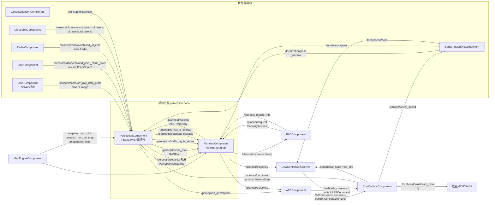

# 02 模块配置与 Topic 数据流拓扑（C01 / orinx）

> **读者对象**：具备 C/C++ 基础、了解自动驾驶基本概念、不熟悉本仓库的开发者。  
> **仓库基准**：perception / planning / driver 检出于 `Stable_Master_4.0_new`；`/sandbox/platform/church` 无该分支，**本文 church 代码基于 dev_master**（差异已经项目组确认）。所有路径为仓库工作区绝对路径。  
> **与 01 篇分工**：本文聚焦 **Topic 声明（jsonnet）→ 订阅/发布（代码）** 的数据流拓扑；进程如何被拉起、组件如何注册等生命周期内容见《01_进程启动与 Church 框架初始化链路》。  
> **名词表**：**Topic/Channel**＝church 框架中以字符串命名的消息通道；**jsonnet**＝JSON 超集配置语言，组件的输入/输出通道在此声明；**DEM 配置**＝`dem/<车型>/` 下的进程启动描述（node→二进制→module_conf）；**FRAMESYNC**＝帧同步触发策略；**graphpipe**＝mediapipe 风格有向图执行引擎；**proto**＝Protocol Buffers 消息。

---

## 1. Component 配置详解

### 1.1 配置层级与装载链（C01 实际生效路径）

C01（orinx 平台 C01PT）的组件通道配置分四层，从上到下覆盖：

```
[第1层] driver/config/dem/c01-pt/*.jsonnet     进程启动配置（node_name/binary_path/module_conf）
[第2层] driver/config/component/<组件>.jsonnet  组件通道声明（通用）
[第2层'] driver/config/component/c01-pt/*.jsonnet C01 车型专属组件声明（仅相机）
[第3层] 运行时 params / cloud config            参数覆盖（如 /task/task_type、/config/perception_mode）
```

关键证据——C01 的感知进程（E2E 主进程）通过 `module_conf` 装载 orin 版组件配置：

> 文件路径：/sandbox/driver/config/dem/c01-pt/perception.jsonnet  
> 函数名：（配置文件）  
> 核心逻辑：
> 
> ```json
> "node_name": "perception",
> "binary_path": "${DEEPROUTE_PATH}/perception/bin/mainboard",
> "orin_flags": {
>     "module_conf": [
>         "${DEEPROUTE_PATH}/perception/config/perception_orin.jsonnet",
>         "${DEEPROUTE_PATH}/planning/config/planning.jsonnet",
>         "${DEEPROUTE_PATH}/data-agent-rt/config/data_agent_rt.jsonnet",
>         "${DEEPROUTE_PATH}/map-engine/config/lock_on_road/lom_infer/config/lom_infer.jsonnet"
>     ]
> },
> "params": { "/task/task_type": "L2_driving" }
> ```
> 
> 逻辑说明：C01 上 **perception 与 Planning 组件运行在同一个 church node（mainboard 进程）**，分别装载 `perception_orin.jsonnet` 与 `planning.jsonnet`。这与 `thread_config/C01/perception.json` 中 `t_perception`、`t_Planning` 两个任务同属 "perception" 进程的线程配置互为印证。

车型维度的文件选择由 bazel `select` 按 `C01-PT_setting` 完成（**车型配置优先于通用配置的机制性证据**）：

> 文件路径：/sandbox/driver/config/stream_config/BUILD  
> 函数名：deeproute_release_package  
> 核心逻辑：
> 
> ```python
> srcs = selects.with_or({
>     "@deeproute_build_tools//:C01-PT_setting": [
>         "//config/stream_config/C01:stream_config",
>     ],
>     ...
> })
> ```
> 
> 逻辑说明：church 调度器的流优先级配置（`stream_config/C01/perception.json`、`map_engine.json`）按车型选择打包；同样的 select 见 `config/module_event/BUILD`（`//config/module_event/c01-pt`）与 `config/BUILD`（C01-PT 映射 `@common//config_service:c01_pt_config_files`，即 `common/config_service/config_files/C01-PT/config_service.json` 的功能开关）。

### 1.2 C01 实际加载的组件通道配置清单

| 配置文件（driver/config/component/ 下） | class_name | 角色 |
|-|-|-|
| perception_orin.jsonnet（orin 生效；perception.jsonnet 为 x86 对照） | PerceptionComponent | 感知 E2E |
| planning.jsonnet | PlanningComponent | 规划 |
| c01-pt/sensor_camera_orin.jsonnet | CamComponent | 前视 7V 相机 |
| c01-pt/sensor_camera_panoramic_orin.jsonnet | CamComponent | 环视 4V 相机 |
| sensor_lidar.jsonnet | LidarComponent | 激光雷达 |
| sensor_radar.jsonnet | RadarComponent | 毫米波雷达 |
| sensor_uss.jsonnet | UltrasonicComponent | 超声波 |
| sensor_ins_online.jsonnet | SensorInsOnlineComponent | 组合导航定位 |
| gps_localization.jsonnet | GpsLocalizationComponent | GNSS 解算 |
| cbw.jsonnet / cbw_canbus.jsonnet / cbw_control.jsonnet | Cbw\*Component | 线控域（底盘/控制） |
| blc.jsonnet | BLCComponent | 业务逻辑控制（Body Logic Control） |
| aeb.jsonnet | AEBComponent | AEB |
| map_engine.jsonnet | MapEngineComponent | 地图引擎 |
| drvla_orin.jsonnet、percep_adas\*.jsonnet、around_view_monitor_orin.jsonnet、bridge_domain_v12.jsonnet 等 | —— | 按场景/状态裁剪 |

注：`control_component.cc` 在工作区为 **0 字节空文件**，C01 的控制功能由 `CbwControlComponent` 承担（差异，证据：`ls -la driver/integration/components/control_component.cc`）。

### 1.3 c01-pt 车型目录详解（相机）

`c01-pt/sensor_camera_orin.jsonnet` 声明 CamComponent（前视 7V）：输入 `/canbus/car_state`、`/canbus/car_info`、`/camera/command`、`/gwm/havp_svp_scrn_info`、`/data_agent/desensitization_boxes`（均 optional）；输出 7 路 `_raw_data_proto`（`deeproute.drivers.Image`，带 `need_topic_supervision`）、对应 `/compressed_proto`（`deeproute.drivers.CompressedImage`）及 `/media/cms_left|right/compressed_proto`、`/media/sensor_luma_info_proto`。`panoramic_orin.jsonnet` 同构，输出 `panoramic_1~4`。

代码中的发布与配置一一对应（topic 由 frame_id 动态拼装）：

> 文件路径：/sandbox/driver/integration/components/cam_component.cc  
> 函数名：CamComponent::Init()  
> 核心逻辑：
> 
> ```cpp
> g_proto_jpg_topic_map[p.first] =
>     "/sensors/camera/" + p.second + "/compressed_proto";
> g_proto_bgra_topic_map[p.first] = "/sensors/camera/" + p.second + "_proto";
> g_proto_compressed_topic_map[p.first] =
>     "/sensors/camera/" + p.second + "/compressed_proto";
> g_proto_raw_topic_map[p.first] = "/sensors/camera/" + p.second + "_proto";
> ...
> node()->RegisterTopicObserver("/canbus/car_info", [&](...) { impl_->CarInfoHandler(command); });
> ```
> 
> 逻辑说明：发布 topic = 前缀 + frame_id + 后缀，展开后与 `c01-pt/sensor_camera_orin.jsonnet` 的 `output_channels` 完全一致；`/canbus/*` 通过 TopicObserver 异步观察（不占用 Proc 输入向量）。

### 1.4 配置优先级

以感知模式选择为例，**cloud config > task_type > 默认值**：

> 文件路径：/sandbox/driver/integration/components/perception_component.cc  
> 函数名：PerceptionComponent::GetPerceptionMode()  
> 核心逻辑：
> 
> ```cpp
> if (GetParam("/config/perception_mode", &perception_mode)) {  // Priority 1: cloud
>   return perception_mode;
> }
> if (GetParam("/task/task_type", &task_type)) {                // Priority 2: task_type
>   if (task_type == kTaskTypeL4) return kPerceptionConfigL4;
>   else if (task_type == kTaskTypeL2Driving /*...*/) return kPerceptionConfigL2AVP;
> }
> return kPerceptionConfigL2AVP;                                // Priority 3: default
> ```
> 
> 逻辑说明：C01 由 DEM params 注入 `/task/task_type=L2_driving`，若无云端覆盖则感知以 l2avp 模式运行，加载 `perception/config/perception_orin_l2avp.cfg`（源文件 /sandbox/perception/perception/cfg/perception_orin_l2avp.cfg）。

---

## 2. 输入 Topic 清单（C01 主线）

**频率说明**：感知帧同步基准 `frame_nano_base: 100000000`（100ms），故感知/规划主线频率约 10Hz（推断）；相机原始采集帧率仓库内未声明（未验证）。`ros_wrapper.cpp` 中 `kPublishFrequency=10` 实为 `Advertise` 的队列长度参数，非频率。

### 2.1 感知输入（PerceptionComponent，perception_orin.jsonnet `input_channels`）

| Topic | 数据结构（proto） | 来源 | 频率 |
|-|-|-|-|
| /sensors/lidar/combined_point_cloud_proto | deeproute.drivers.PointCloud2 | LidarComponent | framesync(100ms) |
| /sensors/camera/camera_1\~6_raw_data_proto | deeproute.drivers.Image | CamComponent(7V) | framesync |
| /sensors/camera/traffic_2_raw_data_proto | deeproute.drivers.Image | CamComponent | framesync |
| /sensors/camera/panoramic_1\~4_raw_data_proto | deeproute.drivers.Image | CamComponent(4V) | framesync |
| /sensors/radar/combined_objects | deeproute.drivers.radar.Radar | RadarComponent | optional |
| /sensors/ultrasonic/combined_ultrasonic | deeproute.drivers.ultrasonic.Ultrasonic | UltrasonicComponent | all_new |
| /localization/pose | deeproute.drivers.gnss.Ins | SensorInsOnlineComponent | all_new |
| /sensors/gnss/pose | deeproute.drivers.gnss.SensorsIns | GpsLocalizationComponent | optional |
| /canbus/car_state | deeproute.common.VehicleState | CbwCanbusComponent | all_new |
| /map/ras_map_plus | deeproute.map.RASMapPlus | map_engine | optional |
| /map/sd_horizon_map、/map/fusion_map | deeproute.map.SdHorizonMap / FusionSdMap | map_engine | optional |
| /map_engine/ras_feature | deeproute.perception.RasModelFeature | map_engine | optional |
| /planner/request、/planner/multi_requests | planning.interface.PlanningRequest(s) | BLCComponent | all_new |
| /planner/trajectory | deeproute.planning.ADCTrajectory | PlanningComponent（预测回灌） | optional |
| /blc/local_routing_info、/blc/operation_status、/blc/vla_info、/vla/vla_output 等 | 见 jsonnet | BLC/VLA | optional |
| /localization/lock_on_road、/localization/matching_status、/localization/event、/localization/global_routing_info | 见 jsonnet | 定位模块 | optional |
| /perception/dtu_request | deeproute.perception.PerceptionRequest | BLC（DTU 请求） | all_new |
| /ddl/logsim/car_state、/ddl/run_close_loop | VehicleState / ModuleStatus | 仿真注入 | all_new |

**代码侧订阅与回调（核心必答 B）**：church 模式下订阅由框架按 jsonnet 完成，数据在图内装配：

> 文件路径：/sandbox/perception/perception/calculators/perception_input_transform_calculator.cc  
> 函数名：PerceptionInputTransformCalculator::Process()（topic 常量定义）  
> 核心逻辑：
> 
> ```cpp
> constexpr std::`array<std::string_view, 12>` kInShmpoolTopics = {
>     "/sensors/lidar/combined_point_cloud_proto",
>     "/sensors/camera/camera_1_raw_data_proto", /* ... camera_2~6, traffic_2, panoramic_1~4 */ };
> const std::`unordered_set<std::string>` kFrameSyncTopics = { /* 上述 12 路 raw + compressed */ };
> // Process():
> auto onboard_msg = FindFirstMessage(input_msgs, "/sensors/lidar/combined_point_cloud_proto");
> ```
> 
> 逻辑说明：church graph 的 `FrameSyncCalculator` 按 100ms 基准对 12 路图像+点云帧同步，`PerceptionInputTransformCalculator` 将 `OnboardMessageConstPtrVector` 逐 topic（FindFirstMessage）转成 `PerceptionProcessInput`（点云走共享内存 shm pool 读取），交给感知算法子图。

ROS 独立运行模式（对照）的订阅回调在：

> 文件路径：/sandbox/perception/perception/sensor/ros_wrapper.cpp  
> 函数名：RosWrapper::InitPcdSub()（其余 InitCameraSub/InitPoseSub/InitRadarSub/InitRasmapSub/InitSdMapSub/InitUltrasonicSub/InitAdcTrajectorySub 同构）  
> 核心逻辑：
> 
> ```cpp
> pcd_sub_ = node_handler_.`Subscribe<deeproute::drivers::PointCloud2>`(
>     topic_info.pcd_topic(), kMaxQueueSize,
>     [&perception_pipeline](const std::`shared_ptr<drivers::PointCloud2>`& point_cloud) {
>       perception_pipeline.AddInput(point_cloud);
>     });
> ```
> 
> 逻辑说明：回调统一为 lambda → `perception_pipeline.AddInput(msg)`；topic 名来自 `perception_orin_l2avp.cfg` 的 `perception_topic` 段（pcd_topic/radar_topics/camera_topic_prefix 等）。**C01 车端 church 模式不走此路径**（`main.cpp` 的 RosWrapper 仅非 church 模式使用）。

### 2.2 规划输入（PlanningComponent，planning.jsonnet）

| Topic | 数据结构 | 类型 | 来源 |
|-|-|-|-|
| **/perception/objects** | deeproute.perception.PerceptionObstacles | **required，触发源** | PerceptionComponent |
| /perception/extra_objects | PerceptionObstacles | optional | PerceptionComponent |
| /perception/ras_map | deeproute.perception.RASMap | all_new（非 required，缺失不硬报错） | PerceptionComponent |
| /perception/ras_map_parking | RASMap | optional | PerceptionComponent |
| /perception/traffic_lights_status | deeproute.perception.TrafficLightResponse | required | PerceptionComponent |
| /perception/camera_obstacle | deeproute.perception.CameraObstacles | optional | PerceptionComponent |
| /perception_magic_carpet/objects | deeproute.perception.MagicCarpetPerception | optional | PerceptionComponent |
| /canbus/car_state | deeproute.common.VehicleState | required | CbwCanbusComponent |
| /localization/pose | deeproute.drivers.gnss.Ins | optional | SensorInsOnlineComponent |
| /map/ras_map_plus | deeproute.map.RASMapPlus | required | map_engine |
| /map/fusion_map、/map/sd_horizon_map | FusionSdMap / SdHorizonMap | optional | map_engine |
| /planner/request、/planner/multi_requests | PlanningRequest(s) | all_new | BLCComponent |
| /planner/context | deeproute.planning.FrameContext | 非 input_channels（仅 task.context_config 与输出通道，自回灌走子图 back edge） | PlanningComponent 自身 |
| /planner/trajectory_bag | ADCTrajectory | optional（bag 回灌） | 录制回放 |
| /blc/local_routing_info、/blc/operation_status、/blc/vla_info、/vla/vla_output | 见 jsonnet | optional | BLC/VLA |
| /localization/matching_status、/localization/global_routing_info、/localization/local_map_link_data_event | 见 jsonnet | optional | 定位模块 |
| /visualizer/command | deeproute.visualizer.VisualizerCommand | optional | 可视化工具 |

**代码侧接收与注册（核心必答 C）**：

> 文件路径：/sandbox/driver/config/component/planning_graph.cfg  
> 函数名：（church graph 定义）  
> 核心逻辑：
> 
> ```
> node {
>   name: "planning_assemble_node"
>   calculator: "AnyCalculator"
>   input_stream: "TRIGGER:0:perception__objects"
>   input_stream: "INPUT:0:perception__extra_objects"
>   input_stream: "INPUT:1:perception__ras_map"   /* ...全部输入流... */
>   output_stream: "OUTPUT:planning_input"
> }
> ```
> 
> 逻辑说明：jsonnet 的 `input_channels`（带 `stream` 字段）映射为 graph 输入流；`/perception/objects` 作 TRIGGER，`trigger_policy: IMMEDIATE`（planning.jsonnet）使其到达即整帧触发。

> 文件路径：/sandbox/planning/planning/calculators/planning_input_preprocess_calculator.cc  
> 函数名：PlanningInputPreprocessCalculator::Process()  
> 核心逻辑：
> 
> ```cpp
> auto input_msgs = cc->Inputs().Tag(kInPlanningInput).`Get<OnboardMessageConstPtrVector>`();
> auto message = FindFirstMessage(input_msgs, "/perception/traffic_lights_status");
> if (message) { outputs->tl_response_ = `dynamic_pointer_cast<const TrafficLightResponse>`(...); }
> else { return absl::InvalidArgumentError("missing perception/traffic_lights_status"); }
> message = FindFirstMessage(input_msgs, "/canbus/car_state");   // L222
> message = FindFirstMessage(input_msgs, "/localization/pose");  // L246
> message = FindFirstMessage(input_msgs, "/perception/extra_objects");        // L568
> FindFirstAndLastMessageIndex(input_msgs, "/perception/ras_map");            // L576
> message = FindFirstMessage(input_msgs, "/map/ras_map_plus");                // L629
> ```
> 
> 逻辑说明：planning 的"注册"即 jsonnet 声明 + graph 汇聚；运行时由 Preprocess 计算器按 topic 名逐一取用并填入 `PlanningFrameData`；注意取法差异：触发流 `/perception/objects` 用 `FindLastMessage` 取最新帧（calculator L561），其余 topic 多用 `FindFirstMessage` 取与触发同批的最早帧。注意取法差异：触发流 `/perception/objects` 用 `FindLastMessage` 取最新帧（calculator L561），其余 topic 多用 `FindFirstMessage` 取与触发同批的最早帧。历史遗留的 `adapter::FactoryCenter`（adapter_center.h REGISTER_ADAPTER 宏，`os::Node::Subscribe` 包装 + `SetCallBack`）在 C01 onboard 链路中未启用，仅 sim/debug 入口调用（`FactoryCenter::Init` 的 onboard 调用点未验证到）。

### 2.3 控制输入（CbwControlComponent，cbw_control.jsonnet）

| Topic | 数据结构 | 类型 |
|-|-|-|
| /localization/pose | deeproute.drivers.gnss.Ins | optional，**trigger（IMMEDIATE）** |
| /planner/trajectory | deeproute.planning.ADCTrajectory | optional，cache_size=1 |
| /canbus/car_state | deeproute.common.VehicleState | optional，cache_size=1 |
| /canbus/car_info | deeproute.canbus.CarInfo | optional，cache_size=1 |

`expected_proc_duration_ms: 20`（控制 50Hz 预算，跟随 pose 触发；pose 实际频率未验证）。

---

## 3. 输出 Topic 清单（C01 主线）

### 3.1 感知输出（perception_orin.jsonnet `output_channels` = perception_graph_l2avp_orin.cfg `output_stream`）

| Topic | 数据结构 | 去向 | 频率 |
|-|-|-|-|
| **/perception/objects** | PerceptionObstacles（supervision） | **planning（触发）**、blc、percep_adas | ≈10Hz（帧同步） |
| /perception/extra_objects | PerceptionObstacles | planning、aeb | ≈10Hz |
| /perception/ras_map | RASMap（supervision） | planning（required）、aeb、blc | ≈10Hz |
| /perception/ras_map_parking | RASMap | planning、aeb | 泊车场景 |
| /perception/traffic_lights_status | TrafficLightResponse | planning（required）、blc | ≈10Hz |
| /perception_aeb/objects | PerceptionObstacles | aeb、percep_adas | ≈10Hz |
| /perception/camera_obstacle | CameraObstacles | planning、aeb、blc | ≈10Hz |
| /perception/camera_info、/perception/camera_quality | CameraInfo / CameraQuality | aeb、blc、percep_adas | ≈10Hz |
| /perception/frame_context、/perception/obstacle3d_nn、/perception/ras_map_nn(\_parking)、/perception/proposal_objects、/perception/objects_vis_objects | FrameContext / NnFrame / PerceptionObstacles | 调试/下游算法 | ≈10Hz |
| /perception/dtu_response | deeproute.perception.PerceptionResponse | BLC（DTU 应答） | 事件 |
| /perception_magic_carpet/objects | MagicCarpetPerception | planning、blc | ≈10Hz |
| /around_view_monitor/avm_viz | deeproute.drivers.CompressedImage | AVM 可视化 | ≈10Hz |
| /common/modulestatus | deeproute.proto.ModuleStatus | 监控 | latched |

### 3.2 规划输出（planning.jsonnet = planning_post_process_calculator 代码）

| Topic | 数据结构 | 去向 | 频率 |
|-|-|-|-|
| **/planner/trajectory** | deeproute.planning.ADCTrajectory（supervision） | **cbw_control（控制）**、aeb、perception（预测回灌）、blc、grading | ≈10Hz（跟随触发） |
| /planner/debug_info | deeproute.planning.debug.PlanningDebug | 调试/记录 | ≈10Hz |
| /planner/context | deeproute.planning.FrameContext | 自回灌（下一帧输入） | ≈10Hz |
| /planner/context_compressed | PlanningContextCompressed | 下游 | 开关控制 |
| /planner/response、/planner/multi_responses | PlanningResponse(s) | BLC（HMI 应答） | 事件 |
| /planner/event | PlanningEvent | BLC | 事件 |
| /planner/semantic_info | PlanningSemanticInfo | BLC | ≈10Hz |
| /planner/stop_objects | PerceptionObstacles | 下游安全 | 事件 |
| /visualizer/command_rp | VisualizerCommandRP | 可视化 | 事件 |
| /common/cancel_trigger_request | deeproute.recorder.CancelTriggerRequest | 录制器 | 事件 |
| /safety/request | dr.safety.Request | safety 模块 | 事件 |
| /planner/signals_request | TrafficLightDetectionTask | （设计给感知） | **无发布者，见 §6.3** |

**核心必答 A（规划→控制）**：

> 文件路径：/sandbox/planning/planning/calculators/planning_post_process_calculator.cc  
> 函数名：PlanningPostProcessCalculator::Process()  
> 核心逻辑：
> 
> ```cpp
> output_msgs["/planner/trajectory"].emplace_back(std::move(out_frame->trajectory));
> output_msgs["/planner/debug_info"].emplace_back(std::move(out_frame->debug_info));
> output_msgs["/planner/context"].emplace_back(std::move(out_frame->frame_context_));
> output_msgs["/planner/response"].emplace_back(std::move(out_frame->planning_response));
> ```
> 
> 逻辑说明：输出经 graph 的 `FrameDoneCalculator`（planning_graph.cfg OUTPUT:0\~12）按序发布到 church channel；**/planner/trajectory 的 proto 类型为 `deeproute.planning.ADCTrajectory`**。

### 3.3 控制输出（CbwControlComponent）

| Topic | 数据结构 | 去向 |
|-|-|-|
| **/control/control_command** | deeproute.control.ControlCommand（supervision） | CbwCanbusComponent → 底盘 |
| /control/debug_info | deeproute.control.debug.CtrlDebug | 调试 |
| /control/context | deeproute.control.ControlContext | 记录/下游 |

> 文件路径：/sandbox/driver/integration/components/cbw_control_component.cc  
> 函数名：CbwControlComponent::Proc()  
> 核心逻辑：
> 
> ```cpp
> onboard_msg = FindFirstMessage(input_msgs, "/planner/trajectory");
> if (onboard_msg) { sSingletonAdcTrajectory->SetAdcTrajectory(
>     std::`dynamic_pointer_cast<const ADCTrajectory>`(onboard_msg->payload())); }
> ...
> control_manager_->ControlProcess();
> output_msgs->emplace_back(MakeOnboardMessage(kControlCommandTopic, ctrl_cmd));  // "/control/control_command"
> ```
> 
> 逻辑说明：控制闭环终点：`/planner/trajectory` → ControlManager → `/control/control_command`；`CbwCanbusComponent`（cbw_canbus.jsonnet）订阅 `/control/control_command`、`/aeb/aeb_command`、`/esa/esa_command` 等，输出 `/canbus/car_state`、`/canbus/car_info`、`/canbus/wheel_speed`、`/canbus/downstream_mcu` 至底盘 MCU，形成完整 E2E 环。

---

## 4. 内部 Topic 清单（perception ↔ planning）

C01 上两组件同进程（§1.1），但仍通过 church channel 通信（进程内直通 + iceoryx 共享内存对外，`platform/church/node/iceoryx_*.cc`）：

| Topic | 数据结构 | 方向 | 交互时机 |
|-|-|-|-|
| /perception/objects | PerceptionObstacles | 感知→规划 | 每帧输出，**规划触发源**；FrameDoneCalculator 刻意最后发送，保证 planning 收到触发时其余 4 路输入已在队列（见 §6 片段注释） |
| /perception/extra_objects、/perception/ras_map、/perception/ras_map_parking、/perception/traffic_lights_status | 同 §3.1 | 感知→规划 | 每帧，先于触发 topic 发出 |
| /perception/camera_obstacle、/perception_magic_carpet/objects | CameraObstacles / MagicCarpetPerception | 感知→规划 | 每帧（optional） |
| /planner/trajectory | ADCTrajectory | 规划→感知 | 每帧；感知订阅用于 prediction（ros_wrapper `InitAdcTrajectorySub`，perception.jsonnet input `type: optional`） |
| /planner/request、/planner/multi_requests | PlanningRequest(s) | BLC→感知+规划 | 事件（接管/泊车请求）；两组件均订阅 |
| /planner/signals_request | TrafficLightDetectionTask | 规划→感知（设计） | **无发布者**（planning_graph.cfg 注释 "no one publish it"；感知 cfg 中 `traffic_enable_topic` 订阅它） |
| /planner/context | FrameContext | 规划→规划（自回灌） | 每帧；Preprocess 计算器读上一帧 context 决策闭环/开环 |

---

## 5. 数据流拓扑图



---

## 6. 配置与代码交叉验证

### 6.1 关键顺序证据（感知→规划的发布顺序）

> 文件路径：/sandbox/driver/config/component/perception_graph_l2avp_orin.cfg  
> 函数名：perception_frame_done（FrameDoneCalculator）  
> 核心逻辑：
> 
> ```
> # Keep this sequence to ensure the planning module receives the trigger
> # topic (/perception/objects) after the other four input topics.
> output_stream: "OUTPUT:0:perception__extra_objects"
> output_stream: "OUTPUT:1:perception__ras_map"
> output_stream: "OUTPUT:2:perception__ras_map_parking"
> output_stream: "OUTPUT:3:perception__traffic_lights_status"
> output_stream: "OUTPUT:4:perception__objects"
> ```
> 
> 逻辑说明：配置注释直接声明了"先发 4 路输入、最后发触发"的时序契约，是 §4 交互时序的代码级证据。

### 6.2 验证表（配置声明 vs 代码实现）

| Topic | 配置声明 | 代码证据 | 结论 |
|-|-|-|-|
| /sensors/camera/\*\_raw_data_proto | c01-pt/sensor_camera_orin.jsonnet output | cam_component.cc `PublishRaw`（g_proto_raw_topic_map） | ✅ 一致 |
| /sensors/lidar/combined_point_cloud_proto | sensor_lidar.jsonnet output（supervision） | dem 配置 + 感知 jsonnet/graph 消费 | ✅（发布函数在 sensor 仓库，未逐行验证） |
| /sensors/radar/combined_objects | sensor_radar.jsonnet output | perception_orin_l2avp.cfg `radar_topics` 订阅 | ✅ |
| /localization/pose | sensor_ins_online.jsonnet output | perception/planning/cbw_control jsonnet 订阅 + cbw_control_component.cc FindFirstMessage | ✅ |
| /canbus/car_state、/canbus/car_info | cbw_canbus.jsonnet output | cam/aeb/blc/percep_adas/ctl 各 jsonnet 订阅；cbw_control_component.cc 消费 | ✅ |
| /perception/objects | perception_orin.jsonnet output（supervision） | FrameDoneCalculator OUTPUT:4；planning.jsonnet TRIGGER/required | ✅ |
| /perception/ras_map | perception_orin.jsonnet output | planning_input_preprocess_calculator.cc L576 | ✅ |
| /planner/trajectory | planning.jsonnet output（supervision） | planning_post_process_calculator.cc L123；cbw_control_component.cc L49 | ✅ |
| /control/control_command | cbw_control.jsonnet output（supervision） | cbw_control_component.cc L71-72；cbw_canbus.jsonnet input | ✅ |
| /aeb/aeb_command | aeb.jsonnet output | aeb_component.cc L586-587；cbw_canbus.jsonnet input | ✅ |

### 6.3 不匹配项清单（核心必答 D）

| # | 项 | 证据 | 定性 |
|-|-|-|-|
| 1 | `/planner/signals_request`：planning.jsonnet 声明输出、感知 cfg 订阅（traffic_enable_topic），但**无任何代码发布** | planning_graph.cfg L103 注释 `output_stream: "OUTPUT:5:planner__signals_request" # no one publish it`；全仓库 grep 无发布点 | **差异（死通道）** |
| 2 | `/perception/lidar_objects`（kRawPerceptObstaclesPubTopic）、`/perception/objects_vis_pointcloud`：代码常量并注册发布（ros_wrapper InitPubInfo），但 perception_orin.jsonnet / graph 均未声明 | perception/util/perception_topic.h L10、L13-14 vs jsonnet output_channels | **差异**（仅 ROS 模式实际使用，church 模式未声明） |
| 3 | `/common/module_events`：perception.jsonnet 声明输出，但 perception_graph_l2avp_orin.cfg 的 output_stream 列表无对应 stream | jsonnet L365-367 vs graph cfg | **差异**（声明未入图，实际发送路径未验证） |
| 4 | `control_component.cc/h` 为 0 字节空文件，而背景先验认为存在 ControlComponent | `ls -la driver/integration/components/` | **差异**（C01 用 CbwControlComponent） |
| 5 | `driver/config/component/c01-pt/` 目录内无 BUILD，driver 仓库内未检索到其打包引用 | grep `c01-pt` 于 driver BUILD 文件 | **未验证**（疑由车型配置仓库/media 仓库装载，发布函数侧对应关系见 §1.3 已确认一致） |
| 6 | planning 的 `adapter::FactoryCenter` 注册了 50+ adapter（含 PerceptionObjects/TrajectoryPub 等），但 onboard 主链路未调用 `FactoryCenter::Init` | adapter_center.h/cpp；grep 仅 sim_main_start.cpp、debug_test.cpp 调用 | **差异**（sim/debug 专用，onboard 用 graph 机制） |
| 7 | perception 与 planning 各自 jsonnet 中大量 `optional` 输入（如 /vla/vla_output、/blc/vla_info）在消费侧仅在 Preprocess/Transform 计算器中有条件取用 | planning_input_preprocess_calculator.cc L346/L368 | ✅ 声明-消费一致（按开关），无缺失 |

### 6.4 未验证项汇总

- 相机原始帧率、/localization/pose、/canbus/\* 的实际发布频率（仓库内无周期常量，需实车 bag 实测）。
- `os_interface`（`os::Node/Subscriber/Publisher`，planning adapter 与 perception ros_wrapper 依赖）源码不在本工作区，其到 church channel 的映射未逐行验证。
- church `Node::Publish` → iceoryx 的跨进程分发细节属框架内部（01 篇边界），本文仅引用 API 位置：`/sandbox/platform/church/node/node.h`（AddPublisher/AddSubscriber/Publish）与 `/sandbox/platform/church/component/component.h`（Component::Process、MakeOnboardMessage）。

---

## 附：核心必答问题速答

- **A**：感知→规划 `/perception/objects`（`deeproute.perception.PerceptionObstacles`，触发）+ extra_objects/ras_map（`deeproute.perception.RASMap`）/ras_map_parking/traffic_lights_status（`TrafficLightResponse`）；规划→控制 `/planner/trajectory`（`deeproute.planning.ADCTrajectory`）；控制→底盘 `/control/control_command`（`deeproute.control.ControlCommand`）经 CbwCanbus 下发。证据：§2.2/§3.2/§3.3 片段。
- **B**：church 模式由 jsonnet 声明订阅 + `PerceptionInputTransformCalculator`（FindFirstMessage/kInShmpoolTopics）装配；ROS 模式在 ros_wrapper.cpp（InitPcdSub 等，回调 lambda → `perception_pipeline.AddInput`）。证据：§2.1 两片段。
- **C**：planning 输入注册 = planning.jsonnet `input_channels`（stream 映射）→ planning_graph.cfg `planning_assemble_node`（TRIGGER=/perception/objects）→ `PlanningInputPreprocessCalculator::Process` 按 topic 解析入 `PlanningFrameData`；请求类直连 `PlanningRequestCalculator`。证据：§2.2 片段。
- **D**：对应关系总体一致（§6.2），不匹配 4 项：/planner/signals_request 无发布者、/perception/lidar_objects 与 /perception/objects_vis_pointcloud 未入 jsonnet、/common/module_events 未入 graph、control_component 空文件（§6.3）。
