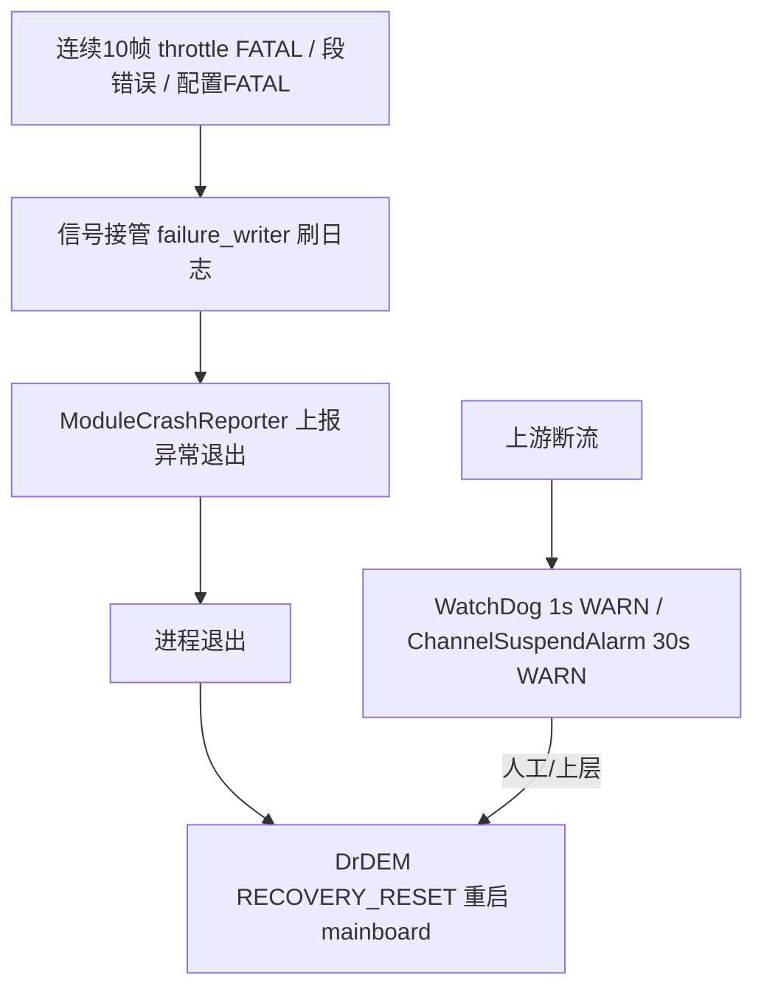

# 05 端到端全链路时序与异常机制（C01 / orinx）

> **读者对象**：具备 C/C++ 基础、不熟悉本仓库的开发者。**仓库基准**：perception/planning/driver 为 `Stable_Master_4.0_new`；`platform/church` 基于 dev_master（差异已确认）。C01（orinx C01PT，/task/task_type=L2_driving）E2E 主进程 = perception mainboard，同进程挂 PerceptionComponent→PlanningComponent→DataAgentRT→lom_infer，调度器 GRAPH（graphpipe/mediapipe）。  
> **名词表**：**FrameSync**＝按时间分桶的多通道帧同步；**背压**＝下游处理慢时限制上游放行新帧；**TRIGGER/IMMEDIATE**＝消息到达即触发图执行；**回边（back_edge）＝图内反馈流，保证上一帧未完成前不装配下一帧；降级（fallback）**＝输出带标记的安全轨迹而非中止。

---

## 1. 正常工况全链路时序图

**各环节耗时预算/频率与数据依赖**：

| 环节 | 配置值（频率/预算） | 证据 |
|-|-|-|
| FrameSync 分桶 | `frame_nano_base: 100000000`（100ms，≈10Hz 拍点） | perception_orin.jsonnet L50（12 路 framesync 同值） |
| 感知帧放行 | 在途帧 < `kMaxFramesInFlight=2` | frame_sync_calculator.cc L64/L132-136 |
| 规划触发周期 | 跟随 `/perception/objects`（IMMEDIATE，≈10Hz，非固定周期） | planning.jsonnet L11-19 |
| 规划单帧预算 | `expected_proc_duration_ms: 500`＝**超时监控阈值**，超限仅上报 `CHURCH_PROC_TIMEOUT_EVENT`，不杀帧 | planning.jsonnet L9；proc_time_unit.cc L200-208 |
| 控制单帧预算 | `expected_proc_duration_ms: 20`（50Hz 预算，跟随 pose 触发；pose 实际频率未验证） | cbw_control.jsonnet L9-13 |
| 发布→触发衔接 | 规划 4 路输入先发、触发 topic 最后发（时序契约） | perception_graph_l2avp_orin.cfg L150-155 |
| 下一帧放行 | DRIVING 模式要求 `lidar_done && uni_model_done && ras_map_done`（trigger_next_frame 回边信用） | trigger_next_frame_calculator.cc L109-125（引自 Perception/05） |

**数据依赖**：规划必需 `/perception/objects`(required,触发)、`/perception/traffic_lights_status`、`/map/ras_map_plus`、`/canbus/car_state`；控制必需 `/localization/pose`(触发)+`/planner/trajectory`(cache_size=1)；感知依赖 `/canbus/car_state`、`/map/ras_map_plus` 等与 `/planner/trajectory` 回灌（optional）。

> 文件路径：/sandbox/driver/config/component/perception_graph_l2avp_orin.cfg  
> 函数名：perception_frame_done（FrameDoneCalculator 节点）  
> 核心逻辑：
> 
> ```text
> # Keep this sequence to ensure the planning module receives the trigger
> # topic (/perception/objects) after the other four input topics.   ← 原注释
> output_stream: "OUTPUT:0:perception__extra_objects"
> output_stream: "OUTPUT:1:perception__ras_map"
> output_stream: "OUTPUT:2:perception__ras_map_parking"
> output_stream: "OUTPUT:3:perception__traffic_lights_status"
> output_stream: "OUTPUT:4:perception__objects"     ← 触发最后发
> ...
> output_stream: "TRIGGER:perception_done"          ← 回边，解锁下帧装配
> ```
> 
> 逻辑说明：`OUTPUT:0~4` 次序是**给规划的发布顺序契约**——规划被 `/perception/objects` 触发时，其余 4 路输入已先行进入中间件队列，避免触发后取不到输入。

---

## 2. 关键路径调用栈

端到端主路径（文字版，从传感器消息注入到控制指令下发，线程域标注）：

```text
[感知图执行线程池 mediapipe/pp/nn_pre 5线程, SCHED_RR/6, CPU1-5]
1. GraphScheduler::RegisterPublishAsInputStreamObserver → graph_->AddPacketToInputStream
   (graph_scheduler.cc L401-406，topic 消息到达注入)
2. FrameSyncCalculator::Process        // 分桶齐套 / TimeoutAssemble / CanOutput 背压
3. PerceptionInputTransformCalculator::Process → TransformInputMsgsToProcessInput
   (FindFirstMessage 逐 topic；点云/图像 ReadXxxMayFromShareMemory 走 shm pool)
4. PercepL2AvpSubgraph                 // 预处理→uni_model NN→任务头→tracker/farseer/AEB 过滤
   → PerceptionOutputProcessCalculator::Process  // 算法结果→PerceptionProcessOutput
5. PerceptionOutputTransformCalculator::TransformPerceptionOutputToProtoMap
   (成员字段→"/perception/xxx" 的 topic map，19 项硬编码)
6. FrameDoneCalculator::Process        // OUTPUT:0~4..18 顺序发布 + TRIGGER:perception_done
7. GraphScheduler::RegisterPublishAsOutputStreamObserver → node()->PublishWithHeader
   (graph_scheduler.cc L288-297，按 output_channel.name() 入中间件)

[规划执行器 planning_executor 3线程, SCHED_RR/5, CPU1-5]
8. AnyCalculator::Process              // TRIGGER=/perception/objects, Assemble 装配,
                                       // FINISHED 回边(prev_calc_finished_)防重入
9. PlanningInputPreprocessCalculator::Process
   (FindLastMessage /perception/objects; 其余 FindFirst/FindFirstAndLast)
10. PlanningStitchMapCalculator        // 拼接地图(IntersectionProcessor, plan_stitch 池)
11. PlanningCoreCalculator::Process → Inference → Planning::Process  // planning_core.cpp L1299
12. Planning::RunOnce (L201) → Planning::InternalRun (L1684):
    ├─ ProcessFrameInitStuff (planning_frame_management.cpp L59)
    │   └─ InitFrame → Frame::Init (frame_lifecycle.cpp L205, Phase1~6:
    │      参考线创建/平滑(QpSplineReferenceLineSmoother)/障碍物/InitializeAndDetectScenes)
    │   └─ traffic_decider_.Execute    // 交通规则(含红绿灯决策→STOP_REASON_SIGNAL)
    ├─ ProcessPlanStuff (L138) → planner_->Plan(frame)
    │   └─ EmPlanner::Plan (em_planner.cpp L472)
    │       ├─ MultiThreadingPlan → PlanOnReferenceLine
    │       │   ├─ RunTasksStage: task->Execute 循环 (L674)
    │       │   │   DP_path→(QP_path)→DpSpeed→QP_speed→...→TrajectorySafety
    │       │   ├─ iLQR: CreateIlqrOptimizationTask(...,thread_pool_)
    │       │   │   → ilqr_task->Execute(frame, selected_reference_line_info)  // L400-404
    │       │   └─ Planner::FallBackPathSpeedSetting (planner.cpp L10-86, 失败时)
    │       ├─ frame->PrependTrajectory(selected_reference_line_info)  // L523
    │       └─ GenerateAdcTrajectory(selected_reference_line_info)     // L545-546
    ├─ ExecuteTrajectoryValidation → RunTrajectoryChecker  // 仅 EM_PLANNER 门控
    └─ HandleTrajectoryPublishingAndExceptions           // 失败清空轨迹点
13. PlanningPostProcessCalculator::Process   // 组装 topic→消息 map(trajectory 等 13 路)
14. FrameDoneCalculator::Process             // OUTPUT:0~12 发布 + TRIGGER:planning_done

[控制线程 t_CbwControl, 触发=/localization/pose, 预算 20ms]
15. CbwControlComponent::Proc (cbw_control_component.cc L38-85)
    FindFirstMessage("/localization/pose" | "/planner/trajectory") → 写入单例缓存
    → ControlManager::ControlProcess() → GetCtrlCmdOutput()
16. 发布 "/control/control_command" → CbwCanbusComponent → 底盘 MCU
    (cbw_canbus.jsonnet trigger_channels 含 /control/control_command 与 /aeb/aeb_command)
[状态回流] CbwCanbus 发布 /canbus/car_state、/canbus/wheel_speed → 规划(required)/感知/控制消费；
    /planner/trajectory → 感知 optional 回灌 prediction。
```

> 文件路径：/sandbox/planning/planning/planner/em_planner.cpp  
> 函数名：EmPlanner::PlanOnReferenceLine()（iLQR 段）  
> 核心逻辑：
> 
> ```cpp
> auto ilqr_task = CreateIlqrOptimizationTask(
>     em_planner_config_.ilqr_config(),
>     em_planner_config_.driving_ilqr_config(), thread_pool_);
> ilqr_task_status_ =
>     ilqr_task->Execute(frame, mutable_selected_reference_line_info);
> PLAN_PROF_STOP(PlanIlqr);
> mutable_selected_reference_line_info->set_flag_use_ilqr(ilqr_task_status_ ==
>                                                         DR_TASK_STATUS_OK);
> ```
> 
> 逻辑说明（L400-407）：iLQR 只对**选中的参考线**单独执行，求解 fan-out 到 `plan_worker` 线程池（Init 时创建，见 Planning/04）；任务是 `CreateXxxTask` 内联工厂装配（L315-337），无宏注册表。调用栈中 9→14 均在此 3 线程执行器内串行成帧。

> 文件路径：/sandbox/driver/integration/components/cbw_control_component.cc  
> 函数名：CbwControlComponent::Proc()  
> 核心逻辑：
> 
> ```cpp
> onboard_msg = FindFirstMessage(input_msgs, "/localization/pose");
> if (onboard_msg) { sSingletonPose->SetPose(...); }
> onboard_msg = FindFirstMessage(input_msgs, "/planner/trajectory");
> if (onboard_msg) { sSingletonAdcTrajectory->SetAdcTrajectory(...); }
> ...
> control_manager_->ControlProcess();
> auto ctrl_cmd = control_manager_->GetCtrlCmdOutput();
> if (ctrl_cmd) {
>   output_msgs->emplace_back(
>       MakeOnboardMessage(kControlCommandTopic, ctrl_cmd));  // /control/control_command
> }
> ```
> 
> 逻辑说明（L38-85）：控制闭环终点——以 pose 为触发节拍（`expected_proc_duration_ms: 20`），轨迹与车况写入单例后由 `ControlManager` 消费计算并输出控制指令；`CbwCanbusComponent` 以 `/control/control_command` 为 trigger_channels 之一，指令经 CAN 下发底盘。

---

## 3. 数据一致性机制

### 3.1 时间戳对齐：FrameSync 机制

**FrameSyncCalculator** 对 12 路（1 lidar + 7 行车相机 + 4 环视）`framesync` 通道按 `frame_nano_base=100ms` 分桶；齐套立即出帧，超时（`frame_sync_timeout` 默认 100ms，tasks_config.proto default）由定时器注入 TIMEOUT 事件触发 `TimeoutAssemble` 残缺装配。放行受双闸门约束。

> 文件路径：/sandbox/platform/church/graph/calculators/frame_sync_calculator.cc  
> 函数名：FrameStateMachine::CanOutput() / FrameSyncCalculator::Process()  
> 核心逻辑：
> 
> ```cpp
> #if defined(DR_VEHICLE_C01_PT) || ... // orinx 车型并行放行
> constexpr int kMaxFramesInFlight = 2;      // L64（其他平台为 1）
> #endif
> bool CanOutput() const {
>   if (frames_in_flight_ >= kMaxFramesInFlight) return false;  // 背压闸门
>   if (cached_trigger_ > 0) return true;    // 有 TRIGGER 信用（子图 done 回边）
>   return frames_in_flight_ == 0;           // 无信用但无在途帧也可放行
> }
> // Process()：CanOutput() 且 TIMEOUT 非空时：
> bool assemble_ret = TimeoutAssemble(timeout_frame_id_, timeout_canceled_,
>                                     generated_input);        // L308-309
> ```
> 
> 逻辑说明：**在途帧数（frames_in_flight\_）+ TRIGGER 信用**构成帧级节拍闭环——感知子图完成并经 `trigger_next_frame` 回边放行信用后才装配下一帧；超时帧"能装多少装多少"而非丢弃，保证 10Hz 拍点稳定。

### 3.2 数据帧匹配：FindFirst/FindLastMessage 语义与 0.5s 容差

装配向量按 topic 字典序排序，`FindFirstMessage`＝该 topic **时间最早**一条（ALL_NEW 通道 old→new 追加），`FindLastMessage`＝**最新**一条。规划对触发输入显式取最新、其余多取最早；车况与定位用**最近邻匹配**，显式容差 0.5s。

> 文件路径：/sandbox/planning/planning/calculators/planning_input_preprocess_calculator.cc  
> 函数名：PlanningInputPreprocessCalculator::Process() / GetNearestCarStateElement()  
> 核心逻辑：
> 
> ```cpp
> message = FindLastMessage(input_msgs, "/perception/objects");     // L561 取最新
> if (message) { perception_obstacles_->CopyFrom(*message->payload()); ... }
> ...
> constexpr uint64_t kTimeDiffTolerance = 500000;                   // L732 微秒=0.5s
> if (min_time_diff < kTimeDiffTolerance &&
>         cached_vehicle_state_.count(nearest_timestamp) != 0) {
>   *nearest_vs_state = cached_vehicle_state_.at(nearest_timestamp);
> ```
> 
> 逻辑说明：`/localization/pose` 的时间戳与缓存 car_state 逐条求最小时间差，**≤0.5s** 才用 Ins 位姿覆盖车况部分字段（超差打 WARN 保留底盘值）；`/perception/traffic_lights_status`、`/map/ras_map_plus` 缺失则返回 `absl::InvalidArgumentError` 整帧失败（见 §4）。

### 3.3 缓存机制

| 缓存 | 容量/位置 | 语义 | 证据 |
|-|-|-|-|
| car_state 帧（规划） | `kMaxCacheVsNum=50`，map 按 timestamp 去重 | 供 pose 最近邻匹配 | preprocess L243-246 |
| ras_map 帧（规划） | `kMaxCacheRasmapNum=10`，有序 map 老的先删 | 供下游按时间取用 | preprocess L616-622 |
| /planner/trajectory（控制） | `cache_size: 1` | 只保留最新轨迹 | cbw_control.jsonnet L16-19 |
| /planner/trajectory（AEB） | `type: optional, cache_size: 1` | 跟踪规划意图 | aeb.jsonnet L101-106 |
| /planner/context（规划自回灌） | 子图 FRAME_CONTEXT back edge | 每帧恢复上帧决策 | planning_sub_graph.cfg L287-289 |

### 3.4 发布顺序契约：两个 FrameDoneCalculator

感知图 `perception_frame_done`（OUTPUT:0~~4 契约见 §1 证据）与规划图 `planning_frame_done` 同用 FrameDoneCalculator::Process()：按 `topic_to_stream_id_` 把消息逐流发布（同 topic 多条时间戳 +i），末尾发自增帧号到 TRIGGER 回边。两者差异：\*\*感知的 OUTPUT 顺序是显式时序契约~~**~~（触发 topic 最后发）；~~**~~规划的 OUTPUT:0~~12 只是流编号\*\*，帧内实际发布顺序由输入 map 的遍历序决定（ Planning/05 标注为 topic 字典序，推断），规划触发是数据驱动的 IMMEDIATE 订阅，不依赖发布顺序。

> 文件路径：/sandbox/driver/config/component/planning_graph.cfg  
> 函数名：planning_frame_done_node / planning_assemble_node  
> 核心逻辑：
> 
> ```text
> output_stream: "OUTPUT:0:planner__trajectory"    ← 主输出流号 0
> ...（OUTPUT:1~12）
> output_stream: "OUTPUT:5:planner__signals_request" # no one publish it  ← 死通道
> output_stream: "TRIGGER:planning_done"
> # assemble 节点防重入：
> input_stream: "FINISHED:planning_done"
> input_stream_info: { tag_index: "FINISHED"  back_edge: true }   // L64-68
> ```
> 
> 逻辑说明：`planning_done` 回边使 AnyCalculator 在上一帧 `prev_calc_finished_` 置位前不再装配，**帧与帧严格串行**；`/planner/signals_request` 声明了流但全仓库无发布者（死通道，与 Planning/05 结论一致）。

---

## 4. 异常链路分析

### 4.1 感知异常：帧同步超时 / 无帧告警 / throttle FATAL

- **帧同步超时**：`TimeoutAssemble` 残缺装配（§3.1），下游以"成员为空则该 topic 缺席"容忍；乱序消息触发 `BreakingOrderNotifier` 复位状态机（推断自 Perception/06，未逐行验证）。
- **无帧告警**：`graph_watch_dog` 线程每秒巡检，>1s 无新帧仅 WARN 并打印运行中节点，不干预业务；`ChannelSuspendAlarm` 补充单通道粒度，30s 无新消息 WARN。
- **throttle FATAL**：注入失败（输入流满）连续计数，达阈值 `MLOG(FATAL)` 主动退出交给重启。注意 `fatal_on_stream_throttle` 默认 true，但 **planning 显式关闭**（planning.jsonnet L14 `"fatal_on_stream_throttle": false`）——规划积压只会 WARN，不触发重启（**差异补充**：基线未提此开关差异）。

> 文件路径：/sandbox/platform/church/graph/graph_scheduler.cc  
> 函数名：RegisterPublishAsInputStreamObserver()（回调 lambda）  
> 核心逻辑：
> 
> ```cpp
> constexpr int kMaxConsecutiveThrottleCount = 10;   // L50
> auto return_status = graph_->AddPacketToInputStream(...);   // L403
> if (return_status != absl::OkStatus()) {
>   if (fatal_on_throttle) {
>     int count = consecutive_throttle_count_.fetch_add(1) + 1;
>     if (count >= kMaxConsecutiveThrottleCount) {
>       MLOG(FATAL) << "Graph input stream throttled for " << count
>                   << " consecutive frames, triggering restart.";   // L413-414
>     }
>   } else {
>     MLOG(WARN) << "Graph input stream throttled (non-fatal): " ...;
>   }
> } else if (fatal_on_throttle) { consecutive_throttle_count_.store(0); }
> ```
> 
> 逻辑说明：连续 10 次注入失败＝消费持续积压，宁可重启也不带病运行；成功注入即清零计数。FATAL 沿崩溃链路（刷日志→上报→退出）走，最终由 DrDEM 重启（§4.3）。

### 4.2 规划异常：输入缺失 → 任务失败降级 → 轨迹校验

- **必需输入缺失**：`traffic_lights_status`/`ras_map_plus` 缺失 → `InvalidArgumentError` 整帧失败，不产轨迹（planning_input_preprocess_calculator.cc L209-219/L629-639，见 Planning/06）；car_state NaN 跳过本帧（planning_core.cpp ValidateAndPreprocessInputs）。
- **任务失败三级降级**（em_planner.cpp L685-719）：DP_path 失败①用 ACC 备份路径继续；②否则 `path_fallback=true` 且连带 `speed_fallback=true`；QP_path 失败沿用 DP 结果；速度任务失败 `speed_fallback=true`。
- **降级执行**：`Planner::FallBackPathSpeedSetting`（planner.cpp L10-86）置 `TrajectoryType=PATH_FALLBACK/SPEED_FALLBACK` + 抬代价 + `GenerateFallbackSpeedProfile` 刹停速度曲线（紧急判定：ST 搜索 ≤2s 或紧急碰撞）。**本分支无 "neutral TrajectoryType"**（枚举仅 UNKNOWN/NORMAL/PATH_FALLBACK/SPEED_FALLBACK/COMBINE_PATH_SPEED_FAILED，planning.proto L175-178；与基线差异已在 Planning/06 更正）。
- **规划彻底失败**：`ProcessPlanStuff` 上报 `PLANNING_OUTPUT_PLANNING_FAILD`，`clear_trajectory_point()` 发布空轨迹并保持当前档位（planning_core.cpp L138-199/L1490-1518）。
- **轨迹校验**：`RunTrajectoryChecker` 仅 EM_PLANNER 门控，21 项可行性枚举；**校验失败轨迹照样发布**，触发 PLANNING_OUTPUT\_\* 事件并影响 VPA 状态机（planning_trajectory_process.cpp L2529-2580）。

> 文件路径：/sandbox/planning/planning/planner/planner.cpp  
> 函数名：Planner::FallBackPathSpeedSetting()  
> 核心逻辑：
> 
> ```cpp
> if (path_fallback) {
>   if (reference_line_info->GetTrajectoryType() == UNKNOWN) {
>     reference_line_info->SetTrajectoryType(PATH_FALLBACK); }        // L37-38
>   reference_line_info->AddCost(kPathFallBackCost);                  // 抬代价防被选主线
> }
> if (speed_fallback) {
>   constexpr double kEmergencyTimeThres = 2.0;
>   bool is_emergency = (!reference_line_info->flag_last_frame_path() &&
>       reference_line_info->st_grid_max_searched_time() <= kEmergencyTimeThres)
>       || reference_line_info->is_emergency_collision();
>   SpeedProfileGenerator::GenerateFallbackSpeedProfile(
>       reference_line_info->adc_planning_point(), ... , is_emergency); // L54-57
>   UpdateBrakeInfoAsFallback(reference_line_info);
>   if (GetTrajectoryType()==UNKNOWN) SetTrajectoryType(SPEED_FALLBACK); // L73-74
> }
> ```
> 
> 逻辑说明：降级的本质是**出一条带标记的刹停/保底轨迹**：路径失败 → 路径+速度双降级 → 减速停车曲线（急迫走急刹档），控制层继续收到可执行轨迹，由下游安全层决定接管。

### 4.3 中间件异常：断流告警 / 进程崩溃 → RECOVERY_RESET

| 异常 | 检测点 | 动作 | 证据 |
|-|-|-|-|
| 图无新帧 ≥1s | WatchDog::PipelineStatusMonitor | WARN 打印运行节点 | watch_dog.h L47-58 |
| 单通道 ≥30s 断流 | ChannelSuspendAlarm | WARN（可 close_topic_report 关闭） | channel_suspend_alarm.cc（引自 Perception/06） |
| proc 超时 | AnomalyMonitor/ComProcTimeUnit | 上报 CHURCH_PROC_TIMEOUT_EVENT | proc_time_unit.cc L200-208 |
| 崩溃/FATAL | 信号接管→刷日志→ModuleCrashReporter 上报后退出 | 进程退出 | church_main.cc L216-217、module_crash_reporter.cc（引自 Perception/06） |
| 进程退出后 | **DrDEM** 按 `recovery_method: "RECOVERY_RESET"` 重启 mainboard | 整进程重启（退避策略未验证，dem_launch 无源码） | dem/c01-pt/perception.jsonnet |



### 4.4 安全兜底：AEB 独立链路 / /safety/request

- **AEB 独立于规划**：aeb.jsonnet 以 `/canbus/car_state` 为 trigger（IMMEDIATE），输入 `/perception_aeb/objects`（optional，感知 AEB 过滤链带状态码输出）与 `/planner/trajectory`（optional, cache 1，仅跟踪意图），输出 `/aeb/aeb_command`；`CbwCanbusComponent` 的 trigger_channels 同时含控制指令与 AEB 指令——**规划失效不清空 AEB 的触发路径**（cbw_canbus.jsonnet L10-18，本文验证）。
- **/safety/request**：planning 在泊车重规划期间发 `TCA_DISABLE(TTL=10s)` 暂停 safety 模块对 `/planner/trajectory` 的帧率看护，结束发 `TCA_RESET_TO_CONFIG`（planning_core_calculator.cc ProcessSafetyRequest L236-302，引自 Planning/06）。
- **规划失败配合**：清空轨迹点发布空轨迹 → safety topic check / 控制侧识别异常接管；同时发布 `/planner/stop_objects` 供追溯刹停原因。

---

## 5. 性能关键点

### 5.1 全链路耗时分布预算（配置值）

| 环节 | 预算 | 性质 |
|-|-|-|
| FrameSync 分桶 | 100ms | 帧基准（10Hz 拍点） |
| 感知子图处理 | 无显式预算；受 3 路 done 信用 + 在途帧≤2 约束（耗时分布见 Perception 系列文档） | 隐式节流 |
| 规划单帧 | 500ms | 超时监控阈值（非硬截止），实际周期≈10Hz 跟随感知 |
| 控制单帧 | 20ms | 50Hz 预算跟随 pose |
| 日志/监控线程 | 10000 条队列、priority -10 | 异步不抢业务核 |

### 5.2 调度优先级与 cpuset 划分

> 文件路径：/sandbox/driver/config/thread_config/C01/perception.json  
> 函数名：process_conf（perception 进程线程表）  
> 核心逻辑（示意：同配置条目用 | 合并，原文为独立 JSON 对象）：
> 
> ```text
> { "name": "t_perception",        "policy": "SCHED_RR", "priority": 6, "cpuset": "1-5" },
> { "name": "pp"|"nn_pre"|"mediapipe"|"nn_internal_designated", "policy": "SCHED_RR", "priority": 6, "cpuset": "1-5" },
> { "name": "t_Planning",          "policy": "SCHED_RR", "priority": 5, "cpuset": "1-5" },
> { "name": "plan_main"|"plan_worker"|"plan_stitch"|"planning_executor"|"open_space_worker", "policy": "SCHED_RR", "priority": 5, "cpuset": "1-5" },
> { "name": "iceoryx_dispatch",    "policy": "SCHED_RR", "priority": 6, "cpuset": "1-5" },   // L59-63
> { "name": "graph_timer",         "policy": "SCHED_RR", "priority": 6, "cpuset": "1-5" },   // L71-75
> { "name": "t_lom_infer",         "policy": "SCHED_RR", "priority": 4, "cpuset": "6-8" },
> { "name": "data_agent_executor"|"desen_dispatch"|"boxsender_dispatch", "policy": "SCHED_RR", "priority": 1, "cpuset": "0,9-10" },
> { "name": "s_monitor"|"async_logger"|"sched_monitor"|"c_anomaly_monit" 等, "policy": "SCHED_OTHER", "priority": -10, "cpuset": "0-10" }
> ```
> 
> 逻辑说明：CPU1-5 为感知+规划实时核（感知 NN/图执行优先级 6 > 规划 5 > lom_infer 4），CPU6-8 隔离给 lom_infer，CPU0/9-10 归数据代理与脱敏，监控/日志类 SCHED_OTHER 压到 -10 避免干扰实时线程。线程按名称匹配配置（THREAD_CONFIG_PATH 指向此 JSON）。  
> **差异标注**：基线称 "iceoryx_dispatch/graph_timer/async_logger 等（SCHED_OTHER/-10）"，实测 `iceoryx_dispatch`、`graph_timer` 为 **SCHED_RR/6、cpuset 1-5**（L59-63/L71-75），仅 async_logger 等监控类为 SCHED_OTHER/-10。

注意：graphpipe 模式下 t_perception/t_Planning 组件线程不直接驱动帧处理（帧处理在图执行线程池），组件线程承载超时等事件（基线 7）。

### 5.3 NN 推理线程配置

> 文件路径：/sandbox/driver/config/component/perception_graph_l2avp_orin.cfg  
> 函数名：executor 定义  
> 核心逻辑：
> 
> ```text
> max_queue_size: 15    // L45，注释：camera syncer 曾阻塞故调大
> num_threads: 5        // L48，图执行线程池
> executor {
>   name: "nn_internal_designated"
>   options: { [mediapipe.ThreadPoolExecutorOptions.ext] {
>     num_threads: 4  thread_name_prefix: "nn_" } }    // L50-58
> }
> ```
> 
> 逻辑说明：图执行池 5 线程（线程名匹配 thread_config 的 pp/nn_pre/mediapipe 等），NN 内部专用执行器 `nn_internal_designated` 4 线程（前缀 nn\_）挂 `uni_model` 等推理节点（graph_l2avp_querytracker.cfg L1127 等处 `executor: "nn_internal_designated"`）；lom_infer 独立进程组件线程 t_lom_infer（SCHED_RR/4，CPU6-8）。

### 5.4 背压与队列

| 队列/闸门 | 值 | 效果 |
|-|-|-|
| `kMaxFramesInFlight` | 2（C01_PT 条件编译） | 感知最多 2 帧在途，处理慢时缓收新帧 |
| 感知图 `max_queue_size` | 15 | 输入流积压上限，满则注入失败→throttle 计数 |
| 规划图 `max_queue_size` | **15**（planning_graph.cfg L36） | 同上；**差异**：Planning/04 记为 5，实测 15 |
| TRIGGER 信用 | trigger_next_frame 回边 | DRIVING 需 lidar/uni_model/ras_map 三路 done 才放行下帧 |
| FINISHED 回边 | perception_done / planning_done | 帧级防重入，规划帧严格串行 |
| planning fatal_on_stream_throttle | false | 积压只 WARN 不重启（感知默认 true） |

---

## 附：本文引用文件清单

- /sandbox/driver/config/component/{perception_orin.jsonnet, perception_graph_l2avp_orin.cfg, planning.jsonnet, planning_graph.cfg, cbw_control.jsonnet, cbw_canbus.jsonnet, aeb.jsonnet}
- /sandbox/driver/config/thread_config/C01/perception.json
- /sandbox/driver/integration/components/cbw_control_component.cc
- /sandbox/platform/church/graph/calculators/{frame_sync_calculator.cc, frame_done_calculator.cc}
- /sandbox/platform/church/graph/{graph_scheduler.cc, watch_dog.h}
- /sandbox/platform/church/component/proc_time_unit.cc
- /sandbox/perception/perception/calculators/perception_input_transform_calculator.cc
- /sandbox/planning/planning/{planning_core.cpp, planning_frame_management.cpp}
- /sandbox/planning/planning/calculators/planning_input_preprocess_calculator.cc
- /sandbox/planning/planning/planner/{em_planner.cpp, planner.cpp}
- /sandbox/planning/planning/frame/frame_lifecycle.cpp

（完，约 7.9 千字）
