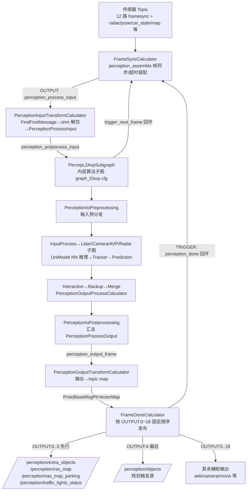
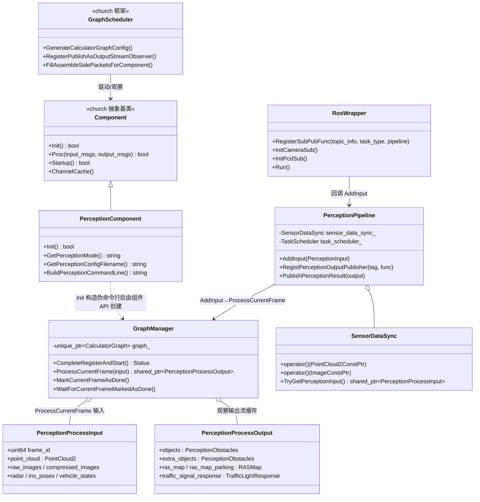

# 00 Perception 模块架构总览

> 所属专项：C01 车型 E2E 架构拆解（子 Agent3-1：Perception 通用机制——总览/输入/输出）  
> 基线分支：perception/driver 为 `Stable_Master_4.0_new`（当前检出即目标分支）；platform/church 仓库为 `dev_master`（该仓库无 `Stable_Master_4.0_new`，涉及 church 框架代码时以 dev_master 检出为准，下文不再重复标注）。  
> 运行形态：C01（orinx 平台 C01PT，DEM 注入 `/task/task_type=L2_driving`）下，感知并非独立进程，而是 E2E 主进程 `perception mainboard` 内的一个 church 组件。**church**（公司自研组件化框架，graphpipe/mediapipe 风格图调度）；**FrameSync**（按帧号对齐多传感器数据）；**Calculator**（图中的一个计算节点）。

---

## 1. 模块定位与职责

感知模块负责把多传感器原始数据（点云、相机图像、雷达目标、超声波）与定位/地图/规划回灌信息，装配成一帧后送入深度学习推理与多模态融合，最终输出\*\*障碍物列表（PerceptionObstacles）**、**轻量栅格地图（RASMap）**、**红绿灯状态（TrafficLightResponse）\*\*等结构化结果，供下游规划（Planning）以 `/perception/objects` 作为触发源使用。

- 组件挂载证据：感知组件类继承自 `deeproute::church::Component`，并通过 `CHURCH_REGISTER_COMPONENT(PerceptionComponent)` 注册：

> 文件路径：/sandbox/driver/integration/components/perception_component.cc  
> 函数名：PerceptionComponent（类定义与注册）  
> 核心逻辑：
> 
> ```cpp
> class PerceptionComponent final : public deeproute::church::Component {
>  public:
>   bool Init() override;
>   void Clear() override;
>   bool Proc(const OnboardMessageConstPtrVector& input_msgs,
>             OnboardMessagePtrVector* output_msgs) override;
> ...
> CHURCH_REGISTER_COMPONENT(PerceptionComponent)
> ```
> 
> 逻辑说明：感知作为 church 组件被 mainboard 挂载，与 PlanningComponent 等同进程共存（见基线第 1 条）。

- 图调度证据：感知组件的图配置由 jsonnet 指定，C01 L2_driving 任务使用 `perception_graph_l2avp_orin.cfg`：

> 文件路径：/sandbox/driver/config/component/perception_orin.jsonnet  
> 核心逻辑：
> 
> ```jsonnet
> "task": {
>     "name": "t_perception",
>     "trigger_policy": "FRAMESYNC",
>     "graph_config_path": "perception/config/perception_graph_l2avp_orin.cfg",
>     "task_type_graph_path": [
>         { "task_type": 'L2_driving', "graph_path": 'perception/config/perception_graph_l2avp_orin.cfg', },
>         { "task_type": 'L2_driving_vision', "graph_path": 'perception/config/perception_graph_vision_orin.cfg', },
>     ],
> ```
> 
> 逻辑说明：`trigger_policy=FRAMESYNC` 表明感知以 12 路传感器帧同步作为驱动节拍（详见《01_输入数据接入与预处理》）。

- C01 L2AVP 链路的两级图结构：

  - **外层 church 图**：`/sandbox/driver/config/component/perception_graph_l2avp_orin.cfg`（数据装配 + 输出发布编排，节点为 FrameSyncCalculator / PerceptionInputTransformCalculator / PercepL2AvpSubgraph / PerceptionOutputTransformCalculator / FrameDoneCalculator 等）。
  - **内层算法子图**：`PercepL2AvpSubgraph`，由构建系统以 `gen_subgraph` 规则从 `graph_l2avp.cfg` 生成注册（见下），是真正的感知算法编排（预处理/NN 推理/跟踪/预测/融合）。

> 文件路径：/sandbox/perception/perception/cfg/graphs/BUILD.bazel  
> 核心逻辑：
> 
> ```python
> gen_subgraph(
>     name = "l2avp_sub_graph_default",
>     src = "graph_l2avp.cfg",
>     python_script = "@graphpipe//:make_subgraph",
>     register_name = "PercepL2AvpSubgraph",
> )
> ```
> 
> 逻辑说明：`PercepL2AvpSubgraph` 不是手写 C++ 类，而是把 `graph_l2avp.cfg` 包装成可在外层图中嵌套的子图 Calculator；外层 cfg 中 `calculator: "PercepL2AvpSubgraph"` 与之对应（/sandbox/driver/config/component/perception_graph_l2avp_orin.cfg 第 114 行）。

---

## 2. 子模块划分

### 2.1 submodules/ 下 8 个算法子仓

| 子模块 | 一句话职责 | C01 L2AVP 链路是否启用 |
|-|-|-|
| aeb | AEB（自动紧急制动）专用障碍物感知链路，输出 `/perception_aeb/objects` | 启用：cfg `enable_aeb_process: true`（/sandbox/perception/perception/cfg/perception_orin_l2avp.cfg L67）；算法子图含 `AebLightFusionProcessSubgraph`（graph_l2avp.cfg L285） |
| avp | 泊车感知（环视全景相机检测、车位融合、自由空间），输出泊车 RasMap/AVM 可视化 | 启用：`AvpProcessSubgraphL2` 节点（graph_l2avp.cfg L458）、`enable_space_parking_det: true`（perception_orin_l2avp.cfg L75） |
| base | 公共基础库（数据结构、相机帧 CameraFrame、ResultFrame、公共算子） | 启用（被所有链路依赖，如 `perception/base_proto.ImagePreprocessParam`，perception_orin_l2avp.cfg L153） |
| camera | 相机图像预处理/质量评估/交通灯与 BEV 视觉任务 | 启用：`CameraProcessSubgraphL2AVP` 节点（graph_l2avp.cfg L316）、`camera_quality_param.cfg` 打包（perception_orin_l2avp.cfg L158） |
| farseer | FarSeer 在板大模型/视觉方案（README：`FarSeer--onboard`） | 未在 L2AVP cfg 的图节点中出现（未验证其是否被 L2_driving 任务间接引用；差异于 vision 模式）——**推断**当前 C01 L2AVP 链路未直接启用 |
| lidar | 激光雷达占用栅格/检测前处理与点云处理 | 启用：`LidarOccProcessSubgraph` 节点（graph_l2avp.cfg L242）、`enable_lidar_process: true`（perception_orin_l2avp.cfg L66） |
| perception_routing | map_engine 感知侧路由（模型预处理/后处理入口在 calculator/ 下，见其 README） | 启用：`DdRoutingPreProcessCalculator` 节点（graph_l2avp.cfg L534） |
| tracker | 多目标跟踪（含 avp_tracker、aeb_tracker 参数） | 启用：`PerceptionTrackerProcessCalculator` 节点（graph_l2avp.cfg L914）及 tracker_param_path 打包（perception_orin_l2avp.cfg L41） |

### 2.2 顶层通用机制（/sandbox/perception/perception/）

| 目录/文件 | 一句话职责 | C01 L2AVP 链路是否启用 |
|-|-|-|
| calculators/（50 个 .cc/.h） | 感知图的所有算子节点：输入变换、雷达处理、预测、输出后处理、DTU 应答等 | 启用（外层图与算法子图的节点实现均在此，如 PerceptionInputTransformCalculator、PerceptionOutputProcessCalculator） |
| triggers/（5 组共 10 个文件） | 感知触发事件检测器（false_positive_cone、inconsistent_stopline、lane_construction、near_field_moving_object、odd_shaped_vehicle） | 启用：`trigger_events_param_config.cfg` 打包（perception_orin_l2avp.cfg L180），由 PerceptionTriggerEventsCalculator 消费（graph_l2avp.cfg L1020） |
| sensor/ros_wrapper.cpp | ROS 独立进程模式下的订阅/发布适配层（订阅→`perception_pipeline.AddInput`） | **C01 车端 church 模式不使用**（独立进程 main.cpp 才走此路径，见 §6） |
| frame_context/perception_frame_context_manager.\* | 全局帧上下文单例（跨 calculator 保存 pull_over/VLA 状态、fusion_map 信息） | 启用：PerceptionInputTransformCalculator 每帧 `ActivateFrameContext`（perception_input_transform_calculator.cc L386-388） |
| pipeline/ | 两级抽象：GraphManager（graphpipe 图封装，church/ROS 共用）+ PerceptionPipeline/SensorDataSync（ROS 模式数据装配） | GraphManager 体系启用；PerceptionPipeline 仅 ROS 模式（main.cpp） |
| radar/（17 文件：common/encoder/obstacle + radar_obstacle_perception） | 毫米波雷达目标级处理（RadarProcessorCalculator 背后实现）与 RadarBEV 编码 | 启用：`enable_radar_process: true`（perception_orin_l2avp.cfg L72）、`RadarProcessorCalculator`/`RadarBEVEncoderCalculator`（graph_l2avp.cfg L873/L883） |
| interaction/（6 文件：collision_filter、output_interaction） | 输出后交互：障碍物与 RasMap 的碰撞过滤/联动修正 | 启用：`PerceptionOutputInteractionCalculator`（graph_l2avp.cfg L1008），param 打包 perception_orin_l2avp.cfg L174 |
| church_component/ | church 模式组件 API：InitPerceptionStream/StopPerceptionStream/Process，与独立进程共用 CreateGraphManager | 启用（见 §6 初始化链） |
| liner_hook/perception_linker_hook.cc | 链接期挂钩（构建/初始化辅助） | 辅助性质，未验证具体生效点 |
| util/（msg_serializer、perception_topic.h 等） | 消息序列化、Topic 常量、时间工具 | 启用 |

---

## 3. 整体处理流程图



要点：

- `trigger_next_frame`（`back_edge`）来自算法子图末端的 `TriggerNextFrameCalculator`——DRIVING 模式下需 lidar/uni_model/ras_map 三者完成才放行下一帧（/sandbox/perception/perception/calculators/trigger_next_frame_calculator.cc L109-115）；`perception_done` 来自 FrameDoneCalculator 的 TRIGGER 输出，两者共同构成外层图的帧间背压（perception_graph_l2avp_orin.cfg L82-92）。
- C01PT（orinx）编译期 `kMaxFramesInFlight = 2`，即帧同步器最多允许 2 帧并行在途（/sandbox/platform/church/graph/calculators/frame_sync_calculator.cc L57-68）。

---

## 4. 核心类图



证据：

- `GraphManager` 与 `CreateGraphManager`：/sandbox/perception/perception/pipeline/graph_api.cc L61-95（Observe 输出流 `perception_output_frame`、StartRun、WaitUntilIdle）、L236-307（读取 `perception_param.graphpipe_cfg_path` 指向的图配置并 Initialize；设置 `ADD_IF_NOT_FULL` 防死锁）、L145-188（ProcessCurrentFrame：向输入流加包→条件变量等待本帧完成→返回缓存输出）。
- `PerceptionProcessInput/Output` 结构：/sandbox/perception/perception/church_component/perception_component_api.h（Input 见 L120-204 区段；Output L206-253：`objects/extra_objects/aeb_objects/traffic_signal_response/ras_map/ras_map_parking/...`，每个成员注释了对应发布 topic）。
- `PerceptionPipeline`/`SensorDataSync`/`RosWrapper`：/sandbox/perception/perception/pipeline/perception_pipeline.h L42-93、/sandbox/perception/perception/pipeline/sensor_data_sync.cc L254-279、/sandbox/perception/perception/sensor/ros_wrapper.cpp L74-100。三者仅被独立进程入口 /sandbox/perception/perception/main.cpp L27-56 使用（ church 模式下 PerceptionComponent::Proc 为空实现，数据流完全由 GraphScheduler 驱动外层图完成）。
- `GraphScheduler`（church 框架侧图调度器）：/sandbox/platform/church/graph/graph_scheduler.cc L192-256（合并各组件图配置）、L277-320（Observe 输出流→`component->node()->PublishWithHeader` 发到 DDS/中间件）。
- 名词：`PerceptionStream` 在当前代码中不存在同名类型（**差异**：任务样例中提到的 "PerceptionStream" 未在 perception 仓找到定义；组件 API 的入口函数名为 `InitPerceptionStream`，见 /sandbox/perception/perception/church_component/perception_component_api.cpp L39-57，本文按代码实际类名 `GraphManager` 呈现）。

---

## 5. 与 Planning/中间件交互关系（Topic 表）

church 模式下中间件发布路径：外层图输出流 → `GraphScheduler::RegisterPublishAsOutputStreamObserver` 注册的 Observer → `component->node()->PublishWithHeader(topic, msg)` 发往中间件（/sandbox/platform/church/graph/graph_scheduler.cc L277-320）。jsonnet 的 `output_channels` 定义 stream→topic 映射与 proto 类型。

### 5.1 感知输入（订阅）

| Topic | Proto | jsonnet 声明 type | 用途 |
|-|-|-|-|
| /sensors/lidar/combined_point_cloud_proto | deeproute.drivers.PointCloud2 | framesync（frame_nano_base=100000000） | 主点云，帧同步基准 |
| /sensors/camera/camera_1~~6、traffic_2、panoramic_1~~4 \_raw_data_proto | deeproute.drivers.Image | framesync | 相机原始图 |
| /sensors/radar/combined_objects | deeproute.drivers.radar.Radar | near（near_topic=点云 topic） | 雷达目标，取时间戳最近 |
| /localization/pose | deeproute.drivers.gnss.Ins | all_new | 定位姿态 |
| /canbus/car_state | deeproute.common.VehicleState | all_new | 车辆状态 |
| /map/ras_map_plus | deeproute.map.RASMapPlus | all_new | 轻量地图 |
| /sensors/ultrasonic/combined_ultrasonic | deeproute.drivers.ultrasonic.Ultrasonic | all_new | 超声波 |
| /planner/trajectory | deeproute.planning.ADCTrajectory | optional | 规划轨迹回灌（prediction 用） |
| /planner/request、/planner/multi_requests | planning.interface.PlanningRequest(s) | all_new / optional | 泊车业务请求 |
| /perception/dtu_request | deeproute.perception.PerceptionRequest | all_new | DTU（远程诊断/调试单元）请求 |
| /map/sd_horizon_map、/map_engine/ras_feature、/map/fusion_map、/localization/lock_on_road 等 | 各自 proto | optional | 辅助地图/定位信息 |

（证据：/sandbox/driver/config/component/perception_orin.jsonnet L35-264；非 framesync 通道的装配语义 ALL_NEW/REQUIRED/OPTIONAL/NEAR 由 FrameSyncCalculator::AssembleNonFramesyncInputs 实现，见 01 文档 §2。）

### 5.2 感知输出（发布）

| Topic | Proto | 去向/消费者 |
|-|-|-|
| /perception/objects | deeproute.perception.PerceptionObstacles | **Planning TRIGGER 输入**（FrameDone 最后发，见 05 文档 §3）；jsonnet 标记 `need_topic_supervision: true` |
| /perception/extra_objects | deeproute.perception.PerceptionObstacles | Planning 辅助输入 |
| /perception/ras_map、/perception/ras_map_parking | deeproute.perception.RASMap | Planning（ras_map 带 need_topic_supervision） |
| /perception/traffic_lights_status | deeproute.perception.TrafficLightResponse | Planning/信号灯策略 |
| /perception/camera_obstacle | deeproute.perception.CameraObstacles | 相机障碍物单独通道 |
| /perception_aeb/objects | deeproute.perception.PerceptionObstacles | AEB 链路 |
| /perception/dtu_response | deeproute.perception.PerceptionResponse | DTU 请求应答（经 DtuRespPublishHandler 直发，perception_component.cc L240-244） |
| /perception/ras_map_nn、/perception/ras_map_nn_parking、/perception/obstacle3d_nn | deeproute.perception.NnFrame | NN 原始结果通道 |
| /perception/camera_quality、/perception/camera_info | CameraQuality/CameraInfo | 相机质量/信息 |
| /perception/frame_context | deeproute.perception.FrameContext | 帧上下文（仿真的上下文回灌源，perception_orin.jsonnet context_config） |
| /perception/objects_vis_objects、/perception/proposal_objects、/perception_magic_carpet/objects、/around_view_monitor/avm_viz、/common/modulestatus | 各自 proto | 可视化/调试 |

（证据：/sandbox/driver/config/component/perception_orin.jsonnet L265-367。）

### 5.3 与 Planning 的交互协议摘要

- Planning 以 `/perception/objects` 为 TRIGGER、IMMEDIATE 策略挂 planning_assemble_node（基线第 5 条）。
- 感知订阅 `/planner/trajectory`（optional）供 prediction 使用：Transform 阶段 `FindFirstMessage(input_msgs, "/planner/trajectory")` 填入 `process_input.adc_trajectory`（perception_input_transform_calculator.cc L780-787）。

---

## 6. 模块配置文件路径与初始化入口

### 6.1 配置文件层级

| 层级 | 文件 | 作用 |
|-|-|-|
| 组件声明 | /sandbox/driver/config/component/perception_orin.jsonnet | 组件类名、trigger_policy、图路径、输入输出通道与类型 |
| 外层图 | /sandbox/driver/config/component/perception_graph_l2avp_orin.cfg | 装配/变换/子图/发布节点编排 |
| 感知功能配置 | /sandbox/perception/perception/cfg/perception_orin_l2avp.cfg | task_type、topic 表、功能开关、参数路径、`graphpipe_cfg_path`（指向内层算法子图 cfg） |
| 内层算法子图 | /sandbox/perception/perception/cfg/graphs/graph_l2avp.cfg | 感知算法节点编排（经 gen_subgraph 注册为 PercepL2AvpSubgraph）；`offline_graph_l2avp.cfg` 为其单节点包装（仅含 PercepL2AvpSubgraph，供 ROS/离线 GraphManager 使用，/sandbox/perception/perception/cfg/graphs/offline_graph_l2avp.cfg L20-25） |

### 6.2 初始化链（church 模式）

1. `PerceptionComponent::Init()`：确定感知模式（优先级：云端 `/config/perception_mode` > `/task/task_type` 映射 > 默认 l2avp），拼出配置名 `perception_{arch}_{mode}.cfg`，构造伪命令行 `perception -launch_mode=church -perception_config_filename=...` 并 `google::ParseCommandLineFlags` 解析（/sandbox/driver/integration/components/perception_component.cc L139-207、L209-234）；随后注入 side packets（`dtu_response_publish_handle` 直发回调、各功能开关）。
2. 配置解析：`LoadPerceptionConfig` 读取 `FLAGS_perception_config_filename` → `CreateGraphManager` 读取 `perception_param.graphpipe_cfg_path` 的图配置并构建 graphpipe 图（/sandbox/perception/perception/pipeline/graph_api.cc L195-234、L236-307）。
3. 组件 API 入口：`InitPerceptionStream()` 调 `CreateGraphManager()` → `CompleteRegisterAndStart()`（观察输出流、StartRun、WaitUntilIdle），成功后上报 `PERCEPTION_INIT_SUCCESS` 事件（/sandbox/perception/perception/church_component/perception_component_api.cpp L39-57）。
4. church 组件生命周期：`Component::Startup()` 顺序为 `RegisterAllPublishers()`（按 jsonnet output_channels 注册发布器）→ `Init()` → `RegisterAllSubscribers()`；`Shutdown()` 反向关闭（/sandbox/platform/church/component/component.cc L155-176）。

   - **未验证**：`InitPerceptionStream` 在当前检出中只有声明与定义，未找到显式调用点（全仓仅 perception_component.cc include 其头文件）；**推断**其由组件装载机制（链接期 hook/组件工厂）或历史版本调用，运行时以 GraphScheduler 拉起外层图为事实上的启动路径。此点与基线第 7 条表述存在差异，待与框架同学确认。

### 6.3 独立进程入口（对照）

`main.cpp → Main()：CreateGraphManager + CompleteRegisterAndStart → 构造 PerceptionPipeline → RosWrapper.RegisterSubPubFunc（订阅→AddInput）→ ros_wrapper.Run()`（/sandbox/perception/perception/main.cpp L27-71）。C01 车端不使用，但离线调试/rosbag 回放使用。

---

## 7. 与其他文档的阅读关系

- 《01_输入数据接入与预处理》（本文档系列）：外层图的装配与变换细节——FrameSync 机制、shm 解包、PerceptionProcessInput 组装、丢帧/乱序策略。建议作为本文档 §3/§6 的下钻。
- 《05_输出发布与中间件交互》（本文档系列）：输出 Topic 全景、PerceptionObstacles/RASMap/TrafficLightResponse 的组装证据、FrameDoneCalculator 发布顺序契约、与 Planning 的触发协议。
- 《00_公共基础文档》（专项公共篇）：church 组件生命周期、graphpipe/mediapipe 图模型、中间件 Topic 机制的通用说明。
- Planning 侧文档（子 Agent3-2 交付）：planning_assemble_node 如何消费 /perception/objects，与本系列 §5.3 互为对照。

## 附：本文档引用文件清单

- /sandbox/driver/integration/components/perception_component.cc
- /sandbox/driver/config/component/perception_orin.jsonnet
- /sandbox/driver/config/component/perception_graph_l2avp_orin.cfg
- /sandbox/perception/perception/cfg/perception_orin_l2avp.cfg
- /sandbox/perception/perception/cfg/graphs/BUILD.bazel、graph_l2avp.cfg、offline_graph_l2avp.cfg
- /sandbox/perception/perception/pipeline/graph_api.cc、perception_pipeline.h
- /sandbox/perception/perception/church_component/perception_component_api.h/.cpp
- /sandbox/perception/perception/sensor/ros_wrapper.cpp
- /sandbox/perception/perception/calculators/trigger_next_frame_calculator.cc
- /sandbox/platform/church/graph/calculators/frame_sync_calculator.cc
- /sandbox/platform/church/graph/graph_scheduler.cc
- /sandbox/platform/church/component/component.cc
