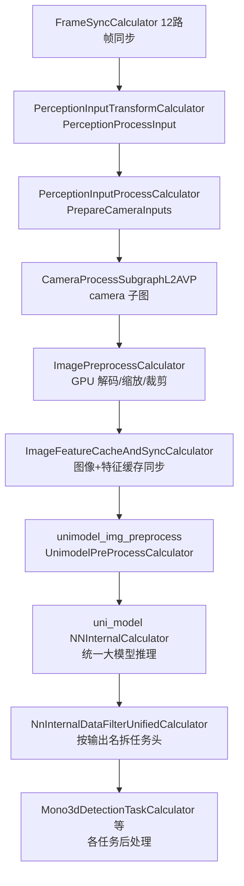
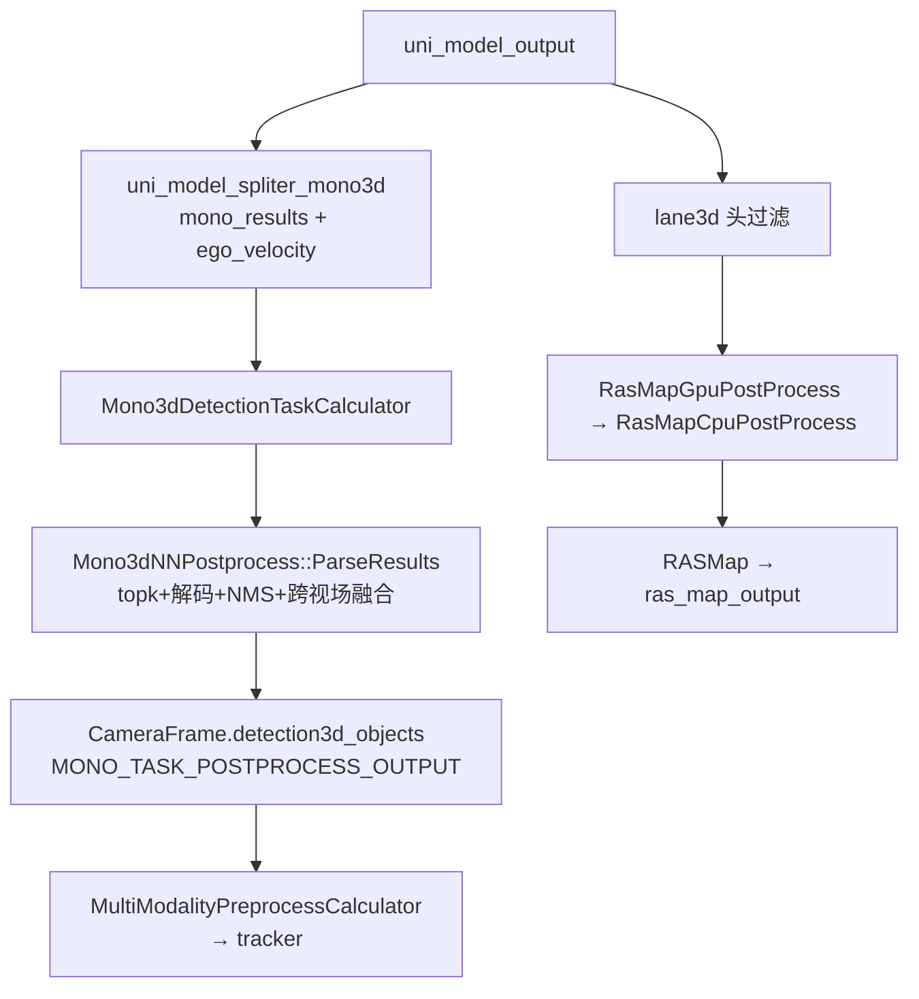

# 子模块1：camera 相机感知子模块

> 代码根目录：`/sandbox/perception/submodules/camera`（约 338 个源文件）  
> 分支说明：perception 及其 submodules 位于 `Stable_Master_4.0_new`（当前检出即该分支）；平台层 platform/church 位于 `dev_master`，本文不涉及平台层差异。  
> 本文所有结论均给出代码证据；无法给出证据的推断处标"推断"。

## 1. 子模块定位与职责

### 1.1 代码仓库结构

camera 是一个独立构建的 C++/CUDA 算法仓（自带 `CMakeLists.txt`、`BUILD.bazel`、`WORKSPACE`），以子模块形式集成进 perception 主仓，核心代码位于 `camera/` 目录下：

```
camera/
├── common/          # 数学工具、匈牙利匹配器、裁剪参数等公共件
├── modules/         # 算法模块（业务核心）
│   ├── base_interface/   # base_detector.h（检测器基类接口）
│   ├── bev_det/          # BEV 检测后处理
│   ├── camera_all/       # 2D 全量检测任务
│   ├── magic_carpet/     # MagicCarpet 任务
│   ├── ras_map/          # 车道线/道路结构（RAS Map）模块
│   ├── scene/            # 场景分类（L2AVP 图中已注释停用）
│   ├── sdmap/            # SD 地图任务
│   ├── tracker/          # 相机侧跟踪（HMA 等）
│   └── traffic/          # 交通灯/交通牌检测（YOLOX/mono3d 后处理）
├── onboard/
│   ├── calculators/ # graphpipe 计算节点（L2AVP 子图的实际执行者）
│   └── processor/   # 纯算法 processor（被 calculator 调用）
└── postprocess_service/
```

### 1.2 在 C01 L2AVP 中的调用点（已验证）

C01（orinx 平台）感知主图 `perception_graph_l2avp_orin.cfg` 中，感知核心子图由 `PercepL2AvpSubgraph` 承载；该子图定义在 `/sandbox/perception/perception/cfg/graphs/onnx/graph_l2avp.cfg`，其中 **camera 子图以节点 `CameraProcessSubgraphL2AVP` 被显式调用**（第 320 行）：

> 文件路径：/sandbox/perception/perception/cfg/graphs/onnx/graph_l2avp.cfg  
> 节点：perception_subgraph 内
> 
> ```cfg
> node {
>   calculator: "CameraProcessSubgraphL2AVP"
>   input_stream: "CAMERA_INPUTS:camera_inputs"
>   input_stream: "UNI_MODEL_OUTPUT:uni_model_output"
>   ...
>   output_stream: "MONO_TASK_POSTPROCESS_OUTPUT:mono_task_postprocess_output"
>   output_stream: "TRAFFIC_TASK_POSTPROCESS_OUTPUT:traffic_task_postprocess_output"
>   output_stream: "RAS_MAP_OUTPUT_WITH_MARK:ras_map_output"
>   output_stream: "SAMPLED_LANE_NN:lane3d_nn_sampled"
>   output_stream: "camera_preprocess_output_synced"
>   ...
> }
> ```

`CameraProcessSubgraphL2AVP` 的子图定义文件即 camera 子模块内的 `/sandbox/perception/submodules/camera/camera/onboard/calculators/subgraph_config/camera_sub_graph_l2avp.cfg`，其 `BUILD.bazel` 第 26 行注册：`register_name = "CameraProcessSubgraphL2AVP"`。**这就是 camera 子模块被主图调用的确切通路**。

### 1.3 职责划分（重要结论）

C01 L2AVP 的相机 3D 检测**不再由 camera 仓内的独立检测模型完成，而是复用统一大模型 uni_model 的视觉部分**（NNInternalCalculator 节点，输入含 `imgs`，见 graph_l2avp.cfg 第 209\~243 行）。camera 子模块在链路中的职责为：

1. **图像 GPU 预处理**：解码/缩放/裁剪/归一化，产出 uni_model 的 `imgs` 输入；
2. **BEV 几何输入准备**：`lidar2img`、内参/外参/畸变系数、pose 转置与逆矩阵（时序 BEV 用）；
3. **任务头后处理**：从 uni_model 输出中过滤各任务头（`NnInternalDataFilterUnifiedCalculator` 按 `name_filter` 拆分），再解码为结构化目标；
4. **周边感知任务**：交通灯/交通牌/红绿灯形状、相机质量检测、MagicCarpet、BarrierGate、2D 全量检测（camera_all）。

2D 检测（camera_all）与单目 3D（mono3d）分别有独立推理节点（`camera_all_2d` 用 `camera_all_nn_param_path`）。

## 2. 核心类结构与成员变量

### 2.1 主要类清单

| 类/Calculator | 文件 | 职责 |
|-|-|-|
| `PerceptionInputProcessCalculator`（上层，非本仓） | `/sandbox/perception/perception/calculators/perception_input_process_calculator.cc` | 从 `PerceptionProcessInput` 拆出 `camera_inputs` |
| `TrafficAlgoProcessInputWrapper` | `/sandbox/perception/submodules/base/camera/traffic_processor_base.h` L27 | 图像帧容器（ImageMap variant） |
| `ImagePreprocessCalculator` | `camera/onboard/calculators/image_preprocess_calculator.cc` | graphpipe 节点：调 GPU 预处理 |
| `ImagePreProcessor` | `camera/onboard/processor/image_pre_processor.h` L45 | 图像批量预处理核心（CUDA） |
| `ImageFeatureCacheAndSyncCalculator` | `camera/onboard/calculators/image_feature_cache_and_sync_calculator.cc` | 特征/图像缓存与帧同步 |
| `Mono3dDetectionTaskCalculator` | `camera/onboard/calculators/mono3d_det_task_calculator.cc` | uni_model mono 头后处理节点 |
| `Mono3dNNPostprocess` / `SingleMono3dNNPostprocess` | `camera/modules/traffic/traffic_detection_task/mono3d_nn_postprocess/` | mono3d 解码+NMS |
| `DetectProcess` | `camera/onboard/processor/detect_processor.h` L19 | YOLOX 2D 检测后处理封装（traffic 用） |
| `CameraFrame` | `/sandbox/perception/submodules/base/camera/camera_frame.h` L31 | 相机帧结果容器 |
| `RasMapGpuPostProcess`/`RasMapCpuPostProcess` | `camera/onboard/calculators/ras_map_gpu_post_process_calculator.cc` 等 | 车道线头→RASMap |

### 2.2 关键成员举例

`ImagePreProcessor`（image_pre_processor.h L96\~132）：

```cpp
private:
  std::vector<std::pair<std::string, std::string>> cameras_to_source_cameras_;
  std::vector<std::string> camera_names_;                 // 参与预处理的相机列表
  std::map<std::string, std::string, std::greater<std::string>>
      imitation_cam_to_source_cam_;                       // "traffic_2_crop"->"traffic_2" 仿真裁剪相机
  std::map<std::string, CroppedImageParam> cropped_image_params_;  // 裁剪参数(内参变换用)
  std::unordered_map<std::string, float*> undist_mapx_;   // 去畸变查找表
  std::unordered_map<std::string, float*> undist_mapy_;
  cudaStream_t stream_ = nullptr;
  ImagePreProcessorOut nodes_;                            // 输出节点(node=主模型, traffic_node=traffic)
  std::unordered_map<std::string, deeproute::base::ImageProcessParam>
      image_preprocess_params_;                           // 每相机的尺寸/布局/归一化参数
  std::unordered_map<int, BatchImageParamsCachePtr> batch_image_params_;  // 按目标分辨率分批
```

常量 `T2C_CAMERA_NAME = "traffic_2_crop"`、`T2C_SOURCE_NAME = "traffic_2"`（image_pre_processor.h L42\~43）表明 traffic_2 会被额外裁剪出一路"虚拟相机"参与 mono3d。

## 3. 核心处理流程与函数调用链

### 3.1 从 FrameSync 到 camera 子图



`camera_inputs` 的构造（上层 perception 主仓，已验证）：

> 文件路径：/sandbox/perception/perception/calculators/perception_input_process_calculator.cc  
> 函数名：PerceptionInputProcessCalculator::PrepareCameraInputs()  
> 核心逻辑：
> 
> ```cpp
> // 优先使用 raw 图像，否则使用压缩图
> if (!input->raw_images.empty()) {
>   std::unordered_map<std::string, std::`shared_ptr<const ::deeproute::drivers::Image>`> raw_frames;
>   for (const auto& img : input->raw_images) {
>     const auto& image_name = img->header().frame_id();
>     if (std::find(target_cameras_in_order_.begin(),
>                   target_cameras_in_order_.end(),
>                   image_name) != target_cameras_in_order_.end()) {
>       raw_frames.emplace(image_name, img);
>     }
>   }
>   camera_inputs.image_frames = raw_frames;
> }
> ```
> 
> 逻辑说明：以 `header().frame_id()`（相机名 camera_1~~6/traffic_2/panoramic_1~~4）为 key 装进 map，包成 `TrafficAlgoProcessInputWrapper` 后由 graph 流 `camera_inputs` 送入 camera 子图。

### 3.2 GPU 批量预处理

> 文件路径：/sandbox/perception/submodules/camera/camera/onboard/processor/image_pre_processor.cc  
> 函数名：ImagePreProcessor::`Process<T>`()  
> 核心逻辑：
> 
> ```cpp
> // 按相机名取图，分配到主输出 node 或 traffic 输出 traffic_node
> uint8_t* out = (absl::EndsWith(param.camera_name, kTrafficCameraSuffix))
>                  ? (`reinterpret_cast<uchar*>`(nodes_.traffic_node.data_ptr) +
>                     (traffic_camera_index++) * param.output_size)
>                  : (`reinterpret_cast<uchar*>`(nodes_.node.data_ptr) +
>                     (normal_camera_index++) * param.output_size);
> uint8_t* input = nullptr;
> ResolveImageToDeviceInput(image, param, &input, stream_);   // 图像搬运到 GPU(含解码)
> ...
> if (::deeproute::base::fusion_preprocess::UpdateBatchImagePreProcessFusionParam(
>         cache->batch_image_preprocess_params_, cache->inputs,
>         cache->outputs, cache->output_zero_flags)) {
>   ::deeproute::base::fusion_preprocess::BatchPreprocessImage(
>       cache->batch_image_preprocess_params_, stream_);       // 融合 CUDA kernel 批处理
> }
> ```
> 
> 逻辑说明：同目标分辨率（`dst_shape`）的相机合入一个 batch，一次性执行解码/缩放/裁剪/归一化；缺图相机 `output_zero_flag=true` 由 kernel 置零，保证 batch 拓扑不变。

`ImagePreprocessCalculator::Process` 随后把 pose 转置矩阵、pose 逆矩阵、`lidar2img`、内参/外参/畸变系数全部封装为 `NNInternalDataType` 推给下游（image_preprocess_calculator.cc L413\~481）。

### 3.3 时序缓存与帧同步

`ImageFeatureCacheAndSyncCalculator` 用 `SyncSetInputStreamHandler` 把"本帧图像预处理结果"与"上一帧 uni_model 回传的特征"（`NEED_CACHE:image_backbone_network_output`、`fpn_stride16_nn_internal_output`）对齐后输出 `camera_preprocess_output_synced`（camera_sub_graph_l2avp.cfg L136\~181）。这是 uni_model 时序 BEV（prev_bev_feats）能拿到历史特征的关键。

### 3.4 推理与任务头拆分

uni_model 输出 `uni_model_output` 后，camera 子图内用多个 `NnInternalDataFilterUnifiedCalculator` 按 `name_filter` 拆头（camera_sub_graph_l2avp.cfg）：

- `traffic_head_filter`：`pred_tlstatus`/`tl_flatten_bboxes`/`hma_flatten_bboxes` 等（L267\~306）；
- `uni_model_spliter_mono3d_network_output`：`mono_results`、`ego_velocity`（L557\~570）；
- `uni_model_spliter_fusion_lane3d_network_output`：`smtc_*`/`roadmask_*`/`refline_*`/`e2e_*` 等车道线/道路头（L495\~543）。

### 3.5 mono3d 与 RASMap 后处理



## 4. 核心算法入口与关键逻辑

### 4.1 mono3d 解码（模型输出→3D 框）

> 文件路径：/sandbox/perception/submodules/camera/camera/modules/traffic/traffic_detection_task/mono3d_nn_postprocess/single_mono3d_nn_postprocess.cpp  
> 函数名：SingleMono3dNNPostprocess::ParseResults()  
> 核心逻辑：
> 
> ```cpp
> // 1) 按分数取 topk（score 存于每个输出槽第 9 维）
> for (int i = 0; i < feat_size_[0] * feat_size_[1]; i++) {
>   output_data_scores.emplace_back(output_data_[i * code_size_ + 9]);  // 9 for score
> }
> auto topk_indices = TopKIndices(output_data_scores, topk_);
> // 2) 逐候选解码
> for (uint32_t topk_idx = 0; topk_idx < topk_indices.size(); topk_idx++) {
>   ComputeBox(topk_indices[topk_idx], &candidates, history_offset);
> }
> // 3) 按类别做 2D NMS（锥桶走专用 NMS）
> for (size_t i = 0; i < candidates.size(); i++) {
>   if (i == kConeCategoryIndex) {
>     nms2d_auxiliary_cone(&candidates.at(i), nms_thresh_[i], topk_,
>                          auxiliary_cone_nms_thresh_);
>   } else {
>     nms2d(&candidates.at(i), nms_thresh_[i], topk_);
>   }
>   ...  // IsBelievable 分数/距离过滤后转 base::Object
> }
> ```
> 
> 逻辑说明：输出张量布局为每格 `code_size_` 个通道，`[9]`=分数、`[10]`=类别、`[0..8]`=框/位姿/速度分量；`ComputeBox` 内完成深度因子缩放（`ScaleDepth(depth_factor_)`，`depth_factor_ = intrinsic_(1,1)/cropped_height_`，L298）、`LocalYawToGlobalYaw`、`ConvertToObject`（相机系→车体系）。

类别映射（L317\~327）：`{SMALLMOT, BIGMOT, PEDESTRIAN, CYCLIST, TRAFFIC_CONE}`。

### 4.2 跨视场结果融合（traffic_2 vs traffic_2_crop 去重）

> 文件路径：/sandbox/perception/submodules/camera/camera/modules/traffic/traffic_detection_task/mono3d_nn_postprocess/mono3d_nn_postprocess.cpp  
> 函数名：Mono3dNNPostprocess::FuseMono3dResult()  
> 核心逻辑：
> 
> ```cpp
> // traffic_2 与 traffic_2_crop 的同类目标，若投影框交叠超过该类 NMS 阈值则删补充视场目标
> float o = w * h /
>           std::min(area_in_camera_view[preferred_camera_name][i],
>                    area_in_camera_view[supplementary_camera_name][j]);
> if (o > nms_thresh_[camera_objects[preferred_camera_name][i]->type]) {
>   camera_view_skip[supplementary_camera_name][j] = true;
> }
> ```
> 
> 逻辑说明：以 `traffic_2` 为主视场、`traffic_2_crop` 为补充视场（L121\~123 显式写明），用"交集面积 / 较小框面积"做软化 IoU 去重，未剔除的按视场顺序合并进 `camera_frame_ptr->detection3d_objects`。主入口 `Mono3dDetectionTaskCalculator::Process` 调 `mono3d_nn_postprocess_->ParseResults(&nn_output_ptrs, camera_frame_ptr.get(), history_offset_)`（mono3d_det_task_calculator.cc L211）。

### 4.3 GPU 预处理与标定参数注入（见 3.2 节证据）

### 4.4 图像质量检测

`CameraQualityPreprocessCalculator` 从 `camera_preprocess_output_synced` 取图，`camera_quality_nn`（NNInternalCalculator）推理，`QualityNNPostprocessCalculator` 输出 `camera_quality_output`（camera_sub_graph_l2avp.cfg L184\~229），最终经 `PerceptionOutputProcessCalculator` 发布为 `perception__camera_quality`。

## 5. 输入输出数据结构

### 5.1 输入

**`TrafficAlgoProcessInputWrapper`**（base/camera/traffic_processor_base.h L27\~76，非 QNX 版本）：

```cpp
struct TrafficAlgoProcessInputWrapper {
  using ImageMap = std::variant<
      std::unordered_map<std::string,
          std::shared_ptr<const ::deeproute::drivers::CompressedImage>>,
      std::unordered_map<std::string,
          std::shared_ptr<const ::deeproute::drivers::Image>>>;
  ImageMap image_frames;            // camera_1~6 + traffic_2（原始或压缩图）
  ImageMap pano_frames;             // panoramic_1~4
  ImageMap destroyer_frames;        // 环视相机（AVP 用）
  ImageMap depth_frames;
  ImageMap avm_frame_ptr;
  std::shared_ptr<camera::CameraFrame> camera_frame_ptr;   // 可继承的历史帧结果
  ...
};
```

来源：FrameSyncCalculator 同步的 12 路消息（其中 8 路行车相机 + 4 路 panoramic，均在 shm pool，见 `/sandbox/perception/perception/calculators/perception_input_transform_calculator.cc` L79\~92 `kInShmpoolTopics`）。

**Side packet（初始化一次）**：`lidar_to_camera_gpu_matrices`（lidar2img 4x4）、`norm_intrinsic_gpu_matrices`、`extrinsic_gpu_matrices`、`distort_coeff_gpu_matrices`，由 `PerceptionIoPreprocessing` 从配置装填（graph_l2avp.cfg L48\~67）。

### 5.2 中间结构

- `NNInternalDataType`（`platform::base::NNInternalDataType`）：多节点 GPU 张量容器，`Node{name, buffer, shape}`；图像/投影矩阵/模型输出统一用它流转。
- `CroppedImageParam`（camera/common/cropped_img_params.h）：裁剪虚拟相机的内参/外参/偏移/缩放。

### 5.3 输出

**`CameraFrame`**（base/camera/camera_frame.h L31\~83）：

```cpp
struct CameraFrame {
  uint64_t frame_id = 0;
  std::vector<base::ObjectPtr> detection3d_objects;   // mono3d 3D 目标
  std::vector<base::LaneLine> lane_objects;
  std::vector<base::TrafficLightPtr> traffic_lights;  // 交通灯
  base::TrafficLightStops traffic_light_stops;
  ...
};
```

去向：`mono_task_postprocess_output`（`CameraFrame`）流入主图 `MultiModalityPreprocessCalculator`（该文件 include 了 `camera/camera_frame.h`、`camera/traffic_processor_base.h`，见 `/sandbox/perception/perception/calculators/multi_modality_preprocess_calculator.cc` L23\~24），与 lidar/radar 一起装配后送 tracker；`traffic_task_postprocess_output`→交通灯状态输出；`ras_map_output`→`perception__ras_map`。

## 6. 代码证据与关键片段

（第 3、4 章已给出 5 段带完整路径/函数名的证据；此处补充 1 段说明 traffic 检测的 YOLOX 路径与 mono3d 并存）

> 文件路径：/sandbox/perception/submodules/camera/camera/onboard/calculators/mono3d_det_task_calculator.cc  
> 函数名：Mono3dDetectionTaskCalculator::Process()  
> 核心逻辑：
> 
> ```cpp
> NNInternalDataType nn_output =
>     cc->Inputs().Get(kInputTag, 0).`Get<NNInternalDataType>`();
> ...
> std::`vector<void*>` nn_output_ptrs;
> for (size_t i = 0; i < nn_output.nodes.size(); i++) {
>   auto const& node = nn_output.nodes.at(i);
>   if (node.data_ptr == nullptr) {
>     return absl::InternalError("data pointer cannot be nullptr. index: " +
>                                std::to_string(i));
>   }
>   nn_output_ptrs.push_back(node.data_ptr);
> }
> mono3d_nn_postprocess_->ParseResults(
>     &nn_output_ptrs, camera_frame_ptr.get(), history_offset_);
> MLOG(DEBUG) << "mono output obj num: "
>             << camera_frame_ptr->detection3d_objects.size();
> ```
> 
> 逻辑说明：节点输入 `ALGO:0` 即过滤后的 `mono_results`+`ego_velocity` GPU 指针，解码结果写入 `CameraFrame`，以 `MONO_TASK_POSTPROCESS_OUTPUT` 发布。`EnableTraffic2()`（同文件 L41\~52）通过检查 `mono_results` 节点 `fixed_shape(0)==2` 决定是否额外启用 traffic_2 原图单目推理。

### 附：关键文件索引

| 文件 | 作用 |
|-|-|
| `camera/onboard/calculators/subgraph_config/camera_sub_graph_l2avp.cfg` | L2AVP camera 子图（节点编排） |
| `camera/onboard/calculators/image_preprocess_calculator.cc` | 预处理节点 |
| `camera/onboard/processor/image_pre_processor.{h,cc}` | GPU 批量预处理 |
| `camera/onboard/calculators/image_feature_cache_and_sync_calculator.cc` | 特征缓存同步 |
| `camera/onboard/calculators/mono3d_det_task_calculator.cc` | mono3d 后处理节点 |
| `camera/modules/traffic/traffic_detection_task/mono3d_nn_postprocess/*` | mono3d 解码/NMS/融合 |
| `camera/onboard/calculators/ras_map_gpu_post_process_calculator.cc` | 车道线 GPU 后处理 |
| `camera/onboard/calculators/traffic_light_task_calculator.cc` | 交通灯任务汇总 |
| `camera/onboard/calculators/camera_all_calculator.cc` | 2D 全量检测后处理 |
| `camera/onboard/calculators/magic_carpet_calculator.cc` | MagicCarpet 任务 |

（全文约 4800 字）
