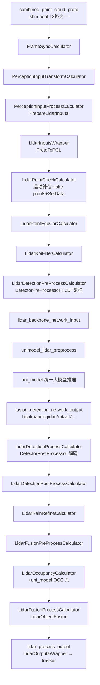

# 子模块2：lidar 激光雷达感知子模块

> 代码根目录：`/sandbox/perception/submodules/lidar`（约 309 个源文件）  
> 分支说明：perception 及其 submodules 位于 `Stable_Master_4.0_new`（当前检出即该分支）；平台层 platform/church 位于 `dev_master`，本文不涉及平台层差异。  
> 本文所有结论均给出代码证据；无法给出证据的推断处标"推断"。

## 1. 子模块定位与职责

### 1.1 代码仓库结构

lidar 与 camera 同构（独立 bazel/cmake 仓，以子模块集成进 perception 主仓）：

```
lidar/
├── modules/            # 算法模块（业务核心）
│   ├── detection/      # 主检测链：pre_processor / infer / post_processor（C++/CUDA）
│   ├── occupancy/      # OCC/gridmap 占用栅格（消费 uni_model 的 BEV 头）
│   ├── gridmap/        # 静态目标 gridmap
│   ├── ground_detector/  # 地面检测（CSF/三角面等实现；L2AVP 图中主地面检测节点已注释）
│   ├── roi_filter/     # ROI 过滤（bitmap）
│   ├── fusion/         # LidarObjectFusion 多来源目标融合
│   ├── rain_refine/    # 雨雾点云修正
│   ├── invisible_detector/ # 雷达盲区/不可见目标
│   ├── anomalies/      # 雷达异常检测（GPU RV 网格）
│   ├── motionseg/      # 运动分割（L2AVP 主图未见调用，未验证）
│   ├── segmentation/ semantic_seg/ overhead_occupancy/ ca_detector/ dolphin/ ...
│   └── lidar_modules.hpp
├── onboard/calculators/  # graphpipe 计算节点
├── accel_ops/ cuda_utils/ # CUDA 加速算子
└── cfg/graphs/lidar_sub_graph.cfg  # LidarOccProcessSubgraph 子图定义
```

### 1.2 在 C01 L2AVP 中的调用点（已验证）

主感知子图 `PercepL2AvpSubgraph`（`/sandbox/perception/perception/cfg/graphs/onnx/graph_l2avp.cfg` 第 247\~276 行）中，**lidar 子图以节点 `LidarOccProcessSubgraph` 被显式调用**：

```cfg
node {
  calculator: "LidarOccProcessSubgraph"
  input_stream: "LIDAR_INPUTS:lidar_inputs"
  input_stream: "UNI_MODEL_OUTPUT:uni_model_output"
  ...
  output_stream: "LIDAR_PROCESS_OUTPUT:lidar_process_output"
  output_stream: "LIDAR_BACKBONE_NETWORK_INPUT:lidar_backbone_network_input"
  output_stream: "NN_OUT:fusion_detection_network_output"
  output_stream: "STATIC_OBJECTS:lidar_grid_map_static_objects"
  ...
}
```

子图本体即 `/sandbox/perception/submodules/lidar/cfg/graphs/lidar_sub_graph.cfg`（BUILD.bazel 第 11 行 `register_name = "LidarOccProcessSubgraph"`）。

### 1.3 职责划分（重要结论）

C01 L2AVP 中 lidar 主检测模型同样是 **uni_model 的激光分支**（`unimodel_lidar_preprocess` 产出 voxel 输入）。lidar 子模块职责：

1. **点云预处理**：运动补偿、本车点剔除、ROI 过滤、采样、体素化特征（`filter_pc`/`idx_info`/`cur_frame_mask_within_range`）；
2. **检测后处理**：解码 `heatmap/reg/dim/rot/vel/heading/subtype/attr/door_attr` 等头为 3D 框，并做语义点云回填；
3. **占用栅格/静态物**：消费 uni_model 的 `static_bev_output`/`ground_bev_output`/`cstr_bev_*` 头，结合点云输出静态目标（gridmap/OCC）；
4. **点云级修正与融合**：rain_refine、invisible_detector、`LidarObjectFusion` 把检测目标与静态物/运动概率融合成 `lidar_process_output`；
5. **质量监控**：`LidarAnomaliesCalculator` 检测雷达异常。

**关于"地面分割/聚类"**：传统的 `LidarGroundDetectionCalculator` 节点在 lidar_sub_graph.cfg L62\~71 中**整段被注释**——即 L2AVP 不再走独立地面分割；地面高度信息改由 uni_model 的 `ground_bev_output` 头 + `GroundHeightLevel` 状态（`ParamSingleton::GetLastGroundHeightLevel()`，参与预处理旋转策略）承担。经典 ground_detector 模块仍在仓内，但未挂入 L2AVP 图（未验证其在其它车型配置中的使用）。

## 2. 核心类结构与成员变量

### 2.1 主要类清单

| 类/Calculator | 文件 | 职责 |
|-|-|-|
| `LidarInputsWrapper` | `/sandbox/perception/submodules/base/lidar/lidar_basic_type.h` L19 | 点云+位姿输入容器（主图→lidar 子图） |
| `LidarAlgoProcessInput` | `/sandbox/perception/submodules/base/lidar/lidar_context.h` L21 | lidar 算法输入（含 `cloud_gpu`） |
| `LidarFrame` | `/sandbox/perception/submodules/base/lidar/lidar_frame.h` L21 | 帧级数据（点云、点语义/标志、各类目标） |
| `LidarPointCheckCalculator` | `lidar/onboard/calculators/lidar_point_check_calculator.cc` | 入口：补偿+fake points+打包 |
| `LidarPointEgoCarCalculator` / `LidarRoiFilterCalculator` | 同目录 | 本车点剔除、ROI 过滤 |
| `LidarDetectionPreProcessCalculator` | `lidar/onboard/calculators/lidar_detection_preprocess_calculator.cc` | 调 `DetectorPreProcessor` 产 NN 输入 |
| `DetectorPreProcessor` | `lidar/modules/detection/detector_pre_processor.hpp` L39 | 采样/体素化（CUDA） |
| `LidarDetectionProcessCalculator` | `lidar/onboard/calculators/lidar_detection_process_calculator.cc` | 调 `DetectorPostProcessor` 解码 |
| `DetectorPostProcessor` | `lidar/modules/detection/detector_post_processor.hpp` | BoxesDecode、语义回填、组装目标 |
| `LidarOccupancyCalculator` | `lidar/onboard/calculators/lidar_occupancy_calculator.cc` | OCC/gridmap 静态物 |
| `LidarFusionProcessCalculator` | `lidar/onboard/calculators/lidar_fusion_process_calculator.cc` | `LidarObjectFusion` 融合并打包输出 |
| `ParamSingleton` | `lidar/onboard/calculators/lidar_processor_base.h` L59 | 参数/盲区/地面高度单例 |

### 2.2 关键结构体

**输入容器 `LidarInputsWrapper`**（base/lidar/lidar_basic_type.h L19\~25）：

```cpp
struct LidarInputsWrapper {
  uint64_t lidar_frame_id{};
  PointCloudXYZIBT::Ptr pcd{};                 // PCL 点云(XYZI+Beams+Timestamp)
  uint64_t timestamp_in_microsecond;
  std::shared_ptr<common::Transformation3> tf{};
  common::InternalPoseConstPtr pose_ptr{};
  std::shared_ptr<common::Transformation3> vehicle_to_sensing{};
};
```

**算法输入 `LidarAlgoProcessInput`**（base/lidar/lidar_context.h L21\~58）：

```cpp
struct alignas(16) LidarAlgoProcessInput {
  uint64_t lidar_frame_id;
  double timestamp_in_second;
  uint64_t timestamp_in_microsecond;
  PointCloudXYZIBT::ConstPtr cloud;            // CPU 点云
  Eigen::Affine3d lidar2world_pose;
  deeproute::os::hpc_hal::Buffer<PointXYZIBT> cloud_gpu;  // GPU 点云(HAL Buffer)
  int max_pc_points = 0;
  ...
};
```

## 3. 核心处理流程与函数调用链

### 3.1 从 shm 到 lidar 子图



**点云进入点（已验证）**：`PerceptionInputProcessCalculator::PrepareLidarInputs()` 把 proto 点云转 PCL：

> 文件路径：/sandbox/perception/perception/calculators/perception_input_process_calculator.cc  
> 函数名：PerceptionInputProcessCalculator::PrepareLidarInputs()  
> 核心逻辑：
> 
> ```cpp
> uint64_t timestamp =
>     input->point_cloud->header().timestamp_sec() * 1'000'000.0;
> ...
> PointCloudXYZIBT cloud;
> // 预留额外空间以容纳下游 lidar_point_check_calculator 插入的 fake points，
> // 避免后续 insert 时触发 vector reallocation（拷贝全部点云，~0.5ms 开销）。
> cloud.reserve(`static_cast<size_t>`(input->point_cloud->width()) *
>                   input->point_cloud->height() +
>               kFakePointsHeadroom);
> deeproute::common::ProtoToPCL(*(input->point_cloud), cloud);
> boost::`shared_ptr<PointCloudXYZIBT>` cloud_ptr =
>     boost::`make_shared<PointCloudXYZIBT>`(std::move(cloud));
> ...
> lidar_inputs.pcd = cloud_ptr;
> ```
> 
> 逻辑说明：输入 topic `/sensors/lidar/combined_point_cloud_proto` 属于 `kInShmpoolTopics`（perception_input_transform_calculator.cc L79\~80），即点云经共享内存池零拷贝读取；此处转为 PCL `PointCloudXYZIBT` 并封装 `LidarInputsWrapper`。

### 3.2 点云预处理入口（补偿 + GPU 上传）

> 文件路径：/sandbox/perception/submodules/lidar/lidar/onboard/calculators/lidar_point_check_calculator.cc  
> 函数名：LidarPointCheckCalculator::Process()  
> 核心逻辑：
> 
> ```cpp
> // lidar compensate（按定位位姿插值做运动补偿）
> if (use_lidar_compensation_ && !should_skip_compensation) {
>   localization_pose_.InsertValue(
>       lidar_algo_input.timestamp_in_microsecond, pose_tf);
>   if (!common::CompensateByPoseInterpolator(
>           localization_pose_, *lidar_algo_input.vehicle_to_sensing,
>           lidar_algo_input.pcd.get())) {
>     MLOG(WARN) << "Point cloud compensation failed ... skip this point cloud";
>   }
> }
> //@gaoxiang fake points insert at front, padding in here?
> lidar_algo_input.pcd->insert(lidar_algo_input.pcd->begin(),
>                              fake_pcd_.begin(), fake_pcd_.end());
> process_input_->SetData(lidar_algo_input.lidar_frame_id,
>                         lidar_algo_input.timestamp_in_microsecond,
>                         lidar_algo_input.pcd,
>                         lidar_algo_input.tf->GetAffineTransform());
> ```
> 
> 逻辑说明：输出 `base::LidarAlgoProcessInput*`。fake points 为 21 个车前固定点（Open() 中构造 `PointXYZIBT{x,0,0,0,0,0}`，L106~~110），用于空点云兜底。`SetData`（lidar_context.h L40~~58）在点数超限时按 1.5 倍扩容 `cloud_gpu` HAL Buffer。

### 3.3 检测预处理（H2D 拷贝 + 采样）

> 文件路径：/sandbox/perception/submodules/lidar/lidar/modules/detection/detector_pre_processor.cpp  
> 函数名：DetectorPreProcessor::Process()  
> 核心逻辑：
> 
> ```cpp
> num_point_ = input.pc_num;
> pc_gpu_ = input.cloud_gpu;
> ...
> const bool should_rotate =
>     (ground_height_level == lidar::GroundHeightLevel::kTooHigh) ||
>     (ground_height_level == lidar::GroundHeightLevel::kTooLow);
> if (should_rotate) {
>   // 地面高度异常时，绕 y 轴旋转 ±rotate_angle_ 再上传（坡道自适应）
>   pc_gpu_.CopyFrom(rotate_pc_cpu_buffer_.data(), 0,
>                    sizeof(PointXYZIBT) * n, *cuda_stream_);
> } else {
>   pc_gpu_.CopyFrom(pcd_ptr->points.data(), 0,
>                    sizeof(pcd_ptr->points[0]) * pcd_ptr->points.size(),
>                    *cuda_stream_);                        // CPU→GPU
> }
> if (use_sweeps_) { valid_num_point_ = InputSweepDataProvider(); } // 多帧累积
> else            { valid_num_point_ = InputDataProvider(); }
> ```
> 
> 逻辑说明：随后 `LidarDetectionPreProcessCalculator::Process` 把三个 GPU buffer 组装为 NN 输入节点：`filter_pc{1,N,5}`、`idx_info{1,N,4}`、`cur_frame_mask_within_range{N}`（lidar_detection_preprocess_calculator.cc L114~~136），经 `lidar_backbone_network_input` 流入 `unimodel_lidar_preprocess`（graph_l2avp.cfg L622~~659）。

### 3.4 检测后处理（解码 + 语义回填）

> 文件路径：/sandbox/perception/submodules/lidar/lidar/modules/detection/detector_post_processor.cpp  
> 函数名：DetectorPostProcessor::GetObjects()  
> 核心逻辑：
> 
> ```cpp
> // 1) 语义点回填：把稀疏化采样点的语义结果按 pc_inv_map_ 写回原始点云
> cuda_utils::MapToOriginOffsets(cuda_stream_.`GetStream<cudaStream_t>`(),
>     num_point_, valid_num_point_,
>     output_semantic_.GetPtr(), output_point_offset_.GetPtr(),
>     output_front_.GetPtr(), pc_semantics_pin_.data(),
>     pc_offsets_.GetPtr(), pc_fronts_.GetPtr(), pc_inv_map_.GetPtr());
> ...
> // 2) heatmap 解码为 3D 框（CUDA kernel，含分类分数/盲区/远近阈值过滤）
> cuda_utils::BoxesDecode(
>     cuda_stream_.`GetStream<cudaStream_t>`(), map_size_, output_map_height_,
>     output_heatmap_.GetPtr(), output_subtype_heatmap_.GetPtr(),
>     output_offset_.GetPtr(), output_dim_.GetPtr(), output_rot_.GetPtr(),
>     output_height_.GetPtr(), output_velocity_.GetPtr(), output_head_.GetPtr(),
>     class_score_thresh_.GetPtr(), class_score_range_.GetPtr(),
>     class_score_is_blind_.GetPtr(), ...);
> ```
> 
> 逻辑说明：`LidarDetectionProcessCalculator::Process` 先从 `fusion_detection_network_output` 的 13+ 个节点按序取出 GPU 指针填入 `network_output_`（lidar_detection_process_calculator.cc L148~~194），再调 `DetectorPostProcessor::Process()`；解码后的目标经 `AssembleResultToLidarFrame(...)` 打包目标点云（L203~~206），遮挡属性过滤后输出 `SEMANTED_OBJECTS`。

### 3.5 静态物/OCC 与融合输出

`LidarOccupancyCalculator::Process` 从 uni_model 输出取 `static_bev_pred_`/`static_bev_sem_pred_`/`ground_bev_pred_`/`cstr_bev_longrange_pred_`（lidar_occupancy_calculator.cc L251~~256），调用 `occupancy_->Process(...)`（gridmap 实现，L327~~340）产出 `lidar_grid_map_static_objects`。`LidarFusionProcessCalculator::Process` 最终调 `lidar_fusion_->Process(process_input->cloud, *invisible_objects, *motion_probs, *static_objects, *segmented_objects, *semantic_flags)`（lidar_fusion_process_calculator.cc L248\~250），打包 `LidarOutputsWrapper` 发布 `ALGO:lidar_process_output`。

## 4. 核心算法入口与关键逻辑

| 环节 | 入口 | 关键逻辑（证据见第 3/6 章） |
|-|-|-|
| 运动补偿 | `LidarPointCheckCalculator::Process` | `CompensateByPoseInterpolator` 按位姿插值补偿扫描期间自车运动；高优先级道路+特定车型（LP/DE）可跳过（L84~~99, L127~~145） |
| 采样 | `DetectorPreProcessor::InputDataProvider/InputSweepDataProvider` | `PointSampler::PointsSampleGPU` 按 `distance_score_ratio_`/`max_distance_` 降采样，多帧 sweep 支持经 `LiDARCache` 缓存（detector_pre_processor.hpp L124\~132） |
| NN 推理 | 主图 `uni_model`（NNInternalCalculator） | 激光输入 `voxel_inputs/unq_pillar_coords/unq_voxel_coords/voxel_overall_mask/cur_idx_info`（graph_l2avp.cfg L213\~217） |
| 解码 | `DetectorPostProcessor::GetObjects` | CUDA `BoxesDecode`：heatmap→中心偏移/尺寸/朝向/速度，按类别分数阈值+盲区模式过滤 |
| NMS 说明 | — | lidar 侧未见显式 CPU/GPU NMS 调用（与 camera 不同）；目标去重依赖 heatmap 峰值解码 + 类别分数阈值（推断，依据 BoxesDecode 参数表与后处理代码中无 nms 关键字；未验证 kernel 内部实现） |
| 语义回填 | `MapToOriginOffsets` | 稀疏点语义→全量点云 `semantic_flags`，供 gridmap/rain_refine 使用 |
| 输出融合 | `LidarObjectFusion` | 检测目标 + 静态物 + 不可见目标按来源融合；连续 30 帧空目标告警（lidar_fusion_process_calculator.cc L237\~246） |

## 5. 输入输出数据结构

### 5.1 输入

- Topic：`/sensors/lidar/combined_point_cloud_proto`（多雷达拼合点云，shm pool 读取，见 3.1 节证据）。
- Proto → `PointCloudXYZIBT`（x,y,z,intensity,beam,timestamp）。
- `LidarInputsWrapper` → `LidarAlgoProcessInput`（含 `cloud_gpu`）。
- Side packets：`lidar_config_proto`（标定/安装位姿）、`car_config_proto`、`ground_config_proto`、`lidar_process_param_path`。

### 5.2 中间结构

- `LidarDetectorNetworkInput`：`input_feats{N,5}`、`input_coords{N,4}`、`current_frame_mask{N}`、`valid_num_point`。
- `LidarDecetorPreProcessOutput`：`cloud_gpu`、`pc_inv_map`、`unsample_indice`、`lidar2world_pose` 等（detector_pre_processor.cpp L192\~199）。
- `base::LidarDetectorNetworkOutput`：`heatmap/reg/height/dim/rot/vel/heading/semantic/semantic_score/front/point_offset/subtype/attr/door_attr` 等 GPU 指针（lidar_detection_process_calculator.cc L148\~194 与子图 name_filter 列表一致）。
- `LidarFrame`（base/lidar/lidar_frame.h L21\~66）：`point_flags`、`semantic_flags`、`segmented_objects`、`static_objects`、`invisible_objects`、`motion_probs` 等。

### 5.3 输出

**`LidarOutputsWrapper`**（base/lidar/lidar_basic_type.h L133\~146）：

```cpp
struct LidarOutputsWrapper {
  uint64_t lidar_frame_id;
  uint64_t timestamp_in_microsecond;
  std::shared_ptr<std::vector<base::ObjectPtr>> objects;   // 融合后 3D 目标
  std::shared_ptr<std::vector<base::PointSemanticType>> semantics;  // 点级语义
  std::shared_ptr<std::vector<Eigen::Vector2f>> motion_flows;
  std::shared_ptr<std::vector<Eigen::VectorXf>> ground_plane_params;
  PointCloudXYZIBT::ConstPtr pcd{};
  std::shared_ptr<std::unordered_map<int, base::StatusCode>> status_map;
};
```

打包处：`LidarFusionProcessCalculator::Process`（lidar_fusion_process_calculator.cc L252\~273）。去向：`lidar_process_output` 流入主图 `MultiModalityPreprocessCalculator`（include `lidar/lidar_basic_type.h`，multi_modality_preprocess_calculator.cc L30）与 `PerceptionTrackerProcessCalculator`（LIDAR 输入，perception_tracker_process_calculator.cc L18），最终进入 tracker 模块融合成 `PerceptionObstacles` 输出。

## 6. 代码证据与关键片段

（第 3 章已给 4 段证据；补充 2 段）

**证据 A：检测后处理计算节点的输入装配（模型头与子图 name_filter 一一对应）**

> 文件路径：/sandbox/perception/submodules/lidar/lidar/onboard/calculators/lidar_detection_process_calculator.cc  
> 函数名：LidarDetectionProcessCalculator::Process()  
> 核心逻辑：
> 
> ```cpp
> network_output_.output_offset = nn_internal_output.nodes.at(0).`GetBuffer<float>`();
> network_output_.output_height = nn_internal_output.nodes.at(1).`GetBuffer<float>`();
> network_output_.output_dim    = nn_internal_output.nodes.at(2).`GetBuffer<float>`();
> network_output_.output_rot    = nn_internal_output.nodes.at(3).`GetBuffer<float>`();
> network_output_.output_velocity = nn_internal_output.nodes.at(4).`GetBuffer<float>`();
> network_output_.output_head   = nn_internal_output.nodes.at(5).`GetBuffer<float>`();
> network_output_.output_heatmap = nn_internal_output.nodes.at(6).`GetBuffer<float>`();
> network_output_.output_semantic = nn_internal_output.nodes.at(7).`GetBuffer<int32_t>`();
> ...
> detector_post_processor_->SetPose(process_input->lidar2world_pose);
> detector_post_processor_->Process(network_output_, detection_preprocess_output);
> AssembleResultToLidarFrame(
>     process_input->cloud, process_input->timestamp_in_second,
>     &segmented_objects_, detection_preprocess_output.objects,
>     pack_object_pointcloud_, min_points_);
> ```
> 
> 逻辑说明：节点顺序与 lidar_sub_graph.cfg L118~~159 的 `uni_model_spliter_fusion_detection_network_output` name_filter 顺序（reg/height/dim/rot/vel/heading/heatmap/point_pred/...）一致；闸机（barrier_gate）头按 `enable_barrier_gate()` 开关挂接（L177~~192）。

**证据 B：OCC 静态物（替代传统地面分割/聚类的静态物来源）**

> 文件路径：/sandbox/perception/submodules/lidar/lidar/onboard/calculators/lidar_occupancy_calculator.cc  
> 函数名：LidarOccupancyCalculator::Process()  
> 核心逻辑：
> 
> ```cpp
> static_bev_pred_      = nn_output.nodes.at(0).`GetBuffer<float>`();
> static_bev_sem_pred_  = nn_output.nodes.at(1).`GetBuffer<float>`();
> ground_bev_pred_      = nn_output.nodes.at(2).`GetBuffer<float>`();
> cstr_bev_longrange_pred_ = nn_output.nodes.at(3).`GetBuffer<float>`();
> ...
> occupancy_->Process(process_input, static_bev_pred_, road_roi_pred_,
>                     cstr_bev_longrange_pred_, others_bev_longrange_pred_,
>                     static_bev_offset_output_, static_bev_sem_pred_, ground_bev_pred_,
>                     *point_flags, *semantic_flags, *segmented_objects,
>                     motion_probs_, &static_objects_,
>                     traffic_sign_noise, false, barrier_gate_in_range, nullptr);
> ```
> 
> 逻辑说明：输入即 lidar_sub_graph.cfg L83~~115 `occupancy_filter` 拆出的 `static_bev_output/static_bev_subtype_output/ground_bev_output/cstr_bev_output_longrange/...`；OCC/gridmap 结合 GPU BEV 语义与点云标志位（`point_flags`/`semantic_flags`）输出静态目标，闸机状态从全局单例 `BarrierGateStatusManager` 读取实现完全并行（L319~~323 注释）。

### 附：关键文件索引

| 文件 | 作用 |
|-|-|
| `cfg/graphs/lidar_sub_graph.cfg` | LidarOccProcessSubgraph 子图（节点编排） |
| `onboard/calculators/lidar_point_check_calculator.cc` | 点云入口：补偿/fake points |
| `onboard/calculators/lidar_detection_preprocess_calculator.cc` | 检测预处理节点 |
| `modules/detection/detector_pre_processor.{hpp,cpp}` | 采样/体素化（CUDA） |
| `modules/detection/detector_post_processor.{hpp,cpp}` | 解码/语义回填/组装 |
| `onboard/calculators/lidar_occupancy_calculator.cc` | OCC/gridmap 静态物 |
| `onboard/calculators/lidar_fusion_process_calculator.cc` | 融合与输出打包 |
| `onboard/calculators/lidar_rain_refine_calculator.cc` | 雨雾修正 |
| `/sandbox/perception/submodules/base/lidar/lidar_frame.h` | 帧级数据结构 |
| `/sandbox/perception/submodules/base/lidar/lidar_context.h` | 算法输入结构 |

（全文约 5200 字）
