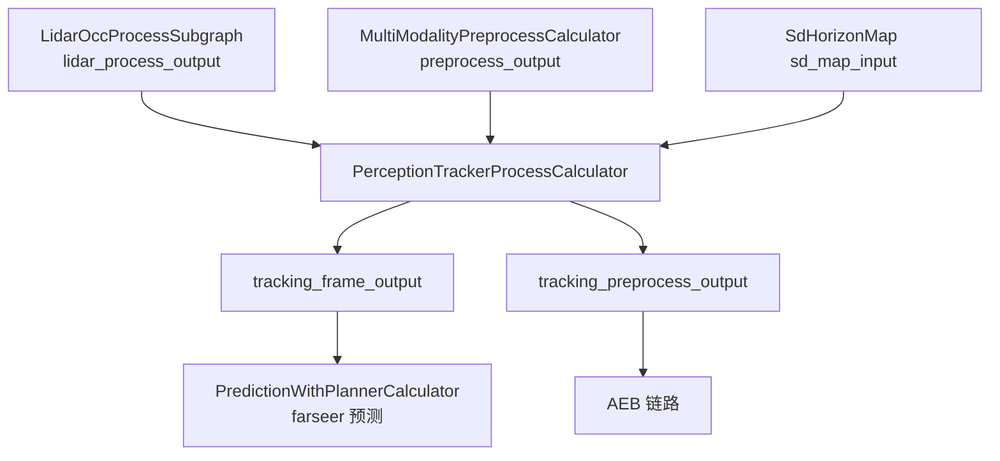
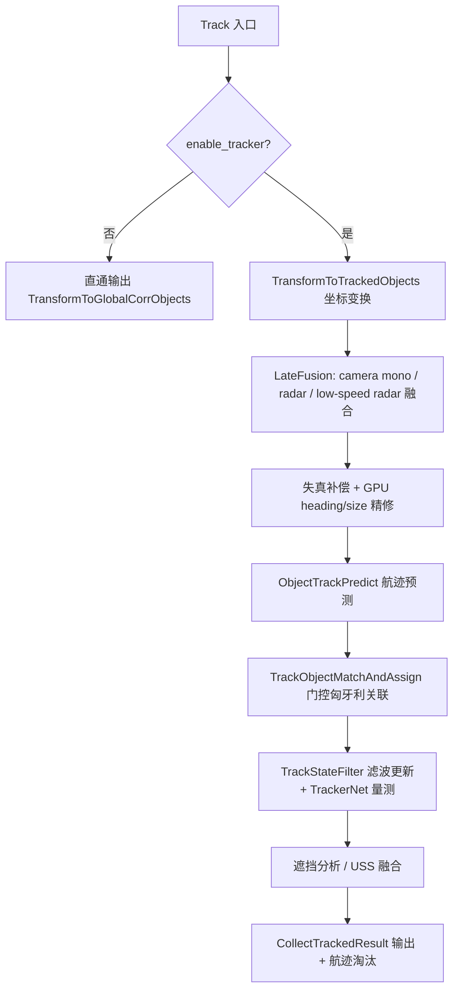

# 子模块3：tracker 多目标跟踪子模块

> 代码位置：`/sandbox/perception/submodules/tracker`（子仓实际检出分支：**Stable_Master_3.2**，perception 主仓为 Stable_Master_4.0_new，属 repo 子仓管理差异，未做任何改动）。

## 1. 子模块定位与职责

tracker 是感知主链路中的**多目标跟踪（MOT, Multi-Object Tracking）子模块**：以 BEV/栅格检测结果（`base::ObjectPtr` 列表）为主量测，融合 **radar（毫米波雷达）/camera（mono 单目 3D 与 2D）/uss（超声波）** 结果，维护跨帧**航迹（track/tracklet）**，完成"预测→关联→更新→输出"闭环，并向下游输出带稳定 `track_id`、平滑速度与属性的 `base::Object` 列表。

- 对外以 C 动态库接口暴露：`perception::ITracker` + `CreateTracker()`（编译为 `libtracker_processor.so`，安装到 `/opt/deeproute/perception/`）。
- 主链路场景（L2AVP Driving）启用 `enable_tracker: true`（见 `/sandbox/perception/submodules/tracker/cfg/tracker_param_config.cfg`）；AVP 泊车链路另有一套 `avp_tracker_param_config.cfg`，由 `PanoDetectionTrackingCalculator` 使用同一 ITracker 接口。

> 文件路径：/sandbox/perception/submodules/tracker/tracker/tracker_api.h  
> 函数名：perception::ITracker::Process()  
> 核心逻辑：
> 
> ```cpp
> virtual bool Process(const PointCloudXYZIBT::ConstPtr& pcd_ptr,
>                      const std::`vector<base::ObjectPtr>`& objects,        // lidar/BEV 检测
>                      const std::`vector<base::ObjectPtr>`& objects_radar,  // 毫米波
>                      const std::`vector<base::ObjectPtr>`& objects_camera, // 相机(mono/2d)
>                      const std::`vector<base::ObjectPtr>`& objects_uss,    // 超声波
>                      double timestamp,
>                      const Eigen::Affine3d& lidar2world_pose,
>                      const std::`vector<Eigen::VectorXf>`& ground_plane_params,
>                      std::`vector<base::ObjectPtr>`* tracked_objects,
>                      std::`vector<base::ObjectPtr>`* extra_objects,
>                      bool is_low_speed = false,
>                      bool is_driving = false) = 0;
> ...
> extern "C" { EXPORT_API ITracker* CreateTracker(); }
> ```
> 
> 逻辑说明：输入为**多传感器检测框 + 点云辅助数据 + lidar→world 位姿**，输出为**跟踪后目标（tracked_objects）与额外目标（extra_objects，如纯雷达低置信目标）**。多态重载支持纯视觉（无 pcd）模式。

## 2. 核心类结构与成员变量

### 2.1 顶层实现类 Tracker

> 文件路径：/sandbox/perception/submodules/tracker/tracker/tracker.hpp  
> 类名：perception::Tracker : ITracker  
> 核心逻辑：
> 
> ```cpp
> protected:
>   // track data
>   std::`vector<ObjectTrackDataPtr>` object_tracks_;   // 航迹集合（核心状态）
>   std::`vector<TrackedObjectPtr>` tracked_objects_;   // 本帧 lidar 量测（变换后）
>   std::`vector<TrackedObjectPtr>` tracked_objects_radar_;
>   std::`vector<TrackedObjectPtr>` tracked_objects_camera_mono_;
>   std::`vector<TrackedObjectPtr>` tracked_objects_uss_;
>   std::`unique_ptr<TrackObjectFilter>` filter_;       // 航迹初始化/滤波更新
>   std::`unique_ptr<TrackObjectMatcher>` matcher_;     // 关联（门控匈牙利）
>   std::`unique_ptr<TrackObjectRecaller>` recaller_;   // 丢跟找回
>   std::`unique_ptr<TrackObjectRefiner>` refiner_;     // 遮挡分析等精修
>   std::`unique_ptr<TrackObjectPreRefiner>` pre_refiner_;
>   std::`unique_ptr<LateFusion>` late_fusion_;         // 多传感器后融合
>   std::`unique_ptr<DepthEstimator>` depth_estimator_;
>   std::`unique_ptr<PostProcess>` post_process_;
>   std::`unique_ptr<PointCloudDistortionCompensation>` distortion_compensation_; // 点云失真补偿
>   std::`unique_ptr<ReportEvent>` report_event_;
>   std::`unique_ptr<MMEstimatorGPUBatch>` mm_estimator_batch_;  // 批量运动估计(GPU)
>   std::`shared_ptr<platform::base::NnInternal>` nn_;  // TrackerNet(UpdateNet) 推理
>   // trackernet 参数
>   int32_t max_tracklet_num_;
>   int32_t history_frame_num_ = 40;   // 历史帧数
>   int32_t predict_frame_num_ = 20;   // 预测帧数
>   int32_t input_feature_size_ = 12;  // (px,py,pz,dx,dy,dz,yaw,cos,sin,score,flag,ts)
>   int32_t output_feature_size_ = 11; // (px,py,pz,dx,dy,dz,yaw,vx,vy,track_score,uncertainty)
>   bool enable_update_net_ = true;
> ```
> 
> 逻辑说明：`object_tracks_` 是唯一跨帧状态（航迹库）；各 `modules/` 子组件在 `Init()` 中按 `LidarTrackerParam` 配置创建，Filter/Matcher/Recaller/Refiner 构成"航迹管理四件套"，`late_fusion_` 负责传感器级融合，`nn_` 承载学习式跟踪网络。

### 2.2 航迹数据类 ObjectTrack / ObjectTrackData

> 文件路径：/sandbox/perception/submodules/tracker/tracker/common/object_track.h  
> 类名：perception::ObjectTrack  
> 核心逻辑：
> 
> ```cpp
> class ObjectTrack {
>  public:
>   std::`pair<double, TrackedObjectPtr>` GetLatestObject() { ... }
>   TrackedObjectConstPtr GetPredictObjectPtr() const { return predict_object_; }
>   virtual void PushTrackedObjectToTrack(const TrackedObjectPtr& obj, double time);
>  public:
>   int track_id_ = -1;
>   int age_ = 0;                          // 航迹自首观测以来的年龄
>   int consecutive_invisible_count_ = 0;  // 连续不可见次数
>   int total_visible_count_ = 0;          // 累计观测次数
>   TrackedObjectPtr predict_object_ = nullptr;   // 本帧预测位置
>   absl::`btree_map<double, TrackedObjectPtr>` history_objects_; // 历史量测(按时间)
>   int max_history_size_ = 40;
> };
> ```
> 
> 逻辑说明：`ObjectTrack` 存"航迹身份 + 历史量测 + 预测框"；子类 `ObjectTrackData`（object_track_data.h）扩展了滤波器 `ObjectSmoother`、缓存队列 `cached_objects_`、遮挡/静止/转弯状态、雷达匹配状态等运行期信息，`PredictObject()` / `PushTrackedObjectToCache()` / `ToObject()` 是预测-更新-落地的关键方法。

### 2.3 单帧量测对象 TrackedObject

> 文件路径：/sandbox/perception/submodules/tracker/tracker/common/tracked_object.h  
> 类名：perception::TrackedObject（struct，L25 起）  
> 核心逻辑：
> 
> ```cpp
> struct TrackedObject {
>   base::ObjectPtr object_ptr;        // 指向 base::Object（输出用）
>   // 内部保留：全局坐标量测、预测状态、匹配代价缓存、supplement 信息等
> };
> typedef std::`shared_ptr<TrackedObject>` TrackedObjectPtr;  // L406
> ```
> 
> 逻辑说明：`TrackedObject` 是 `base::Object` 在 tracker 内部的"加工态"包装（补全局坐标、门控缓存、量测时间等），属于推断（结构体其余字段见头文件 L25-L404，此处仅列关键关联字段）。

## 3. 核心处理流程与函数调用链

### 3.1 在 C01 l2avp 图中的调用点

C01（orin 平台 L2AVP）感知图两级结构：

1. 顶层 `perception_graph_l2avp_orin.cfg`：`FrameSyncCalculator → PerceptionInputTransformCalculator → PercepL2AvpSubgraph → FrameDoneCalculator`；
2. 子图 `perception/perception/cfg/graphs/graph_l2avp.cfg` 中 tracker 由 **`PerceptionTrackerProcessCalculator`** 节点 `perception_tracker` 承载：

> 文件路径：/sandbox/perception/perception/cfg/graphs/graph_l2avp.cfg（L912-L929）  
> 节点名：perception_tracker  
> 核心逻辑：
> 
> ```text
> node {
>   name: "perception_tracker"
>   calculator: "PerceptionTrackerProcessCalculator"
>   input_stream: "LIDAR:lidar_process_output"      # lidar 子图检测/跟踪预处理输出
>   input_stream: "PREPROCESS:preprocess_output"    # 多模态融合预处理（radar/camera/uss 打包）
>   input_stream: "SD_MAP:sd_map_input"             # 高精地图（道路优先级用于补偿开关）
>   output_stream: "INTER:0:tracking_frame_output"  # → PredictionWithPlannerCalculator（主链路）
>   output_stream: "INTER:1:tracking_preprocess_output"  # → AEB（注明仅 AEB 用，需 deepcopy）
>   input_side_packet: "CONFIG:3:tracker_param_path"     # tracker_param_config.cfg
>   input_side_packet: "ENABLE_T2_MONO_OBJ_SWITCH:..."   # 等 3 个运行时开关
> }
> ```
> 
> 逻辑说明：C01 主链路（Driving 模式）中 tracker 的上游是 `LidarOccProcessSubgraph` 与 `MultiModalityPreprocessCalculator`，下游是 farseer 预测（`PredictionWithPlannerCalculator`）与 AEB 同步节点。AVP 泊车分支由 `PanoDetectionTrackingCalculator` 复用同一 tracker 库。



### 3.2 Tracker::Track() 内部主流程（L2AVP 主链路全启用配置下）

> 文件路径：/sandbox/perception/submodules/tracker/tracker/tracker.cpp  
> 函数名：Tracker::Track()（L1346-L1801）  
> 核心逻辑（按执行顺序摘录）：
> 
> ```cpp
> bool Tracker::Track(...) {
>   if (!enable_tracker_) { TransformToGlobalCorrObjects(...); return true; }   // (1) 直通
>   if (enbale_motion_compensation_) distortion_compensation_->RecordPose(...); // (2) 位姿记录
>   ...timestamp 回退/跳变 → object_tracks_.clear() 重置...
>   TransformToTrackedObjects(objects, objects_radar, ..., lidar2world_pose, timestamp); // (3) 坐标变换
>   if (enable_camera_fusion_mono_) late_fusion_->LidarObjectMatchCameraObject(..., 1);  // (4) mono 融合
>   if (enable_camera_fusion_2d_)   late_fusion_->LidarObjectMatchCameraObject(..., 2);  // (5) 2d 融合
>   if (enable_radar_fusion_) { late_fusion_->ProjectAndJudgeRadarObjects(...);
>       late_fusion_->LidarObjectMatchRadarObject(..., &unassigned_radar_objects); }     // (6) radar 融合
>   distortion_compensation_->CompensationUsingPointCloudOffset(tracked_objects_);       // (7) 失真补偿
>   TrackObjectHeadingRefine(tracked_objects_);   // (8) GPU 朝向精修
>   TrackObjectSizeRefine(tracked_objects_);      // (9) GPU 尺寸精修
>   ObjectTrackPredict(object_tracks_, lidar2world_pose, timestamp);  // (10) 航迹预测
>   TrackObjectMatchAndAssign(tracked_objects_, unassigned_radar_objects, &object_tracks_, timestamp); // (11) 关联
>   TrackStateFilter(object_tracks_);             // (12) 状态滤波更新
>   TrackObjectOcclusionAnalysis(&object_tracks_);// (13) 遮挡分析
>   CollectTrackedResult(tracked_objects, extra_objects, ...);            // (14) 结果输出
>   RemoveStaleObjectTrackData(&object_tracks_);  // (15) 航迹淘汰
> }
> ```
> 
> 逻辑说明：全流程 = **输入准备(1-3) → 传感器后融合(4-6) → 量测精修(7-9) → 预测(10) → 关联(11) → 更新(12-13) → 输出与清理(14-15)**。C01 tracker_param_config.cfg 中 `enable_camera_fusion_mono/radar_fusion` 为 true、`enable_uss_fusion` 为 false，故 (5) 不执行；(1) 的时间戳保护（回退或跳变 >1s 清空航迹）见 L1390-L1404。



## 4. 核心算法入口与关键逻辑（预测/关联/更新）

### 4.1 预测：ObjectTrackPredict

> 文件路径：/sandbox/perception/submodules/tracker/tracker/tracker.cpp  
> 函数名：Tracker::ObjectTrackPredict()（L786）  
> 核心逻辑：
> 
> ```cpp
> void Tracker::ObjectTrackPredict(const std::`vector<ObjectTrackDataPtr>`& tracks,
>                                  const Eigen::Affine3d& lidar2world_pose, double timestamp) {
>   for (const auto& track_data : tracks) {
>     track_data->PredictObject(lidar2world_pose, ego_velocity_, timestamp);
>   }
> }
> ```
> 
> 逻辑说明：对每条航迹按自车速度 `ego_velocity_` 与时间差把上一帧状态外推到当前帧（`predict_object_`），为关联提供"预测框"。实现在 object_track_data.cpp::PredictObject（本篇未展开，标注**推断**：含匀速/运动补偿逻辑）。

### 4.2 关联：TrackObjectMatchAndAssign + 门控匈牙利

> 文件路径：/sandbox/perception/submodules/tracker/tracker/tracker.cpp  
> 函数名：Tracker::TrackObjectMatchAndAssign()（L794）  
> 核心逻辑：
> 
> ```cpp
> void Tracker::TrackObjectMatchAndAssign(const std::`vector<TrackedObjectPtr>`& objects,
>     const std::`vector<TrackedObjectPtr>`& radar_obj,
>     std::`vector<ObjectTrackDataPtr>`* tracks, double timestamp) {
>   if (enable_query_match_) { late_fusion_->QueryMatchFusion(...); }
>   else { matcher_->Match(objects, *tracks, &assignments, &unassigned_tracks, &unassigned_objects); }
>   GetTrackernetMeasurements(objects, *tracks, assignments);   // TrackerNet 量测(若启用)
>   for (const auto& pair : assignments)
>     tracks->at(pair.first)->PushTrackedObjectToCache(objects.at(pair.second)); // 匹配→入缓存
>   ... // tracklet-camera/radar 二次融合
>   for (auto& id : unassigned_objects) {                       // 未匹配量测 → 新建航迹
>     ObjectTrackDataPtr track_data = std::`make_shared<ObjectTrackData>`();
>     filter_->InitializeTrack(track_data, objects.at(id));
>     tracks->emplace_back(track_data);
>   }
>   for (auto& id : unassigned_tracks) {                        // 未匹配航迹
>     if (recall_miss_object_by_physical_ && ...)
>       recaller_->RecallMissObject(tracks->at(id));            // 找回
>     tracks->at(id)->PushTrackedObjectToCache(tracks->at(id)->predict_object_);
>   }
> }
> ```
> 
> 逻辑说明：关联核心是 `matcher_->Match()`：先用 `ComputeAssociateMatrix()`（track_object_matcher.cpp L309，基于 `TrackObjectDistance` 计算代价矩阵），再由 `optimizer_.Match()`（`GatedHungarianMatcher<float>`，OPTMIN，见 track_object_matcher.cpp L21）做**门控匈牙利最优分配**；未匹配量测建新航迹，未匹配航迹可被 `recaller_` 找回或用预测框占位。C01 cfg `enable_query_match: false`，故走经典路径。

> 文件路径：/sandbox/perception/submodules/tracker/tracker/modules/track_object_matcher.cpp  
> 函数名：TrackObjectMatcher::Match()（L67 起）  
> 核心逻辑：
> 
> ```cpp
>   cost_matrix_->Resize(tracks.size(), objects.size());
>   ComputeAssociateMatrix(tracks, objects, cost_matrix_);
>   optimizer_.Match(max_match_loose_th_, bound_value_, opt_flag_, assignments,
>                    unassigned_tracks, unassigned_objects);
> ```
> 
> 逻辑说明：`max_match_loose_th_/bound_value_` 等门控阈值按大小目标（big/small object）在 `Init()` 中区分配置（L33-L45），距离度量由 `TrackObjectDistance` 提供（中心距/朝向/类别一致性等，未逐项展开，标注**推断**）。

### 4.3 更新：TrackStateFilter 与 TrackerNet

> 文件路径：/sandbox/perception/submodules/tracker/tracker/tracker.cpp  
> 函数名：Tracker::TrackStateFilter()（L927）  
> 核心逻辑：
> 
> ```cpp
> void Tracker::TrackStateFilter(const std::`vector<ObjectTrackDataPtr>`& tracks) {
>   if (use_mm_estimator_batch_) {
>     late_fusion_->GetMMEstimateMeasure(tracks, &objects, *mm_estimator_batch_);
>     for (...) { track_data->GetLastestAndCleanCachedObjects(&new_object);
>                 filter_->UpdateObjectTrackDataWithObject(track_data, new_object, *report_event_); }
>   } else {
>     for (const auto& track_data : tracks) {
>       track_data->GetAndCleanCachedObjectsInTimeInterval(&objects);  // 取本帧缓存量测
>       for (const auto& object : objects)
>         filter_->UpdateObjectTrackDataWithObject(track_data, object, *report_event_); // 逐量测更新
>     }
>   }
> }
> ```
> 
> 逻辑说明：更新入口在 `TrackObjectFilter::UpdateObjectTrackDataWithObject()`（滤波/平滑，内部含 `ObjectSmoother`，**推断**）。学习式通道 `GetTrackernetMeasurements()`（L843-L925）在 `enable_update_net_` 时，把每条航迹最近 `history_frame_num_=40` 帧特征拼成 `max_tracklet_num_` 批量输入 `nn_->Process()`，将输出（未来 20 帧 `predict_frame_num_` 的位置/速度/置信度）经 `SetTrackerModelOutput()` 写回航迹——即 **TrackerNet/UpdateNet（跟踪更新网络）**，对应 cfg `updatenet_param`。

### 4.4 航迹生命周期（补充）

- 新建：关联未匹配量测 → `InitializeTrack`；淘汰：`RemoveStaleObjectTrackData()`（L1319，基于 `invisible_life_cycle_threshold=5` 等阈值，见 cfg）；
- 输出保真：`CollectTrackedResult()`（L977）里用 `collect_objs_ptr_cache_` 等预分配缓存避免逐帧分配（tracker.hpp L471-L477）；
- 空帧保护：连续 `null_obstacle_count_ >= 70`（7Hz×10s）且 mono 有效则上报 `PERCEPTION_RUNTIME_NULL_OBSTACLE_DETECTED`（L1718-L1746）。

## 5. 输入输出数据结构

| 方向 | 结构 | 说明 |
|-|-|-|
| 输入 | `base::MultiModalityPreprocessOutput`（calculator 侧容器，定义于 `submodules/base/frame/multi_modality_base.h`） | 携带 `lidar_objects/radar_objects/camera_objects/ultraonic_objects/tf/ground_plane_params/timestamp_sec` |
| 输入 | `base::LidarOutputsWrapper` | 含原始点云 `pcd`（`PointCloudXYZIBT`，XYZI+环号） |
| 输入 | `deeproute::map::SdHorizonMap` | 高精地图，用于"高速禁用点云补偿"道路优先级判断 |
| 输出 | `std::vector<base::ObjectPtr>` → `tracking_frame_output` | 跟踪结果（含 track_id、速度、属性），交 farseer 预测 |
| 输出 | `std::vector<base::ObjectPtr>` → `tracking_preprocess_output` | AEB 专用（图配置注明需 deepcopy） |
| 参数 | `LidarTrackerParam`（`proto/tracker_param.pb.h`）+ `tracker_param_config.cfg` | 开关/阈值/TrackerNet 参数 |

`base::Object`（公共数据结构，见子模块8文档）核心字段：`center/size/theta/velocity/type/confidence/tracking_time/attribute_type` 等，均由 tracker 写入或精修。

## 6. 代码证据与关键片段

证据1（调用点）：见第 3.1 节 graph_l2avp.cfg 引用；calculator 侧加载与调用证据：

> 文件路径：/sandbox/perception/perception/calculators/perception_tracker_process_calculator.cc  
> 函数名：PerceptionTrackerProcessCalculator::Process()（L247 起）  
> 核心逻辑：
> 
> ```cpp
> tracker_->Process(lidar_outputs.pcd,
>                   preprocess_input.mutable_lidar_objects(),
>                   preprocess_input.mutable_radar_objects(),
>                   preprocess_input.mutable_camera_objects(),
>                   preprocess_input.mutable_ultraonic_objects(),
>                   preprocess_input.timestamp_sec(),
>                   preprocess_input.tf().GetAffineTransform(),
>                   preprocess_input.mutable_ground_plane_params(),
>                   &tracked_objects_, &extra_objects_, is_low_speed, is_driving);
> ```
> 
> 逻辑说明：calculator 从图流取多模态输入后直调 `ITracker::Process`；`is_low_speed/is_driving` 来自 `DrivingModeInfo`，影响 tracker 内部低置信目标保持、闸机过滤等分支（L1690 barrier gate 过滤仅在 `is_driving` 生效）。

证据2（主流程与预测/关联/更新）：见第 3.2、4.1、4.2、4.3 节引用（tracker.cpp L786/L794/L927/L1346）。

证据3（门控匈牙利初始化）：

> 文件路径：/sandbox/perception/submodules/tracker/tracker/modules/track_object_matcher.cpp  
> 函数名：TrackObjectMatcher::Init()（L18-L63）  
> 核心逻辑：
> 
> ```cpp
> opt_flag_ = `GatedHungarianMatcher<float>`::OptimizeFlag::OPTMIN;
> ...
> big_object_max_match_strict_th_ = param.big_object_max_match_strict_th();
> small_object_max_match_strict_th_ = param.small_object_max_match_strict_th();
> ```
> 
> 逻辑说明：确认关联器为**求最小代价的门控匈牙利匹配器**，且按目标尺寸分级门控。

证据4（TrackerNet 量测）：见第 4.3 节 `GetTrackernetMeasurements()`（tracker.cpp L843-L925）。

证据5（输出端 null-obstacle 上报）：

> 文件路径：/sandbox/perception/submodules/tracker/tracker/tracker.cpp  
> 函数名：Tracker::Track()（L1718-L1746，节选）  
> 核心逻辑：
> 
> ```cpp
> if (bev_objects_num > 0) { null_obstacle_count_ = 0; mono_valid_count_ = 0; }
> else { null_obstacle_count_++; if (has_valid_mono_objects) mono_valid_count_++; }
> if (null_obstacle_count_ >= null_obstacle_threshold_ && mono_valid_count_ >= mono_valid_threshold_) {
>   deeproute::common::ReportEvent(dr::common::PERCEPTION,
>       dr::common::PERCEPTION_RUNTIME_NULL_OBSTACLE_DETECTED, "Detected null obstacle.");
> }
> ```
> 
> 逻辑说明：BEV 连续 70 帧（约 10s）空输出而单目仍有有效目标时上报运行时异常事件——tracker 兼具部分**质检上报**职责。

## 附：模式差异简述

- **L2AVP（C01 主模式）**：`graph_l2avp.cfg` 单节点 `perception_tracker`（Driving 帧主链路）+ `PanoDetectionTrackingCalculator`（Parking 帧 AVP 链路，参数 `avp_tracker_param_config.cfg`）。
- **其他模式**：`graph_l2avp_querytracker.cfg` 为带 query 匹配（`enable_query_match`）变体图（仅存在于 cfg 目录，C01 未引用，**未验证**其运行配置）；QNX 平台走 `post_process_qnx.cpp` 与 `#ifdef __QNX__` 编译分支（如 L1535）。
- 本篇所有行号基于当前检出（tracker 子仓 Stable_Master_3.2）。
