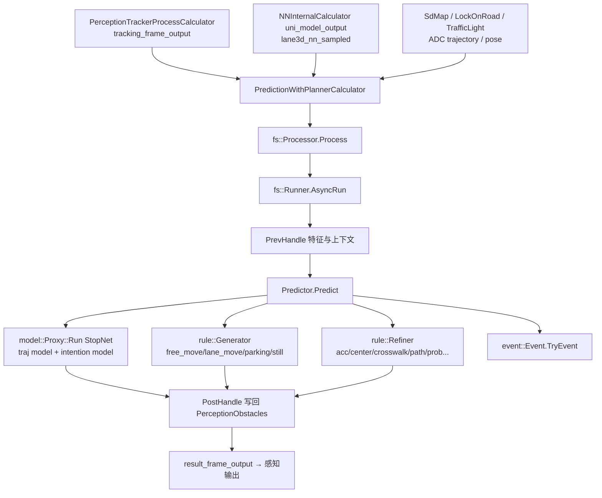

# 子模块4：farseer 子模块

**一句话定义：farseer（仓内命名空间 `fs` = FarSeer）是感知 E2E 中的他车/交通参与者轨迹预测（Prediction）子模块——在感知进程内以动态库形式被 `PredictionWithPlannerCalculator` 调用，输入跟踪后的障碍物、规划轨迹、地图与感知多任务网络特征图，对每个 Agent 生成带概率的多条未来轨迹，并就地写回 `PerceptionObstacles` 下发给规划。**

> 代码位置：`/sandbox/perception/submodules/farseer`（子仓实际检出分支：**Stable_Master_3.2**，perception 主仓为 Stable_Master_4.0_new，子仓分支差异仅作标注，未做任何改动）。
> 
> **与任务先验的偏差说明**：基线猜测"farseer 与 BEV/占用栅格/RasModelFeature 相关"不准确——代码证据表明 farseer **不产出**占用栅格/BEV 特征；它与 `/perception/ras_map_nn`、`lane3d` 特征图的关系是**消费方**：预测模型读取感知 uni-model 输出的 lane3d 张量（ras_map_nn 数据通道）作为特征输入（详见第 3、5 节）。产 ras_map 的模块在 camera/avp 子图（由其他子 Agent 负责）。

## 1. 子模块定位与职责

- **职责**：对感知输出中的动态目标（车辆/骑行者/行人等 Agent）做**多模态未来轨迹预测**（模型通道 StopNet + 规则通道 generator/refiner），输出 `deeproute::prediction::Trajectory`（含 probability）写回每个 `PerceptionObstacle`；同时上报预测相关事件（event 通道）。
- **部署形态**（README.md 与 BUILD 证据）：

  1. 感知进程内库调用（C01 主形态）：`IPredictionProcessor` C 接口；
  2. 独立 ROS 节点 `fs_rosnode`（调试/离线）；Mock 感知 `fs_perception_node`；planning 端联调 `fs_planning_node`（`-DFS_FOR_PLANNING=ON`）；单帧工具 `fs_singleframe`。
- **门控**：C01 配置 `/sandbox/perception/perception/cfg/perception_orin_l2avp.cfg` 中 `enable_prediction: true`（L69），否则跟踪原始结果直通下发（calculator L2545-2550 的 WARN 分支）。

> 文件路径：/sandbox/perception/submodules/farseer/source/prediction_api.h  
> 函数名：prediction::IPredictionProcessor::Process()  
> 核心逻辑：
> 
> ```cpp
> class IPredictionProcessor {
>  public:
>   struct FeatureMapInfo {
>     uint64_t timestamp;
>     common::Point2d adc_position;   // 特征图对应的自车位置
>     double adc_heading;
>     std::vector<::deeproute::common::`TensorReader<float>`> feature_maps; // 感知NN特征图
>   };
>   struct PredictionInput {
>     std::`shared_ptr<const deeproute::planning::ADCTrajectory>` adc_trajectory; // 规划轨迹
>     std::`shared_ptr<const deeproute::map::SdHorizonMap>` sdmap;                // 高精地图
>     std::`shared_ptr<const deeproute::localization::LockOnRoadResult>` lock_on_road;
>     std::`shared_ptr<const dr::blc::BlcSpeedLimitInfo>` blc_speed_limit_info;
>     common::InternalPoseConstPtr pose_ptr;          // 自车位姿
>     FeatureMapInfo feature_map_info;                // lane3d/rasmap_nn 特征张量
>     std::`shared_ptr<const deeproute::vla::vla_output::VlaOutput>` vla_output;
>     std::`shared_ptr<const deeproute::common::DrivingParkingFusionPacket>` fusion_packet;
>     ... // 红绿灯/语义地图/全局路由/车辆状态等
>   };
>   virtual bool Load(const std::string& param_path) = 0;
>   virtual absl::Status Process(const PredictionInput& prediction_input,
>       deeproute::perception::PerceptionObstacles* perception_objects_ptr) = 0;
> };
> extern "C" {
> EXPORT_API IPredictionProcessor* CreatePredictionProcessor();
> EXPORT_API bool IsRasmapNNUseSensing();   // ras_map_nn 位姿使用感知系位姿?
> }
> ```
> 
> 逻辑说明：**输入不是原始传感器数据，而是跟踪结果+规划+地图+NN 特征图**；**输出是原地修改的 `PerceptionObstacles`**（预测轨迹挂在障碍物上）。`IsRasmapNNUseSensing()` 佐证 farseer 与 ras_map_nn 的关系是使用其数据并适配位姿坐标系。

## 2. 核心类结构与成员变量

farseer 内部为"**Runner（编排）→ Predictor（预测器）→ Handler 链**"的组件化架构：

### 2.1 对外实现类 Processor（boot 层）

> 文件路径：/sandbox/perception/submodules/farseer/source/boot/node_prediction_api.cpp  
> 类名：prediction::Processor : IPredictionProcessor（L22 起）  
> 核心逻辑：
> 
> ```cpp
> absl::Status Processor::Process(const PredictionInput& prediction_input,
>     deeproute::perception::PerceptionObstacles* perception_objects_ptr) override {
>   const auto& runner_input = std::`shared_ptr<fs::Runner::Input>`(new fs::Runner::Input{
>       .curr_time_us = perception_objects_ptr->time_measurement(),
>       .perception_obstacles = std::`shared_ptr<...>`(perception_objects_ptr, [](auto*) {}),
>           // 所有权仍属 perception，farseer 只借用
>       .adc_trajectory = prediction_input.adc_trajectory,
>       .sdmap = prediction_input.sdmap, .lock_on_road = ..., .traffic_light_response = ...,
>       .feature_map = {.is_setted = (prediction_input.feature_map_info.feature_maps.size() != 0L),
>                       .timestamp_us = ..., .adc_position_x = ..., .adc_heading = ...,
>                       .rasmap_nn = nullptr, .buffers = prediction_input.feature_map_info.feature_maps},
>       .driving_mode = prediction_input.driving_mode, ...});
>   BEGIN_PERF_COST();
>   runner_->AsyncRun(runner_input, ...);   // 提交内部管线
> }
> ```
> 
> 逻辑说明：`Processor` 是薄适配层：把感知侧 `PredictionInput` 平铺为 farseer 内部 `fs::Runner::Input`（**注意 `feature_map.buffers` 即感知 lane3d 特征张量被注入 `fs::FeatureMap`**），随后交给 Runner。

### 2.2 编排器 Runner

> 文件路径：/sandbox/perception/submodules/farseer/source/boot/runner.h / runner.cpp  
> 类名：fs::Runner  
> 核心逻辑（runner.cpp L28-L60 关键序列）：
> 
> ```cpp
> std::`future<int64_t>` Runner::AsyncRun(const InputPtr& input, ...) {
>   ... ThreadPoolTask:
>   { MTRACE_GPU_SCOPE("Runner::PrevHandle");
>     self->PrevHandle(input, prev_context_holder, curr_context); }   // (1) 特征构建/上下文准备
>   { MTRACE_GPU_SCOPE("Runner::PredictorPredict");
>     fs::GetPredictor()->Predict(curr_context); }                    // (2) 预测主推理(GPU)
>   { MTRACE_GPU_SCOPE("Runner::PostHandle");
>     self->PostHandle(prev_context_holder, curr_context); }          // (3) 后处理/写回
> }
> ```
> 
> 逻辑说明：Runner 维护 `prev_context_holder`（上一帧上下文，用于跨帧特征/轨迹缓存）与 `curr_context`，三段式执行；上下文数据容器与键定义在 `source/contract/`（context.h/container.h/context_key.h），Agent 实体在 `source/entity/agent.h`（`AgentFeature` 含 base/map 特征与 Frenet/Raster 坐标懒加载缓存）。

### 2.3 预测器 Predictor 与 handler 链

> 文件路径：/sandbox/perception/submodules/farseer/source/selfdrive/predictor.cpp  
> 函数名：REGISTER_GLOBAL_INITIALIZER(init_predictor)（L53-L71）  
> 核心逻辑：
> 
> ```cpp
> auto predictor = GetPredictor();
> // model
> predictor->RegisterHandler("PredictRun", std::bind(&fs::model::Proxy::Run,
>     std::`make_shared<fs::model::Proxy>`(), std::placeholders::_1, model::kStopnetName));
> // rule--generator
> predictor->RegisterHandler("PredictGenerate",
>     std::bind(&fs::rule::Generator::Generate, fs::rule::GetGenerator(), std::placeholders::_1));
> // rule--refine
> predictor->RegisterHandler("PredictRefine",
>     std::bind(&fs::rule::Refiner::Refine, fs::rule::GetRefiner(), std::placeholders::_1));
> // event--report
> predictor->RegisterHandler("EventReport",
>     std::bind(&fs::event::Event::TryEvent, fs::event::GetEvent(), std::placeholders::_1));
> ```
> 
> 逻辑说明：`PredictorStub::Predict()`（L29-L41）按注册顺序串行执行 handler 链：**StopNet 模型推理 → 规则轨迹生成 → 规则精修 → 事件上报**。每个 handler 均有 NVTX 打点（`MTRACE_GPU_SCOPE`），可被火焰图/trace 工具观测。

### 2.4 模型层 model::Proxy 与 StopNet

> 文件路径：/sandbox/perception/submodules/farseer/source/selfdrive/model/proxy.h  
> 函数名：fs::model::Proxy::Run()  
> 核心逻辑：
> 
> ```cpp
> void Run(const ContextPtr& context, const std::string& model_name) {
>   if (enable_models_.count(model_name) && CheckCondition(context, conditions_[model_name])) {
>     const auto& infer = model::InferFactory().Produce(model_name);
>     infer->BuildFeatures(context);                       // (1) 特征构建
>     if (container->GetDriverMode() == DrivingMode_Mode_PARKING
>         || container->GetDriverMode() == DrivingMode_Mode_LOW_SPEED)
>       infer->RunParking(context);                        // (2a) 泊车/低速分支
>     else
>       infer->Run(context);                               // (2b) 行车分支
>     infer->ExtractOutput(context);                       // (3) 输出提取
>   }
> }
> ```
> 
> 逻辑说明：模型工厂（factory.h）按名字（`kStopnetName`）产出 `fs::model::Infer`（stopnet/infer.h，继承 `BaseInfer`）。model/readme.md 明确模型构成："Models: traj model / intention model"——**轨迹模型 + 意图模型**。**推断**：kStopnetName 即 stopnet（StopNet，估计包含停车/意图相关输出头），具体网络结构在模型文件中，不在仓内源码。

## 3. 核心处理流程与函数调用链

### 3.1 在 C01 l2avp 图中的调用点

> 文件路径：/sandbox/perception/perception/cfg/graphs/graph_l2avp.cfg（L950-L986）  
> 节点名：PredictionWithPlannerCalculator（原 PredictionProcessorCalculator 已注释，被其替代）  
> 核心逻辑：
> 
> ```text
> node {
>   calculator: "PredictionWithPlannerCalculator"
>   input_stream: "INPUT:0:tracking_frame_output"               # tracker 跟踪结果(行车)
>   input_stream: "INPUT:1:pano_detection_tracker_output_parking" # 泊车跟踪结果
>   input_stream: "MODEL_OUTPUT:uni_model_output"               # uni-model 多任务输出
>   input_stream: "RASMAP_NN:lane3d_nn_sampled"                 # lane3d 特征(采样张量)
>   input_stream: "PREDICTION_SHARED_DATA:prediction_shared_data"
>   input_stream: "DRIVING_MODE:driving_mode"
>   input_stream: "LIDAR_TS:lidar_timestamp"
>   output_stream: "L2_RESULT:result_frame_output"              # 行车预测结果 → 下游输出链
>   output_stream: "AVP_RESULT:pano_detection_prediction_output" # 泊车预测结果 → AvpProcessSubgraphL2
>   output_stream: "DONE_SIGNAL:prediciton_done_signal"         # 幀完成信号(打断 GatePassThrough 环)
> }
> ```
> 
> 逻辑说明：C01 主链路中 farseer 处于 **tracker 之后、输出闸门之前**的汇聚点：行车取 `tracking_frame_output`，泊车取 `pano_detection_tracker_output_parking`；`lane3d_nn_sampled`（来自 camera 子图 lane3d 任务的采样张量）正是 `PredictionInput.feature_map_info.feature_maps` 的数据源。



### 3.2 规则生成器 handler 分发（模型兜底逻辑）

> 文件路径：/sandbox/perception/submodules/farseer/source/selfdrive/rule/generator.cpp  
> 函数名：GeneratorStub::Generate()（handler 注册于 L57-L67，调度体 L35-L54）  
> 核心逻辑：
> 
> ```cpp
> std::copy_if(handlers_.begin(), handlers_.end(), std::back_inserter(filtered_handlers),
>     [context](const std::`shared_ptr<GenerateHandler>`& handler) {
>       return handler->CheckCondition(context); });           // 按条件筛 handler
> for (const auto& agent_id_context : agent_contexts) {       // 每个 Agent 并行
>   task_group.Post([...]() {
>     if (container->GetDriverMode() != DrivingMode_Mode_PARKING &&
>         agent_context->HasMessage(CtxKey::kModelTraj)) {
>       return;   // 行车模式下模型轨迹已存在 → 跳过规则生成
>     }
>     for (auto handler : filtered_handlers) {
>       if (handler->CheckCondition(agent_context)) {
>         const auto result = handler->TryGenerate(agent_context);
>         if (result == GenerateHandler::Result::JUMP_TO_END) break;
>       }
>     }
>   });
> }
> ```
> 
> 逻辑说明：规则通道按 Agent 粒度并行执行；**行车模式下若 StopNet 已产出模型轨迹（`CtxKey::kModelTraj`），规则生成直接跳过**——即"模型优先、规则兜底"。可用生成器见 `rule/generator/`：free_move（匀速直行类）、lane_move（沿车道）、parking（泊车）、still（静止）。

## 4. 核心算法入口与关键逻辑（模型/规则/写回）

### 4.1 模型通道（StopNet：BuildFeatures → Run → ExtractOutput）

入口：`model::Proxy::Run()`（见 2.4 节）。特征构建/推理/提取实现位于 `selfdrive/model/stopnet/`（infer.cpp、feature_builder/、extractor/、agent_selector.cpp——挑选参与推理的 Agent 集合，`max_tracklet` 类上限逻辑**推断**）。模型输出经 `ExtractOutput` 写入 `Context`（键 `CtxKey::kModelTraj` 等），供 refiner 与写回使用（**推断**，未逐行展开 stopnet/infer.cpp）。

### 4.2 规则通道（Generator + Refiner）

> 文件路径：/sandbox/perception/submodules/farseer/source/selfdrive/rule/generator/still.cpp  
> 函数名：StillGenerateHandler::FillTraj()（L54）  
> 核心逻辑：
> 
> ```cpp
> void StillGenerateHandler::FillTraj(const AgentPtr& agent,
>                                     ::deeproute::prediction::Trajectory* traj) {
>   traj->set_probability(1.0);
>   ...
> }
> ```
> 
> 逻辑说明：静止目标的规则轨迹：概率 1.0、位置不动的点列。Refiner 通道（`rule/refiner/`）按 `rule.cfg` 注册 acc（加减速约束）/center（居中）/crosswalk（人行横道）/path（路径贴合）/prob（概率重估）/qpalign（QP 轨迹对齐）/sample/purepursuit 等 handler 逐步精修轨迹（类目为目录枚举，各 handler 细节**未验证**）。

### 4.3 感知侧调用与结果写回

> 文件路径：/sandbox/perception/perception/calculators/prediction_with_planner_calculator.cc  
> 函数名：PredictionWithPlannerCalculator::Process 内 prediction 段（L2342-L2534，节选）  
> 核心逻辑：
> 
> ```cpp
> if (perception_config_->enable_prediction()) {
>   prediction::IPredictionProcessor::PredictionInput prediction_input{};
>   if (shared_data != nullptr) {
>     prediction_input.traffic_light_response = shared_data->traffic_result();
>     prediction_input.sdmap = shared_data->sdmap();
>     prediction_input.adc_trajectory = context.shared_data->adc_trajectory;
>     prediction_input.lock_on_road = context.shared_data->lock_on_road;
>     prediction_input.vla_output = context.shared_data->vla_output;   // VLA 输出也注入
>     ... }
>   // 自车位姿：上一帧与当前帧插值，避免预测用位姿抖动
>   prediction_input.pose_ptr = InterpolatePoseForPrediction(prev_lidar_pose_ptr, lidar_pose_ptr, timestamp);
>   // lane3d 特征张量
>   prediction_input.feature_map_info = context.feature_map_info;
>   if (context.lane3d_tensor_processed.has_value())
>     prediction_input.feature_map_info.feature_maps = std::move(*context.lane3d_tensor_processed);
>   // 预测主过程：farseer 原地修改感知结果
>   const std::`shared_ptr<deeproute::perception::PerceptionObstacles>`
>       perception_objects_ptr(context.obstacles, &perception_objects);
>   auto status = prediction_processor_->Process(prediction_input, perception_objects_ptr);
>   if (status != absl::OkStatus()) MLOG(WARN) << ...;
> } else {
>   MLOG(WARN) << "... Raw tracking results will be published to downstream.";
> }
> ```
> 
> 逻辑说明：perception 侧把第 1 节列出的全部上下文打包；位姿做了**上一帧→当前帧插值**；`lane3d_tensor_processed`（camera 子图 lane3d 任务的张量）经 `feature_map_info` 传入——这是"farseer 消费 ras_map_nn/lane3d 特征"的直接证据。farseer 内部 `Processor::Process` → `Runner::AsyncRun` 同步完成后，`perception_objects_ptr` 即已携带预测轨迹，继续走 `PerceptionOutputInteractionCalculator → ... → FrameDoneCalculator` 发布 `/perception/objects`。

## 5. 输入输出数据结构

| 方向 | 结构 | 定义位置 | 说明 |
|-|-|-|-|
| 输入 | `prediction::IPredictionProcessor::PredictionInput` | farseer `source/prediction_api.h` L60-L84 | 跟踪障碍物（随 `PerceptionObstacles`）、规划轨迹、SD 地图、LockOnRoad、红绿灯、语义地图、自车位姿（插值后）、**lane3d/ras_map_nn 特征张量**、VLA 输出、行泊融合包等 |
| 内部 | `fs::Runner::Input` | `source/boot/runner.h` L38-L76 | 上述内容的 farseer 内部平铺形态，含 `fs::FeatureMap feature_map` |
| 内部 | `fs::Agent` / `AgentFeature` | `source/entity/agent.h` | 预测对象实体；`AgentFeature` 持有 base/map 特征与 Frenet/Raster 坐标懒加载缓存，历史特征用 `boost::circular_buffer` |
| 输出 | `deeproute::prediction::Trajectory`（挂在 `PerceptionObstacle` 上，含 `probability`） | proto（perception/预测共享 proto） | 每条轨迹为点列+概率；由 PostHandle/写回阶段填入（still.cpp `FillTraj` 为最简证据） |
| 输出 | 事件 | `selfdrive/event/` | 预测侧事件上报（`Event::TryEvent`） |

## 6. 代码证据与关键片段

证据1（模块身份）：见第 1 节 `prediction_api.h` 引用（L51-L100）——类名 `IPredictionProcessor`、命名空间 `prediction`，文件注释 `@brief Prediction Api For Perception`。

证据2（farseer 内部主链）：见第 2.3 节 predictor.cpp L53-L71（StopNet→Generate→Refine→Event handler 链）与第 2.2 节 runner.cpp L48-L59（PrevHandle→Predict→PostHandle）。

证据3（模型构成）：

> 文件路径：/sandbox/perception/submodules/farseer/source/selfdrive/model/readme.md  
> 核心逻辑：
> 
> ```text
> Models:
>  * traj model
>  * intention model
> ```
> 
> 逻辑说明：官方口径确认 farseer 模型 = 轨迹模型 + 意图模型（无占用栅格/BEV 特征模型）。

证据4（模型优先、规则兜底）：见第 3.2 节 generator.cpp 引用（`HasMessage(CtxKey::kModelTraj)` 跳过规则生成）。

证据5（感知侧集成与特征注入）：见第 4.3 节 prediction_with_planner_calculator.cc L2342-L2534 引用（`feature_map_info.feature_maps = lane3d_tensor_processed` 与 `prediction_processor_->Process(...)`）。

证据6（ras_map_nn 坐标适配）：`IsRasmapNNUseSensing()` 被 perception 侧调用（prediction_with_planner_calculator.cc L2440-L2448），按其返回值选择 `EvaluatePoseSimToSensing/EvaluatePoseSim` 为 ras_map_nn 特征图取位姿——进一步印证 farseer 对 ras_map_nn 的**消费与坐标系适配**角色。

## 附：模式差异简述

- **L2AVP（C01 主模式）**：`PredictionWithPlannerCalculator` 内单实例 Processor；行车/泊车输入分流（INPUT:0/INPUT:1），泊车模式走 `infer->RunParking`（proxy.h）与 `parking.cpp` 规则生成器；行车模式模型轨迹优先。
- **其他形态**：独立进程 `fs_rosnode`、联调节点 `fs_planning_node`（`-DFS_FOR_PLANNING=ON`）、单帧工具 `fs_singleframe`（README.md）；v2 接口 `IFsProcessor`（predictionv2_api.h）支持 AEB 障碍物双输入，当前 C01 图配置未引用（**未验证**其在其他车型的接线）。
- 配置入口：`source/config/{global,model,rule,event,dynamic}.cfg`（由 `Processor::Load` 经 `fs::SetAppConfigPath` 装载）；C01 参数路径 `prediction_param_path: ".../param/prediction.cfg"`（perception_orin_l2avp.cfg L45）。
