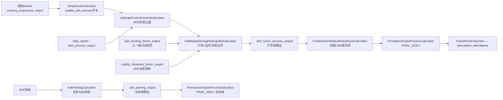

# 子模块5：aeb 感知侧子模块

> 仓库路径：`/sandbox/perception/submodules/aeb`（perception 分支 `Stable_Master_4.0_new`，当前检出即目标分支）  
> 规模：70 个源文件（不含 proto/cfg）。本文所有结论均有代码证据，推断处已标注。

## 1. 子模块定位与职责

### 1.1 与车端独立 AebComponent 的关系（核心结论）

**submodules/aeb 是"感知侧 AEB 支撑子模块"**：它在 perception mainboard 进程内，对感知跟踪输出的目标做**AEB 专用的过滤、富化、行车/泊车目标合并**，最终通过 C01 l2avp 感知图发布到 `/perception_aeb/objects` 话题；**它不做 AEB 控制决策**（无 TTC 计算、无制动请求逻辑）。消费 `/perception_aeb/objects` 并做碰撞判断与制动的是 driver 仓库中的**独立 AEB 组件**（不在本文范围内）。

两者通过话题衔接，证据链如下：

> 文件路径：/sandbox/driver/config/component/perception_graph_l2avp_orin.cfg  
> 函数名：（图配置，无函数）  
> 核心逻辑：
> 
> ```cfg
> # 感知图顶层输出流（L25）：感知侧 AEB 目标集
> output_stream: "perception_aeb__objects"
> ...
> node {
>   name: "perception_frame_done"
>   calculator: "FrameDoneCalculator"
>   ...
>   output_stream: "OUTPUT:6:perception_aeb__objects"   # L159
> ```

> 文件路径：/sandbox/driver/config/component/perception_orin.jsonnet  
> 函数名：（jsonnet 发布配置，L287-290）  
> 核心逻辑：
> 
> ```jsonnet
> { "name": "/perception_aeb/objects",
>   "stream": "perception_aeb__objects", ... }
> ```
> 
> 逻辑说明：感知 mainboard 把内部流 `perception_aeb__objects` 以话题 `/perception_aeb/objects` 发布。

> 文件路径：/sandbox/driver/integration/components/aeb_component.cc  
> 函数名：AEBComponent（消费端，仅作衔接证据）  
> 核心逻辑：
> 
> ```cpp
> 349:  input_msg = FindLastMessage(input_msgs, "/perception_aeb/objects");
> ```
> 
> 逻辑说明：车端独立 AEB 组件订阅 `/perception_aeb/objects`。即：**submodules/aeb（生产）→ 话题 → driver AebComponent（消费）**。submodules/aeb 内部代码（aeb_light_fusion_process_calculator.cc、aeb_merge_driving_parking_objs_calculator.cc 等）只做感知目标级的处理，全仓库 grep 不到任何制动/碰撞控制代码，职责边界以代码为准。

### 1.2 在 C01 感知图中的启用条件

C01（orinx 平台 L2AVP）使用 `perception_orin_l2avp.cfg`，其中 `enable_aeb_process: true`（cfg L67；`perception_default.cfg`/`perception_vision.cfg` 中为 false）。该开关经 `PerceptionIoPreprocessing` 的 `FILL_EXPECTATION_20` 变成 side packet，控制 `SimpleGateCalculator` 是否放行 AEB 分支（graph_l2avp.cfg L68/L285）。

## 2. 核心类结构与成员变量

全部核心类位于 `percep_aeb` 命名空间，均为 graphpipe **Calculator**（mediapipe 计算器）：

| 类 | 文件 | 职责 |
|-|-|-|
| `AebLightFusionProcessCalculator` | percep_aeb/onboard/calculators/aeb_light_fusion_process_calculator.cc | **主链路核心**：对跟踪后目标做 AEB 专项过滤 |
| `AebMergeDrivingParkingObjsCalculator` | 同目录 aeb_merge_driving_parking_objs_calculator.cc | 行车目标与泊车(AVP)目标合并，AVP 补盲区 |
| `AebParkingCalculator`（及 `_qnx` 变体） | aeb_parking_calculator.cc / aeb_parking_calculator_qnx.cc | 泊车模式下对 AVP 目标做 AEB 过滤（CUDA 点云入箱校验） |
| `AebProcessCalculator` | aeb_process_calculator.cc | AEB 独立激光雷达检测子图（aeb_sub_graph.cfg）的后处理；**未在 C01 l2avp 主图调用**（见 §3） |
| `AebParamSingleton` | aeb_lidar_processor_base.h | 参数单例：加载 `aeb_lidar_process_param` proto |
| `AebDetectorPostProcessor` | percep_aeb/modules/postprocess/detector_post_processor.\* | NN 输出解码（仅 AebProcessCalculator 使用） |
| `ObjectFilterManager` / `RainGridManager` / `ObjectGridManager` | percep_aeb/utils/object_filter_manager.\* 等 | 锥桶滑窗过滤 / 雨点栅格 / 障碍物栅格 |

`AebLightFusionProcessCalculator` 关键成员（L968-985）：

```cpp
  AebLidarProcessParam param_;                    // 全部过滤阈值（proto 配置）
  std::unique_ptr<ObjectFilterManager> obj_manager_;      // 锥桶连续帧高度过滤
  std::unique_ptr<RainGridManager> rain_grid_manager_;    // 雨点时空栅格
  std::unique_ptr<ObjectGridManager> object_grid_manager_;
  float ground_z_;                                // 地面高度（取自 ground_config）
  int consecutive_non_rainy_frames_ = 0;          // 连续非雨帧计数（防抖）
  bool is_rain_scene_ = false;
  std::unique_ptr<common::LruMap<int, ObjectHistoryInfo>>
      history_obj_refine_infos_;                  // track_id -> 历史 w/l/h（尺寸保持）
  std::string car_type_ = "DEFAULT";              // 依 CAR_ID 环境变量区分车型
  float ped_blind_area_offset_;                   // 行人盲区偏移（P03=7m，其余3m）
  float cone_blind_area_offset_;                  // 锥桶盲区偏移（M81/M82/M83=2m）
```

参数单例（aeb_lidar_processor_base.h L53-92）：

```cpp
class AebParamSingleton {
 public:
  static AebParamSingleton& GetInstance() {
    static AebParamSingleton instance = AebParamSingleton();
    return instance;
  }
  const AebLidarProcessParam& GetParams();
  void Init(const std::string& param_path, const VehicleConfig& car_config,
            const LidarConfig& lidar_config);
 private:
  AebLidarProcessParam params_;   // proto: proto/aeb_lidar_process_param.proto
  ...
};
```

## 3. 核心处理流程与函数调用链

### 3.1 C01 l2avp 图中的调用点（已验证）

C01 感知主图 `perception/cfg/graphs/onnx/graph_l2avp.cfg` L278-318：

```cfg
###### AEB subgraph ######
node {
  name: "aeb_simple_gate"
  calculator: "SimpleGateCalculator"
  input_stream: "tracking_preprocess_output"          # 来自感知 tracker（主图 L822）
  output_stream: "aeb_tracking_preprocess_output"
  input_side_packet: "SWITCH:enable_aeb_process"      # C01 配置为 true
}
node {
  calculator: "AebLightFusionProcessSubgraph"         # 注册于 submodules/aeb/cfg/graphs/BUILD.bazel:26
  input_stream: "LIDAR:0:lidar_inputs"
  input_stream: "LIDAR:1:lidar_process_output"
  input_stream: "AVP_LIDAR:mighty_lidar_inputs"       # 泊车前向激光雷达
  input_stream: "PREPROCESS:aeb_tracking_preprocess_output"
  output_stream: "AEB_PROCESS:aeb_tracking_preprocess_fusion_output"
  input_stream: "AEB:aeb_tracking_frame_output"       # 回环（上一帧 AEB 结果）
  input_stream: "AVP:mighty_obstacles_fusion_output"  # 泊车 AVP 目标
  output_stream: "AEB_PROCESS_MERGE:aeb_fusion_process_output"
  output_stream: "AEB_PARKING:aeb_parking_output"
}
```

子图内部（`submodules/aeb/cfg/graphs/aeb_sub_graph_light_fusion.cfg` L21-67）由三个 calculator 组成：



`PerceptionObjectsTransferCalculator`（主图 L310-316）把过滤后目标回写 `aeb_tracking_frame_output` 形成回环，用于跨帧尺寸保持。

**注意**：`AebProcessCalculator`（AEB 独立检测子图）只被 `aeb_sub_graph.cfg` / `aeb_sub_graph_light.cfg` 引用，而这两个 cfg 在 C01 l2avp 主图中**未被引用**（全仓库仅 `submodules/aeb/cfg/graphs/BUILD.bazel` 注册），属于其它图配置/历史方案，C01 未启用——此为代码 grep 结论。

### 3.2 与车端调度器的关系

AEB 子图节点运行在感知 mainboard 的 graphpipe（GRAPH 调度器）线程池内，受 `FrameSyncCalculator` 100ms 帧同步驱动，无独立调度进程；`MTRACE_GPU_SCOPE("AebLightFusionProcessCalculator")` 表明其耗时进入感知 trace。

## 4. 核心算法入口与关键逻辑

### 4.1 AebLightFusionProcessCalculator::Process()——AEB 专项过滤

输入是 tracker 输出的 `std::vector<base::ObjectPtr>`（共享指针，原地过滤）。处理分四层：

> 文件路径：/sandbox/perception/submodules/aeb/percep_aeb/onboard/calculators/aeb_light_fusion_process_calculator.cc  
> 函数名：AebLightFusionProcessCalculator::Process()  
> 核心逻辑：
> 
> ```cpp
> // (1) 雨天检测：统计 NOISE 语义点数量与关键区域雨点数
> for (size_t i = 0; i < lidar_outputs.semantics->size(); i += 1) {
>   uint32_t type = `static_cast<uint32_t>`(lidar_outputs.semantics->at(i));
>   if (type == base::PointSemanticType::NOISE) { ... key_rain_count += 1; ... }
> }
> if (rain_count > param_.rain_filter_threshold() ||
>     key_rain_count > param_.rain_filter_key_area_threshold()) {
>   consecutive_non_rainy_frames_ = 0;  is_rain_scene_ = true;
> } else { /* 连续 N 帧非雨才退出雨天态（防抖） */ }
> 
> // (2) GRIDMAP（栅格地图生成）目标：雨场景/雨栅格置状态码而非删除
> if (obj->algo_name == base::AlgoName::GRIDMAP) {
>   in_rain_grid = rain_grid_manager_->isPolygonInRainGrid(obj->polygon);
>   ...
>   if ((param_.rain_sence_filter_gridmap() && is_rain_scene_) ||
>       in_rain_grid || in_object_grid) {
>     update_status_for_objects(objects, it, status_map,
>         base::StatusCode::FILTERED_POLY_BY_RAIN_SCENE_OR_RAIN_GRID);
>   }
>   // 悬空/过矮多边形、植被、护栏臂等硬删除：
>   if (min_height > ground_z_ + param_.min_obstacle_filter_z()) {
>     it = erase_with_status_for_objects(objects, it, status_map,
>         base::StatusCode::FILTERED_BY_FLOATING_POLY, removedObjects);
>     continue;
>   }
> 
> // (3) DETECTOR（检测器）目标：盲区/非盲区分档分数阈值
> } else if (obj->algo_name == base::AlgoName::DETECTOR) {
>   bool blind_flag = is_blind_area(lidar_center.x(), lidar_center.y(),
>       param_.blind_area_angle_min(), param_.blind_area_angle_max(),
>       param_.blind_area_x_min(), param_.blind_area_x_max());
>   ...
>   float score_thres = param_.default_score_thres();
>   if (blind_flag) {  // 盲区阈值随距离线性衰减
>     switch (obj->type) { case base::ObjectType::SMALLMOT:
>       score_thres = CalBlindAreaScoreThres(lidar_center.x(), lidar_center.y(),
>         param_.blind_area_car_score_thres(),
>         param_.far_blind_area_car_score_thres(), param_.close_thres()); ... }
>   } else {           // 非盲区按距离分区间查表
>     int idx = FindScoreThredsIndex(param_.distance_boundary(), lidar_center.x());
>     switch (obj->type) { case base::ObjectType::SMALLMOT:
>       score_thres = param_.car_score_thres(idx); ... }
>   }
>   // (4) 置信度过滤（带跟踪时长豁免）：
>   if (obj->confidence < score_thres) {
>     if ((obj->type==SMALLMOT || obj->type==BIGMOT) &&
>         obj->tracking_time > param_.vehicle_traking_check_time())
>       score_filter_flag = false;          // 长期跟踪目标豁免
>     ...
>     it = erase_with_status_for_objects(objects, it, status_map,
>         base::StatusCode::FILTERED_BY_CONFIDENCE, removedObjects);
>   }
> ```
> 
> 逻辑说明：① 每个被删目标写入 `status_map`（detection_id→StatusCode），并被移入 `removedObjects`；② 函数末尾 `objects.insert(objects.end(), removedObjects...)` 把被删目标**重新放回输出**（L787-788）——即 AEB 输出包含"被过滤目标+过滤原因码"，由下游 AEB 控制组件自行判读，这是 AEB 专用输出区别于常规 `/perception/objects` 的关键设计。

其它关键点：

- **尺寸历史保持**（L471-479）：`detection_id == -1`（tracker 未匹配）时用 LruMap 中历史 w/l/h 回填，避免目标闪烁。
- **行人速度/高度双重过滤**（L482-502）：运动行人高度过低或静止行人过矮则删除（对应飞书安全 bug 链接注释）。
- **DBSCAN 密集行人簇过滤**（`filterDensePedestrianTargets`，L825-882）：对行人做 DBSCAN 聚类，簇内分数低于簇中位数 `dense_ped_score_threshold` 的剔除（`FILTER_PED_BY_DENSE_STRATEGE`）。
- **GRIDMAP 高度拆分**（`splitGridmapObjectsByHeight`，L884-966）：按 `heights` 数组把"悬空段"与"落地段"拆成多个子多边形（`SPLIT_POLY_BY_HEIGHT`）。

### 4.2 AebMergeDrivingParkingObjsCalculator::Process()——行车/泊车目标合并

> 文件路径：/sandbox/perception/submodules/aeb/percep_aeb/onboard/calculators/aeb_merge_driving_parking_objs_calculator.cc  
> 函数名：AebMergeDrivingParkingObjsCalculator::Process()  
> 核心逻辑：
> 
> ```cpp
> cc->SetInputStreamHandler("ImmediateInputStreamHandler");  // 行车/泊车流异步到达
> ...
> if (param_.merge_avp_obj()) {
>   if (!aeb_packet.IsEmpty() && !avp_packet_.IsEmpty() && !lidar_packet_.IsEmpty()) {
>     // avp的障碍物时间戳要在一定范围
>     if (IsInTimeRange(merged_obstacles->..., avp_obstacles->...)) {
>       // first remove static car / truck in driving obstacles, we use avp
>       // static car for better position
>       for (auto it = mutable_aeb_obstacles->begin(); it != ...;) {
>         if ((obj.type()==VEHICLE || obj.type()==TRUCK) && 速度≈0
>             && IsInROI(...) && is_blind_area(...)) {
>           it = erase_with_status_for_obstacle(..., FILTERED_BY_AVP_MERGING, ...);
>         }  // 行车链路的盲区静态车被删除，改用 AVP（泊车环视）版本
>       }
>       for (int i = 0; i < avp_obstacles_sz; ++i) {
>         ...
>         if (obj.type()==PARK_FREESPACE &&
>             (freespace_type()==FS_OTHERS_STATIC || freespace_type()==FS_WALL))
>           keep_flag = true;                        // 松散自由空间（墙/静态物）
>         if (IsInROI(...) && is_blind_area(...)) keep_flag |= ShouldKeepObject(obj);
>         else if (IsInExtraROI(...)) keep_extra_flag = ShouldKeepObject(obj);
>         if (keep_flag || keep_extra_flag) { ...加进 merged_obstacles... }
>       }
>     } else { avp_packet_ = Packet(); }  // 超时清缓存
>   }
> }
> ```
> 
> 逻辑说明：合并策略为"**行车目标为骨架 + AVP 目标补盲区**"：行车链路盲区内的静态车用 AVP（环视+mighty）结果替换（位置更准）；AVP 侧仅保留 ROI 内感兴趣类型（`ShouldKeepObject`：行人/灭火器/静态车/高置信锥桶/各类 FreeSpace）。输出 `aeb_fusion_process_output`。

### 4.3 AebParkingCalculator::UpdateAebObject()——泊车帧 AEB 目标筛选

> 文件路径：/sandbox/perception/submodules/aeb/percep_aeb/onboard/calculators/aeb_parking_calculator.cc  
> 函数名：AebParkingCalculator::UpdateAebObject()（QNX 平台用 aeb_parking_calculator_qnx.cc，BUILD 中 select 切换）  
> 核心逻辑：
> 
> ```cpp
> std::`set<int32_t>` delete_fs_ids;
> MatchOtherClassObstaclesWithIOU(objects, delete_fs_ids); // freespace与非自由物IOU去重
> for (int i = 0; i < objects.perception_obstacle_size(); ++i) {
>   const auto& obj = objects.perception_obstacle(i);
>   if (delete_fs_ids.find(i) != delete_fs_ids.end()) continue;
>   if (obj.has_type() && (
>       obj.type()==PEDESTRIAN || obj.type()==BICYCLE || obj.type()==VEHICLE ||
>       (!param_.close_avp_bigmot() && obj.type()==TRUCK) ||
>       obj.type()==FIRE_HYDRANT ||
>       (obj.type()==TRAFFIC_CONE && obj.confidence_score() > param_.avp_cone_score_thres()) ||
>       (obj.type()==PARK_FREESPACE && ... FS_WALL/FS_LOCK_ON/FS_FENCE/FS_BIGCAR/...))) {
>     auto remain_obj = remain_obstacles.add_perception_obstacle();
>     remain_obj->CopyFrom(obj);
>     remain_obj->set_pt_size(10000);        // 点数标记放大（下游AEB识别用）
>   }
> }
> ```
> 
> 逻辑说明：泊车模式下直接从 AVP 目标集筛选 AEB 关心的类型；对 BICYCLE/VEHICLE 再用 CUDA `points_in_box` 把激光点云按 box 归属补充（L275-300 起）。输出 `aeb_parking_output`，最终走 `PerceptionOutputProcessCalculator FINAL_AEB:1`（graph_l2avp.cfg L1021，注释 "parking objetcs which do not merge driving objects"）。

## 5. 输入输出数据结构

| 流 | 方向 | 类型 | 来源/去向 |
|-|-|-|-|
| `PREPROCESS`（tracker 目标） | 入 | `std::vector<base::ObjectPtr>` | 感知 tracker（主图 `INTER:1:tracking_preprocess_output`） |
| `LIDAR:0/1` | 入 | `base::LidarInputsWrapper` / `LidarOutputsWrapper`（含 pcd、semantics、status_map、tf） | lidar 子图 |
| `AVP_LIDAR` | 入 | `base::LidarInputsWrapper` | `mighty_lidar_inputs`（泊车前向激光） |
| `AVP` | 入 | `CombinedObstaclesPtr`（含 `PerceptionObstacles` + `avp_vis_obstacles`） | AVP 泊车目标 `mighty_obstacles_fusion_output` |
| `AEB`（回环） | 入 | `CombinedObstaclesPtr` | 上一帧 AEB 结果 |
| `AEB_PROCESS` | 出 | `std::vector<base::ObjectPtr>` | `PerceptionObjectsTransferCalculator` 回写 tracker |
| `AEB_PROCESS_MERGE` | 出 | `CombinedObstaclesPtr` | → `aeb_fusion_process_output` → `/perception_aeb/objects`（行车帧） |
| `AEB_PARKING` | 出 | `CombinedObstaclesPtr` | → `aeb_parking_output` → `/perception_aeb/objects`（泊车帧） |

消息 proto：`deeproute::perception::PerceptionObstacle(s)`（含 `StatusCode`、`freespace_type`、`PARK_FREESPACE` 类型）；内部参数 proto：`proto/aeb_lidar_process_param.proto`（`AebLidarProcessParam`）、`proto/aeb_post_processor.proto` 等。

被过滤目标携带状态码示例（均在 base::StatusCode 中）：`FILTERED_BY_CONFIDENCE`、`FILTERED_BY_RAIN_RATIO`、`FILTERED_CONE_BY_CONSECUTIVE_PT_HEIGHT`、`FILTERED_BY_NO_HEIGHT_OVERLAP`、`FILTERED_BY_AVP_MERGING`、`KEPT_BY_EXTRA_ROI`、`FILTER_PED_BY_DENSE_STRATEGE` 等。

## 6. 代码证据与关键片段

（§2/§4 已含 5 段核心片段：成员变量、参数单例、雨检+盲区分档过滤、行车/泊车合并、泊车目标筛选。此处补第 6 段——被删目标回流设计。）

> 文件路径：/sandbox/perception/submodules/aeb/percep_aeb/onboard/calculators/aeb_light_fusion_process_calculator.cc  
> 函数名：AebLightFusionProcessCalculator::Process()（末段）  
> 核心逻辑：
> 
> ```cpp
> filterDensePedestrianTargets(objects, param_.ped_dbscan_eps(),
>                              param_.ped_dbscan_minp(), status_map,
>                              removedObjects);
> 
> objects.insert(objects.end(), removedObjects.begin(),
>                removedObjects.end());          // 被过滤目标重新放回输出
> auto out_packet = MakePacket<std::`vector<base::ObjectPtr>`>(objects);
> cc->Outputs().Get(kOutputTag, 0)
>     .AddPacket(out_packet.At(cc->Inputs().Get(kInputTag, 0).Value().Timestamp()));
> ```
> 
> 逻辑说明：AEB 输出不是"干净目标列表"，而是**全量目标 + 每目标 StatusCode**。下游独立 AEB 组件可据此区分"确认障碍物"与"疑似/被过滤障碍物"，用于 AEB 误触发抑制策略。（`update_status_for_objects` 与 `erase_with_status_for_objects` 定义于 utils/filter_utils.h。）

### 6.1 非主链路文件索引

| 目录/文件 | 说明 | C01 状态 |
|-|-|-|
| percep_aeb/modules/postprocess/detector_base.*、detector_post_processor.* | AEB 独立检测 NN 后处理 | 未启用（仅 AebProcessCalculator 用） |
| percep_aeb/onboard/calculators/aeb_process_calculator.cc、aeb_light_process_calculator.cc | AEB 独立检测子图 | 未在 l2avp 图引用 |
| accel_ops/（cpu/cuda/opencl 三后端 detector_utils、points_in_box、memset_util） | 加速算子 | points_in_box 被 AebParkingCalculator 引用 |
| aeb_cuda_utils/ | CUDA 工具 | 同上 |
| proto/\*.proto | 参数与配置 proto | 已用 |
| perception_routing 式后处理 | 无 | — |

### 6.2 平台差异标注

- 行车过滤逻辑含 `#ifdef __QNX__` 分支（如非盲区点数过滤 L657-661：x86 允许 D03 行人盲区豁免，QNX 不允许）；C01 orinx 走非 QNX 分支。
- 泊车 calculator 文件级切换：QNX 用 `aeb_parking_calculator_qnx.cc`，其余用 `aeb_parking_calculator.cc`（onboard/calculators/BUILD.bazel `select()`）。
- 本模块随 perception 仓库在 `Stable_Master_4.0_new` 分支；platform/church 仓库在 `dev_master` 分支，两者独立演进，话题/类型契约以上述 proto 与 jsonnet 为准。
