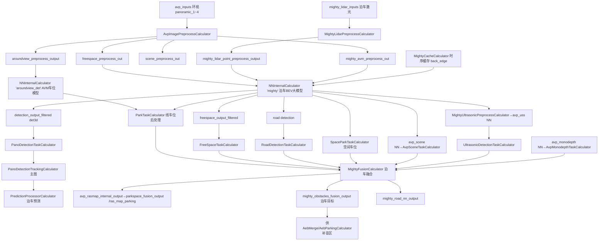

# 子模块6：avp 自动泊车感知子模块

> 仓库路径：`/sandbox/perception/submodules/avp`（469 个 C/C++ 源文件）。分支 `Stable_Master_4.0_new`。  
> 本文聚焦 C01 l2avp 泊车感知主链路；非主链路文件以索引表列出（§6.2）。

## 1. 子模块定位与职责

submodules/avp 是 **C01 L2+自动泊车（APA/AVP）的感知算法子模块**，在 perception mainboard 的泊车子图 `AvpProcessSubgraphL2` 中运行（注册于 `submodules/avp/avp/onboard/calculators/subgraph_config/BUILD.bazel:10`，`register_name = "AvpProcessSubgraphL2"`）。它完成：

1. **环视（panoramic_1\~4）与 AVM 鱼眼图像预处理**（`AvpImagePreprocessCalculator`，含 aroundview/freespace/scene/mighty_avm 多路输出）；
2. **泊车 BEV 大模型 "mighty" 的前后处理**（freespace 可行驶区域 / det3d 障碍物 / road detection 道路结构 / USS 超声波障碍分支）；
3. **车位检测**（AVM 线车位 `ParkTaskCalculator` + 空间车位 `SpaceParkTaskCalculator` + 泊车场景模型 `ParkingScene*`）；
4. **超声波（USS）障碍处理**（`avp/ultrasonic` 库 + USS 检测后处理）；
5. **泊车目标融合与 RASMap（泊车地图）生成**（`MightyFusionCalculator` → `obstacle_fusion` / `parkspace_fusion`），输出 `/perception/ras_map_parking`、`/perception/objects`（泊车帧）、`/perception/avm_viz_parking` 等。

**与车端泊车规划的关系**：泊车请求/挡位/方向盘等全局状态由子模块内单例 `TaskManager` 维护（数据来自 DTU 请求与 canbus，由主仓库 `PerceptionIoPreprocessing` 写入），算法各 calculator 通过 `TaskManager::GetInstance()` 读取。

## 2. 核心类结构与成员变量

### 2.1 融合层三大类（子模块对图暴露的核心）

| 类 | 文件 | 职责 |
|-|-|-|
| `MightyFusionCalculator` | avp/onboard/calculators/mighty_fusion_calculator.cc | 泊车融合总调度（见 §4.1） |
| `obstacle_fusion::ObstacleFusion` | avp/obstacle_fusion/obstacle_fusion.h | 泊车障碍物融合：PreMerge/Process + 十余种类型 Processor |
| `parkspace_fusion::ParkspaceFusion` | avp/parkspace_fusion/parkspace_fusion.h | 车位融合：线车位跟踪 + 车位后处理出 RASMap |
| `spacepark::SpaceParkInterface` | avp/parkspace_fusion/space_parkspace/spacepark_processor.h | 空间车位（无划线）处理 |
| `avp::TaskManager` | avp/avp_task/task_manager.h | 泊车任务全局状态单例 |

`MightyFusionCalculator` 私有成员（L563-576）：

```cpp
 private:
  bool is_calculator_enabled_ = false;                 // 环视相机不在配置中则整体禁用
  spacepark::SpaceParkInterface spacepark_processor_;  // 空间车位
  parkspace_fusion::ParkspaceFusion parkspace_fusion_; // 车位融合
  obstacle_fusion::ObstacleFusion obstacle_fusion_;    // 障碍物融合
#ifndef __QNX__
  obstacle_fusion::DepthObstacleFilter depth_obstacle_filter_; // 深度障碍过滤(x86)
  obstacle_fusion::ParkSpaceUpdater parkspace_updater_;
  bool enable_depth_parkspace_filter_ = true;
#endif
  std::shared_ptr<CombinedObstacles> uss_obstacles_ptr_ = nullptr;
```

`ObstacleFusion` 聚合的类型处理器（obstacle_fusion.h L105-120，节选）：`ChockProcessor`（轮挡）、`UltrasonicProcessor`/`UltrasonicDetectionProcessor`（超声波融合）、`ObstacleFilter`/`ObstacleMerge`、`SpeedbumpFusion`（减速带）、`CurbProcessor`（路缘）、`BarrierGateProcessor`（道闸）、`BushProcessor`（灌木）、`FireHydrantTracker`（消防栓）、`OtherStaticProcessor`、`VehicleTracker`（车辆跟踪）等——每类一个目录，是 469 文件规模的主体。

`ParkspaceFusion` 成员（parkspace_fusion.h L44-59）：`LineParkspaceManager line_parkspace_manager_`（线车位跟踪）、`ParkspaceFusionPostProcess post_process_`、`AvmScene avm_scene_`（AVM 场景/暗光识别）。

### 2.2 全局状态：TaskManager（task_manager.h L97-155 节选）

```cpp
class TaskManager {
 public:
  void Update(const PerceptionRequest& request);      // DTU 泊车请求
  void UpdateCanbusCarInfo(const VehicleState& car_info);
  bool GetRequestStatus();          // 是否在泊车请求中
  bool GetOutParkingRequestStatus();// 是否在泊出请求中
  bool IsParkingMode() const noexcept;
  bool IsLowSpeedMode() const noexcept;
  GearPosition GetGearPosition();
  DoorState GetDoorState();         // 门/后备箱/后视镜状态
  LockParkspace GetLockParkspace(); // 锁定车位
  void SetLatestRasmap(const RASMap& fusion_output);
  ...
 private:
  std::atomic_bool parking_perception_request_{false};
  std::atomic_bool out_parking_perception_request_{false};
  deeproute::perception::DrivingMode_Mode driving_mode_{
      deeproute::perception::DrivingMode::DRIVING};
  ...
  DECLARE_SINGLEINSTANCE(TaskManager);
};
```

成员含 VPA 学习/巡航、RPA 直行前后、RADS、自选车位等请求位（L264-279），覆盖 C01 泊车全家桶功能。

## 3. 核心处理流程与函数调用链

### 3.1 C01 l2avp 图调用点（已验证）

主图 `perception/cfg/graphs/onnx/graph_l2avp.cfg` L402-463 挂载 `AvpProcessSubgraphL2`，输入 `avp_inputs`（来自 `PerceptionInputProcessCalculator` 的 `AVP:avp_inputs`，即 panoramic_1\~4 环视帧流）、`mighty_lidar_inputs`（泊车前向激光）；输出 10 路流（L411-420），其中 5 路经 `DrivingParkingGateCalculator(PARKING_GATE)`（L178-202）进入最终输出：`ras_map_output_parking`→`/perception/ras_map_parking`、`mighty_obstacles_fusion_output_parking`→泊车 objects、`avm_viz_parking`→`/perception/avm_viz_parking`、`ras_map_nn_output_parking`、`pano_detection_tracker_output_parking`→prediction。

子图内部（`avp_sub_graph_l2.cfg`，1072 行）主链路：



（图中 mighty 系泊车 BEV 感知大模型名，非 PWM 库；`InsightFakeNnCalculator` 见 §4.3。）

### 3.2 泊车帧闭环

泊车目标经主图 `PanoDetectionTrackingCalculator`（L831-840，泊车目标跟踪）→ `PredictionProcessorCalculator INPUT:1`（L847，PARKING 模式激活）→ `pano_detection_prediction_output` 回灌 `MightyFusionCalculator` 的 `DETECTION` tag（back_edge，avp_sub_graph_l2.cfg L824-828），实现泊车感知-预测-融合的帧内闭环。

## 4. 核心算法入口与关键逻辑

### 4.1 MightyFusionCalculator::Process()——泊车融合总调度

> 文件路径：/sandbox/perception/submodules/avp/avp/onboard/calculators/mighty_fusion_calculator.cc  
> 函数名：MightyFusionCalculator::Process()  
> 核心逻辑：
> 
> ```cpp
> // 1. 车位融合：线车位跟踪（AVM 车位模型输出）
> if (!parkspace_fusion_.ProcessLineParkspace(nn_parkspace_output)) { ... }
> // 2. 车位后处理 → 生成 RASMap（含 parking_space 列表）
> auto parkspace_fusion_output = parkspace_fusion_.PostProcess(
>     *rasmap_spacepark_ptr,
>     *obstacles_combine->mutable_perception_obstacles(),
>     *obstacles_combine->mutable_avp_vis_obstacles());
> ...
> // 3. 合并道路检测结果（道路结构写入泊车 RASMap）
> parkspace_fusion_output->mutable_edge()->CopyFrom(road_detection_ptr->edge());
> parkspace_fusion_output->mutable_boundary()->CopyFrom(road_detection_ptr->boundary());
> parkspace_fusion_output->mutable_road_polygons()->CopyFrom(road_detection_ptr->road_polygons());
> parkspace_fusion_output->mutable_lanes()->CopyFrom(road_detection_ptr->lanes());
> ...
> // 4. 障碍物融合（freespace+detection 预合并结果 + 超声波 + 场景）
> const bool is_succed = obstacle_fusion_.Process(
>     pose.GetAffineTransform(), pose.GetTransformationMatrix(),
>     parkspace_fusion_.GetLineParkspace(), parkspace_fusion_output.value(),
>     *obstacles_combine->mutable_perception_obstacles(),
>     *obstacles_combine->mutable_avp_vis_obstacles(),
>     uss_perception_obstacles);
> ...
> // 5. 输出：RASMap(泊车地图) 与 CombinedObstacles(泊车目标)
> cc->Outputs().Get(kOutputTag, 0)
>     .AddPacket(MakePacket<std::`shared_ptr<RASMap>`>(
>         std::`make_shared<RASMap>`(std::move(*parkspace_fusion_output)))...);  // → /perception/ras_map_parking
> cc->Outputs().Get(kOutputTag, 1)
>     .AddPacket(`MakePacket<CombinedObstaclesPtr>`(
>         std::`make_shared<CombinedObstacles>`(std::move(*obstacles_combine)))...); // → 泊车 objects
> ```
> 
> 逻辑说明：`PreMerge`（L343-347）先把 freespace 与 det3d 目标预合并到 `obstacles_combine`；空间车位 `spacepark_processor_.Process()`（L366-368）把空间车位写入 `rasmap_spacepark_ptr`；车位后处理结果与道路检测合并成完整泊车 RASMap；最后障碍物融合把各类 Processor（轮挡/路缘/减速带/消防栓/超声波等）结果写入目标集。泊车请求中还会做消防栓 ROI 过滤（`FilterFireHydrantByRoi`，L500-505）。

复位机制（L283-290）：`LOOP_RESET`/`AVP_RESET` 信号触发 `TaskManager::GetInstance()->Reset()` + 两个 fusion 的 `Reset()`，对应"泊车请求结束/异常清帧"。

### 4.2 超声波（USS）主链路

C01 配置 `perception_orin_l2avp.cfg` L74 `enable_ultrasonic_process: true`、L21 `ultrasonic_topic: "/sensors/ultrasonic/combined_ultrasonic"`。USS 数据有**两条路径**：

1. **传感器路径**（avp/ultrasonic 库，以动态库导出）：`perception/perception/calculators/perception_io_preprocessing_calculator.cc` L1360-1445 调 `::perception::ultrasonic::CreateStream()`（EXPORT_API，avp/ultrasonic/ultrasonic_stream.cpp L155）：

> 文件路径：/sandbox/perception/submodules/avp/avp/ultrasonic/ultrasonic_stream.cpp  
> 函数名：UltrasonicStream::Init()/Process()  
> 核心逻辑：
> 
> ```cpp
> bool UltrasonicStream::Init(const std::string& ultrasonic_param_path,
>     const UltrasonicConfig& ultrasonic_config, const VehicleConfig& car_config,
>     const LidarConfig& ground_config) {
>   ...
>   auto instance = UltrasonicManager::GetInstance();
>   UltrasonicType type = GetUltrasonicType(ultrasonic_config); // 依 frame_id 识别探头型号(M7_BOSCH等)
>   instance->SetUltrasonicParam(param_);
>   instance->SetUltrasonicType(type);
>   processor_ptr = CreateUltrasonicProcessor(type);  // v1/v2/v2_pdc 处理器
>   ...
> }
> bool UltrasonicStream::Process(uint64_t timestamp,
>                                const Eigen::Affine3d& lidar2world_pose,
>                                const common::InternalPoseConstPtr& pose) {
>   if (param_.debug_ultrasonic_process_param().disable_uss()) return true;
>   ...
>   return processor_ptr->Process(timestamp, lidar2world_pose, pose);
> }
> ```
> 
> 逻辑说明：原始 USS 回波 → `UltrasonicManager` 全局缓存（含自车速度正负判断）→ processor 生成 USS 障碍物，供 `ObstacleFusion` 的 `UltrasonicProcessor` 在融合时消费（obstacle_fusion.h L107）。

1. **NN 路径**：mighty 模型输出中的 USS 分支（`MightyUltrasonicPreprocessCalculator`→`avp_uss` NN→`UltrasonicDetectionTaskCalculator`）生成 USS NN 障碍物，`ultrasonic_detection_task_calculator.cc` L176-198 要求 `nn_frame_id_ == avp_frame_id_` 才输出，非 APA 模式下 Reset（L168-173）。

### 4.3 泊车 NN 家族与 insight 现状

- `ParkTaskCalculator`（park_task_calculator.cc L125-186）：输入 AVM 车位模型（`aroundview_det` NN）与 mighty NN 输出，`park::ParkPostProcess park_postprocess_` 生成 `NnParkspaceOutput`（线车位）。
- `AvpMonodepth*`：单目深度 BEV 模型，输出 `depthbev_obstacles_output`，仅 x86 分支参与融合（`#ifndef __QNX__`）。
- **insight（messi）NN 当前被禁用**：`avp_sub_graph_l2.cfg` L996-1031 中 `avp_messi` NNInternalCalculator 与 `InsightMergeCalculator` 整体被注释，改用 `InsightFakeNnCalculator`（L1033-1042）直通占位；`InsightTaskCalculator` 输出 `parkspace_fusion_output` 与 `avp_avm_viz`。即"RASMap 泊车输出最后一跳"目前由 fake NN 转发，真实 messi 模型未启用——以当前 cfg 为准。

### 4.4 FreespaceTaskCalculator（可行驶区域）

> 文件路径：/sandbox/perception/submodules/avp/avp/onboard/calculators/freespace_task_calculator.cc  
> 函数名：FreeSpaceTaskCalculator::Process()（L160-218）  
> 核心逻辑：
> 
> ```cpp
> if (!freespace_postprocess_.Process(nn_output, imgs_ptr, sens2global, timestamp,
>         obstacles_combine->mutable_perception_obstacles(),
>         obstacles_combine->mutable_avp_vis_obstacles())) {
>   return absl::InternalError("freespace post process failed");
> }
> cc->Outputs().Get(kOutputTag, 0)
>     .AddPacket(`MakePacket<CombinedObstaclesPtr>`(obstacles_combine)...);
> ```
> 
> 逻辑说明：`freespace::FreespacePostProcess` 把 mighty 的 freespace featuremap（`freespace_pt/class/fine_*` 等 filter，avp_sub_graph_l2.cfg L400-423）解码为 `PARK_FREESPACE` 类型障碍物（FreeSpaceType：FS_WALL/FS_LOCK_ON/FS_FENCE/FS_BIGCAR/FS_HUMAN…），输出 `freespace_task_output`。orin 相机内参缩放修正见 `ResizePanoCamConfig`（L221-265，依赖 OrinCamSettings）。

## 5. 输入输出数据结构

| 流 | 方向 | 类型 | 说明 |
|-|-|-|-|
| `AVP:avp_inputs` | 入 | 泊车帧消息包（panoramic_1\~4 图像+pose+canbus） | 主图 `PerceptionInputProcessCalculator` |
| `MIGHTY:mighty_lidar_inputs` | 入 | `base::LidarInputsWrapper` | 泊车前向激光 |
| `DETECTION`（back_edge） | 入 | `CombinedObstaclesPtr` | 泊车预测回灌 |
| `freespace_task_output` | 出 | `CombinedObstaclesPtr` | 可行驶区域障碍 |
| `pano_detection_task_output_for_tracker` | 出 | 检测帧 | → 泊车 tracker |
| `mighty_obstacles_fusion_output` | 出 | `CombinedObstaclesPtr` | **泊车最终目标**（含 `perception_obstacles` + `avp_vis_obstacles`） |
| `parkspace_fusion_output` | 出 | `std::shared_ptr<RASMap>` | **泊车地图**（`parking_space` 列表+edge/boundary/lanes/area/road_polygons）→ `/perception/ras_map_parking` |
| `avp_camera_quality_output` | 出 | 相机质量 | 泊车帧相机质量 |
| `mighty_road_nn_output` | 出 | `std::shared_ptr<NnFrame>`/RASMap 路 | 道路 NN 结果 |
| `avp_avm_viz` | 出 | `CompressedImagePtr` | AVM 可视化 → `/perception/avm_viz_parking` |

核心 proto：`deeproute::perception::RASMap`（perception_ras_map.pb.h）、`PerceptionObstacles`（`PARK_FREESPACE`/`FreespaceType`/`parking_space`）、`NnParkspaceOutput`（perception::base::parkspace 命名空间，含 `pose_info`/`avm_pose_info`/`parkspaces`）。

配置：`spacepark_avp1/2`、`parkspace_fusion_param`（default/conservative/radical 三档，L832-854 CONFIG:6/8/9/10）、`obstacle_fusion_param`、`road_detection_param` 等 18 个 side packet cfg。

## 6. 代码证据与关键片段

§4.1/§4.2/§4.4 已给出 4 段核心证据。补充索引：

### 6.1 非主链路文件索引（469 文件中未展开部分）

| 目录 | 内容 | 状态 |
|-|-|-|
| avp/modules/depth、insight、parking_scene、scene、road_detection、detection、freespace、parkspace、around_view、camera_wrap、ultrasonic_detection | 各 NN 任务前后处理实现 | 均在 avp_sub_graph_l2.cfg 挂载（insight 的 NN 被注释） |
| avp/obstacle_fusion/{barrier_gate,bush,chock,curb,electric_wire,firehydrant,lock,merge,other_static,polyline_tracker,rear_mirror,scene,speedbump,u_tube,ultrasonic,vehicle_tracker,filter} | 按障碍物类型划分的融合子模块 | 由 ObstacleFusion::Process 调用 |
| avp/parkspace_fusion/{line_parkspace,space_parkspace,post_process,common} | 线车位/空间车位/后处理 | 由 ParkspaceFusion 调用 |
| avp/ultrasonic/{process,fuse,curve,track,manager,common} | USS 处理器 v1/v2/v2_pdc、fuse | 主仓库 calculator 经动态库调用 |
| avp/common/{container,math,structs,utils} | Box2d/Polygon2d、结构体 | 公共库 |
| avp/visualization/{bounding_box,pdc_manager} | AVM 可视化/PDC | viz 输出 |
| avp/testdata、scripts | 单测数据/脚本 | 开发用 |

### 6.2 平台差异标注（QNX vs x86）

- `MightyFusionCalculator`：深度障碍过滤、消防栓 ROI 过滤仅在非 QNX 生效（L438-506）；QNX 下无 DEPTH_OBSTACLES 分支。
- `avp_sub_graph_l2.cfg` L887-891：inference_data 预留 QNX 5 层 / x86 6 层（`#ifndef __QNX__`）。
- 泊车计算器存在 `*_qnx.cc` 变体（aroundview/image preprocess 等）；C01 orinx 走非 QNX 编译分支，但 onnx/qnx 两套 cfg 并存于 subgraph_config/。
- 分支说明：本子模块随 perception 仓库在 `Stable_Master_4.0_new`；platform/church（dev_master）仅承载 topic 传输，不涉及本子模块代码。
