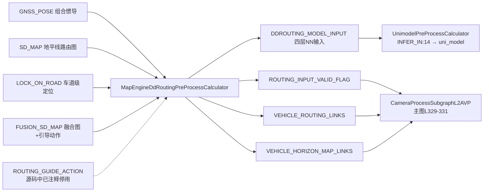

# 子模块7：perception_routing 子模块

> 仓库路径：`/sandbox/perception/submodules/perception_routing`（perception 分支 `Stable_Master_4.0_new`，当前检出即目标分支）。  
> 规模最小：14 个 C/C++ 源文件。README 自述 `perception_map_engine_part`、`contains ddrouting`，"入口文件在 calculator 下面，从这里开始，是模型的预处理和后处理"。

## 1. 子模块定位与职责

**perception_routing（感知路由预处理子模块）**负责 **DDRouting（端到端导航路由数据生成）：把 SDMap（标准地图）、LockOnRoad（车道级定位，LOR）、FusionSdMap（融合地图+导航引导动作）** 等离线地图/导航信息，渲染成 **E2E 统一感知大模型 uni_model 可直接消费的 NN 输入张量**，并把车体系下的路由链路提供给视觉子图。

**与 RASMap/可行驶区域的关系（已验证）**：本子模块**不产生 RASMap（实时可行驶区域地图）**——在子模块全部源码中 grep `RASMap|ras_map` 为 **0 命中**；可行驶区域由 uni_model 消费本子模块输出后自行推理得出。本子模块提供的是**路由先验**（routing links、引导动作、车道级位置），属于"导航信息 → 感知模型输入"的数据管道。

**与导航路由建议的关系**：C01 图中 `ROUTING_GUIDE_ACTION` 虽有接线（graph_l2avp.cfg L478），但 calculator 源码中该处理块整体被注释（`// BM input, deprecated later`，L226-255）；当前生效的引导动作来自 `FusionSdMap.guidance()`。

## 2. 核心类结构与成员变量

| 类 | 文件 | 职责 |
|-|-|-|
| `MapEngineDdRoutingPreProcessCalculator` | calculator/map_engine_ddrouting_pre_process_calculator.cc（367行） | 图节点：收流/缓存/投影初始化/调度预处理/输出 |
| `DdRoutingPreProcess` | module/ddrouting_preprocess/ddrouting_preprocess.cpp（153行） | 组合适配层：InsAdapter + DDRoutingDataGen |
| `DDRoutingDataGen` | module/ddrouting_preprocess/ddrouting_data_generate.cpp（1074行，子模块最大文件） | 核心算法：坐标转换 + 四层张量渲染 |
| `InsAdapter` | module/data_adapter/ins_adapter.cpp | 把 SensorsIns（组合惯导消息）转为内部 Ins 格式 |
| `UtmProjector` | module/data_adapter/utm_projector.cpp | 经纬度 → UTM（通用横轴墨卡托投影）转换 |
| `publish_ros_img` | module/debug/publish_ros_img.cc | 调试可视化图发布（仅 debug 构建） |

Calculator 私有成员（L345-363）：`output_nn_data_`（NNInternalDataType，4 层 GPU 节点缓冲）、`projection_`/`projection_initialized_`（首帧有效 GNSS 的 llh 设定的投影原点）、五个输入缓存（`gnss_pose_`/`lock_on_road_`/`sd_horizon_map_`/`fusion_sd_map_`/`routing_guide_action_`）、`routing_pre_process_`。

渲染几何常量（module/ddrouting_preprocess/const_value.h L7-21）：图像 400×240，覆盖范围 x∈[-60,200]m、y∈[-60,60]m（前向 200m、左右各 60m）。

## 3. 核心处理流程与函数调用链

### 3.1 C01 l2avp 图调用点（已验证）

主图 `perception/cfg/graphs/onnx/graph_l2avp.cfg` L468-485 独立挂载本子模块唯一 calculator：

```cfg
node {
  name: "map_engine_ddrouting_preprocess_calculator"
  calculator: "MapEngineDdRoutingPreProcessCalculator"
  input_side_packet: "MODEL_CONFIG:uni_model_nn_param_path"
  input_side_packet: "CAR_CONFIG_PROTO:car_config_proto"
  input_stream: "SD_MAP:sd_map_input"
  input_stream: "GNSS_POSE:gnss_pose"
  input_stream: "LOCK_ON_ROAD:lock_on_road"
  input_stream: "ROUTING_GUIDE_ACTION:routing_guide_action"
  input_stream: "FUSION_SD_MAP:fusion_sd_map"
  output_stream: "DDROUTING_MODEL_INPUT:ddrouting_model_input"
  output_stream: "ROUTING_INPUT_VALID_FLAG:routing_input_valid_flag"
  output_stream: "VEHICLE_ROUTING_LINKS:vehicle_routing_links"
  output_stream: "VEHICLE_HORIZON_MAP_LINKS:vehicle_horizon_map_links"
}
```

下游去向（均已 grep 验证）：`ddrouting_model_input` → `UnimodelPreProcessCalculator INFER_IN:14`（L554，uni_model E2E 模型输入）；`routing_input_valid_flag`/`vehicle_routing_links`/`vehicle_horizon_map_links` → `CameraProcessSubgraphL2AVP`（L329-331）。



### 3.2 内部函数链

`Process()` → `TryReceiveNewData()`（收流+缓存校验）→ `TryInitialize()`（首次有效 GNSS 初始化投影原点）→ `DdRoutingPreProcess::GenerateDataForInference()` → `InsAdapter::GetIns()` → `RoutingPreprocess()` → `DDRoutingDataGen::GenerateDataForInference()`（渲染）→ 逐层拷贝进 GPU 缓冲。

失败降级路径：任一输入缺失/匹配失败 → `ROUTING_INPUT_VALID_FLAG=false`，四层张量 `Memset(0)` 清零后仍照常输出（L324-331），模型照跑、标志位告知下游数据无效。

## 4. 核心算法入口与关键逻辑

> 文件路径：/sandbox/perception/submodules/perception_routing/module/ddrouting_preprocess/ddrouting_data_generate.cpp  
> 函数名：DDRoutingDataGen::GenerateDataForInference()（L780 起）  
> 核心逻辑：
> 
> ```cpp
> inference_data_.clear();
> // (20240301 update @lzm) use LOR position instead of GPS.
> const common::Point3D& lor_position = lock_on_road.matched_position_wgs84();
> projection_.LatLonToUtm(lor_position.y(), lor_position.x(),
>                         &lor_utm_x, &lor_utm_y);
> Eigen::Vector3d global_translation = global_pose.GetTranslation();
> const double gps_to_lock_on_road_dist = (lor_utm_x - global_translation[0]) * ...
> if (gps_to_lock_on_road_dist > 60.0 * 60.0) {   // GPS 与 LOR 偏差 >60m
>   global_translation[0] = lor_utm_x;            // 用 LOR 位置修正 GPS
>   global_translation[1] = lor_utm_y;
> }
> ::common::Transformation3 lor_pose(global_pose.GetRollPitchYaw(), global_translation);
> vehicle_frame_routing_links =
>     ConvertRoutingResponseFromGcj02ToVehicleFrame(routing_response, projection_, lor_pose);
> vehicle_frame_horizon_map_links =
>     ConvertHorizonMapToVehicleFrame(horizon_map, projection_, lor_pose);
> ...
> // Note(20240725): layer order definition: road net lane num(0-1),
> //                 routing link mask(0,1), road net cos, road net sin
> all_samples.insert(all_samples.end(), map_samples.begin(), map_samples.end());
> all_samples.insert(all_samples.begin() + 1, route_samples.begin(), route_samples.end());
> ...
> // Ad hoc. When pull over set distance to 110
> if (fusion_sd_map.fusion_map_type() == ...FUSION_MAP_TYPE_PULL_OVER) {
>   fusion_sd_map.mutable_guidance()->set_distance_to_next_step(110.0);
> }
> std::`vector<float>` e2e_action_one_hot(
>     3 * main_action_length + 2 * assistant_action_length, 0.0f);
> ```
> 
> 逻辑说明：① **定位基准用 LOR 替代 GPS**（20240301 注释），GPS-LOR 距离 >60m 时以 LOR 修正，防 GPS 漂移带偏渲染原点；② `ConvertRoutingResponseFromGcj02ToVehicleFrame`/`ConvertHorizonMapToVehicleFrame` 把 **GCJ02（国测局加密坐标系）** 路由/地图链路经 UTM 转到**车体系**；③ `RenderMapInfo`/`RenderRouteInfo` 渲染四层：车道数、路由掩码、车道朝向 cos/sin（层序注释 20240725）；④ 靠边停车（PULL_OVER）特例把引导距离强制 110m；⑤ `e2e_action_one_hot` 为 main/step_main/assistant/step_assistant 四组 one-hot 拼接，不常见动作映射到公共 bit（L905-906 注释）。

Calculator 侧缓存与降级逻辑（calculator L180-215）：`sd_horizon_map` 校验三要素（路由响应、路网、完整性），无效沿用缓存，超过 `kClearCacheIntervalMs=2s` 未更新则清空；`fusion_sd_map` 超时为 10 倍（20s，L277）。

## 5. 输入输出数据结构

| 流 | 方向 | 类型 | 说明 |
|-|-|-|-|
| `GNSS_POSE` | 入 | `SensorsIns` | 组合惯导（llh + 位姿），用于初始化投影与全局位姿 |
| `SD_MAP` | 入 | `SdHorizonMap` | 地平线路由图（routing response + 路网） |
| `LOCK_ON_ROAD` | 入 | `LockOnRoadResult` | 车道级定位（含 `matched_position_wgs84`） |
| `ROUTING_GUIDE_ACTION` | 入 | `GuidanceActionList` | 旧版引导动作，**源码已注释停用** |
| `FUSION_SD_MAP` | 入 | `FusionSdMap` | 融合地图 + `guidance`（main/assistant action） |
| `DDROUTING_MODEL_INPUT` | 出 | `NNInternalDataType` | 4 层 GPU 张量：sdmap_mat / e2e_action_one_hot / e2e_bitmap_one_hot / e2e_distance（L52-57） |
| `ROUTING_INPUT_VALID_FLAG` | 出 | `bool` | 预处理是否成功 |
| `VEHICLE_ROUTING_LINKS` / `VEHICLE_HORIZON_MAP_LINKS` | 出 | `std::vector<sd_map::LinkData>` | 车体系路由链路/地平线链路（供视觉子图） |

side packet：`MODEL_CONFIG`（`NnInternalParameter`，uni_model 的输入节点形状，Open 时按名字匹配 4 层并分配 GPU 缓冲，L100-128）、`CAR_CONFIG_PROTO`（`VehicleConfig`，取 vehicle→imu 外参）。

## 6. 代码证据与关键片段

补充证据一：投影初始化（calculator L133-170，`TryInitialize()`）——仅当 GNSS 类型非 `INVALID/UNCONVERGE_DR` 且带 llh 时，用 `imu_frame_position_llh()`（缺省回退 vehicle 系）设定 `projection_`，并连同 vehicle→imu 平移、400×240 尺寸构造 `DdRoutingPreProcess`；此后不再重复初始化（`Process` L290-292 判 `projection_initialized_`）。

补充证据二：数据搬运（ddrouting_preprocess.cpp L142-147，`DdRoutingPreProcess::GenerateDataForInference()`）——`for (idx...) node_buffer.CopyFrom(input.data(), input.size()*sizeof(float), *compute_stream)` 把 CPU 侧 `GetInferenceData()` 结果逐层拷入预分配 GPU 缓冲，QNX/x86 走同一逻辑（`__QNX__` 仅影响 `dr_infer.h` 头文件引入，L8-10）。

**未验证**：`calculator/ddrouting_pre_process_calculator.cc`（非 map_engine 版本）未在 C01 l2avp 主图中找到引用，属其它图配置/历史方案（grep 结论）。
