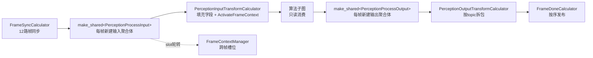
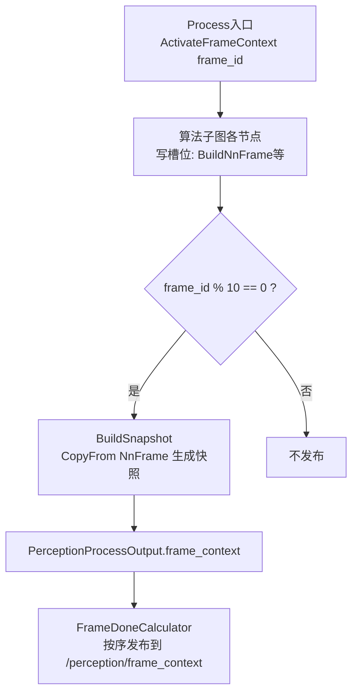
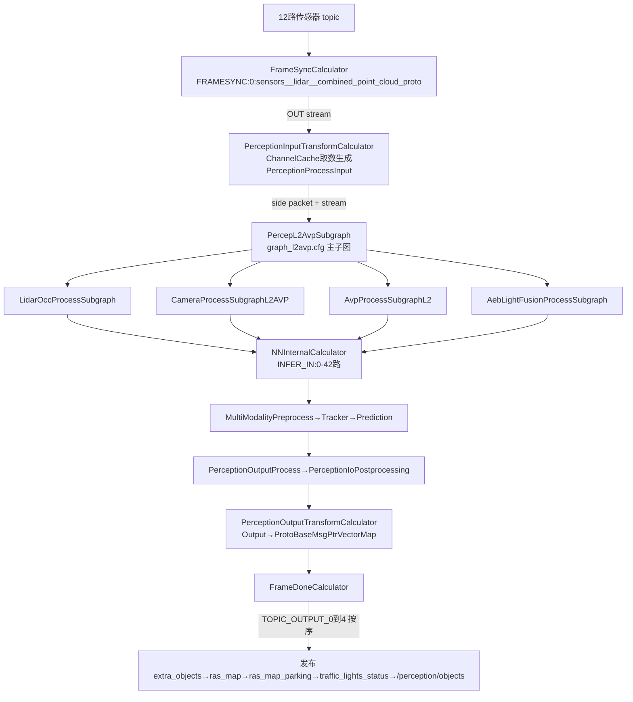

# 03 关键数据结构与内存管理

> 所属系列：C01车型E2E架构拆解 · Perception 通用机制  
> 读者：具备 C/C++ 基础、不熟悉本仓库的开发者  
> 基线引用：阶段1结论（perception mainboard 进程、FRAMESYNC 帧同步、Stable_Master_4.0_new 分支）

## 1. 核心结构体总览

感知链路的数据结构分为四层：**组件层输入/输出聚合体（PerceptionProcessInput/Output）、帧上下文层（FrameContext）、pipeline 层共享数据（PerceptionSharedData/MsgBuffer）、proto 层**序列化消息（PerceptionObstacles 等）。

### 1.1 PerceptionProcessInput —— 每帧输入聚合体

> 文件路径：/sandbox/perception/perception/church_component/perception_component_api.h  
> 函数名：struct PerceptionProcessInput  
> 核心逻辑：

```cpp
struct PerceptionProcessInput {
  uint64_t frame_id = 0;   // 帧号 = 首路帧时间戳 / frame_nano_base(100ms)
  // 12路帧同步输入：点云 / 压缩图像 / 原始图像 / RAS地图 / 高精地图
  std::shared_ptr<const deeproute::sensor::PointCloud> point_cloud;
  std::map<std::string, std::shared_ptr<const deeproute::sensor::CompressedImage>>
      compressed_images;
  std::map<std::string, std::shared_ptr<const deeproute::sensor::Image>> raw_images;
  std::shared_ptr<const deeproute::perception::RASMapPlus> ras_map_plus;
  std::shared_ptr<const deeproute::map::SdMap> sd_map;
  std::map<std::string, std::shared_ptr<const deeproute::sensor::RadarObstacles>> radar;
  std::map<std::string, std::shared_ptr<const deeproute::sensor::VehicleState>>
      vehicle_states;
  std::map<std::string, std::shared_ptr<const deeproute::common::InternalPose>> ins_poses;
  std::map<std::string, std::shared_ptr<const deeproute::common::UltrasonicSense>>
      ultrasonics;
  std::shared_ptr<const deeproute::planning::DtuRequest> dtu_requests;
  std::shared_ptr<const deeproute::planning::Request> planning_requests;
  std::map<std::string, std::shared_ptr<const deeproute::planning::MultiRequest>>
      planning_multi_requests;
  std::shared_ptr<const deeproute::perception::Aroundview> aroundview;
  std::shared_ptr<const deeproute::planning::ADCTrajectory> adc_trajectory;
  // …… 另有 ras_model_feature / gnss_pose / lock_on_road / lock_on_map /
  // blc_operation_status / routing_guide_action / fusion_sd_map /
  // blc_speed_limit_info / localization_event / global_routing_info /
  // vla_output / vla_status_info 等字段（QNX 上不含 cloud_cfgs_functions）
};
```

逻辑说明：`PerceptionProcessInput` 是"帧同步完成"后交给算法主流程的唯一输入包裹体。所有成员均为 `std::shared_ptr<const T>`（只读共享指针），即整帧数据在装配完成后是**不可变的**；`frame_id` 由 FrameSyncCalculator 按帧基（100ms）从时间戳整除得到。每帧在 `PerceptionInputTransformCalculator::Process` 中 `std::make_shared` 新建一次。

`PerceptionProcessOutput` 是对称的输出聚合体（同一头文件），包含 objects / extra_objects / traffic_signal_response / ras_map / ras_map_parking / frame_context / obstacle3d_nn / aeb_objects 等约 22 个字段，每个字段注释标明其对应发布 topic（如 objects → `/perception/objects`）。

### 1.2 FrameContext —— 帧上下文（跨帧暂存区）

> 文件路径：/sandbox/perception/perception/frame_context/perception_frame_context_manager.h  
> 函数名：PerceptionFrameContextManager::ActivateFrameContext  
> 核心逻辑：

```cpp
class PerceptionFrameContextManager : public base::Singleton<...> {
 public:
  void ActivateFrameContext(uint64_t frame_id);   // 每帧激活/重置槽位
  void BuildNnFrame(uint64_t frame_id, const NnFrame& frame);
  std::shared_ptr<NnFrame> BuildSnapshot(uint64_t frame_id);
 private:
  mutable std::mutex mutex_;      // 保护全部槽位状态
  int frame_stride_ = 10;         // 发布步长：每10帧发布一次frame_context
  bool ShouldPublishFrameContextUnlocked(uint64_t frame_id) const {
    return frame_id % frame_stride_ == 0;   // 100ms帧基 × 10 = 1Hz发布
  }
};
// ActivateFrameContext 实现要点（.cc）：
//  - 找到空闲槽位（kFrameContextSlotCount），填入新 frame_id
//  - ClearSlotLocked() 将 slot 内 obstacle3d_nn_ 等 std::optional 重置
```

逻辑说明：FrameContext 是感知内部"上一帧遗留信息"的载体（如障碍 3D 框 NN 输出的跨帧缓存、pull_over 状态等）。管理器为**单例**，内部用固定数量槽位（slot）轮转保存多帧上下文；`ActivateFrameContext` 在每帧装配入口被调用，清空旧数据避免跨帧污染；`BuildSnapshot` 仅在 `frame_id % 10 == 0` 时才真正构建快照供发布（**推断**：降低发布频率以节省带宽）。

> 文件路径：/sandbox/proto_msg/proto/perception/perception_frame_context.proto  
> 函数名：message FrameContext  
> 核心逻辑：

```proto
// 该文件仅定义了 FrameContext 的最小骨架（约4个字段）：
message FrameContext {
  uint64_t frame_id = 1;
  // …… 其余字段在本地检出版本中极为精简
}
```

**差异**：perception_frame_context_manager.cc 中引用了 `has_pull_over_state()` / `has_received_vla_request_type()` / `has_obstacle3d_nn()` 等方法，但 /sandbox/proto_msg/proto 下所有 .proto 均未定义这些字段。判定 **proto_msg 检出版本与 perception 代码版本不匹配**，FrameContext 实际字段以车端实机 proto 为准（未验证）。

### 1.3 pipeline 层关键结构：PerceptionSharedData 与 MsgBuffer

> 文件路径：/sandbox/perception/perception/pipeline/perception_shared_data.h  
> 函数名：struct PerceptionSharedData  
> 核心逻辑：

```cpp
struct PerceptionSharedData {
  MsgBuffer<::common::InternalPoseConstPtr> pose_buff_;      // 组合惯导位姿环形缓冲
  // GPU 参数：注释明确 "GPU参数全部改为Buffer"、"Buffer替换裸指针"
  deeproute::os::hpc_hal::Buffer<float> lidar2cams_gpu_;     // lidar→camera外参
  deeproute::os::hpc_hal::Buffer<float> camera_matrixs_gpu_;
  deeproute::os::hpc_hal::Buffer<float> camera_dists_gpu_;
  deeproute::os::hpc_hal::Buffer<float> color_matrixs_gpu_;
  // …… AVP 流程另有一组 avp_ 系 GPU Buffer
  std::vector<uint64_t> frame_ids_with_incomplete_camera_data_; // 相机数据不全的帧
  std::mutex mutex_;                                  // 全局共享数据锁
  std::mutex driving_mode_mutex_;                     // 行车/泊车模式切换锁
  std::mutex driving_parking_fusion_packet_mutex_;
  std::mutex gnss_pose_mutex_;
  struct PredictionSharedData { /* 247-261行：预测子模块专用数据 */ };
};
```

逻辑说明：PerceptionSharedData 是整条感知 pipeline 的"黑板"（多个 calculator 共读写的内存区），与"每帧不可变"的 PerceptionProcessInput 互补：前者放**跨帧/跨节点可变**状态（位姿缓冲、GPU 外参、模式标志），后者放**单帧只读**输入。多把细粒度 mutex 分别保护不同数据域，减小锁竞争。

MsgBuffer（/sandbox/perception/perception/util/buffer.h）是时序环形缓冲的通用实现：

```cpp
template <typename T>
class MsgBuffer {
  // boost::circular_buffer<std::pair<uint64_t /*timestamp*/, ConstPtr>>
  // std::mutex buffer_mutex_;
  // SetData(): 时间戳回退时拒绝写入（防乱序污染）
  // LookupNearest / LookupLatest / LookupPeriod 三种时间邻域查询
};
```

逻辑说明：MsgBuffer 用 `boost::circular_buffer` 存 (时间戳, 只读指针) 对，是"时间敏感性"查询（取最近 N ms 内位姿等）的基础设施。写入时校验时间戳单调性。

### 1.4 proto 层关键消息字段（以 proto 文件为准）

| proto 消息 | 文件 | 关键字段 |
|-|-|-|
| **PerceptionObstacle** | /sandbox/proto_msg/proto/perception/deeproute_perception_obstacle.proto | id、position、theta、velocity、length/width/height、polygon_area、tracking_time、confidence_score、bbox2d、AlgoName、Type（21种枚举）、SubType |
| **PerceptionObstacles** | 同上（464行起） | repeated perception_obstacle、adc_lane_id、model_based_decision、obstacles_mode 等17字段——规划的**触发话题**载荷 |
| **RASMap** | /sandbox/proto_msg/proto/perception/deeproute_perception_ras_map.proto（411-456行） | lanes、boundary、area、edge、stop_line、parking_space、adc_position、adc_rotation、road_to_sd_links、ego_lane_curvature 等23字段 |
| **TrafficLightResponse** | /sandbox/proto_msg/proto/perception/traffic_light_detection.proto（186行起） | traffic_lights（固定4个：FORWARD/LEFT/RIGHT/UTURN）、time_stamp、traffic_light_3d、virtual_traffic_lights_id、e2e_tags、vla_scenario_speedlimit |

> 文件路径：/sandbox/proto_msg/proto/perception/deeproute_perception_obstacle.proto  
> 函数名：message PerceptionObstacle  
> 核心逻辑：

```proto
message PerceptionObstacle {
  optional int32_t id = 1;
  optional common.Point3D position = 2;
  optional float theta = 3;
  optional common.Point3D velocity = 4;
  optional float length = 5;
  optional float width = 6;
  optional float height = 7;
  repeated common.Point3D polygon_point = 8;
  optional double tracking_time = 9;
  optional float confidence_score = 12;
  optional Bbox2D bbox2d = 13;
  optional string algo_name = ...;      // 产出该障碍的算法名
  optional Type type = ...;             // 车辆/行人/锥桶等21种
  optional SubType sub_type = ...;
}
```

逻辑说明：PerceptionObstacle 是单个障碍物的最终表达，由跟踪器（tracker）填充 tracking_time/id 等跨帧字段；`PerceptionObstacles` 是其集合消息，**FrameDoneCalculator 最后一个发布它**以触发规划（基线第5条）。

### 1.5 消息指针别名与特殊打包结构

> 文件路径：/sandbox/perception/perception/util/msg_type.h  
> 函数名：msg_type.h 全文  
> 核心逻辑：

```cpp
// 全部消息的只读指针别名，如：
using ImageConstPtr = std::shared_ptr<const deeproute::sensor::Image>;
using CompressedImageConstPtr = std::shared_ptr<const deeproute::sensor::CompressedImage>;
using OnboardMessageConstPtrVector = std::vector<OnboardMessageConstPtr>;

using ImageVariant =
    std::variant<std::monostate, CompressedImageConstPtr, ImageConstPtr>;

// 雷达BEV输入：上游把多包雷达数据打包为单条流，避免输出限流(throttle)
struct RadarBEVInput {
  uint64_t lidar_timestamp_us = 0;    // 以 lidar 时间戳对齐
  std::shared_ptr<RadarInput> radar_input;
};

// 注意：结构体名拼写即为 ObstableInfo（源代码原文如此）
struct ObstableInfo { ... };
```

逻辑说明：全链路统一使用 `XxxConstPtr` 别名传递只读共享指针；`ImageVariant` 用 std::variant 承接"压缩图或原图"两种形态；`RadarBEVInput` 把多条雷达消息在**上游**合并为一条，是规避下游 throttle 丢帧的典型手法（详见 06 篇）。

## 2. 生命周期

### 2.1 每帧创建/复用模型



> 文件路径：/sandbox/perception/perception/calculators/perception_input_transform_calculator.cc  
> 函数名：PerceptionInputTransformCalculator::Process  
> 核心逻辑：

```cpp
absl::Status PerceptionInputTransformCalculator::Process(CalculatorContext* ctx) {
  // 每帧新建输入聚合体（不复用旧对象，避免脏数据）
  auto input = std::make_shared<PerceptionProcessInput>();
  uint64_t frame_id = ctx->InputTimestamp().Value();
  input->frame_id = frame_id;

  // 激活该帧的 FrameContext 槽位（清空上一帧遗留）
  auto& frame_context_manager = PerceptionFrameContextManager::Instance();
  frame_context_manager.ActivateFrameContext(frame_id);

  // 逐 topic 从 ChannelCache 查找消息并填入 input
  TransformInputMsgsToProcessInput(ctx, input.get());

  ctx->Outputs().Tag("OUT").Add(input);
  // DTU_REPS 请求先于主流程输出（规划请求要及时透传）
  // SetNextTimestampBound(InputTimestamp() + 1)：声明时间界，允许后续calculator
  // 在同一时间戳内完成再推进，避免下游过早关闭
}
```

逻辑说明：生命周期为"**每帧一进一出**"：输入聚合体在 Transform 节点每帧新建，输出聚合体在算法子图末端生成，二者都是 `shared_ptr`，沿图流动由框架引用计数管理，**没有对象池**（每帧全量新建，靠只读共享避免拷贝）。

### 2.2 FrameContext 传递路径



FrameContext 不在图上流动，而是经**单例管理器**传引用：写方（子图节点）与读方（输出 Transform）都通过 `PerceptionFrameContextManager::Instance()` 访问同一批槽位，由 `mutex_` 保证并发安全。**推断**：快照发布频率 1Hz（100ms 帧基 × stride 10），用于给下游/云端做场景级特征回传。

## 3. 内存与缓存机制

### 3.1 shm pool 共享内存读取（大消息零拷贝通道）

点云/图像这类 MB 级消息跨进程传递时，**proto 载荷里只编码"共享内存块索引"**，接收方按索引回到共享内存取真数据。

> 文件路径：/sandbox/perception/perception/calculators/perception_input_transform_calculator.cc  
> 函数名：PerceptionInputTransformCalculator::ReadImageMayFromShareMemory  
> 核心逻辑：

```cpp
absl::Status ReadImageMayFromShareMemory(const std::string& topic_name,
                                         sensor::Image* img_out) {
  const auto& pkg_data = img_out->data();       // data字段此时不是像素，是编码串
  // 不足64字节视为普通数据直接用；否则解析出块索引
  if (img_out->data().size() < 64) return absl::OkStatus();
  int index = std::stoi(pkg_data);
  // 用 topic + index + seq 从共享内存池取块（seq 比对防覆写）
  auto read_block = read_pool_.AcquireReadabledBlock(
      topic_name, index, img_out->shm_msg_seq());
  if (read_block == nullptr) {
    MLOG(WARN) << "Perception acuire read block failed, topic=" << topic_name;
    return absl::InternalError("read shm block failed");
  }
  // 取到真实像素首地址（cuda_data()，GPU共享内存）
  img_out->set_data(reinterpret_cast<const char*>(read_block->cuda_data()),
                    read_block->real_msg_size());
  img_out->set_data_storage(DATA_STORAGE_POINTER);  // 标记: data是指针/映射而非拷贝
  shm_blocks_.emplace_back(std::move(read_block));  // 持有引用防共享内存被发布方复用
}
```

> 文件路径：/sandbox/platform/church/node/shm/shm_pool.h  
> 函数名：ShmPool::AcquireReadabledBlock / AddSegment  
> 核心逻辑：

```cpp
class ShmPool final {
 public:
  // 每个topic一个segment：默认10块、单块上限16KB（大消息按实际尺寸申请）
  void AddSegment(const std::string& key, uint32_t block_num = 10,
                  uint64_t ceiling_real_msg_size = 16 * 1024);
  // key+index 定位块；seq 与块内序号比对：不一致说明数据已被发布方覆盖
  ShmBlockPtr AcquireReadabledBlock(const std::string& key, uint32_t index,
                                    uint64_t seq);
 private:
  std::unique_ptr<ShmPoolImpl> impl_;   // 实现在未检出的 .cc 中
};
```

逻辑说明：**shm pool**（共享内存池）按 topic 分段、段内固定块数轮转。`seq`（序号）机制是防读撕裂的关键：发布方写第 index 块时递增 seq，读取方带 seq 读取，若不匹配则说明该块已被新消息覆写，读取失败。读取成功后**必须持有 ShmBlockPtr**（存入 `shm_blocks_`），否则发布方可能立即复用该块；本帧结束后 `shm_blocks_.clear()` 释放。点云侧 `ReadPointCloudMayFromShareMemory` 同理，`DATA_STORAGE_SHM` 判断后同样 `set_data_storage(DATA_STORAGE_POINTER)`。

### 3.2 点云/图像缓冲

- **图像**：`ImageVariant` 承接压缩/非压缩两态，12 路相机帧在 FrameSync 处对齐（基线第5条）；压缩图优先、原图兜底（`TransformInputMsgsToProcessInput` 中先查 compressed_images 再查 raw_images）。
- **点云**：`PerceptionProcessInput.point_cloud` 单一共享指针；lidar 主帧即帧基来源。
- **位姿**：`PerceptionSharedData.pose_buff_`（MsgBuffer）保存历史 INS 位姿，算法按时间邻域查询做外参对齐。

### 3.3 queue 管理两级视图

| 层级 | 机制 | 配置证据 |
|-|-|-|
| 图级输入队列 | mediapipe input stream queue，`SetGraphInputStreamAddMode(ADD_IF_NOT_FULL)` | /sandbox/platform/church/graph/graph_scheduler.cc（注释：避免死锁、降低延迟） |
| Channel 缓存队列 | ChannelCache::CircularBuffer，cache_size 默认10 | /sandbox/platform/church/cache/channel_cache.h、tasks_config.proto |
| 组件级 max_queue_size | 15 | /sandbox/driver/config/component/perception_graph_l2avp_orin.cfg |

> 文件路径：/sandbox/platform/church/cache/channel_cache.h  
> 函数名：ChannelCache::Push / ConsumeOld / GetByTimestampNearest  
> 核心逻辑：

```cpp
enum class ChannelInputType {
  REQUIRED,    // 必须有：如12路FRAMESYNC帧
  OPTIONAL,    // 可选：缺失不阻塞
  ALL_NEW,     // 取全部新消息
  NEAR,        // 取时间最近
  FRAMESYNC,   // 帧同步专属
};
// CircularBuffer 底层环形数组；Push 失败时
// MLOG(WARN) << "Failed to cache message"
// GetByTimestampNearest：二分查找时间戳最近的消息
// BreakingOrderNotifier：乱序到达时通知帧同步状态机复位
```

逻辑说明：**ChannelCache** 是组件级消息缓存（每个 topic 一个实例），FrameSyncCalculator 通过五种 `ChannelInputType` 声明各 topic 的取数语义。图级 queue 的 `ADD_IF_NOT_FULL` 表示队列满时阻塞注入而非丢弃（丢帧由上游 throttle 机制处理，见 06 篇）。

## 4. 数据拷贝策略

### 4.1 指针传递为主，深拷贝为辅

> 文件路径：/sandbox/platform/church/node/onboard_message.h  
> 函数名：OnboardMessage  
> 核心逻辑：

```cpp
class OnboardMessage {
  deeproute::common::Header header;
  std::shared_ptr<ProtoBaseMsg> payload;   // 载荷为shared_ptr，跨组件共享
  // lazy_payload：payload 可延迟解析（先传指针，用到再反序列化）
  uint64_t GetSourceTimestampOrDataplaneTimestamp() const;
};
```

逻辑说明：Church 框架内所有消息统一包成 OnboardMessage，payload 是 `shared_ptr<ProtoBaseMsg>`——**同一份 proto 对象被下游共享只读**，不做逐组件深拷贝。深拷贝只发生在两类必要处：

1. **跨进程大消息**：数据本体留在共享内存，proto 里只放索引字符串（3.1节）——"零拷贝"；
2. **FrameContext 快照**：`BuildSnapshot` 用 CopyFrom 复制 NnFrame，因为快照要脱离槽位生命周期发布。

### 4.2 OnboardMessageConstPtrVector 语义

`OnboardMessageConstPtrVector = std::vector<OnboardMessageConstPtr>`（msg_type.h）。它出现在 calculator 输出端口签名中，语义是"**一批消息的只读句柄集合"：Vector 本身随 Packet 在图上复制，但每个元素是 const shared_ptr——复制 vector 不复制消息体**。FrameDoneCalculator 拿到它后按 topic 分发发布（见 5 节）。**推断**：这种设计保证发布路径不因 vector 扩容触发 proto 深拷贝。

### 4.3 GPU 数据显式 Buffer 化

PerceptionSharedData 中 GPU 外参矩阵全部用 `deeproute::os::hpc_hal::Buffer<float>` 而非裸指针（源码注释："GPU参数全部改为Buffer"、"Buffer替换裸指针"），托管 GPU 显存生命周期，避免悬垂。

## 5. 各子模块间数据交接

### 5.1 calculator 间 stream 传递全景



### 5.2 输出 Transform：按 topic 拆包

> 文件路径：/sandbox/perception/perception/calculators/perception_output_transform_calculator.cc  
> 函数名：PerceptionOutputTransformCalculator::Process  
> 核心逻辑：

```cpp
// PerceptionProcessOutput → 按topic字符串为key的消息映射
// 输出类型 ProtoBaseMsgPtrVectorMap: map<topic, OnboardMessageConstPtrVector>
// 每个输出字段（objects/extra_objects/ras_map/...）被包装为 OnboardMessage，
// 以其目标topic名为key放入map，交给FrameDoneCalculator统一发布。
```

逻辑说明：Output Transform 是"**聚合体 → 消息映射**"的翻译层；FrameDoneCalculator 持有 `topic_to_stream_id_` 映射完成最终发布。

> 文件路径：/sandbox/platform/church/graph/calculators/frame_done_calculator.cc  
> 函数名：FrameDoneCalculator::Process  
> 核心逻辑：

```cpp
// 按配置顺序发布，保证规划最后收到触发话题：
// OUTPUT:0 extra_objects
// OUTPUT:1 ras_map
// OUTPUT:2 ras_map_parking
// OUTPUT:3 traffic_lights_status
// OUTPUT:4 /perception/objects   ← 最后发布，触发 planning (IMMEDIATE触发器)
// frame_id_++ 维护本地帧计数
// 未在 topic_to_stream_id_ 中的topic：
//   MLOG(ERROR) << "Topic not found in mapping: " << topic;  // 跳过继续
```

逻辑说明：perception_graph_l2avp_orin.cfg 中注释明确"Keep this sequence to ensure the planning module receives the trigger topic (/perception/objects) after the other four input topics"——**先发数据、后发触发**，规划组件收到 `/perception/objects` 才读其他四个 topic，保证可见性。

### 5.3 独立进程形态的输入组装对照

> 文件路径：/sandbox/perception/perception/pipeline/sensor_data_sync.h  
> 函数名：SensorDataSync::TryGetPerceptionInput  
> 核心逻辑：

```cpp
struct PerceptionProcessInputInternal {
  std::shared_ptr<PerceptionProcessInput> input;
  int tick_count;                              // tick计数（每10ms一次）
  std::unordered_set<std::string> arrived_cameras;  // 已到齐的相机
};
// max_tick_count_for_sensor_sync_：超tick数放弃本帧（ROS/独立进程形态的超时兜底）
```

逻辑说明：ROS/独立进程形态下没有 FrameSyncCalculator，由 `SensorDataSync` 在轮询 tick 中组包同样结构的 PerceptionProcessInput——**两形态共用同一算法输入契约**，算法代码不感知调度形态。

## 小结

- 每帧一进一出：PerceptionProcessInput（只读）进、PerceptionProcessOutput 出，shared_ptr 全程零拷贝共享；
- 大消息走 shm pool（topic分段 + seq防覆写 + ShmBlock持有防复用），proto 只传索引；
- 可变状态收敛在 PerceptionSharedData / FrameContextManager 两个带锁的"黑板"；
- FrameContext 每10帧发布快照，槽位轮转防跨帧污染；
- 输出按"先数据后触发"次序发布，/perception/objects 是规划的时间锚点。

（完，约 6.9 千字）
