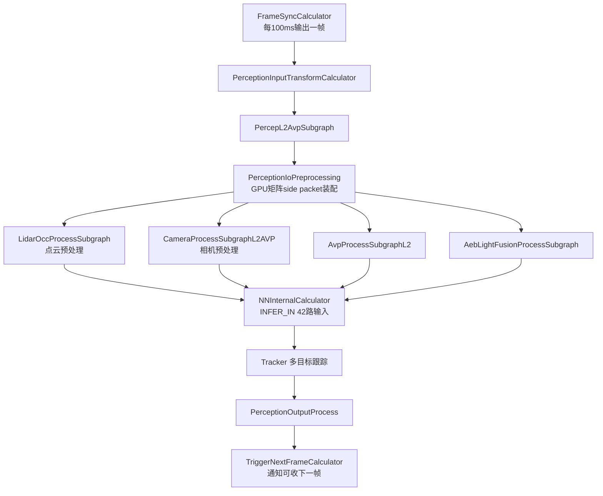
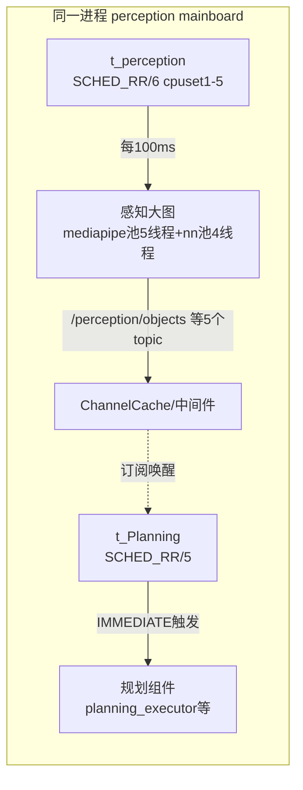

# 04 线程调度与运行机制

> 所属系列：C01车型E2E架构拆解 · Perception 通用机制  
> 读者：具备 C/C++ 基础、不熟悉本仓库的开发者  
> 基线引用：阶段1第3条（线程表 perception.json）、第2条（感知图 cfg 参数）

## 1. 进程线程全景

C01 的感知 mainboard 进程内，线程分为四类：**组件调度线程（每组件一个）、图执行线程池（mediapipe/命名执行器）、框架监控线程（watch_dog/monitor 系）、基础设施线程**（日志/中间件）。

### 1.1 线程配置表（C01/perception.json）

配置文件：/sandbox/driver/config/thread_config/C01/perception.json（进程级，规划与感知同文件）

| 线程名 | 策略 | 优先级 | cpuset | 归属 |
|-|-|-|-|-|
| default | SCHED_OTHER | 0 | 0-10 | 兜底默认 |
| **t_perception** | SCHED_RR | 6 | 1-5 | 感知组件任务线程 |
| **t_Planning** | SCHED_RR | 5 | 默认 | 规划组件任务线程 |
| pp / nn_pre / mediapipe / nn_internal_designated | SCHED_RR | 6 | 默认 | 图执行相关线程池 |
| Percep:CamQua / Percep:PanoQua / Percep:RasPost | SCHED_RR/6 或 SCHED_OTHER/-10 | - | - | 感知内部子线程 |
| Percep:monitor / s_monitor / s_timer / c_anomaly_monit / sched_monitor | SCHED_OTHER | -10 | 默认 | 监控类线程 |
| async_logger | SCHED_OTHER | -10 | 默认 | 异步日志 |
| plan_main / plan_worker / plan_stitch / planning_executor / open_space_worker | SCHED_RR | 5 | 默认 | 规划侧线程 |
| t_lom_infer | SCHED_RR | 4 | 6-8 | lom_infer 组件 |
| data_agent_executor | SCHED_RR | 1 | 默认 | DataAgentRT |
| iceoryx_dispatch / NvSciEventLoop / SemanticServer / graph_timer | SCHED_RR | 6 | 默认 | 中间件/GPU/图定时器 |

### 1.2 线程配置如何生效：按线程名匹配

> 文件路径：/sandbox/common/base/thread/thread_manager.cc  
> 函数名：ThreadManager::GetThreadConf  
> 核心逻辑：

```cpp
// 从环境变量 THREAD_CONFIG_PATH 读取线程配置json
static const char kThreadConfigEnv[] = "THREAD_CONFIG_PATH";
// GetThreadConf(thread_name)：
//   在配置表中按名字精确匹配，返回该线程的
//   {name, policy, priority, cpuset, stack_size}
//   未命中时返回空 conf —— 由 default 段兜底（SCHED_OTHER/0/0-10）
```

> 文件路径：/sandbox/common/base/thread/thread.h  
> 函数名：deeproute::base::Thread::Thread（构造函数，100-140行）  
> 核心逻辑：

```cpp
// Thread 构造时：
//   1. SetThreadName(thread_name_)                 ← 先设置线程名
//   2. SetInnerThreadAttr(
//        manager_instance->GetThreadConf(thread_name_),   ← 按名字查配置
//        manager_instance->GetDefaultThreadCPUset(), true);
// 命中配置后：SetSchedPolicy(policy, priority) + SetCpuCgroupAttr(cpuset)
// QNX 上另有 WrapWithExceptionHandler 防止 __cxa_throw 死锁
```

逻辑说明：**线程库按"线程名"查表配置**——线程创建时先用名字注册，再以名字查 `THREAD_CONFIG_PATH` 指向的 json，命中即应用 SCHED_RR/SCHED_OTHER、优先级、cpuset。这就是为什么线程名必须与 perception.json 中键名一致（如 "mediapipe"、"nn_internal_designated"）。跨平台差异：QNX 平台 Thread 构造走 `WrapWithExceptionHandler` 包装并支持自定义栈大小（conf.stack_size>0 时走 pthread 专用路径），Linux（orin）直接 std::thread + SetInnerThreadAttr。

## 2. 触发机制

### 2.1 四种触发器

> 文件路径：/sandbox/platform/church/component/trigger.h  
> 函数名：class Trigger  
> 核心逻辑：

```cpp
// Trigger 基类：组件任务线程的"等待-唤醒"核心
//   std::condition_variable cv_;  +  RealtimeMutex mutex_;
//   WaitForTrigger() { cv_.wait_until(...); }   ← 带超时的等待
// 子类决定"何时唤醒"：
//   FrameSyncTrigger  → 帧同步齐了/超时了唤醒（感知用）
//   ImmediateTrigger  → 任一trigger_channel有新消息立即唤醒（规划用）
//   PeriodicTrigger   → 固定周期唤醒
//   NoTrigger         → 不唤醒（纯被动，如由外部直接调Process）
```

### 2.2 感知用的 FrameSyncTrigger

> 文件路径：/sandbox/platform/church/component/trigger/framesync_trigger.h  
> 函数名：FrameSyncTrigger  
> 核心逻辑：

```cpp
// FrameSyncTrigger 维护：
//   TimeoutFrameMap<100>   ← 超时帧表：记录每帧(100ms一个)的到齐进度
//   SetTimeoutProcessHandler(handler)  ← 超时回调：组件的Process会被调用
//     （Component::InitializeTrigger 中：
//        SetTimeoutProcessHandler([this](msgs){ Process(msgs); })）
//   超时默认 100000000 ns = 100ms（见 tasks_config.proto frame_sync_timeout）
//   触发条件：本帧12路REQUIRED消息全部到齐 → 唤醒
//            或：帧超时（100ms内未齐）→ 带残缺消息唤醒（降级路径）
```

> 文件路径：/sandbox/driver/config/component/perception_orin.jsonnet  
> 函数名：task 配置段  
> 核心逻辑：

```jsonnet
task: {
  name: "t_perception",
  trigger_policy: "FRAMESYNC",
  trigger_channels: [ /* 12路输入，frame_nano_base: 100000000 */ ],
  // 未设置 frame_sync_timeout → 使用 tasks_config.proto 默认值 100ms
  graph_config_path: "perception/config/perception_graph_l2avp_orin.cfg",
},
```

逻辑说明：感知组件声明 `trigger_policy: FRAMESYNC`，12 路输入通道（chips）以 100ms 为帧基对齐；`Trigger` 内部条件变量带超时等待，帧齐/超时都唤醒组件 Process。规划组件则用 `IMMEDIATE`（trigger_channels 只有 `/perception/objects`，来一条醒一次）。四种触发器对应 tasks_config.proto 的 `trigger_policy` 枚举：FRAMESYNC / IMMEDIATE / PERIODIC / NOTRIGGER。

**差异（关键机制澄清）**：当组件配置了 `graph_config_path`（graphpipe 模式）时，`Component::InitializeTrigger` 中存在条件 `!config().task().has_graph_config_path()` 才注册 topic observer——即**数据注入图输入流由 GraphScheduler 完成，组件任务线程的 WaitForTrigger 循环不驱动帧处理**；FrameSyncCalculator 才是真正的帧同步执行点（在图执行线程池中跑）。t_perception 线程此时主要承载非图路径任务与超时事件。

## 3. graphpipe 执行器

### 3.1 图合并与执行器替换

> 文件路径：/sandbox/platform/church/graph/graph_scheduler.cc  
> 函数名：GraphScheduler::Start / UpdateExecutor  
> 核心逻辑：

```cpp
// Start()：
//   1. 把所有组件的 graph config 合并为一张大图：
//      config.MergeFrom(tmp_config);
//      // num_threads 逐个累加，max_queue_size 取最大
//   2. UpdateExecutor(config, graph_.get());
//   3. graph_->SetGraphInputStreamAddMode(
//          mediapipe::ADD_IF_NOT_FULL);
//      // 注释：避免死锁、降低延迟
//   4. StartRun / WaitUntilIdle；watch_dog_.SetGraph + Start；
//      StartChannelSuspendAlarm()

// UpdateExecutor(config, graph)：
//   if (config.executors().empty()) {
//     // 默认执行器：名字为空，线程池名固定 "mediapipe"
//     graph->SetExecutor("", std::make_shared<GraphExecutor>(
//         config.num_threads()));
//   }
//   for (const auto& exec : config.executors()) {
//     // 命名执行器：线程池名 = executor 名（如 "nn_internal_designated"）
//     graph->SetExecutor(exec.name(),
//         std::make_shared<GraphExecutor>(options.num_threads(), exec.name()));
//   }
```

> 文件路径：/sandbox/platform/church/graph/graph_executor.h  
> 函数名：GraphExecutor（21-95行）  
> 核心逻辑：

```cpp
class GraphExecutor : public ::mediapipe::Executor {
 public:
  explicit GraphExecutor(int num_threads)
      : thread_pool_(num_threads, "mediapipe") { Start(); }
  GraphExecutor(int num_threads, const std::string& thread_pool_name)
      : thread_pool_(num_threads, thread_pool_name) { Start(); }
  void Schedule(std::function<void()> task) override {
    thread_pool_.Enqueue(std::move(task));   // calculator节点被调度到此池
  }
 private:
  deeproute::common::ThreadPool thread_pool_;
  // Create() 工厂还支持 stack_size / nice_priority_level /
  // thread_name_prefix 等ThreadPoolExecutorOptions字段
};
```

逻辑说明：**GraphScheduler**（图调度器）把每个组件的图 cfg 合并成一张进程级大图，并用 `UpdateExecutor` 把 mediapipe 原生执行器替换为仓库自研的 `common::ThreadPool` 包装类（这样线程才能被 thread_manager 按名配置调度策略）。默认执行器线程池名为 "mediapipe"（对应 perception.json 中 `mediapipe` 条目，SCHED_RR/6）；命名执行器用 executor 名作为线程池名。

**差异**：外层主图 cfg 中 executor 的 `thread_name_prefix: "nn_"` 在 UpdateExecutor 路径下**未生效**——GraphScheduler 构造 GraphExecutor 时只传 (num_threads, exec.name())，未走带 ThreadOptions 的 Create() 工厂（该工厂才会读 thread_name_prefix）。实际线程池名 = "nn_internal_designated"，与 perception.json 中该名字条目匹配，功能等效但命名机制与基线第2条表述有细微出入。

### 3.2 感知图的执行器分配

> 文件路径：/sandbox/driver/config/component/perception_graph_l2avp_orin.cfg  
> 函数名：graph 配置（180行全读）  
> 核心逻辑：

```text
# 外层主图
max_queue_size: 15
num_threads: 5                  # 默认执行器5线程（线程池名"mediapipe"）
executor {
  name: "nn_internal_designated"
  num_threads: 4                # NN推理专用4线程
  thread_name_prefix: "nn_"     # 实际未生效（见上"差异"）
}
node { calculator: "FrameSyncCalculator" ... }        # 帧同步（默认池）
node { calculator: "PerceptionInputTransformCalculator" ... }
node { calculator: "PercepL2AvpSubgraph" ... }        # 算法子图
node { calculator: "PerceptionOutputTransformCalculator" ... }
node { calculator: "FrameDoneCalculator" ... }
```

执行器的实际使用者（证据）：

- /sandbox/perception/submodules/lidar/cfg/graphs/lidar_sub_graph.cfg 第 114/157 行：`executor: "nn_internal_designated"`，挂在 uni_model_spliter_fusion_detection_network_output 等 **NN 推理节点**上；
- /sandbox/perception/submodules/avp/.../avp_sub_graph_l2.cfg：多处同样指定；
- /sandbox/perception/submodules/camera/.../camera_sub_graph_l2avp.cfg：grep "executor" 计数为 0，**camera 子图未指定执行器**（走默认池）；
- 外层主图 /sandbox/perception/perception/cfg/graphs/graph_l2avp.cfg（1201行）：无 executor 指定。

## 4. 流水线与并行逻辑

### 4.1 帧同步后的并行结构



逻辑说明（基于 graph_l2avp.cfg 节点连接，部分为**推断**）：FrameSync 后主链是串行的（每帧一个 timestamp bound 推进），并行发生在两处：

1. **四个预处理子图**在 5 线程默认池中由 mediapipe 依赖调度并行（仅当相互无 stream 依赖时，mediapipe 按 node 依赖自动并行，节点内部串行）；
2. **NN 推理节点**独占 4 线程 nn_internal_designated 池，与默认池其他节点并行。

`TriggerNextFrameCalculator` 是**回边（back_edge）**节点：帧处理完通知 FrameSync 可以装配下一帧——这是控制并发帧数（`kMaxFramesInFlight=2`，见 06 篇）的机制之一。

## 5. 锁机制与线程安全

### 5.1 框架层锁实例

**实例1：组件消息缓存锁（RealtimeMutex）**

> 文件路径：/sandbox/platform/church/component/component.h  
> 函数名：Component 成员  
> 核心逻辑：

```cpp
// cache_mutex_: RealtimeMutex —— 保护各 ChannelCache 的Push/Consume
//   （消息注入线程 与 组件消费线程并发访问同一缓存）
// process_observer_mutex_: 保护 topic observer 注册/注销
// RealtimeMutex：实时互斥量封装（比 std::mutex 更适合 rt 线程）
```

**实例2：触发器条件变量锁**

> 文件路径：/sandbox/platform/church/component/trigger.h  
> 函数名：Trigger::WaitForTrigger  
> 核心逻辑：

```cpp
// RealtimeMutex mutex_ + std::condition_variable cv_
// WaitForTrigger(): cv_.wait_until(lock, deadline)
// 唤醒方：FrameSyncTrigger 的帧齐/超时判定线程
```

### 5.2 感知业务层锁实例

**实例3：共享数据黑板锁**

> 文件路径：/sandbox/perception/perception/pipeline/perception_shared_data.h  
> 函数名：PerceptionSharedData 成员  
> 核心逻辑：

```cpp
std::mutex mutex_;                               // 主黑板锁
std::mutex driving_mode_mutex_;                  // 行车/泊车模式
std::mutex driving_parking_fusion_packet_mutex_; // 行泊融合包
std::mutex gnss_pose_mutex_;                     // GNSS位姿
// 四把细粒度锁：不同数据域独立加锁，避免整结构单锁竞争
```

**实例4：RAS地图服务静态锁**

> 文件路径：/sandbox/perception/submodules/camera/camera/modules/ras_map/single_ras_map_server.h  
> 函数名：SingleRasMapServer::base_map_mutex\_  
> 核心逻辑：

```cpp
static std::mutex base_map_mutex_;   // 保护底层地图的单次加载/替换
// .cc 346行：std::lock_guard<std::mutex> lock(base_map_mutex_);
```

**实例5（含误导性注释警示）**

> 文件路径：/sandbox/perception/submodules/camera/camera/modules/ras_map/ras_map_lane_tracker.h  
> 函数名：RasMapLaneTracker::mtx\_  
> 核心逻辑：

```cpp
std::mutex mtx_;
// is this needed? multi-thread running?   ← 源码原始注释
```

逻辑说明：这行注释说明原作者也不确定该成员是否需要加锁——**误导注释实例**：读代码时不能轻信注释，需自行确认调用线程上下文。

### 5.3 线程安全设计模式小结

| 模式 | 实例 | 要点 |
|-|-|-|
| 每帧不可变对象 | PerceptionProcessInput | 消除读写竞争的根本手段 |
| 单例+互斥槽位 | PerceptionFrameContextManager | mutex\_ 保护 slot 轮转 |
| 细粒度分域锁 | PerceptionSharedData 四把锁 | 降低锁竞争 |
| 环形缓冲内锁 | MsgBuffer::buffer_mutex\_ | SetData/Lookup 原子化 |
| 框架级 RealtimeMutex | Component::cache_mutex\_、Trigger::mutex\_ | rt 线程适用 |

## 6. 与 planning 组件的并发关系



> 文件路径：/sandbox/driver/config/component/planning.jsonnet  
> 函数名：task 配置段  
> 核心逻辑：

```jsonnet
task: {
  name: "t_Planning",
  trigger_policy: "IMMEDIATE",
  trigger_channels: ["/perception/objects"],  // 感知输出即规划触发
  fatal_on_stream_throttle: false,
  expected_proc_duration_ms: 500,
},
```

逻辑说明：感知与规划是**同进程内两个 church 组件**，各有一个组件任务线程（t_perception / t_Planning，来自 conditional_scheduler.cc：每组件一个 base::Thread(task_name)），互不共享图执行线程池。二者耦合点只有消息通道：感知 FrameDoneCalculator 发布 `/perception/objects` → 规划 IMMEDIATE 触发器立即唤醒。CPU 隔离上，感知图线程（t_perception 所在 cpuset 1-5）与规划线程默认池分开，t_lom_infer 单独用 cpuset 6-8，避免互相抢占。**推断**：这种"组件独立线程 + 图线程池共享池内并发"的混合模型兼顾隔离性与吞吐。

（完，约 6.8 千字）
