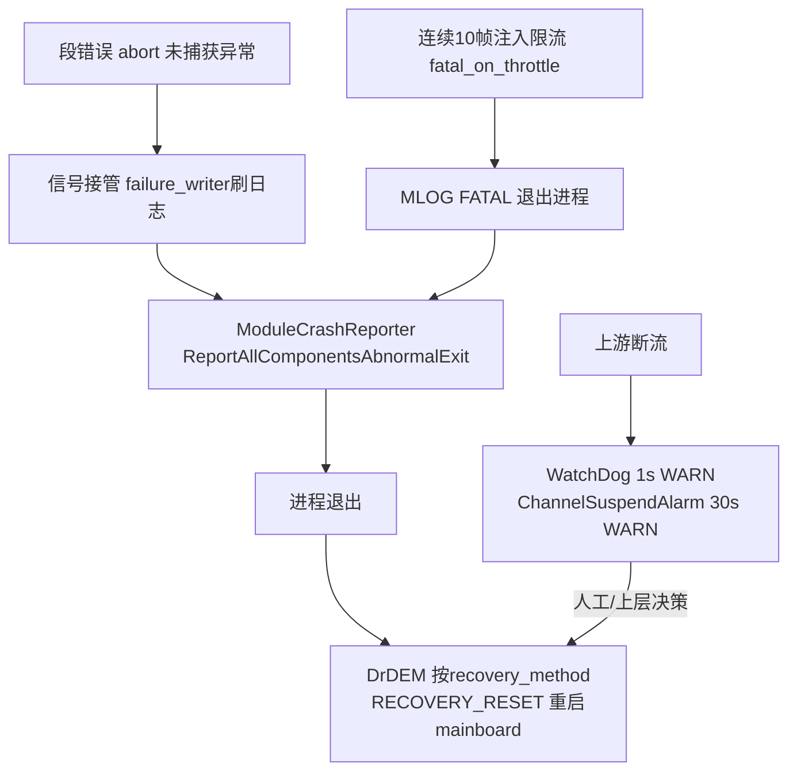

# 06 异常处理与容错机制

> 所属系列：C01车型E2E架构拆解 · Perception 通用机制  
> 读者：具备 C/C++ 基础、不熟悉本仓库的开发者  
> 基线引用：阶段1第4条（watch_dog/ChannelSuspendAlarm/crash reporter/RECOVERY_RESET）

## 1. 输入异常：帧同步超时与丢帧

### 1.1 帧同步超时参数链

超时值从 proto 默认值一路传到 FrameSyncCalculator：

> 文件路径：/sandbox/platform/church/proto/tasks_config.proto  
> 函数名：TaskProto 字段  
> 核心逻辑：

```proto
optional uint32 frame_sync_timeout = 12 [default = 100000000];  // 100ms（纳秒）
optional bool fatal_on_stream_throttle = 14 [default = true];   // 限流默认致命
optional uint32 cache_size = ... [default = 10];                // channel缓存
optional uint32 msg_trans_warn_threshold_ms = ... [default = 500]; // 传输耗时告警阈值
```

> 文件路径：/sandbox/platform/church/graph/graph_scheduler.cc  
> 函数名：GraphScheduler::FillSidePacketsForFrameSync（449-530行）  
> 核心逻辑：

```cpp
// 把配置注入 FrameSyncCalculator 的 side packet：
//   FRAME_SYNC_TIMEOUT  → task().frame_sync_timeout()（未配置用默认100ms）
//   SETUP_TIMER_CALLBACK → timer_.Emplace(...) 定时器注册
// 定时器触发时：
//   graph_->AddPacketToInputStream(timer_stream, packet)
//   // 带着超时事件进入图 → FrameSyncCalculator 执行 TimeoutAssemble
// 限流保护：
//   if (fatal_on_throttle) {
//     if (++consecutive_throttled >= 10) {
//       MLOG(FATAL) << "Graph input stream throttled for " << count
//                   << " consecutive frames, triggering restart.";
//     }   ← 连续10帧注入失败直接致命退出（触发进程重启）
//   }
```

逻辑说明：**frame_sync_timeout**（帧同步超时）默认 100ms，perception_orin.jsonnet 未覆写即生效。超时不是"放弃本帧"而是**降级装配**（见 1.2）；真正致命的是**注入限流**：组件消费不过来导致输入流满（`ADD_IF_NOT_FULL` 下注入阻塞/失败），连续 10 帧后 `MLOG(FATAL)` 主动结束进程——宁可重启也不带着积压跑。

### 1.2 超时装配与最大在途帧数

> 文件路径：/sandbox/platform/church/graph/calculators/frame_sync_calculator.cc  
> 函数名：FrameSyncCalculator::TimeoutAssemble（460-495行）与帧状态机  
> 核心逻辑：

```cpp
// kMaxFramesInFlight —— 最大在途帧数（C01 orin 平台为 2）：
#if defined(DR_VEHICLE_C01_PT) || defined(ORIN_PLATFORM)  // 57-68行（示意）
constexpr int kMaxFramesInFlight = 2;
#endif
// 帧状态机 FrameStateMachine::CanOutput()：
//   在途帧 ≥ kMaxFramesInFlight 时不再输出新帧（背压）

// TimeoutAssemble(timeout_frame_id)（460-495行）：
//   1. 若该帧已被取消 → 忽略
//   2. 若更高帧已处理过（higher_frame_processed）→ 跳过旧超时帧
//   3. 否则按各 topic 的 ChannelInputType 语义"尽力装配"残缺帧输出
//      （REQUIRED 缺失的通道为空，下游需容忍）
// 乱序保护（BreakingOrderNotifier）：
//   MLOG(WARN) << "frame sync state has been reset, due to breaking-order"
//   // 乱序消息到达后复位帧同步状态机

// 非帧同步输入的装配语义（AssembleNonFramesyncInputs）：
//   ALL_NEW  → 循环 ConsumeOld 取全部新消息
//   REQUIRED → GetNewest（必须有，否则本路为空）
//   OPTIONAL → ConsumeNew（可选，缺了不报错）
//   NEAR     → 取时间戳最近
```

逻辑说明：FrameSyncCalculator（**帧同步计算器**）对超时的处理是"**能装多少装多少**"：`TimeoutAssemble` 输出残缺帧而非丢弃，保证 10Hz 拍点稳定；同时用 `kMaxFramesInFlight=2` 限制同时在途帧数形成背压——处理慢时新帧先不装配，等待 `TriggerNextFrameCalculator` 回边放行。12 路 REQUIRED 输入全部齐套则提前触发（无需等超时）。

### 1.3 上游源头：消息打包防限流

> 文件路径：/sandbox/perception/perception/util/msg_type.h  
> 函数名：struct RadarBEVInput  
> 核心逻辑：

```cpp
// 上游把多包雷达消息打包成单条流（以lidar时间戳对齐），
// 避免下游 channel 因消息过密触发 throttle：
struct RadarBEVInput {
  uint64_t lidar_timestamp_us = 0;
  std::shared_ptr<RadarInput> radar_input;
};
```

逻辑说明：这是"输入异常预防"设计——把高频消息在**上游合并**降低注入频率，属于第一层容错（预防），FrameSync 的超时装配是第二层（容忍），fatal_on_throttle 是第三层（放弃治疗重启）。

## 2. 算法异常：calculator 错误路径

### 2.1 错误处理的三种姿势（源自感知 calculators 实码）

> 文件路径：/sandbox/perception/perception/calculators/perception_input_transform_calculator.cc  
> 函数名：ReadImageMayFromShareMemory / TransformInputMsgsToProcessInput  
> 核心逻辑：

```cpp
// 姿势1：致命错误返回 absl 状态，中断整帧
if (read_block == nullptr) {
  MLOG(WARN) << "Perception acuire read block failed, topic=" << topic_name;
  return absl::InternalError("read shm block failed");
}
// 姿势2：非关键缺失打告警继续（压缩图缺、原图兜底）
// 姿势3：未知topic跳过继续（frame_done_calculator.cc）：
//   MLOG(ERROR) << "Topic not found in mapping: " << topic;
//   continue;   // 单topic失败不拖垮整帧发布
```

逻辑说明：calculator 的错误处理采用"**关键路径 fail-fast（返回 absl::InternalError，mediapipe 会置图错误状态），非关键路径 log-and-continue**"分级策略。mediapipe 的图错误最终会被 GraphScheduler/WatchDog 感知（表现为停止产出），由上层监控与重启机制兜底（见 3、5 节）。

### 2.2 配置级致命检查

> 文件路径：/sandbox/platform/church/component/trigger/framesync_trigger.h  
> 函数名：FrameSyncTrigger 构造  
> 核心逻辑：

```cpp
// 帧同步通道为空直接致命退出（配置错误，启动即失败）：
MLOG(FATAL) << "frame sync channels are empty";
// 类似：Component::Check_Component_Version 中版本不匹配也 MLOG(FATAL)
```

逻辑说明：启动期可判定的配置错误（空通道、版本不符）用 `MLOG(FATAL)`**启动即失败**——在 DrDEM 看来等价于崩溃，走重启流程，避免带病运行。

## 3. 框架级监控

### 3.1 WatchDog：1 秒无帧告警

> 文件路径：/sandbox/platform/church/graph/watch_dog.h  
> 函数名：WatchDog（82行全文）  
> 核心逻辑：

```cpp
class WatchDog {
  static constexpr int64_t kWaitMsgArrivedMaxTimeNs = 999999999;  // ≈1s
  // PipelineStatusMonitor 线程：每秒检查一次
  // 若图最后收到新输入距今 >1s：
  //   MLOG(WARN) << "There is no incoming frame"
  //              << " ... " << GetRunningProcess();
  // 只告警不重启 —— 上报监控平台由人工/上层决策
};
```

逻辑说明：**WatchDog**（看门狗）监控的是"图层面还有没有新帧进来"，1 秒无帧打 WARN（对应基线第4条）。它不区分"上游没发"还是"处理卡死"，只是最小闭环的第一道哨兵；组件级还有更细的 watchdog（graph_api.h 中 GraphManager::watch_dog\_），推断用于帧级处理超时。

### 3.2 ChannelSuspendAlarm：单通道断流告警

> 文件路径：/sandbox/platform/church/graph/channel_suspend_alarm.cc  
> 函数名：ChannelSuspendAlarm（77行全文）  
> 核心逻辑：

```cpp
static constexpr int kAlarmTimeout = 30;   // 秒
// 每 1s 轮询：某个已配置 topic 超过30s无新消息：
//   MLOG(WARN) << "No message arrived for a long time, component="
//              << ... << ", topic=" << ...;
// close_topic_report 配置可关闭特定topic的上报
```

逻辑说明：**ChannelSuspendAlarm**（通道挂起告警）补足 WatchDog 的粒度：WatchDog 只看"有没有帧"，它看"**哪一路**断了"。30s 阈值对 10Hz 帧基意味着连续 300 帧缺一路——大概率是传感器或上游进程问题。

### 3.3 AnomalyMonitor 与 ScheduleMonitor

> 文件路径：/sandbox/platform/church/component/anomaly_monitor.cc  
> 函数名：AnomalyMonitor 构造（19-28行）  
> 核心逻辑：

```cpp
// 四个监控单元：
MsgePubRateUnit(...)      // 消息发布频率单元，周期2000ms
ComProcTimeUnit(...)      // 组件处理耗时单元，周期1000ms
SubAnomalyUnit(...)       // 子异常单元
ChannelMonitorUnit(...)   // 通道单元，周期1000ms
// 各单元独立定时检查，产出异常上报
```

> 文件路径：/sandbox/platform/church/component/schedule_monitor.h  
> 函数名：ScheduleMonitor  
> 核心逻辑：

```cpp
// boost::lockfree::queue 承载调度事件（调度器无锁上报）
// InstallOnComponents / InstallOnNodes / InstallOnGraph
// RequestReclaimEvents(...)：向崩溃回收机制登记事件
```

逻辑说明：**AnomalyMonitor**（异常监视器）是组件级四合一监控（发布频率/处理耗时/子异常/通道健康），**ScheduleMonitor**（调度监视器）用无锁队列异步收集调度事件，避免监控本身干扰实时线程。两者均为 SCHED_OTHER 低优先级线程（perception.json 中 s_monitor/c_anomaly_monit/sched_monitor，priority -10）——**推断**：故意压低优先级，让监控让位于业务。

## 4. 崩溃处理与上报

### 4.1 崩溃信号接管链

> 文件路径：/sandbox/platform/church/mainboard/church_main.cc  
> 函数名：church_main（216-217行）  
> 核心逻辑：

```cpp
InstallFailureResourceReclaimer(
    RequestChurchAppReclaim,        // 崩溃时请求回收（glog signal handler 回调）
    WaitForChurchAppReclaimed);     // 等待回收完成
// RegisterStopSignals(SIGINT, SIGTERM)：正常退出信号注册
```

> 文件路径：/sandbox/platform/church/module/module_crash_reporter.cc  
> 函数名：ModuleCrashReporter::ReportRoutine（85行全文）  
> 核心逻辑：

```cpp
// crash_reporter 线程循环：
//   WaitForReclaimDone(5s超时)
//     // pthread_equal 防止自己等自己；5s 内未完成回收则放弃等待
//   → ReportAllComponentsAbnormalExit()
//     // 逐组件上报"异常退出"事件（crash上报平台）
//   → 上报完成后进程退出，交给 DrDEM 重启
```

> 文件路径：/sandbox/common/base/logger/spdlog/failure_writer.cc  
> 函数名：InstallFailureResourceReclaimer（1697行定义）  
> 核心逻辑：

```cpp
// 把"崩溃时先刷日志/回收资源"挂进 glog 的 failure handler：
//   信号 → failure_writer → 调用传入的 request/Wait 回调
//   1763行日志："Church async_logger flush successful"
//   —— 即崩溃路径会先保证日志落盘再退出
```

逻辑说明：崩溃链路是三段接力：**信号接管**（glog failure handler 挂入回收回调）→ **资源回收+日志落盘**（5s 超时保护，防回收卡死）→ **上报后退出**（ModuleCrashReporter 逐组件上报异常退出）。`MLOG(FATAL)` 与段错误/abort 都汇入这条链路。

## 5. 降级与恢复



降级层级总结（对照代码证据）：

| 层级 | 机制 | 后果 | 证据 |
|-|-|-|-|
| 帧 | FrameSync 超时装配 | 残缺帧输出，下游容忍 | frame_sync_calculator.cc TimeoutAssemble |
| 帧 | kMaxFramesInFlight=2 | 背压限流，处理慢时缓收帧 | 同上（C01_PT 条件编译） |
| 进程 | fatal_on_stream_throttle 连续10帧 | MLOG(FATAL) 主动重启 | graph_scheduler.cc FillSidePackets |
| 进程 | 崩溃信号接管+上报 | 日志落盘→上报→退出 | church_main.cc / module_crash_reporter.cc |
| 系统 | DrDEM RECOVERY_RESET | 重启 mainboard 进程 | 感知组件配置 dem_launch 字段；**DrDEM 源码未检出，重启退避策略未验证** |

> 文件路径：/sandbox/driver/config/component/perception_orin.jsonnet  
> 函数名：dem_launch 配置段  
> 核心逻辑：

```jsonnet
dem_launch: {
  recovery_method: "RECOVERY_RESET",   // 异常退出后由守护进程整体重启
},
```

逻辑说明：感知没有进程内的"部分重启"——组件配置的恢复方式是 `RECOVERY_RESET`（整体重置）：任何 FATAL/崩溃后由 **DrDEM**（守护进程管理器）重启整个 mainboard（四个 church 组件随之一并重启）。帧级异常（残缺帧）则完全交给算法自行容忍，不升级为重启。**推断**：残缺帧频率过高会体现在 AnomalyMonitor 的发布频率/耗时指标中，间接促发运维介入。

## 6. 日志机制

### 6.1 异步日志线程

> 文件路径：/sandbox/common/base/logger/spdlog/log_initializer.cpp  
> 函数名：InitMlog（异步初始化段）  
> 核心逻辑：

```cpp
static const char kLoggerThread[] = "async_logger";
// init_thread_pool(FLAGS_mlog_local_queue_size /*默认10000*/, 1, ...)
//   ↑ 10000条内存队列、1个后台线程
// kLoggerThreadPriority = -15（非QNX）：压低优先级防日志干扰实时线程
```

> 文件路径：/sandbox/common/base/logger/spdlog/log.cc  
> 函数名：日志初始化（380-388行）  
> 核心逻辑：

```cpp
if (FLAGS_mlog_async) {
  spdlog::async_logger ...            // 异步logger：写队列，后台线程落盘
    (GetAsyncOverflowPolicy())        // 队列满时策略（阻塞/丢弃）
  ->flush_on(GetSpdLogLevel(FLAGS_mlog_flush_level));
  // 高于设定等级（如ERROR）的日志触发立即flush
}
```

逻辑说明：MLOG 底层是 **spdlog 异步 logger**：业务线程只做入队（10000 深度队列），名为 "async_logger" 的专用后台线程负责格式化落盘（对应 perception.json 中 async_logger 条目，SCHED_OTHER priority -10）。`flush_on` 保证 ERROR 级别以上即时刷盘；队列溢出策略由 `GetAsyncOverflowPolicy` 决定（具体取值未验证）。崩溃路径 failure_writer 会强制刷队列（"Church async_logger flush successful"），保证致命错误日志不丢。

### 6.2 日志在容错体系中的角色

- **WARN 级**：WatchDog 无帧 / ChannelSuspendAlarm 断流 / 读 shm 失败 / 乱序复位——供车端日志检索定位；
- **ERROR 级**：未知 topic 跳过等单点失败，触发 flush；
- **FATAL 级**：主动重启开关（throttle 连续10帧、配置错误），进入崩溃链路。

（完，约 7.2 千字）
