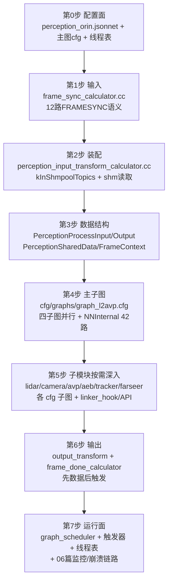

# 07 Perception 代码索引与学习指南

> 所属系列：C01车型E2E架构拆解 · Perception 通用机制  
> 读者：具备 C/C++ 基础、不熟悉本仓库的开发者  
> 前置阅读：本系列 00 总览 / 03 数据结构 / 04 线程调度 / 06 异常机制  
> 分支基线：perception/planning/driver 在 Stable_Master_4.0_new；platform/church 在 dev_master（文中路径以当前检出为准，涉及 church 处存在分支差异）

## 1. 核心文件索引表

### 1.1 车端挂载入口（driver 侧）

| 文件 | 职责 | 关键函数/宏 |
|-|-|-|
| /sandbox/driver/integration/components/perception_component.cc | 感知组件装载壳：构造伪命令行、注册 side packet | GetArchitecture()、GetPerceptionMode()、Init()、Proc()、CHURCH_REGISTER_COMPONENT(PerceptionComponent) |
| /sandbox/driver/config/component/perception_orin.jsonnet | 组件级配置：触发策略/12路输入/图路径 | task.name="t_perception"、trigger_policy:"FRAMESYNC"、graph_config_path |
| /sandbox/driver/config/component/perception_graph_l2avp_orin.cfg | 感知外层主图（180行） | FrameSyncCalculator/PerceptionInputTransform/PercepL2AvpSubgraph/FrameDone 节点链、max_queue_size:15、num_threads:5、executor nn_internal_designated(4) |
| /sandbox/driver/config/thread_config/C01/perception.json | 进程线程表 | t_perception/t_Planning/mediapipe/nn_internal_designated 等条目 |

### 1.2 perception 顶层目录（/sandbox/perception/perception/）

| 文件/目录 | 职责 | 关键函数/类型 |
|-|-|-|
| church_component/perception_component_api.{h,cpp} | church 形态感知 API：GraphManager 建图入口 | InitPerceptionStream()、Process()、CreateGraphManager()；结构体 PerceptionProcessInput / PerceptionProcessOutput |
| main.cpp | 独立进程形态入口（与 church 形态共用 GraphManager） | Main() → CreateGraphManager + RosWrapper.Run() |
| frame_context/perception_frame_context_manager.{h,cc} | FrameContext 单例管理：槽位轮转/快照 | ActivateFrameContext()、BuildNnFrame()、BuildSnapshot()、ShouldPublishFrameContextUnlocked() |
| pipeline/perception_shared_data.h | 算法"黑板"：GPU Buffer/位姿缓冲/模式锁 | MsgBuffer pose_buff\_、lidar2cams_gpu\_ 等、PredictionSharedData |
| pipeline/graph_api.{h,cc} | GraphManager 定义：图生命周期 | ProcessCurrentFrame()、TaskWaitConditionMessage、watch_dog\_ |
| pipeline/sensor_data_sync.h | ROS/独立进程形态输入组装（对照 church 的 FrameSync） | SensorDataSync::TryGetPerceptionInput()、PerceptionProcessInputInternal |
| util/msg_type.h | 全链路消息指针别名/打包结构 | XxxConstPtr、ImageVariant、RadarBEVInput、OnboardMessageConstPtrVector |
| util/buffer.h | 时序环形缓冲模板 | MsgBuffer::SetData/LookupNearest/LookupLatest/LookupPeriod |
| calculators/（50文件） | 感知计算器集 | 见 1.3 |
| triggers/（10文件） | 感知业务后处理触发器（**非** church 触发器） | false_positive_cone / inconsistent_stopline / lane_construction / near_field_moving_object / odd_shaped_vehicle |
| sensor/（3文件）、radar/（17文件）、interaction/（6文件） | 传感器/radar/交互支撑代码 | - |
| cfg/perception_orin_l2avp.cfg | C01 感知参数主配置 | task_type="L2_driving"、perception_topic\*、perception_param（tracker/prediction/error_codes 等路径） |
| cfg/graphs/graph_l2avp.cfg | 算法主子图（1201行） | PerceptionIoPreprocessing→…→TriggerNextFrameCalculator 节点链 |

### 1.3 calculators 关键文件（外层主图四个 + 通用）

| 文件（/sandbox/perception/perception/calculators/） | 职责 | 关键函数 |
|-|-|-|
| perception_input_transform_calculator.cc（864行） | ChannelCache 消息 → PerceptionProcessInput 装配；shm pool 读取 | Process()、TransformInputMsgsToProcessInput()、ReadImageMayFromShareMemory()、ReadPointCloudMayFromShareMemory()、kInShmpoolTopics（12路） |
| perception_output_transform_calculator.cc | PerceptionProcessOutput → topic 映射 | Process()（输出 ProtoBaseMsgPtrVectorMap） |
| （平台侧）/sandbox/platform/church/graph/calculators/frame_sync_calculator.cc（647行） | 12路帧同步/超时装配/背压 | Process()、TimeoutAssemble()、AssembleNonFramesyncInputs()、FrameStateMachine::CanOutput() |
| （平台侧）/sandbox/platform/church/graph/calculators/frame_done_calculator.cc（222行） | 按序发布 + 触发规划 | Process()、topic_to_stream_id\_、frame_id\_++ |

### 1.4 submodules 子模块入口（/sandbox/perception/submodules/）

| 子模块 | 入口文件 | 说明 |
|-|-|-|
| aeb（70文件） | aeb/linker_hook/percep_aeb_linker_hook.{h,cc} | AEB 算法链接钩子 |
| avp（469文件） | cfg/graphs/avp_sub_graph_l2.cfg | 泊车子图（多处 executor: nn_internal_designated） |
| base（131文件） | base/object.h | 公共对象定义 |
| camera（338文件） | camera/linker_hook/perception_camera_linker_hook.{h,cc}；camera/modules/ras_map/single_ras_map_server.{h,cpp} | 相机算法；RAS 地图单例服务（static std::mutex base_map_mutex\_） |
| farseer（362文件） | farseer/source/prediction_api.h、predictionv2_api.h | 预测 API |
| lidar（309文件） | cfg/graphs/lidar_sub_graph.cfg（114/157行 executor 指定） | 激光雷达算法子图 |
| perception_routing（14文件） | calculator/ddrouting_pre_process_calculator.cc + module/ + pipeline/ | 路由预处理 |
| tracker（76文件） | tracker/tracker_api.h | 多目标跟踪 API |

### 1.5 依赖的平台框架文件（church，dev_master 分支）

| 文件 | 职责 | 关键函数 |
|-|-|-|
| /sandbox/platform/church/graph/graph_scheduler.cc（1163行） | 合并大图/执行器替换/帧同步 side packet | Start()、UpdateExecutor()、FillSidePacketsForFrameSync()、SetGraphInputStreamAddMode(ADD_IF_NOT_FULL) |
| /sandbox/platform/church/graph/graph_executor.h | 线程池执行器 | GraphExecutor(num_threads, name)、Schedule() |
| /sandbox/platform/church/component/component.cc | 组件基类：触发器装配 | InitializeTrigger()（197-278行）、WaitForTrigger() |
| /sandbox/platform/church/component/trigger.h + trigger/{framesync,immediate,periodic,notrigger}\_trigger.h | 四种触发器 | WaitForTrigger()、SetTimeoutProcessHandler() |
| /sandbox/platform/church/scheduler/conditional_scheduler.cc（84行） | 每组件一个任务线程 | WaitForTrigger()→Process() 循环、base::Thread(task_name) |
| /sandbox/platform/church/node/shm/shm_pool.h | 共享内存池 | AddSegment()、AcquireReadabledBlock(key,index,seq) |
| /sandbox/platform/church/node/onboard_message.h | 统一消息封装 | OnboardMessage（payload shared_ptr + lazy_payload） |
| /sandbox/platform/church/cache/channel_cache.h | 组件级消息缓存 | Push/ConsumeNew/ConsumeOld/GetByTimestampNearest、ChannelInputType 五枚举 |
| /sandbox/platform/church/graph/watch_dog.h | 1s 无帧告警 | kWaitMsgArrivedMaxTimeNs=999999999 |
| /sandbox/platform/church/graph/channel_suspend_alarm.cc | 30s 断流告警 | kAlarmTimeout=30 |
| /sandbox/platform/church/module/module_crash_reporter.cc | 崩溃上报 | ReportRoutine()、ReportAllComponentsAbnormalExit() |
| /sandbox/common/base/thread/thread_manager.cc + thread.h | 按名线程配置 | GetThreadConf()、THREAD_CONFIG_PATH、SetInnerThreadAttr() |
| /sandbox/common/base/logger/spdlog/{log.cc,log_initializer.cpp,failure_writer.cc} | MLOG/异步日志/崩溃刷盘 | async_logger、InstallFailureResourceReclaimer() |

## 2. 核心函数索引（按模块分类）

| 模块 | 函数 | 一句话说明 |
|-|-|-|
| 装载 | PerceptionComponent::Init | 伪命令行 `perception -launch_mode=church -perception_config_filename=...` + ParseCommandLineFlags |
| 装载 | PerceptionComponent::GetPerceptionMode | cloud config → task_type → 默认 l2avp |
| 装载 | PerceptionComponent::Init（side packet 段） | AddInputSidePacket dtu_response_publish_handle 等 → 发布 /perception/dtu_response |
| 感知API | InitPerceptionStream | CreateGraphManager → CompleteRegisterAndStart → ReportEvent(PERCEPTION_INIT_SUCCESS)。**注**：无显式调用点（未验证，推断由组件装载机制/链接期 hook 触发） |
| 感知API | GraphManager::ProcessCurrentFrame | 每帧算法主流程入口 |
| 输入 | PerceptionInputTransformCalculator::Process | 组包 + ActivateFrameContext + SetNextTimestampBound |
| 输入 | ReadImageMayFromShareMemory | data<64字节判断 + AcquireReadabledBlock + DATA_STORAGE_POINTER + shm_blocks\_ 持有 |
| 同步 | FrameSyncCalculator::Process | 帧齐/超时两路输出 |
| 同步 | FrameSyncCalculator::TimeoutAssemble | 超时残缺帧装配（canceled/higher_frame_processed 检查） |
| 输出 | FrameDoneCalculator::Process | 按序发布 5 个 topic，最后 /perception/objects |
| 框架 | GraphScheduler::UpdateExecutor | mediapipe 执行器 → common::ThreadPool（线程池名=executor名） |
| 框架 | GraphScheduler::FillSidePacketsForFrameSync | FRAME_SYNC_TIMEOUT 注入 + fatal_on_throttle 连续10帧 FATAL |
| 线程 | ThreadManager::GetThreadConf | 线程名 → {policy,priority,cpuset,stack_size} |
| 线程 | base::Thread::SetInnerThreadAttr | 应用调度策略与 cgroup |
| 监控 | WatchDog::PipelineStatusMonitor | 每秒检查无帧 >1s WARN |
| 监控 | ChannelSuspendAlarm | 每 1s 检查，30s 断流 WARN |
| 崩溃 | ModuleCrashReporter::ReportRoutine | 5s 超时回收等待 → 逐组件异常退出上报 |
| 帧上下文 | PerceptionFrameContextManager::ActivateFrameContext / BuildSnapshot | 槽位激活（清旧）/ 每10帧快照 |

## 3. 推荐学习路径

perception README（/sandbox/perception/README.md，196行）给出了官方阅读顺序，结合本系列验证结果整理如下：

| 步骤 | 前置知识 | 验收标准（能回答的问题） |
|-|-|-|
| 0 配置面 | jsonnet/mediapipe graph cfg 语法 | 帧基为什么是 100ms？nn_internal_designated 谁在用？ |
| 1 帧同步 | ChannelInputType 五枚举 | REQUIRED 缺失会怎样？超时后帧还发吗？ |
| 2 装配 | shm pool 原理（A篇3.1） | data 字段什么时候是索引字符串？ShmBlock 为什么要持有？ |
| 3 数据结构 | shared_ptr 语义 | 哪些对象每帧新建？哪些跨帧复用？ |
| 4 主子图 | mediapipe back_edge 概念 | TriggerNextFrameCalculator 的回边作用？ |
| 5 子模块 | 各算法域基础知识 | 各子图入口 cfg 与 linker_hook 在哪？ |
| 6 输出 | planning IMMEDIATE 触发机制 | 为什么 /perception/objects 必须最后发？ |
| 7 运行面 | 本系列 04/06 篇 | 线程名如何映射到调度策略？FATAL 后发生什么？ |

## 4. 重点难点与常见误区

### 4.1 两套入口形态

- **church 模式**（车端 C01 实际使用）：driver 的 PerceptionComponent（伪命令行）→ church 框架装载 → GraphScheduler 拉起外层大图；
- **ROS/独立进程模式**（/sandbox/perception/perception/main.cpp）：Main() 自建 GraphManager + SensorDataSync 组包。  
**误区**：只看 main.cpp 会找不到车端入口——车端实际走 perception_component.cc；两形态共用算法管线（PerceptionProcessInput 契约一致），差异只在调度与组包（见 A篇 5.3）。

### 4.2 graphpipe 模式下组件线程不驱动帧处理

**误区**：以为 t_perception 线程循环 Process 处理每一帧。证据：component.cc InitializeTrigger 中 `!config().task().has_graph_config_path()` 才注册 topic observer——配置了图路径时消息由 GraphScheduler 注入图输入流，FrameSyncCalculator 在**图执行线程池中完成帧同步，组件线程 WaitForTrigger 空转（承载超时事件）。差异**：与基线"perception_assemble 首节点帧同步"表述一致，但需澄清执行线程归属。

### 4.3 thread_name_prefix "nn\_" 未生效

**误区**：以为 cfg 里 `thread_name_prefix: "nn_"` 决定线程名。证据：graph_scheduler.cc UpdateExecutor 只传 (num_threads, exec.name()) 给 GraphExecutor，带 ThreadOptions 的 Create() 工厂（会读 prefix）未被此路径调用。实际线程池名 = "nn_internal_designated"，与线程表匹配。**差异**：与基线第2条"thread_name_prefix 'nn\_'"表述有出入，实际生效的是 executor 名。

### 4.4 shm pool 语义

**误区**：以为 proto 的 data 字段永远是像素/点云数据。实际：跨进程大消息 data 里是编码的块索引字符串（<64 字节判断），必须走 AcquireReadabledBlock 还原；忘记持有 ShmBlockPtr 会导致读到的数据被发布方覆写（seq 比对失败）。**另**：单帧结束时 shm_blocks\_.clear() 的释放时机决定了 ShmBlock 生命周期，调试数据覆写问题先看这里。

### 4.5 帧（FrameSync）语义

- frame_id = 时间戳 / 100ms（整数除法），不是传感器自己的帧号；
- 超时≠丢帧：TimeoutAssemble 输出残缺帧；12 路里 lidar 主帧（sensors\_\_lidar\_\_combined_point_cloud_proto）决定拍点；
- kMaxFramesInFlight=2：同时最多 2 帧在途，第 3 帧等回边；
- "FrameSync 输出的帧"与"FrameDone 发布的帧"通过 timestamp bound 对齐，乱序触发 BreakingOrderNotifier 复位。

### 4.6 其他易混淆点

- perception/triggers/（业务触发器：锥桶误检/停止线不一致等）与 church trigger（调度触发器）**重名不同物**；
- OnboardMessageConstPtrVector 复制不复制消息体（A篇 4.2）；
- ras_map_lane_tracker.h 中 "is this needed?" 注释不能作为无锁依据（B篇 5.2 实例5）；
- proto_msg 检出版本与 perception 代码存在字段缺失（FrameContext，A篇 1.2 差异）。

## 5. 调试与验证方法

### 5.1 日志检索（MLOG 关键字表）

| 症状 | 检索关键字 | 出处 |
|-|-|-|
| 图 1s 无帧 | `There is no incoming frame` | watch_dog.h |
| 单路断流 | `No message arrived for a long time` | channel_suspend_alarm.cc |
| 注入限流重启 | `Graph input stream throttled for` | graph_scheduler.cc |
| 帧同步乱序复位 | `breaking-order` | frame_sync_calculator.cc |
| shm 读取失败 | `Perception acuire read block failed` | perception_input_transform_calculator.cc |
| 缓存失败 | `Failed to cache message` | channel_cache.h |
| 输出映射缺项 | `Topic not found in mapping` | frame_done_calculator.cc |
| 崩溃日志落盘 | `Church async_logger flush successful` | failure_writer.cc |

日志线程为异步（10000 队列），崩溃路径会强制 flush；ERROR 及以上即时刷盘，排查时优先找 FATAL/ERROR。

### 5.2 bag / 可视化 topic 验证

- 输出五个 topic：/perception/extra_objects → /perception/ras_map → /perception/ras_map_parking → /perception/traffic_lights_status → **/perception/objects**（触发规划）。**推断**：可视化工具按 topic 订阅绘制（具体可视化前端未在本仓库验证）；
- 回放验证帧同步：检查 bag 中 12 路 FRAMESYNC topic 的时间戳是否以 100ms 对齐（frame_id = ts/100ms）；
- 对比 msg_trans_warn_threshold_ms（默认 500ms）日志可定位传输耗时毛刺。

### 5.3 graph cfg 调整实验（只读分析视角，实机需走发布流程）

- 降低 `num_threads`（5→3）观察背压与 fatal_on_throttle 触发；改 `frame_sync_timeout`（100ms→200ms）观察残缺帧频率变化；
- 调整线程表 cpuset（t_perception 1-5）观察调度隔离效果；
- `close_topic_report`（ChannelSuspendAlarm）可屏蔽特定 topic 断流告警——排查已知断流传感器时使用。

### 5.4 静态验证清单

1. `grep "executor" perception/submodules/*/cfg/graphs/*.cfg` —— 确认各子图执行器分配；
2. `grep -rn "kMaxFramesInFlight" platform/church/graph/calculators/frame_sync_calculator.cc` —— 确认平台在途帧数（C01_PT=2）；
3. 比对 thread_config/C01/perception.json 与运行时 `ps -T -o comm,psr` 线程名/核绑定。

（完，约 7.5 千字）
