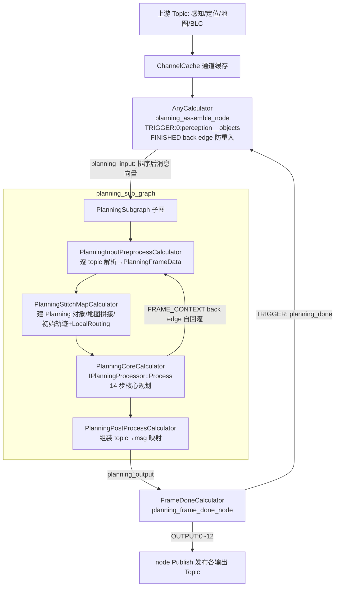
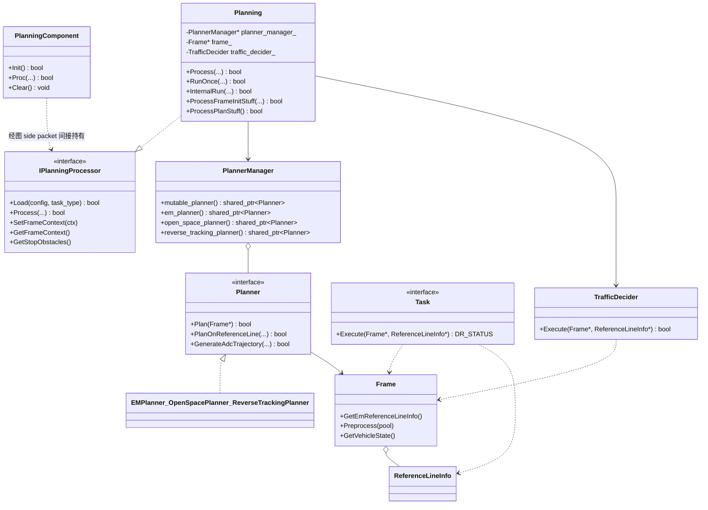

# 00 Planning 模块架构总览

> 分析对象：C01 车型（orinx 平台 C01PT，`/task/task_type=L2_driving`）E2E 主链路中的规划模块。  
> 分支说明：perception / planning / driver 仓库均在 `Stable_Master_4.0_new`（当前检出即目标分支）；platform / church 在 `dev_master`，涉及差异处已标注。  
> 本篇为 Planning 系列文档的总览篇，输入细节见《01_输入数据接入与有效性校验》，输出细节见《05_输出发布与控制指令生成》。

---

## 1. 模块定位与职责

**Planning（规划）** 模块是 E2E 行车链路的"大脑"：接收感知、定位、地图、底盘等上游数据，在每个感知帧上完成参考线生成、场景决策、路径/速度规划与轨迹校验，输出车辆未来轨迹 `/planner/trajectory`（**ADCTrajectory**，即规划给控制的轨迹消息），由控制模块（CbwControl）闭环执行。

它不是独立进程，而是**挂在 perception mainboard 主进程内的一个组件**：

> 文件路径：/sandbox/driver/config/component/planning.jsonnet  
> 核心逻辑：
> 
> ```jsonnet
> {
>     "components": [
>         {
>             "class_name": "PlanningComponent",
>             "config": {
>                 "name": "Planning",
>                 "task": {
>                     "name": "t_Planning",
>                     "expected_proc_duration_ms": 500,
>                     "graph_config_path": "planning/config/planning_graph.cfg",
>                     "trigger_channels": [ "/perception/objects" ],
>                     "trigger_policy": "IMMEDIATE",
>                     ...
> ```
> 
> 逻辑说明：`PlanningComponent` 以图配置 `planning_graph.cfg` 挂载进 GRAPH（graphpipe/mediapipe 风格）调度器，触发源为 `/perception/objects`，触发策略 IMMEDIATE（**立即触发**：消息到达立即进入装配，不做周期对齐）。

组件壳本身极薄，业务全部在图中的 Calculator 内：

> 文件路径：/sandbox/driver/integration/components/planning_component.cc  
> 函数名：PlanningComponent::Proc()  
> 核心逻辑：
> 
> ```cpp
> bool PlanningComponent::Proc(const OnboardMessageConstPtrVector&,
>                              OnboardMessagePtrVector*) {
>   return true;   // 组件 Proc 为空实现
> }
> ```
> 
> 逻辑说明：`Init()` 只注入 side packet（`city`、`task_type`、`publish_handle` 发布回调，L56-78），`Proc()` 为空——数据流与规划逻辑完全由 `planning_graph.cfg` 声明的 Calculator 图承担（见第 3 节）。

线程归属（与调度配置一致）：

> 文件路径：/sandbox/driver/config/thread_config/C01/perception.json  
> 核心逻辑：
> 
> ```json
> { "name": "t_Planning",        "policy": "SCHED_RR", "priority": 5, "cpuset": "1-5" },
> { "name": "plan_main",         "policy": "SCHED_RR", "priority": 5, "cpuset": "1-5" },
> { "name": "plan_worker",       "policy": "SCHED_RR", "priority": 5, "cpuset": "1-5" },
> { "name": "plan_stitch",       "policy": "SCHED_RR", "priority": 5, "cpuset": "1-5" },
> { "name": "planning_executor", "policy": "SCHED_RR", "priority": 5, "cpuset": "1-5" },
> { "name": "open_space_worker", "policy": "SCHED_RR", "priority": 5, "cpuset": "1-5" }
> ```
> 
> 逻辑说明：规划组件任务线程 `t_Planning` 与图执行器线程 `planning_executor`（`planning_graph.cfg` 中 `executor` 声明，3 线程）等均绑定 CPU 1-5，实时策略 **SCHED_RR（轮转实时调度）**/优先级 5。

---

## 2. 子模块划分

以下按 `/sandbox/planning/planning/` 实际目录逐项给出职责（文件数为当前检出实测）：

| 目录 | 文件数 | 一句话职责 |
|-|-|-|
| `calculators/` | 5 | 图计算器：输入预处理、地图拼接、核心规划、请求处理、后处理五级流水 |
| `frame/` | 29 | **Frame（规划帧）**：单帧数据的容器与预处理（参考线、障碍物、交通灯、VPA 状态） |
| `tasks/` | 327 | **Task（规划任务）** 管线：dp_path/dp_speed/ilqr/qp_speed、换道决策、轨迹安全等各算法任务 |
| `planner/` | 8 | 规划器：EMPlanner（行车）、OpenSpacePlanner（泊车）、ReverseTrackingPlanner（倒车循迹） |
| `reference_line_info/` | 45 | **ReferenceLineInfo（参考线信息）**：单条参考线上的路径/速度/决策结果载体 |
| `scene_decider/` | 6 | 场景级决策入口 |
| `scene_sets/` | 41 | 具体场景集合（跟车、cut-in、泊车等场景实现） |
| `traffic_rules/` | 24 | **TrafficDecider（交通规则决策）** 及各规则（红灯、人行道、限速等） |
| `traffic_light_decider/` | 2 | 交通灯专用决策 |
| `trajectory_checker/` | 9 | **TrajectoryChecker（轨迹校验器）**：规划轨迹可行性/安全性检查 |
| `continuous_object_prediction/` | 14 | 连续目标预测 |
| `planning_debug/` | 11 | DebugHandle 调试信息收集与发布 |
| `adapter/` | 4 | 历史 **FactoryCenter（适配器工厂）**，onboard 未启用（见《01》篇第 6 节） |
| `visualizer/` | 2 | 可视化（RViz marker） |
| `common/`、`config/`、`planning_gflags/`、`proto/` 等 | — | 公共工具、配置、gflags、proto 定义 |
| `post_process_intervention_reporter/` | 5 | 后处理人工接管（intervention）上报器 |
| `human_planning_interface/`、`sim_planning_interface/`、`accessory_process/`、`tests/` 等 | — | 人机接口、仿真接口、辅助进程、测试 |

根级核心文件职责表：

| 文件 | 职责 |
|-|-|
| `planning_core.cpp`（2702 行） | **Planning 类**主实现：14 步 `Process()` 主流程、`RunOnce()`、异常事件等 |
| `planning.h` | `Planning : public IPlanningProcessor` 类声明与成员 |
| `planning_api.h` | 对外接口：`IPlanningProcessor`、`PlanningFrameData`、`CreatePlanningProcessor()` C 工厂 |
| `planner_manager.cpp/.h` | **PlannerManager（规划器管理器）**：按 HPI 输入在 3 种规划器间选择/切换 |
| `planning_frame_management.cpp` | `InitFrame`、`ProcessFrameInitStuff`（帧初始化+交通规则决策） |
| `planning_planner_management.cpp` | 规划器生命周期管理 |
| `preprocess.cpp` | `PlanningPreProcessBase` 实现（rasmap 拼接、道路 mask 解码） |
| `planning_trajectory_process.cpp` | 轨迹后处理（stitch 点、轨迹点加工） |
| `mission_planner.cpp/.h` | 任务级（mission）规划 |
| `open_space_planning_async_manager.cpp/.h` | 泊车异步规划管理 |
| `planning_collision_check.cpp`、`planning_speed_control.cpp`、`planning_signal_control.cpp` 等 | 碰撞检查、速度/灯语控制等专项逻辑 |

---

## 3. 整体处理流程图

以代码为准的端到端数据流（图配置见 `planning_graph.cfg` 与 `planning/planning/config/planning_sub_graph.cfg`）：



关键节点说明：

- **AnyCalculator**（`planning_assemble_node`）：触发汇聚器。收到新触发消息且上一帧已 `FINISHED` 才会重新装配（`any_calculator.cc:115-133`）；输出 `planning_input`（按 topic 排序的 `OnboardMessageConstPtrVector`）。
- **PlanningSubgraph** 是 cfg 中声明的**子图**（非 C++ 类）：`planning_sub_graph.cfg` 首行 `# subgraph name: PlanningSubgraph`，由 `planning_graph.cfg` 的 `node { calculator: "PlanningSubgraph" }` 引用。
- **PlanningCoreCalculator** 调用核心规划对象 `IPlanningProcessor::Process()`（实现类为 `Planning`），完成参考线→决策→任务管线→轨迹校验的 14 步流程。

> 文件路径：/sandbox/planning/planning/calculators/planning_core_calculator.cc  
> 函数名：PlanningCoreCalculator::Inference()  
> 核心逻辑：
> 
> ```cpp
> planning_->Process(
>     input_data.plan_with_context, *input_data.tl_response_,
>     input_data.vehicle_state_, input_data.frame_context_, local_routing,
>     map_msg, road_mask_decoder, stitch_map_thread_pool_,
>     *input_data.perception_objects_extra_, *input_data.fusion_map_,
>     sd_horizon_map, input_data.perception_obstacles_.get(),
>     input_data.magic_carpet_perception_,
>     output_data.trajectory.get());
> ProcessSafetyRequest(output_data);
> ...
> output_data.frame_context_ = planning_->GetFrameContext();
> ```
> 
> 逻辑说明：核心规划结果写回 `PlanningFrameDataOutput`（轨迹、debug、response、semantic_info、stop_obstacles 等），随后交由 `PlanningPostProcessCalculator` 组装、`FrameDoneCalculator` 发布。

`Planning::Process()` 的 14 步主流程（`planning_core.cpp:1299-1442`）：1 输入验证 → 2 系统初始化 → 3 路由处理 → 4 设置 FrameContext → 5 感知对象处理 → 6 调试信息 → 7 HPI 前置 → 8 准备 RunOnce → 9 HPI 后置 → **10 `RunOnce()`** → 11 后台 OSP → 12 轨迹后处理 → 13 控制模式设置 → 14 最终处理。其中 `RunOnce()`（`planning_core.cpp:201-275`）内部依次为：`InternalRun()`（帧初始化 `ProcessFrameInitStuff` 含 `InitFrame`+`traffic_decider_.Execute`，核心规划 `ProcessPlanStuff` 即 `planner_->Plan(frame_)`）→ `ExecuteTrajectoryValidation()`（**TrajectoryChecker 轨迹校验**）→ 意图/语义/异常事件处理。

---

## 4. 核心类图



类关系证据：

> 文件路径：/sandbox/planning/planning/planning.h（L106）  
> 核心逻辑：
> 
> ```cpp
> class Planning : public IPlanningProcessor {
>  public:
>   bool Load(deeproute::planning::ParsingConfig& parsing_config,
>             const std::string& task_type = "L4") override;
>   bool Process(..., deeproute::planning::ADCTrajectory *trajectory_pb) override;
> ```
> 
> 逻辑说明：`Planning` 是 `IPlanningProcessor` 的实现，经 `CreatePlanningProcessor()` C 工厂创建（`planning_api.h:177-178`），由 `PlanningStitchMapCalculator::Open()` 持有（`planning_stitch_map_calculator.cc:115`：`planning_.reset(DeepRoute::planning::CreatePlanningProcessor())`）。

> 文件路径：/sandbox/planning/planning/planner/planner.h（L15-25）  
> 核心逻辑：
> 
> ```cpp
> // an interface class for trajectory planning.
> class Planner {
>  public:
>   virtual bool Plan(Frame* frame) = 0;
>   virtual bool PlanOnReferenceLine(Frame* frame,
>                                    ReferenceLineInfo* reference_line_info) = 0;
> ```
> 
> 逻辑说明：**Planner（规划器）** 基类持有 `adc_trajectory_` 成员（L116），规划结果即写入该 proto。`PlannerManager`（`planner_manager.h:15-53`）以 `planner_factory_` map 管理 3 种规划器实例并按 `HPIPlanningInterface` 分发（`PlannerDispatch`，L44-45）。

> 文件路径：/sandbox/planning/planning/tasks/task.h（L13-17）  
> 核心逻辑：
> 
> ```cpp
> // An interface class to perform a planning task. Data IO is
> // through Execute() interface.
> class Task {
>  public:
>   virtual DR_STATUS Execute(Frame* frame,
>                             ReferenceLineInfo* reference_line_info) = 0;
> ```
> 
> 逻辑说明：**Task（任务）** 是 EMPlanner 管线上的最小算子单元，输入输出都是 Frame/ReferenceLineInfo；tasks/ 下 20+ 子目录（dp_path、dp_speed、ilqr、qp_speed、lane_change_decider、trajectory_safety 等）均为其派生。

> 文件路径：/sandbox/planning/planning/planning.h（L646）  
> 核心逻辑：
> 
> ```cpp
> TrafficDecider traffic_decider_;
> ```
> 
> 逻辑说明：`Planning` 持有 `TrafficDecider`（定义于 `planning/traffic_rules/traffic_decider.h:22`），在 `ProcessFrameInitStuff` 中对每条参考线执行 `traffic_decider_.Execute(frame_.get(), ref_line_info.get())`（`planning_frame_management.cpp:101`）。

---

## 5. 与 Perception / 中间件 / 控制交互关系

调度中间件为 **Church（自研 GRAPH/graphpipe 图调度框架）**：jsonnet 声明 topic 通道 → `planning_graph.cfg` 声明流图 → AnyCalculator/FrameDoneCalculator 完成汇聚与发布。Topic 交互全景：

| 方向 | Topic | 消息类型 | 说明 |
|-|-|-|-|
| 输入（TRIGGER） | `/perception/objects` | `deeproute.perception.PerceptionObstacles` | 帧触发源，required |
| 输入 | `/perception/traffic_lights_status` | `deeproute.perception.TrafficLightResponse` | required，缺失报错 |
| 输入 | `/map/ras_map_plus` | `deeproute.map.RASMapPlus` | required，缺失报错 |
| 输入 | `/canbus/car_state` | `deeproute.common.VehicleState` | required（底盘状态） |
| 输入 | `/localization/pose` | `deeproute.drivers.gnss.Ins` | optional，覆盖车状态位姿/速度 |
| 输入 | `/perception/ras_map`、`/perception/ras_map_parking` | `deeproute.perception.RASMap` | all_new / optional |
| 输入 | `/planner/request`、`/planner/multi_requests` | `PlanningRequest(s)` | all_new，请求事件 |
| 输入 | `/map/fusion_map`、`/map/sd_horizon_map`、`/blc/*`、`/vla/vla_output` 等 | 各异 | optional（共 24 个输入通道） |
| 输出 | `/planner/trajectory` | `deeproute.planning.ADCTrajectory` | supervision，→ 控制/AEB/回灌 |
| 输出 | `/planner/context` | `deeproute.planning.FrameContext` | 帧上下文（子图内自回灌+对外发布） |
| 输出 | `/planner/debug_info`、`/planner/response`、`/planner/event`、`/planner/semantic_info`、`/planner/stop_objects`、`/safety/request` 等 | 各异 | 调试/响应/事件/安全 |
| 下游 | `/planner/trajectory` → CbwControlComponent | — | 控制订阅（见《05》篇） |

> 文件路径：/sandbox/driver/config/component/planning.jsonnet（L20-218）  
> 逻辑说明：完整输入 24 通道 / 输出 13 通道声明见该文件；`need_topic_supervision: true` 仅 `/planner/trajectory`，表示该通道受 **topic supervision（通道监管，超时/丢帧监控）**。

---

## 6. 模块配置文件路径与初始化入口

| 配置 | 路径 | 作用 |
|-|-|-|
| 组件声明 | `/sandbox/driver/config/component/planning.jsonnet` | 组件挂载、任务线程、触发通道、输入/输出通道 |
| 主图配置 | `/sandbox/driver/config/component/planning_graph.cfg`（运行时路径 `planning/config/planning_graph.cfg`） | AnyCalculator→PlanningSubgraph→FrameDoneCalculator 三节点流水与 executor |
| 子图配置 | `/sandbox/planning/planning/config/planning_sub_graph.cfg` | `PlanningSubgraph` 子图内部 5 个 Calculator 连线与 back edge |
| 算法配置目录 | `/sandbox/planning/planning/config/`（`filelist.txt` + 品牌 `geely/gwm/hw/lp/seres/share/smart` 子目录） | 各品牌/车型的 EMPlanner、TrafficRules 等算法参数 |
| gflags | `/sandbox/planning/planning/planning_gflags/`（planning/、tests/ 子目录） | 开关类 flag（如 `FLAGS_only_publish_one_trajectory`、`FLAGS_perception_timestamp`） |
| 泊车制造数据配置 | `$DEEPROUTE_PATH/planning/config/planning/open_space_e2e_manufacture_data_config.jsonnet` | E2E 制造数据定制请求（`planning_input_preprocess_calculator.cc:803-817` 动态加载） |
| 线程配置 | `/sandbox/driver/config/thread_config/C01/perception.json` | t_Planning / planning_executor 等线程调度参数 |

初始化入口链路（标注"推断"处未经逐行验证）：

1. mainboard 按 `planning.jsonnet` 创建 `PlanningComponent`，调 `Init()`：读取 `/task/city`、`/task/task_type`（`L2_driving_vision → L2_driving` 映射，`planning_component.cc:45`），注入 `publish_handle`（`node()->Publish` 回调），启动 `PostProcessInterventionReporter`。
2. 图框架加载 `planning_graph.cfg`，实例化 AnyCalculator / PlanningSubgraph / FrameDoneCalculator（推断：FrameDoneCalculator 的 `TOPIC_TO_STREAM_ID_MAP`、`GENERATE_HEADER_CALLBACK` 等 side packet 由框架按 output_channels 自动生成，未验证细节）。
3. 首个数据帧到来时，`PlanningStitchMapCalculator::Open()` 调 `CreatePlanningProcessor()` 创建 `Planning` 核心对象并 `Load()` 配置（`planning_stitch_map_calculator.cc:111-120`）。

---

## 7. 阅读关系说明

建议阅读顺序与分工：

| 文档 | 内容 | 适合何时读 |
|-|-|-|
| 本篇《00_总览》 | 模块定位、目录地图、整体流水、类体系 | 第一次接触仓库 |
| 《01_输入数据接入与有效性校验》 | 24 输入通道、触发汇聚、逐路解析与校验 | 排查输入问题（丢帧/缺数据/时间戳） |
| 《05_输出发布与控制指令生成》 | 13 输出通道、发布顺序、ADCTrajectory 字段、控制交互 | 排查轨迹发布/控制不响应问题 |
| 其他子 Agent 文档（场景决策、任务管线等） | Scene/Tasks/Planner 细节 | 深入算法逻辑 |

代码阅读入口推荐顺序：  
`planning.jsonnet`（通道）→ `planning_graph.cfg` + `planning_sub_graph.cfg`（数据流）→ `planning_input_preprocess_calculator.cc`（输入）→ `planning_core.cppProcess()/RunOnce()`（核心）→ `planning_post_process_calculator.cc`（输出）→ `frame_done_calculator.cc`（发布）。

---

## 附：与既有结论基线的差异与修正

1. **差异**：`/perception/ras_map` 在 jsonnet 中类型为 `all_new`（每条新消息都进入装配，`any_calculator.cc:173-184`），并非 "required"；`/planner/request`、`/planner/multi_requests` 同为 `all_new`。
2. **修正**：`/planner/context` 不是外部输入通道（当前 jsonnet input_channels 中无此项）；**FrameContext 自回灌发生在子图内部**：`PlanningCoreCalculator` 输出 `FRAME_CONTEXT` 流，经 back edge 回连 `PlanningInputPreprocessCalculator`（planning_sub_graph.cfg L23-27）。
3. **补充**：除 `/perception/traffic_lights_status` 外，`/map/ras_map_plus` 缺失同样直接返回 `InvalidArgumentError`（planning_input_preprocess_calculator.cc:629-639）。
