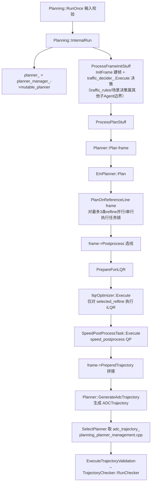

# 子模块1：planner 与 tasks 决策规划任务管线

> 分析对象：/sandbox/planning/planning/planner（8 文件）、/sandbox/planning/planning/tasks（327 文件）  
> 分支基线：perception/planning/driver 均处于 Stable_Master_4.0_new（当前检出即目标分支）

## 1. 子模块定位与职责

### 1.1 planner 目录（8 文件）

planner 目录只有 3 对 .h/.cpp 加 2 个构建文件，职责是**定义规划器抽象与三种具体规划器**：

| 文件 | 类/函数 | 职责 |
|-|-|-|
| planner.h/.cpp | `Planner`（抽象基类） | 定义 `Plan()` / `PlanOnReferenceLine()` 接口，持有输出 `adc_trajectory_`，实现回退设置 `FallBackPathSpeedSetting()` 与最终轨迹生成 `GenerateAdcTrajectory()` |
| em_planner.h/.cpp | `EmPlanner`（匿名命名空间内实现）+ 工厂 `CreateEmPlannerShared()` | 行车主规划器：装配并顺序执行 tasks 任务链（本文主体） |
| open_space_planner.h/.cpp | `OpenSpacePlanner` | 泊车/挪车等非结构化场景规划（mission/open_space 归其他子 Agent，此处只列边界） |
| reverse_tracking_planner.h/.cpp | `ReverseTrackingPlanner` | 反向跟踪规划（泊出跟踪场景） |

> 文件路径：/sandbox/planning/planning/planner/planner.h  
> 函数名：Planner（类定义）  
> 核心逻辑：
> 
> ```cpp
> // an interface class for trajectory planning.
> class Planner {
>  public:
>   virtual bool Plan(Frame* frame) = 0;
>   virtual bool PlanOnReferenceLine(Frame* frame,
>                                    ReferenceLineInfo* reference_line_info) = 0;
>   virtual void FallBackPathSpeedSetting(const bool path_fallback,
>                                         const bool speed_fallback,
>                                         const bool draw_speed,
>                                         ReferenceLineInfo* reference_line_info);
>   virtual bool GenerateAdcTrajectory(
>       const Frame* frame,
>       const std::`shared_ptr<ReferenceLineInfo>`& selected_ref_line_info,
>       const bool flag_em_planner = true);
>  protected:
>   deeproute::planning::ADCTrajectory adc_trajectory_;   // 最终输出轨迹
>   deeproute::common::VehicleSignal turn_signal_;        // 转向灯信号
>   int idx_combine_task_ = -1;      // combine_path_speed 任务在链中的下标
>   int idx_traj_safety_task_ = -1;  // trajectory_safety 任务下标
> };
> ```
> 
> 逻辑说明：`Planner` 是纯接口 + 少量公共回退/输出逻辑。`idx_combine_task_`、`idx_traj_safety_task_` 两个下标用于在任务链执行失败后按需直取 combine/safety 任务补跑（见第 3 章 fallback 逻辑）。

### 1.2 tasks 目录（327 文件）的任务管线组织方式

tasks 目录按**规划阶段**组织为 23 个子目录（实测目录树），每个子目录是一个独立 Task 的实现（含其求解器/工具类）：

- **决策类**：`decision_making`（端到端决策）、`lane_change_decider`、`static_lat_decider`（静态横向决策）、`intention_recognizer`（意图识别）、`open_space`（泊车决策+优化器）、`reverse_tracking`
- **路径类**：`dp_path`（DP 路径，含 path_cost/path_graph/sampler 等子模块）、`qp_spline_path`（QP 样条路径）、`optimizer/piecewise_jerk_path`、`model_trajectory`（模型路径/轨迹生成）、`trace_path`（轨迹跟踪）
- **速度类**：`dp_speed`（DP 速度）、`qp_speed`（QP/MPC 速度）、`st_graph`（ST 图与限速）、`speed_profile_preprocess`（速度后处理 QP）、`vpa_init_speed`、`vpa_model_speed_generator`
- **轨迹合成与安全**：`combine_path_speed`（路径+速度合成轨迹）、`trajectory_safety`（轨迹安全代价校验）
- **其他**：`ilqr`（iLQR 轨迹优化，7757 行，含 solver/problem/driving 等子目录）、`prediction_regenerator`（交互式预测重生成）、`optimizer`（通用优化器壳）

组织方式特点：**Task 即目录**，目录内 `xxx_optimizer.h/.cpp` 是 Task 外壳（继承 `Task`，实现 `Execute()`），复杂算法（DP 图搜索、QP/iLQR 求解器）拆在子目录中。Task 之间**无显式注册表**，执行顺序完全由 `EmPlanner` 构造函数装配（见第 2 章）。

## 2. 核心类结构与成员变量

### 2.1 Task 基类与派生体系

> 文件路径：/sandbox/planning/planning/tasks/task.h  
> 函数名：Task（类定义，全文仅 34 行）  
> 核心逻辑：
> 
> ```cpp
> class Task {
>  public:
>   virtual ~Task() = default;
>   virtual DR_STATUS Execute(Frame* frame,
>                             ReferenceLineInfo* reference_line_info) = 0;
>   void SetName(const std::string& name) { name_ = name; }
>   const std::string& Name() const { return name_; }
>   void SetIsInSecondStage(const bool is_in_second_stage) {...}
>   bool IsInSecondStage() const { return is_in_second_stage_; }
>   virtual void Clear(){};
>  private:
>   std::string name_;
>   bool is_in_second_stage_ = false;
> };
> ```
> 
> 逻辑说明：`Task` 基类极简：唯一抽象方法是 `Execute(Frame*, ReferenceLineInfo*)`，返回 `DR_STATUS`。数据输入输出**不走 Task 成员**，全部通过 `Frame` 与 `ReferenceLineInfo` 两个上下文对象传递（详见第 5 章）。所有具体任务以此为根：

派生体系（均继承 `DeepRoute::planning::Task`）：

| Task 类 | Name() | 目录 |
|-|-|-|
| `DpPathOptimizer` | "DP_path" | tasks/dp_path |
| `QpSplinePathOptimizer` | "QP_path" | tasks/qp_spline_path |
| `DecisionMaking` | "DecisionMaking" | tasks/decision_making |
| `ModelTrajectoryGenerator` | "Model_trajectory" | tasks/model_trajectory |
| `StaticLatDecider` | "Static_lat_decider" | tasks/static_lat_decider |
| `DpSpeedOptimizer` | "DP_speed"/"DP_speed_simple" | tasks/dp_speed |
| `QpSpeedOptimizer` | "QP_speed" | tasks/qp_speed |
| `CombinePathSpeedOptimizer` | "combine_path_speed"/"...\_simple" | tasks/combine_path_speed |
| `TrajectorySafety` | "trajectory_safety" | tasks/trajectory_safety |
| `IlqrOptimizer` | "iLQR"/"iLQR_simple" | tasks/ilqr |
| `OptimalJerk`（SpeedPostProcessTask） | "speed_postprocess" | tasks/speed_profile_preprocess |
| `VpaInitSpeedOptimizer`/`IntentionRecognizer`/`VpaModelSpeedGenerator` | vpa 系列 | tasks/vpa\_\* |

### 2.2 Task 注册机制：工厂函数 + EmPlanner 构造装配（无 REGISTER 宏）

**结论（已验证）**：本仓库 tasks 体系**没有** Apollo 式 `REGISTER_TASK`/`TaskFactory` 宏注册。每个任务头文件提供一个内联工厂函数（`CreateXxxTask`），返回 `std::unique_ptr<Task>`；任务链在 `EmPlanner` 构造函数中按配置条件 `push_back` 装配。全仓 `grep REGISTER` 在 tasks 目录无结果（已验证）。

> 文件路径：/sandbox/planning/planning/tasks/dp_path/dp_path_optimizer.h  
> 函数名：CreateDpPathOptimizationTask  
> 核心逻辑：
> 
> ```cpp
> class DpPathOptimizer : public Task {
>  public:
>   explicit DpPathOptimizer(const deeproute::taskconfig::DpPathConfig &config)
>       : config_(config) {
>     SetName("DP_path");
>   }
>   DR_STATUS Execute(Frame *frame, ReferenceLineInfo *ref_line_info_ptr) override;
>  private:
>   deeproute::taskconfig::DpPathConfig config_;
> };
> // Creates a DP path optimization task.
> inline std::`unique_ptr<Task>` CreateDpPathOptimizationTask(
>     const deeproute::taskconfig::DpPathConfig &config) {
>   return std::`make_unique<DpPathOptimizer>`(config);
> }
> ```
> 
> 逻辑说明：任务构造时绑定各自的 `DpPathConfig` 等 proto 配置并 `SetName`。运行期配置更新通过重建整个 EmPlanner 实现（见 2.3）。

### 2.3 PlannerManager：规划器容器与选择器

> 文件路径：/sandbox/planning/planning/planner_manager.h 与 planner_manager.cpp  
> 函数名：PlannerManager::Init / Update / PlannerDispatch  
> 核心逻辑：
> 
> ```cpp
> class PlannerManager {
>  private:
>   std::unordered_map<deeproute::planning::PlannerType, std::`shared_ptr<Planner>`>
>       planner_factory_;
>   std::`shared_ptr<Planner>` current_planner_;
>   deeproute::planning::PlannerType default_planner_;
> };
> // Init：一次性构造三个规划器
> planner_factory_.emplace(PlannerType::EM_PLANNER,
>                          CreateEmPlannerShared(em_planner_config, thread_pool));
> planner_factory_.emplace(PlannerType::OPEN_SPACE_PLANNER,
>                          std::`make_shared<OpenSpacePlanner>`(...));
> planner_factory_.emplace(PlannerType::REVERSE_TRACKING_PLANNER,
>                          std::`make_shared<ReverseTrackingPlanner>`(...));
> default_planner_ = PlannerType::EM_PLANNER;
> // Update：按 HPI 请求切换 current_planner_；新配置时重建 EmPlanner
> deeproute::planning::PlannerType planner_type = PlannerDispatch(hpi_input);
> if (current_planner_->planner_type() != planner_type) { ... current_planner_ = planner_factory_[planner_type]; }
> if (has_new_em_config && planner_type == EM_PLANNER) {
>   planner_factory_[planner_type] = CreateEmPlannerShared(em_planner_config, thread_pool);
>   current_planner_->Clear(); current_planner_ = planner_factory_[planner_type];
> }
> ```
> 
> 逻辑说明：`PlannerManager` 持有 3 个常驻规划器实例的 map，按 `HPIPlanningInterface.planner_selection_`（SELECTION_EM / SELECTION_OPEN_SPACE / SELECTION_REVERSE_TRACKING）分派。**配置热更新 = 整体重建 EmPlanner（即重建整条任务链）**。`Update()` 的调用方是 PlanningHpiInterface（planning_hpi_interface.cpp:304），每帧在 HPI 数据处理阶段调用。

## 3. 核心处理流程与函数调用链

### 3.1 单帧主流程（planning_core 层）



> 文件路径：/sandbox/planning/planning/planning_core.cpp  
> 函数名：Planning::InternalRun（L1684）/ Planning::ProcessPlanStuff（L138）  
> 核心逻辑：
> 
> ```cpp
> // 4. 初始化规划器并验证路由
> planner_ = planner_manager_->mutable_planner();
> if (!CheckPlannerAndRouting()) { return false; }
> // 5. 处理帧初始化（建帧+交通规则决策）
> if (!ProcessFrameInitStuff(...)) { run_success = false; ... }
> // 7. 核心规划
> if (run_success && !ProcessPlanStuff()) { run_success = false; }
> // ...
> if (!ProcessFinalTrajectoryOperations(...)) { run_success = false; }
> ```
> 
> ```cpp
> bool Planning::ProcessPlanStuff() {
>   const bool _plan_ok = planner_->Plan(frame_.get());   // ← 规划核心入口
>   if (!_plan_ok) {
>     if (planner_->planner_type() != OPEN_SPACE_PLANNER) {
>       abnormal_events_.push_back(PlanningEventInfo(
>           dr::common::Event::PLANNING_OUTPUT_PLANNING_FAILD));
>       run_success = false;
>     }
>   }
>   // ilqr 失败/约束违背等异常事件上报（略）
>   frame_->CheckBlocking();
> }
> ```
> 
> 逻辑说明：单帧主入口 `RunOnce → InternalRun → ProcessPlanStuff → Planner::Plan`。规划失败上报 `PLANNING_OUTPUT_PLANNING_FAILD` 事件；iLQR 求解失败单独上报 `PLANNING_RUNTIME_ILQR_SOLVE_FAILED`。

### 3.2 EmPlanner 任务链装配与实际执行顺序

> 文件路径：/sandbox/planning/planning/planner/em_planner.cpp  
> 函数名：EmPlanner::EmPlanner（L202-339）  
> 核心逻辑：
> 
> ```cpp
> bool dp_path_active = (!cfg.model_trajectory_config().enable_model_path()) ||
>     (cfg.model_trajectory_config().enable_model_path() &&
>      cfg.model_trajectory_config().use_dp_path());
> bool qp_path_active = (!cfg.model_trajectory_config().enable_model_path() &&
>     cfg.use_qp_path_obtimizer());
> bool model_trajectory_generator_active =
>     (cfg.model_trajectory_config().enable_model_path() &&
>      cfg.model_trajectory_config().enable_model_speed());
> bool decision_making_active = cfg.model_trajectory_config().enable_decision_making();
> bool static_lat_decider_active = cfg.static_lat_decider_config().enable_static_lat_decider();
> bool dp_speed_active = true;                       // 恒 true
> bool qp_speed_active = cfg.use_qp_speed_optimizer();
> bool double_ilqr = cfg.enable_double_ilqr();       // proto 默认 false
> // build task query, and the order goes like
> //  DpPath -> QpPath -> ModelTrajectoryGenerator -> DpSpeed -> QpSpeed
> if (dp_path_active)  tasks_stage_.push_back(CreateDpPathOptimizationTask(...));
> if (qp_path_active)  tasks_stage_.push_back(CreateQpSplinePathOptimizationTask(...));
> if (decision_making_active) tasks_stage_.push_back(CreateDecisionMakingTask(config));
> if (model_trajectory_generator_active) tasks_stage_.push_back(CreateModelTrajectoryGeneratorTask(...));
> if (static_lat_decider_active) tasks_stage_.push_back(CreateStaticLatDeciderTask(...));
> if (double_ilqr) { /* vpa_init_speed + intention_recognizer + combine(simple)
>                      + vpa_model_speed_generator + ilqr(simple)，仅 VPA 双iLQR链 */ }
> if (dp_speed_active) tasks_stage_.push_back(CreateDpSpeedOptimizationTask(...));
> if (qp_speed_active) tasks_stage_.push_back(CreateQpSpeedOptimizationTask(...));
> tasks_stage_.push_back(CreateCombinePathSpeedTask(config.trajectory_safety_config())); // 恒加入
> idx_combine_task_ = tasks_stage_.size() - 1;
> tasks_stage_.push_back(CreateTrajectorySafetyTask(config.trajectory_safety_config())); // 恒加入
> idx_traj_safety_task_ = tasks_stage_.size() - 1;
> ```
> 
> 逻辑说明：`tasks_stage_` 是 `std::vector<std::unique_ptr<Task>>`，顺序即执行顺序。iLQR **不在**`tasks_stage_` 内逐 refline 执行，而是在选线后单独创建执行（见 3.4）。

### 3.3 C01 L2_driving 实际启用任务链（已查证配置装配）

配置装配链（jsonnet 合并，`+` 表示叠加覆盖）：

- 车型配置入口：/sandbox/planning/planning/config/gwm/planning_internal_C01_config.jsonnet（C01 属 **gwm 目录**，已验证）
- `"em_planner_config": em_planner_config + rulebase_driving_ilqr_config + em_planner_C01_config`（基础链）
- `"model_em_planner_config": em_planner_config + driving_ilqr_config + model_config + em_planner_C01_config`（模型链）
- 基础 share 配置 em_planner_config.jsonnet：`use_qp_path_obtimizer=true`、`use_qp_speed_optimizer=true`、`use_multithreading_planning=true`，但 `model_trajectory_config.enable_model_path=false、enable_model_speed=false`
- model_config.jsonnet（仅并入 model\_\* 链）：`enable_model_path=true、enable_model_speed=true、use_dp_path=true`
- `enable_double_ilqr` proto 默认 false（em_planner_config.proto:565），两份 jsonnet 均未覆盖 → **double_ilqr=false**
- `enable_static_lat_decider` proto 默认 true（static_lat_decider_config.proto:6）→ Static_lat_decider 启用
- 运行时选择：planning_input_mapper.cpp:207-211`config_ptr_ = (model_path_enabled && (L2_NCA || L2_ICA)) ? &model_all_config_ : &all_config_;`，再由 UpdateConfigByModelPathEnabled（L421-463） 在 `model_path_enabled=false` 时强制 `set_enable_model_path(false)`。

**推断（配置合并规则已验证，最终 L2_driving 档位绑定未逐帧验证）**：C01 L2_driving 行车（非 NCA/ICA 模型模式、非 VPA）走基础链，实际执行顺序为：

| # | Task（Name） | 阶段 | 启用依据 |
|-|-|-|-|
| 1 | DpPathOptimizer（DP_path） | 路径 DP | enable_model_path=false → dp_path_active=true |
| 2 | QpSplinePathOptimizer（QP_path） | 路径 QP | use_qp_path_obtimizer=true（基础 share 配置） |
| 3 | StaticLatDecider（Static_lat_decider） | 横向决策 | proto 默认 true |
| 4 | DpSpeedOptimizer（DP_speed） | 速度 DP | dp_speed_active 恒 true |
| 5 | QpSpeedOptimizer（QP_speed） | 速度 QP | use_qp_speed_optimizer=true |
| 6 | CombinePathSpeedOptimizer（combine_path_speed） | 轨迹合成 | 恒加入 |
| 7 | TrajectorySafety（trajectory_safety） | 轨迹安全代价 | 恒加入 |
| 8 | IlqrOptimizer（iLQR，选线后单独执行） | 轨迹优化 | EmPlanner::PlanOnReferenceLine(Frame\*) 必建 |
| 9 | OptimalJerk（speed_postprocess） | 速度后处理 | EmPlanner::PlanOnReferenceLine(Frame\*) 必建 |

model 链（model_em_planner_config，L2_NCA/ICA 且 model_path_enabled 时）额外插入 DecisionMaking（enable_decision_making=true，share 基础配置 L5620）与 ModelTrajectoryGenerator（enable_model_path/model_speed=true），此时 DP_path 因 `use_dp_path=true` 仍保留。**DecisionMaking 在基础链不装配**（enable_model_path=false 时 `decision_making_active` 仍为 true 会装配，但 share 基础链未叠加 model_config 前该值取 share/em_planner_config.jsonnet 内嵌的 `enable_decision_making: true`——注意此字段位于 share 基础配置 L5620，故**基础链也含 DecisionMaking**；两条链差异仅在 Model_trajectory 与 iLQR 相关 cost 开关。此处以装配代码条件 `decision_making_active = enable_decision_making()` 与配置原值为准）。

### 3.4 逐 refline 执行与 fallback

> 文件路径：/sandbox/planning/planning/planner/em_planner.cpp  
> 函数名：EmPlanner::RunTasksStage（L587）/ EmPlanner::PlanOnReferenceLine(Frame\*, ReferenceLineInfo\*)（L736）/ EmPlanner::PlanOnReferenceLine(Frame\*)（L341）  
> 核心逻辑：
> 
> ```cpp
> // RunTasksStage：顺序执行，DP_path 失败→backup path 或整体 fallback
> for (auto& task : *tasks_stage) {
>   if (task->Name() == "QP_path" && (*path_fallback || use_backup_path)) continue;
>   auto execute_status = task->Execute(frame, reference_line_info);
>   if (execute_status != DR_TASK_STATUS_OK) {
>     if (flag_dp_path) {
>       if (is_backup_path_valid) { /* 用 ADC 预测备份路径顶替 */ continue; }
>       *path_fallback = true; *speed_fallback = true;   // 路径失败连带速度回退
>     } else if (task->Name() == "DP_speed" || task->Name() == "QP_speed") {
>       *speed_fallback = true;
>     } else if (task->Name() == "QP_path") { continue; /* QP 失败沿用 DP 结果 */ }
>     break;
>   }
> }
> // PlanOnReferenceLine(frame*)：每条 refline 各跑一遍任务链（可多线程）
> for (auto& reference_line_info : frame->GetConstEmReferenceLineInfo()) {
>   ref_line_drivable_info[reference_line_info->id()] =
>       PlanOnReferenceLine(frame, reference_line_info.get()) &&
>       reference_line_info->normal();
> }   // use_multithreading_ 时提交 thread_pool_->Enqueue
> // 选线后：iLQR 只对选中 refline 执行
> auto ilqr_task = CreateIlqrOptimizationTask(em_planner_config_.ilqr_config(),
>     em_planner_config_.driving_ilqr_config(), thread_pool_);
> ilqr_task_status_ = ilqr_task->Execute(frame, mutable_selected_reference_line_info);
> mutable_selected_reference_line_info->set_flag_use_ilqr(ilqr_task_status_ == DR_TASK_STATUS_OK);
> ```
> 
> 逻辑说明：三条参考线（LEFT/MIDDLE/RIGHT）各自独立跑任务链并打 `normal` 标志；`frame->Postprocess()` 按代价选线；**iLQR 与 speed_postprocess 仅对选中的 refline 执行**。fallback 时通过 `idx_combine_task_` 直取 combine 任务补合轨迹并让 TrajectorySafety 复检（L777-831，见证据 6.5）。

## 4. 核心算法入口与关键逻辑

### 4.1 路径任务①：DpPathOptimizer（DP_path）

> 文件路径：/sandbox/planning/planning/tasks/dp_path/dp_path_optimizer.cpp  
> 函数名：DpPathOptimizer::Execute（L42）  
> 核心逻辑：
> 
> ```cpp
> DR_STATUS DpPathOptimizer::Execute(Frame *frame, ReferenceLineInfo *ref_line_info_ptr) {
>   ref_line_info_ptr->set_normal(false);                    // 先置异常，成功路径再置回
>   auto *mutable_path_data = ref_line_info_ptr->mutable_path_data();
>   SlGrid sl_grid(config_, frame->em_planner_config().object_efficiency_cost_configs(),
>                  ref_line_info_ptr->speed_data(),
>                  frame->GetPlanningStartPoint(), frame, ref_line_info_ptr);
>   RETURN_VAL_IF_PRINT(!sl_grid.Init(), DR_TASK_STATUS_FAIL, ERROR, "sl_grid init failed");
>   FrenetFramePath dp_path; bool dp_path_success = false;
>   // 优先使用新的方法，同时获得 frenet path 和 discretized path
>   dp_path_success = sl_grid.FindPathUsingSmoothedModelPath(mutable_path_data);
>   if (!dp_path_success) {
>     dp_path_success = sl_grid.FindPathUsingDp(ref_line_info_ptr->GetPathDecision(), &dp_path);
>   }
>   RETURN_VAL_QUIETLY_IF(!dp_path_success, ExceptionHandle(frame, ref_line_info_ptr, &sl_grid));
>   if (mutable_path_data->Empty()) {
>     mutable_fresh_path_data->SetFrenetPath(dp_path);
>     // combine stitching path and current dp path
>     mutable_path_data->UpdateWithCombinedFrenetPath(
>         ref_line_info_ptr->sparse_extended_stitching_frenet_frame_path(), dp_path);
>     ref_line_info_ptr->set_trajectory_behavior(
>         sl_grid.ClassifyTrajectoryBehavior(dp_path));      // 分类轨迹行为（变道等）
>   }
>   ...
> }
> ```
> 
> 逻辑说明：DP_path 在 **SL 栅格（SlGrid）** 上做动态规划路径搜索：先尝试沿平滑模型参考线取路径（`FindPathUsingSmoothedModelPath`），失败则回退经典 DP 采样搜索（`FindPathUsingDp`，采样/代价/图求值在 tasks/dp_path/{sampler,path_cost,path_graph,path_graph_evaluator} 子目录）。结果写回 `ReferenceLineInfo::path_data_`（拼接历史缝合路径 + 本帧 DP 路径），并输出 `trajectory_behavior`（直行/左变道/右变道）供 iLQR 使用。失败走 `ExceptionHandle`，最终由 RunTasksStage 触发 path_fallback。

### 4.2 路径任务②：ModelTrajectoryGenerator（Model_trajectory，model 链）

> 文件路径：/sandbox/planning/planning/tasks/model_trajectory/model_trajectory_generator.cpp  
> 函数名：ModelTrajectoryGenerator::Execute（L12，全文 56 行）  
> 核心逻辑：
> 
> ```cpp
> DR_STATUS ModelTrajectoryGenerator::Execute(Frame *frame, ReferenceLineInfo *reference_line_info) {
>   ModelTrajectory model_trajectory(config_, frame, reference_line_info);
>   // should do preprocess if dp path is disabled
>   if (config_.enable_model_path() && !config_.use_dp_path()) {
>     if (!model_trajectory.ModelTrajectoryPreprocess()) return DR_TASK_STATUS_FAIL;
>   }
>   if (!model_trajectory.GenerateModelTrajectory()) return DR_TASK_STATUS_FAIL;
>   if (frame->GetVehicleState().gear() == Chassis_GearPosition_REVERSE) {
>     if (!model_trajectory.GenerateModelReverseTrajectory()) { ... }
>   }
>   return DR_TASK_STATUS_OK;
> }
> ```
> 
> 逻辑说明：C01 配置 `use_dp_path=true`，故模型链下**不做模型路径预处理，DP_path 与模型路径并存**（DP 失败时模型路径兜底，反向场景生成倒车模型轨迹）。该任务是"感知大模型输出参考路径 → 规划侧生成 model_path_data"的入口（模型推断本身由上游模型链路完成，此处为轨迹化与预处理）。

### 4.3 速度任务①：DpSpeedOptimizer（DP_speed）

> 文件路径：/sandbox/planning/planning/tasks/dp_speed/dp_speed_optimizer.cpp  
> 函数名：DpSpeedOptimizer::Execute（L105，含 ST 图构建 L823 与 DP 搜索 L1139）  
> 核心逻辑：
> 
> ```cpp
> // 1) 决策/限速准备：红绿灯限速、模型限速、收费站限速、SpeedCautionSceneDecider
> reference_line_info->set_traffic_light_speed_limit(traffic_light_speed_limit);
> ModelSpeedLimit model_speed_limit(is_high_way, config_.model_speed_limit_config(), frame, reference_line_info);
> model_speed_limit.Execute();
> // 2) ST 边界与限速写入 StGraphData
> *reference_line_info->mutable_st_graph_data() =
>     StGraphData{boundaries, decision_reference_boundaries, init_point,
>                 speed_limit, path_data.discretized_path().Length()};
> // 3) DP 在 ST 网格上搜最小代价 s(t) 曲线
> if (!st_grid.Search(speed_data)) { return DR_TASK_STATUS_FAIL; }
> // 4) 从 ST 图提取纵向决策写回 PathDecision
> if (enable_model_speed) {
>   st_grid.GetSpeedDecision(*speed_data, reference_line_info->mutable_st_graph_data(),
>                            reference_line_info->GetPathDecision(), reference_line_info);
> }
> ```
> 
> 逻辑说明：DP_speed 是**纵向决策+速度粗解一体**的任务：把障碍物投影为 ST 边界（tasks/st_graph/st_boundary_mapper），叠加各限速源，然后在 ST 网格上做 DP 搜索得到 s(t) 曲线写入 `ReferenceLineInfo::speed_data_`；`GetSpeedDecision` 把 ST 边界对应的跟停/超车决策写回 `PathDecision`（决策与求解在同一任务内闭环）。`enable_dp_speed` 条件不满足时直接返回 OK（跳过，保留 model speed）。

### 4.4 速度任务②：QpSpeedOptimizer（QP_speed）

> 文件路径：/sandbox/planning/planning/tasks/qp_speed/qp_speed_optimizer.cpp  
> 函数名：QpSpeedOptimizer::Execute（L63）  
> 核心逻辑：
> 
> ```cpp
> const auto& st_graph_data = reference_line_info->st_graph_data();
> const std::`pair<double,double>` accel_bound = {config_.max_deceleration(), config_.max_acceleration()};
> // Choose solver: MPC or Spline QP
> bool use_mpc = reference_line_info->use_open_space_planner() ||
>                reference_line_info->use_reverse_tracking_planner() || is_e2e_out_parking;
> auto run_optimal_st_solver = [&](SpeedData* output_speed_data) {
>   OptimalStSolver st_solver(config_, frame->GetPlanningStartPoint(), ...);
>   return st_solver.Solve(current_speed_limit, st_graph_data, accel_bound, output_speed_data);
> };
> if (use_mpc) { MpcStSolver st_solver(...); /* 提取上一帧 acc profile 做帧间缝合 */ solve_success = st_solver.Solve(...); }
> else       { solve_success = run_optimal_st_solver(&speed_data_out); }
> ```
> 
> 逻辑说明：QP_speed 在 DP 粗解与 ST 图约束之上做**二次规划平滑**（`OptimalStSolver`；泊车/倒车跟踪/E2E 出库走 `MpcStSolver`，并注入上一帧加速度剖面保证帧间连续）。输入是 `st_graph_data_ + speed_data_（DP 粗解）`，输出仍是平滑后的 `speed_data_`。

### 4.5 轨迹优化：IlqrOptimizer（iLQR，选线后执行）

> 文件路径：/sandbox/planning/planning/tasks/ilqr/ilqr_optimizer.cpp  
> 函数名：IlqrOptimizer::Execute（L415）/ 求解段（L976-1080）  
> 核心逻辑：
> 
> ```cpp
> std::`unique_ptr<ilqr::DrivingIlqrSolverV2>` driving_ilqr_solver =
>     std::`make_unique<ilqr::DrivingIlqrSolverV2>`(thread_pool_);
> ilqr::DrivingIlqrSolverInput input;
> if (!BuildIlqrSolverInput(*frame, *reference_line_info, &input)) { ... }
> if (!driving_ilqr_solver->Init(time_horizons_, driving_config_, input,
>                                ilqr::SolverMode::DEFAULT, ilqr::TrajMode::DEFAULT)) { ... }
> _ilqr_seg.reset();  // stop IlqrBuild → GenerateTrajectory 是 Solve
> bool ret = driving_ilqr_solver->GenerateTrajectory(&output);
> if (!ret || !output.ilqr_has_solution) { /* 失败：写回 init_trajectory 并返回 FAIL */ }
> _ilqr_seg.emplace(prof::Node::IlqrApply);  // Solve 后:碰撞处理 + 写回 ref line
> DrivingIlqrCollisionHandle(reference_line_info, input.bicycle_model_input.static_objects_info,
>                            input.bicycle_model_input.dynamic_objects_info, ...);
> WriteDrivingIlqrContextToFrame(frame, input, output);
> if (!ApplyIlqrSolverOutputToRefLineInfo(output, reference_line_info)) { ... }
> ```
> 
> 逻辑说明：iLQR 把路径-速度联合优化为一个 **iLQR 最优控制问题**：输入由 `BuildIlqrSolverInput` 从 Frame/refline 组装（自行车模型、静态/动态障碍物、参考线），`DrivingIlqrSolverV2::GenerateTrajectory` 迭代求解（solver 实现在 tasks/ilqr/{solver,problem,driving} 子目录），失败时把初值轨迹（DP+combine 结果）写回 refline 作为兜底，成功则经碰撞处理后 `ApplyIlqrSolverOutputToRefLineInfo` 写回 `ReferenceLineInfo::trajectory_`。本仓 7757 行为 tasks 目录最大单文件。

## 5. 输入输出数据结构（Task 间传递什么）

**核心约定：Task 无自有 IO 成员，全部通过 `Frame`（帧级，跨 refline 共享）与 `ReferenceLineInfo`（每条参考线一份）传递**（task.h 注释："Data IO is through Execute() interface"，实参即这两个上下文）。

### 5.1 ReferenceLineInfo：路径-速度解耦的载体

> 文件路径：/sandbox/planning/planning/reference_line_info/reference_line_info.h  
> 函数名：ReferenceLineInfo 成员区（L4569/L4641 起）  
> 核心逻辑：
> 
> ```cpp
> PathDecision path_decision_;      // 障碍物决策（PathObject 集合 + ST 决策）
> PathData path_data_;              // extended stitching path + current planning path（FrenetPath+DiscretizedPath）
> PathData model_path_data_;        // frenet path l does not valid（模型路径）
> SpeedData speed_data_;            // 纵向 s(t) 曲线（DP/QP 产出）
> SpeedData model_speed_data_;      // 模型速度
> StGraphData st_graph_data_;       // ST 边界 + 限速 + init_point（dp_speed 构建、qp_speed 消费）
> DiscretizedTrajectory raw_trajectory_;        // combine 合成（iLQR 前）
> DiscretizedTrajectory em_trajectory_;         // EM 链轨迹
> DiscretizedTrajectory discretized_trajectory_; // 最终选中轨迹（iLQR 后写回）
> DiscretizedTrajectory double_ilqr_trajectory_;
> ```
> 
> 逻辑说明：路径-速度解耦体现在三组字段——① 路径：`path_data_`（Frenet l(s) + 笛卡尔 DiscretizedPath）；② 速度：`speed_data_`（s(t) 曲线，SpeedPoint 数组）；③ 合成：`CombinePathSpeedOptimizer` 把两者按时间采样合成为 `DiscretizedTrajectory`（TrajectoryPoint = PathPoint + v/a/t）。iLQR 再把轨迹整体优化覆写进 `discretized_trajectory_`。`model_path_data_`/`model_speed_data_` 是模型链的平行通道。

### 5.2 Frame：帧级共享上下文

`Frame`（planning/frame/frame.h）持有 `GetConstEmReferenceLineInfo()`（≤3 条 refline）、`GetPlanningStartPoint()`（规划起始点，含缝合状态）、`GetVehicleState()`、HPI 数据与各决策器句柄（lane_change_decider、traffic_light_decider 等，属其他子 Agent 边界）。Task 通过 `frame->` 读取帧级信息、调用决策器（如 DP_speed 内 `frame->GetTrafficLightDecider()`）。

### 5.3 与上下游的数据边界

- **上游输入**：`PlanningFrameData`（planning_input_preprocess_calculator 产出）→ Planning 组件；感知/定位/地图经 `PlanningInputMapper` 映射为 HPI 数据与配置（`selected_planner_config` 决定任务链形态）。
- **下游输出**：`Planner::GenerateAdcTrajectory` 把 `selected_reference_line_info->trajectory()` 填入 `deeproute::planning::ADCTrajectory`（含 trajectory_point、gear、turn_signal、trajectory_type），经 `SelectPlanner`（planning_planner_management.cpp L92-100：`*trajectory_pb = planner_->adc_trajectory(); *turn_signal = planner_->turn_signal();`）后由 planning_post_process_calculator 发布到 /planner/trajectory。

## 6. 代码证据与关键片段

### 6.1 任务链装配顺序（见 3.2 节，em_planner.cpp L202-339）

补充装配代码注释原文，证明顺序是设计意图而非巧合：

> ```cpp
> /**
>  * build task query, and the order goes like
>  *  DpPath -> QpPath -> ModelTrajectoryGenerator -> DpSpeed -> QpSpeed
>  */
> ```

### 6.2 Task 基类数据 IO 约定（见 2.1 节 task.h 全文）

`Execute(Frame*, ReferenceLineInfo*)` 签名本身即是"Task 间数据通过 Frame/refline 传递"的直接证据。

### 6.3 多 refline 并行执行（em_planner.cpp L341-365）

> 文件路径：/sandbox/planning/planning/planner/em_planner.cpp  
> 函数名：EmPlanner::PlanOnReferenceLine(Frame\*)  
> 核心逻辑：
> 
> ```cpp
> if (use_multithreading_ && !frame->GetConstEmReferenceLineInfo().front()->is_vpa_driving()) {
>   for (auto& reference_line_info : frame->GetConstEmReferenceLineInfo()) {
>     auto PlanOnReferenceLineWithRes = [&ref_line_drivable_info, frame, reference_line_info, this]() {
>       ::DeepRoute::planning::profiling::PlanProfiler::GetInstance()
>           ->SetLocalReflineId(reference_line_info->id());
>       ref_line_drivable_info[reference_line_info->id()] =
>           PlanOnReferenceLine(frame, reference_line_info.get()) && reference_line_info->normal();
>     };
>     thread_pool_->Enqueue(PlanOnReferenceLineWithRes);
>   }
>   thread_pool_->WaitUntilWorkComplete();
> }
> ```
> 
> 逻辑说明：`use_multithreading_planning=true`（share 基础配置 L7）时，各 refline 的任务链在 `plan_worker` 线程池并行执行，与基线"t_Planning(SCHED_RR/5) + plan_worker 线程池"一致。

### 6.4 QP_path 失败不回退（em_planner.cpp L714-718）

> ```cpp
> } else if (task->Name() == "QP_path") {
>   MLOG(WARN) << reference_line_info->reference_line_position()
>              << ", qp path failed, use dp path result";
>   continue;
> }
> ```
> 
> 逻辑说明：QP_path 是 DP_path 的平滑增强，失败仅告警并沿用 DP 结果，不触发 fallback；只有 DP_path/DP_speed/QP_speed 失败才升级为 path/speed fallback。

### 6.5 fallback 时补合轨迹并复检安全（em_planner.cpp L777-831）

> 文件路径：/sandbox/planning/planning/planner/em_planner.cpp  
> 函数名：EmPlanner::PlanOnReferenceLine(Frame\*, ReferenceLineInfo\*)  
> 核心逻辑：
> 
> ```cpp
> if ((path_fallback && !reference_line_info->flag_last_frame_path()) || speed_fallback) {
>   DiscretizedTrajectory trajectory;
>   CombinePathSpeedOptimizer* combine_task =
>       `dynamic_cast<CombinePathSpeedOptimizer*>`(tasks_stage_[idx_combine_task_].get());
>   if (combine_task != nullptr) {
>     if (!combine_task->CombinePathAndSpeedProfile(*reference_line_info,
>                                                   planning_start_point, false, &trajectory)) {
>       // 低速静止时允许生成停车假轨迹（enable_stop_fake_trajectory，proto 默认 false）
>       ... ReferenceLineCost kFailCost(true); reference_line_info->AddCost(kFailCost); return false;
>     }
>     reference_line_info->SetTrajectory(trajectory);
>     reference_line_info->SetRawTrajectory(trajectory);
>     reference_line_info->SetEmTrajectory(trajectory);
>     reference_line_info->set_normal(true);
>     if (idx_traj_safety_task_ != -1) {
>       TrajectorySafety* traj_safety_task =
>           `dynamic_cast<TrajectorySafety*>`(tasks_stage_[idx_traj_safety_task_].get());
>       if (traj_safety_task != nullptr && !traj_safety_task->Execute(frame, reference_line_info)) { ... }
>     }
>   }
> }
> ```
> 
> 逻辑说明：任务链中断后，用 fallback 路径/速度补一次"合成+安全复检"，保证 refline 仍有可用轨迹参与选线；合成彻底失败则对该 refline 记 FAIL 代价并剔除。

### 6.6 CombinePathSpeedOptimizer：路径+速度 → 轨迹（combine_path_speed.cpp L741-798）

> 文件路径：/sandbox/planning/planning/tasks/combine_path_speed/combine_path_speed.cpp  
> 函数名：CombinePathSpeedOptimizer::Execute  
> 核心逻辑：
> 
> ```cpp
> if (!CombinePathAndSpeedProfile(*reference_line_info, init_point, false, &trajectory)) {
>   lane_change_cost.mutable_critical_items()->at(
>       common::to_underlying(CriticalItemsIndex::FLAG_FALLBACK)) = true;
>   reference_line_info->AddCost(lane_change_cost);
>   reference_line_info->SetTrajectoryType(
>       `static_cast<ADCTrajectory::TrajectoryType>`(kCombinePathSpeedFailed));
>   return DR_TASK_STATUS_FAIL;
> }
> reference_line_info->SetTrajectory(trajectory);
> reference_line_info->SetRawTrajectory(trajectory);
> reference_line_info->SetEmTrajectory(trajectory);
> if (enable_model_path && !CombineModelPathAndSpeedProfile(...)) { return DR_TASK_STATUS_FAIL; }
> reference_line_info->SetModelTrajectory(model_trajectory);
> ```
> 
> 逻辑说明：按 `speed_data_` 的时间戳对 `path_data_` 插值取点合成 `DiscretizedTrajectory`；失败将 refline 标记为 `kCombinePathSpeedFailed` 轨迹类型并加 FALLBACK 代价（与 trajectory_checker 的 FillStopSpeedIntoTrajectory 使用同一枚举值，体现端到端类型贯通）。

### 6.7 与 trajectory_checker 的交互边界

Planner 输出的 `adc_trajectory_` 在 RunOnce 尾部进入 `Planning::RunTrajectoryChecker`（planning_trajectory_process.cpp L2529，仅 EM_PLANNER 启用）→ `TrajectoryChecker::RunChecker`。校验细节见《子模块4：trajectory_checker 轨迹校验子模块》。

---

**与 platform/church 分支差异说明**：本篇全部代码证据取自当前检出分支 Stable_Master_4.0_new；platform/church 位于 dev_master，未逐一比对，涉及平台侧差异处均未在本篇展开（标注：未验证）。
