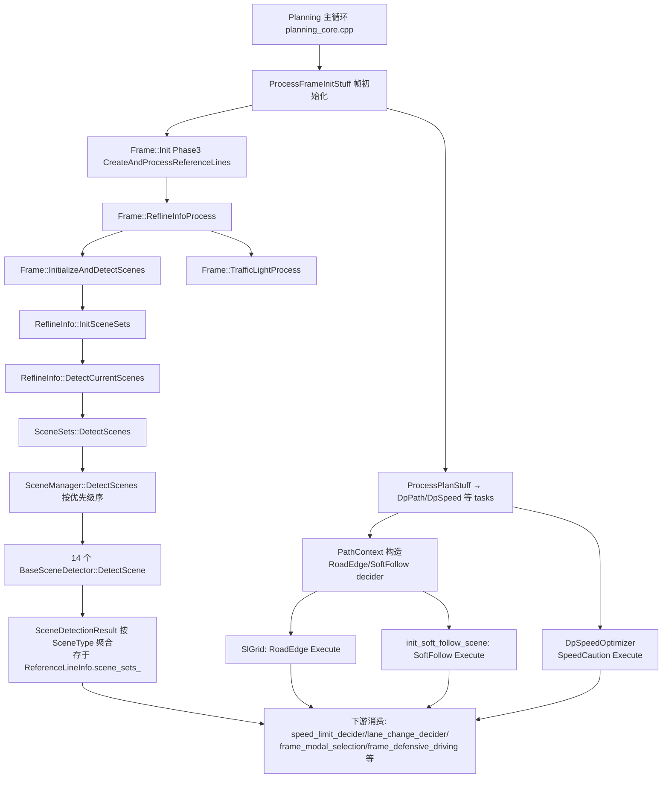

# 子模块2：scene_decider 与 scene_sets 场景决策子模块

> 分支基线：perception/planning/driver @ Stable_Master_4.0_new（当前检出）。本文所有路径均为只读分析结论，未经证实处标注"推断"或"未验证"。

## 1. 子模块定位与职责

本仓库 Planning 的"场景决策"由**两个相互独立的子模块**构成，二者均**不做轨迹规划**，只在任务管线（tasks）早期产出"场景标签/场景参数"，供 DP path、DP speed、变道决策、防御性驾驶等下游模块消费。

### 1.1 scene_decider（6 个代码文件）：参考线级"专项判定器"

无基类、无注册机制，三个独立类各管一件事，直接被 tasks 内部构造：

| 类名 | 文件 | 职责（代码证据见 §2/§4） |
|-|-|-|
| RoadEdgeSceneDecider | road_edge_scene_decider.h/.cpp | 判断自车是否在**最左/最右车道**且旁有**路沿**，输出"远离路沿的中性横向位置"（neutral_l）与横向安全距离 |
| SoftFollowLaneSceneDecider | soft_follow_lane_scene_decider.h/.cpp | 判定**软跟车（Soft Follow）车道场景**：宽车道/异常车道线长度/虚拟单车道/低置信度车道中心/低速保护 |
| SpeedCautionSceneDecider | speed_caution_scene_decider.h/.cpp | 判定**窄道谨慎场景**并计算谨慎限速（caution_speed）、谨慎比例（caution_ratio）与接管计数（block_frame_count） |

> 文件路径：/sandbox/planning/planning/scene_decider/road_edge_scene_decider.h  
> 类名：RoadEdgeSceneDecider  
> 核心逻辑（成员与接口摘要）：
> 
> ```cpp
> // note: `road edge` and `curb` maybe the same physical object. diff:
> // `road edge` is from Rasmap; `curb` is from 3d obstacle detection
> class RoadEdgeSceneDecider {
>  public:
>   void Execute();
>   bool GetNeutralLWithAwayRoadEdge(double s, double *neutral_l_with_away_curb) const;
>   bool is_valid_to_away_left_curb() const { return is_valid_to_away_left_curb_; }
>   double neutral_l_with_away_curb() const { return neutral_l_with_away_curb_; }
>  private:
>   const deeproute::taskconfig::DpPathConfig &config_;
>   const ReferenceLineInfo &ref_line_info_;
>   bool is_valid_to_away_left_curb_ = false;
>   bool is_valid_to_away_right_curb_ = false;
>   std::`map<double, RoadEdgeDistInfo>` dict_road_edge_dist_info_;
> };
> ```
> 
> 逻辑说明：注释明确 road edge 来自 Rasmap（在线感知地图），curb 来自 3D 障碍物检测；该类以 ReferenceLineInfo 为唯一输入，输出横向前馈量。三个 decider 均以 `Execute()` 为唯一执行入口、构造时传入配置与 ReferenceLineInfo。

### 1.2 scene_sets（41 个文件，14 个场景检测器）：场景库

采用**抽象基类 + 工厂 + 管理器**框架：

- **BaseSceneDetector**（base_scene_detector.h/.cpp）：纯虚接口 `DetectScene() / GetSceneType() / GetPriority() / IsEnabled()`
- **SceneDetectorFactory**（scene_detector_factory.h/.cpp）：`CreateAllDetectors()` 按优先级降序创建全部检测器
- **SceneManager**（scene_manager.h/.cpp）：持有检测器集合，逐个执行并按 `SceneType` 聚合结果（带互斥锁）
- **SceneSets**（scene_sets.h/.cpp）：SceneManager 的薄封装，挂接在 ReferenceLineInfo 上
- **scene_types.h/.cpp**：`SceneType` 枚举（16 项）、`ScenePriority`、统一输出结构 `SceneDetectionResult`

**全部场景类名清单与功能分组**（`SceneType` 枚举 + 工厂注册，代码为准）：

| 分组 | SceneType | 检测器类名 | IsEnabled |
|-|-|-|-|
| 障碍物占道 | NARROW_CHANNEL(2) | NarrowChannelSceneDetector | true |
| 障碍物占道 | VRU_OCCUPANCY(3) | VRUOccupancySceneDetector | true |
| 障碍物占道 | ABN_OCCUPANCY(4) | ABNOccupancySceneDetector | true |
| 障碍物占道 | UNMOVABLE_OCCUPANCY(10) | UnmovableOccupancySceneDetector | true |
| 障碍物占道 | LC_ABN_OCCUPANCY(13) | LCABNOccupancySceneDetector | true |
| 汇入汇出/变道 | MERGE_IN(5) | MergeInSceneDetector | true |
| 汇入汇出/变道 | MERGE_OUT(7) | MergeOutSceneDetector | true |
| 汇入汇出/变道 | U_TURN_LANE_BORROWING(14) | UTurnLaneBorrowingSceneDetector | true |
| 巡航/效率 | WIDE_LANE(6) | WideLaneSceneDetector | true |
| 巡航/效率 | TRAFFIC_JAM(11) | TrafficJamSceneDetector | true |
| 巡航/效率 | FRONT_VEHICLE_QUEUE(12) | FrontVehicleQueueSceneDetector | true |
| 道路结构 | ROUNDABOUT(8) | RoundaboutSceneDetector | true |
| 道路结构 | INTERSECTION(9) | IntersectionSceneDetector | true |
| 道路结构（高速施工+弯道降速） | CONSTRUCTION_AREA(15) | ConstructionAreaSceneDetector | **false（禁用）** |
| 无检测器 | NORMAL_DRIVING(1)/UNKNOWN(0) | —（工厂返回 nullptr） | — |

> 文件路径：/sandbox/planning/planning/scene_sets/scene_types.h  
> 函数名：enum class SceneType  
> 核心逻辑：
> 
> ```cpp
> enum class SceneType {
>   UNKNOWN = 0,  NORMAL_DRIVING = 1,  NARROW_CHANNEL = 2,
>   VRU_OCCUPANCY = 3,  ABN_OCCUPANCY = 4,  MERGE_IN = 5,
>   WIDE_LANE = 6,  MERGE_OUT = 7,  ROUNDABOUT = 8,
>   INTERSECTION = 9,  UNMOVABLE_OCCUPANCY = 10,  TRAFFIC_JAM = 11,
>   FRONT_VEHICLE_QUEUE = 12,  LC_ABN_OCCUPANCY = 13,
>   U_TURN_LANE_BORROWING = 14,  CONSTRUCTION_AREA = 15,
> };
> enum class ScenePriority { LOW = 0, MEDIUM = 1, HIGH = 2, CRITICAL = 3 };
> ```
> 
> 逻辑说明：场景分类为平面枚举而非场景树/状态机；NORMAL_DRIVING 与 UNKNOWN 无检测器（工厂 case 返回 nullptr），仅作兜底语义。

**泊车类场景不在此模块**：目录中无 parking 相关场景检测器（泊车走 mission/open_space 体系，由其他子Agent负责）。

## 2. 核心类结构与成员变量

### 2.1 scene_sets 体系（基类→工厂→管理器）

> 文件路径：/sandbox/planning/planning/scene_sets/base_scene_detector.h  
> 类名：BaseSceneDetector  
> 核心逻辑：
> 
> ```cpp
> class BaseSceneDetector {
>  public:
>   virtual bool DetectScene(const ReferenceLineInfo& reference_line_info,
>                            const Frame* frame,
>                            std::`vector<SceneDetectionResult>`& results) = 0;
>   virtual SceneType GetSceneType() const = 0;
>   virtual ScenePriority GetPriority() const = 0;
>   virtual bool IsEnabled() const = 0;
>   static bool SelectImportantObstacles(const ReferenceLineInfo& ras_refline_info);
>   virtual void UpdateConfigFromFrame(const Frame* frame) { (void)frame; }
>  protected:
>   static std::`unordered_set<ObstacleId>` important_obstacle_set_;
>   struct Config { double obstacle_consider_range; };
>   static Config config_;
> };
> ```
> 
> 逻辑说明：检测器为**无状态实例 + 类级静态状态**（important_obstacle_set\_ 为静态成员，由 `SelectImportantObstacles` 在每帧检测前统一筛选"重要障碍物"）。`UpdateConfigFromFrame` 允许子类从 Frame 动态读取参数（当前仅少数子类使用，推断）。

**SceneManager 成员**（scene_manager.h）：`std::map<SceneType, std::vector<SceneDetectionResult>> current_scenes_`（结果聚合表）、`std::vector<std::unique_ptr<BaseSceneDetector>> scene_detectors_`、置信度阈值 `confidence_threshold`（构造函数中置 0，即不过滤）。**SceneSets** 仅持 `std::unique_ptr<SceneManager> manager_`，是 ReferenceLineInfo 的挂接壳。

### 2.2 统一输出结构 SceneDetectionResult

> 文件路径：/sandbox/planning/planning/scene_sets/scene_types.h  
> 结构体：SceneDetectionResult  
> 核心逻辑：
> 
> ```cpp
> struct SceneDetectionResult {
>   SceneType scene_type{SceneType::UNKNOWN};
>   ScenePriority priority{ScenePriority::LOW};
>   double confidence{0.0};
>   double severity{0.0};
>   double start_s{0.0}, end_s{0.0};   // 场景在参考线上的纵向区间
>   double start_l{0.0}, end_l{0.0};   // 横向区间
>   std::`vector<ObstacleId>` key_obstacle_ids{};      // 关键障碍物ID
>   std::`unordered_map<std::string, double>` parameters{}; // 场景特定参数
> };
> ```
> 
> 逻辑说明：所有场景统一输出 SL 区间 + 关键障碍物 + 自由键值参数，下游无需知道检测器内部实现。scene_decider 三类不使用该结构（见 §5）。

### 2.3 scene_decider 三类的关键成员

- RoadEdgeSceneDecider：`is_valid_to_away_left/right_curb_`（左右远离路沿有效性）、`neutral_l_with_away_curb_`（远离路沿中性 l）、`max_safety_distance_to_road_edge_`（随曲率/速度查表的安全距离，构造函数计算）、`dict_road_edge_dist_info_`（s→路沿距离插值表）。
- SoftFollowLaneSceneDecider：7 个 bool 场景标志（wide_lane/abnormal_lane_boundary_length/abnormal_sine_shape_lane/virtual_single_lane/low_speed_protect_scene/low_confidence_lane/slacked_ref_line_lat_bound），`HasSoftFollowLaneScene()` 为其"或"聚合。
- SpeedCautionSceneDecider：`speed_caution_objs_`（谨慎对象向量）、`caution_ratio_/caution_speed_/final_protect_ratio_`、`block_frame_count_`（阻塞帧计数，外部传入）、`passable_area_map_`（s→可通行宽度，纯模型路径使用）。

## 3. 核心处理流程与函数调用链

### 3.1 scene_sets：帧初始化阶段全量执行（每条参考线）

场景检测发生在 **Frame 初始化**（planner 运行前），不参与 Stage 状态机推进：

> 文件路径：/sandbox/planning/planning/frame/frame_init_utils.cpp  
> 函数名：Frame::ReflineInfoProcess()  
> 核心逻辑：
> 
> ```cpp
>   ProcessConstructionZone();
>   InitializeAndDetectScenes();     // ← scene_sets 入口
>   ...
>   TrafficLightProcess();           // ← 红绿灯入口（见子模块3文档）
> ```
> 
> 逻辑说明：`ReflineInfoProcess` 是 `Frame::Init` 的 Phase 3（`CreateAndProcessReferenceLines` 内调用，frame_reference_line.cpp:3332）。场景检测在障碍物映射（MapObjectsToRefline）、施工区处理之后执行。

> 文件路径：/sandbox/planning/planning/frame/frame_utils.cpp  
> 函数名：Frame::InitializeAndDetectScenes()  
> 核心逻辑：
> 
> ```cpp
> void Frame::InitializeAndDetectScenes() {
>   for (const auto& refline_info : em_reference_line_info_) {
>     if (refline_info == nullptr) continue;
>     // 初始化并执行场景检测
>     refline_info->InitSceneSets();
>     refline_info->DetectCurrentScenes(this);
>   }
> }
> ```
> 
> 逻辑说明：对**每条参考线**独立建 SceneSets 并检测——场景结果按参考线隔离（同帧不同参考线的场景可能不同，如左右变道候选线的 MERGE_IN 判定不同）。

> 文件路径：/sandbox/planning/planning/scene_sets/scene_manager.cpp  
> 函数名：SceneManager::DetectScenes()  
> 核心逻辑：
> 
> ```cpp
> bool SceneManager::DetectScenes(const ReferenceLineInfo& reference_line_info,
>                                 const Frame* frame) {
>   std::`lock_guard<std::mutex>` lock(scenes_mutex_);
>   current_scenes_.clear();
>   StaticExecBaseSceneDetector(reference_line_info); // 先筛选重要障碍物
>   for (const auto& detector : scene_detectors_) {
>     if (!detector->IsEnabled()) continue;
>     if (frame != nullptr) detector->UpdateConfigFromFrame(frame);
>     std::`vector<SceneDetectionResult>` detector_results;
>     if (detector->DetectScene(reference_line_info, frame, detector_results)) {
>       for (const auto& result : detector_results)
>         if (result.confidence >= config_.confidence_threshold)
>           current_scenes_[result.scene_type].push_back(result);
>     }
>   }
>   ...
> }
> ```
> 
> 逻辑说明：**每帧全量重算、无跨帧场景记忆**（除各检测器内部使用 FrameContext 的场景除外，如 CONSTRUCTION_AREA 用 Frame 的 ConstructionCurvyRoadInfo 记忆触发状态）；场景无生命周期管理（无显式进入/退出状态机，检测不到即视为退出）。

### 3.2 scene_decider：分散在 DP path / DP speed 任务内部

- RoadEdgeSceneDecider、SoftFollowLaneSceneDecider 由 **PathContext 构造函数**创建（tasks/dp_path/path_common/path_context.cpp:53-56，DpPath 任务的上下文对象）：

  - `SoftFollowLaneSceneDecider::Execute()` 在 `PathContext::init_soft_follow_scene()`（path_context.cpp:618）调用，结果 `set_is_soft_follow_lane_scene()` 写回参考线；
  - `RoadEdgeSceneDecider::Execute()` 在 **SlGrid**（DP path 的 SL 网格初始化，sl_grid.cpp:375-379）调用，随后 `mutable_ref_line_info_->set_road_edge_scene_decider(...)` 挂到参考线上，供 sl_path_cost_calculator.cpp:1758、decorate_lat_sampler.cpp:134 等 cost/sampler 环节读取。
- SpeedCautionSceneDecider 由 **DpSpeedOptimizer**（tasks/dp_speed/dp_speed_optimizer.cpp:294-301）每帧构造并执行，仅对 `REFERENCE_LINE_AT_MIDDLE` 参考线生效，`caution_ratio>0.2` 时生成谨慎限速。

### 3.3 Mermaid 全景流程



**与 planner/tasks 的关系**：场景检测与 scene_decider 均**早于**任务管线执行或在任务初始化中完成；产物通过 ReferenceLineInfo 传递给 tasks（DpPath、DpSpeed、LaneChangeDecider、STGraph 等）。scene_sets 的下游消费点（代码实证）：tasks/st_graph/speed_limit_decider.cpp:1278（CONSTRUCTION_AREA 限速）、tasks/lane_change_decider/lane_change_decider.cpp:15901（变道保持/基准线判定）、frame/frame_modal_selection.cpp:986/1242/3186（WIDE_LANE/NARROW_CHANNEL/INTERSECTION 参考线选型）、frame/frame_defensive_driving.cpp:4195/4838（NARROW_CHANNEL/TRAFFIC_JAM 防御驾驶）、frame/frame_semantic_map_info.cpp（6 类场景语义上报）、tasks/prediction_regenerator/interaction（LC_ABN_OCCUPANCY/MERGE_IN 交互仿真）。

## 4. 核心算法入口与关键逻辑（代表性场景）

### 4.1 NarrowChannelSceneDetector（窄道）：进入/退出条件最完整的占道类场景

> 文件路径：/sandbox/planning/planning/scene_sets/narrow_channel_scene_detector/narrow_channel_scene_detector.cpp  
> 函数名：NarrowChannelSceneDetector::DetectScene() / IsBlockObstacle()  
> 核心逻辑：
> 
> ```cpp
> // DetectScene: 动态纵向范围 = clamp(5s * 车速, 20, 100) 米
> double dynamic_longitudinal_range =
>     std::clamp(kSpeedTimeFactor * current_speed, kMinLongitudinalFilterRange,
>                kMaxLongitudinalFilterRange);
> // 将重要障碍物按中心线 l 正负分到左/右 blocker 集合
> GetBlockObjMinDistanceWithinRange(..., &left_block_obj_ids, &right_block_obj_ids);
> bool is_narrow_channel = IsBlockObstacle(...);
> ...
> if (is_narrow_channel) {
>   double channel_width = min_narrow_channel_end_l_ - min_narrow_channel_start_l_;
>   result.parameters["channel_width"] = channel_width;
>   result.parameters["two_side_unmovable"] = left_side_unmovable && right_side_unmovable;
>   results.push_back(result);   // SceneType::NARROW_CHANNEL, Priority=LOW
> }
> // IsBlockObstacle 核心判定:
> constexpr double kDistanceThres = 1.2;
> const double kTotalDistanceThres = vehicle_param.width() + kDistanceThres;
> constexpr double kMinLateralDistance = 0.1;
> // 静态: 左右 SL 横向间距 < 车宽+1.2 且 >0.1, 且纵向间距 < 车长
> // 非静态: IsNarrowChannelWithPrediction 用预测框序列(0.5s 间隔×6点)逐点判定
> ```
> 
> 逻辑说明：**进入条件** = 动态纵向窗口（随速 20–100m）内存在左右两侧 blocker，且某对左右障碍物的可通行横向净宽 ∈ (0.1, 车宽+1.2)m、纵向错位 < 车长；动态障碍物按预测轨迹扩展判定。**退出** = 无状态记忆，下一帧任一条件不满足即不再产出。输出通道宽度、两侧是否含不可移动/低速对象（`two_side_unmovable`、`has_low_speed_obj`）供下游差异化策略（推断：防御性驾驶与速度限制使用）。

### 4.2 MergeInSceneDetector（汇入）：依赖变道意图 + 语义地图邻接关系

> 文件路径：/sandbox/planning/planning/scene_sets/merge_in_scene_detector/merge_in_scene_detector.cpp  
> 函数名：MergeInSceneDetector::DetectScene()  
> 核心逻辑：
> 
> ```cpp
> const auto& lane_change_decider = frame->lane_change_decider();
> // 1) 有变道意图且原因 ∈ {ROUTING, MERGE}
> const std::`unordered_set<...LaneChangeReason>` kMergeInValidReasons = {
>     ...LaneChangeReason_ROUTING, ...LaneChangeReason_MERGE};
> // 2) 自车在本车道内
> if (!reference_line_info.GetConstReferenceLine()->IsOnLane(adc_pose)) return false;
> // 3) 左邻道为 MERGE_NEIGHBOR 且意图向左
> if (lane_data.has_left_neighbor_type() && lane_change_intention_pos_diff < 0) {
>   const bool is_left_merge_neighbor = lane_data.left_neighbor_type() ==
>       Lane_NeighborType::Lane_NeighborType_MERGE_NEIGHBOR;
>   if (is_left_merge_neighbor) {
>     AddSceneDetectionResult(GetSceneType(), adc_init_s,
>                             std::`numeric_limits<double>`::infinity(), 0.0,
>                             left_lane_width, &results);
>     return true; }}
> // 4) 兜底: 左 topo 为 TopoInfo_Type_MERGE, 以汇流点 s 为场景终点
> ```
> 
> 逻辑说明：**进入条件** = 本参考线（非自车所选目标线）上存在"向本线汇入"的变道意图（来自 lane_change_decider 或上一帧 most-intended 线回退逻辑），且语义地图判定邻道为 MERGE_NEIGHBOR 或存在 MERGE topo 点。**输出**：MERGE_IN 场景，start_s=自车 s、end_s=∞（邻接类）或汇流点 s（topo 类），横向区间为本车道半宽。它还反向消费 lane_change_decider 与 gamble_cost（跨模块耦合点）。

### 4.3 ConstructionAreaSceneDetector（施工区+弯道降速）：状态记忆型场景，但**当前禁用**

> 文件路径：/sandbox/planning/planning/scene_sets/construction_area_scene_detector/construction_area_scene_detector.cpp  
> 函数名：ConstructionAreaSceneDetector::DetectScene() / ComputeSpeedReductionRatio()  
> 核心逻辑：
> 
> ```cpp
> bool ConstructionAreaSceneDetector::DetectScene(...) {
>   if (!IsEnabled() || frame == nullptr ||
>       reference_line_info.reference_line_position() !=
>           ReferenceLinePosition::REFERENCE_LINE_AT_MIDDLE ||
>       !frame->IsHighway()) return false;          // 仅高速+中间参考线
>   ...
>   const double max_kappa = reference_line_info.forward_max_abs_kappa();
>   const double speed_reduction_ratio = ComputeSpeedReductionRatio(max_kappa);
>   const int trigger_count = info->trigger_count() + 1;
>   info->set_trigger_count(trigger_count);
>   if (trigger_count < kCurveTriggerFrameThreshold) return false; // 连续 N 帧才触发
>   const double target_speed =
>       std::max(kMinSpeedFloorMps, base_speed * (1.0 - speed_reduction_ratio));
>   info->set_triggered(true);
>   info->set_target_speed_limit(target_speed);
>   ...
> }
> // 弯道曲率→降速比插值表
> table.Init({{1.0/800.0, 0.10}, {1.0/600.0, 0.20},
>             {1.0/400.0, 0.30}, {1.0/250.0, 0.40}});
> bool ConstructionAreaSceneDetector::IsEnabled() const { return false; }  // ← 默认关闭
> ```
> 
> 逻辑说明：**进入条件** = 高速公路 + 施工区标志（`is_construction_zone` 或有效施工引导线）+ 前向最大曲率超阈值并连续 `kCurveTriggerFrameThreshold` 帧；触发后经 `frame->MutableConstructionCurvyRoadInfo()`（FrameContext）记忆状态，直到引导线远端通过或曲率归零（`IsConstructionZoneFinished`）才复位——这是 scene_sets 中少有的**跨帧状态机**。**但 `IsEnabled()` 硬编码 false，SceneManager::DetectScenes 会直接跳过该检测器，当前版本该场景不生效**（下游 speed_limit_decider.cpp:1280 的 CONSTRUCTION_AREA 分支因此为死代码，未验证是否有其他打开途径）。

### 4.4 SpeedCautionSceneDecider（谨慎限速，scene_decider 侧代表）

> 文件路径：/sandbox/planning/planning/tasks/dp_speed/dp_speed_optimizer.cpp  
> 函数名：DpSpeedOptimizer::Execute()（创建与消费）/ speed_caution_scene_decider.cpp 的 Execute()  
> 核心逻辑：
> 
> ```cpp
> // 创建与消费(dp_speed_optimizer.cpp)
> std::`shared_ptr<SpeedCautionSceneDecider>` speed_caution_scene_decider =
>     std::`make_shared<SpeedCautionSceneDecider>`(is_high_way, block_frame_count,
>         config_.speed_caution_scene_decider_config(), *reference_line_info);
> if (reference_line_info->reference_line_position() ==
>     ReferenceLinePosition::REFERENCE_LINE_AT_MIDDLE) {
>   speed_caution_scene_decider->Execute();
>   constexpr double kCautionRatioThres = 0.2;
>   if (common::StrictGreatThan(speed_caution_scene_decider->caution_ratio(),
>                               kCautionRatioThres)) {
>     caution_speed_limit = std::max(
>         init_point.v() * speed_caution_scene_decider->final_protect_ratio(),
>         speed_caution_scene_decider->caution_speed());
>   }
> }
> // Execute() 内部: 筛选 UNKNOWN_UNMOVABLE+GRIDMAP 且无 ST 边界的阻塞物,
> // 分左右统计最小横向间距, MergeCautionDecision() 汇总 caution_ratio/protect_ratio
> ```
> 
> 逻辑说明：对左右 4m、纵向 50m 内的 gridmap 不可移动障碍物（护栏/围挡类）统计两侧净宽，形成"窄道谨慎"限速；`IsNarrowScene()`（横向间距 <3.5m）还会复位"临近收费站"标志以限制加速度（dp_speed_optimizer.cpp:309-315）。典型谨慎对象类型枚举 `SpeedCautionObjType{VRU, REVERSE_TURN, CUTIN, BLOCK}`。

## 5. 输入输出数据结构

| 模块 | 输入 | 输出 | 传递载体 |
|-|-|-|-|
| scene_sets 各检测器 | `ReferenceLineInfo`（PathDecision、adc_sl_boundary、PathObject SL 框）、`Frame`（PlanningStartPoint、配置、FrameContext 状态） | `std::vector<SceneDetectionResult>`（含 confidence/severity/SL 区间/关键障碍物/parameters） | `ReferenceLineInfo::scene_sets_`（`shared_ptr<SceneSets>`），下游 `GetSceneSets()->HasScene()/GetScenesOfType()` 查询 |
| RoadEdgeSceneDecider | DpPathConfig + VehicleParam + ReferenceLineInfo | neutral_l_with_away_curb、左右远离路沿有效性、s→路沿距离表 | `set_road_edge_scene_decider()` 挂到 ReferenceLineInfo，sl_path_cost_calculator/decorate_lat_sampler 读取 |
| SoftFollowLaneSceneDecider | SoftFollowLaneSceneConfig + ReferenceLineInfo | HasSoftFollowLaneScene() 等 7 项布尔 | `set_is_soft_follow_lane_scene()` 写回 ReferenceLineInfo |
| SpeedCautionSceneDecider | SpeedCautionSceneDeciderConfig + ReferenceLineInfo（含 path_data） | caution_ratio/caution_speed/final_protect_ratio/min_lateral_distance/block_frame_count | DpSpeedOptimizer 局部对象，直接用于 SpeedLimitDecider 输入（不落 ReferenceLineInfo，推断：仅本帧速度优化使用） |

## 6. 代码证据与关键片段（补充）

**片段1：工厂按优先级排序创建检测器**

> 文件路径：/sandbox/planning/planning/scene_sets/scene_detector_factory.cpp  
> 函数名：SceneDetectorFactory::CreateAllDetectors()
> 
> ```cpp
>   std::`vector<SceneType>` all_types = {SceneType::VRU_OCCUPANCY, SceneType::NARROW_CHANNEL,
>       SceneType::ABN_OCCUPANCY, SceneType::MERGE_IN, SceneType::MERGE_OUT,
>       SceneType::ROUNDABOUT, SceneType::WIDE_LANE, SceneType::INTERSECTION,
>       SceneType::TRAFFIC_JAM, SceneType::FRONT_VEHICLE_QUEUE,
>       SceneType::UNMOVABLE_OCCUPANCY, SceneType::LC_ABN_OCCUPANCY,
>       SceneType::U_TURN_LANE_BORROWING, SceneType::CONSTRUCTION_AREA};
>   for (auto type : all_types) { auto detector = CreateDetector(type);
>     if (detector) detectors.push_back(std::move(detector)); }
>   std::sort(detectors.begin(), detectors.end(),
>             [](const auto& a, const auto& b) { return a->GetPriority() > b->GetPriority(); });
> ```
> 
> 逻辑说明：14 个检测器全量创建，执行顺序 = 优先级降序（HIGH 优先）；CONSTRUCTION_AREA 虽被创建但运行期被 IsEnabled 短路。

**片段2：重要障碍物筛选是所有检测器的公共前置**

> 文件路径：/sandbox/planning/planning/scene_sets/scene_manager.cpp  
> 函数名：SceneManager::StaticExecBaseSceneDetector()
> 
> ```cpp
> void SceneManager::StaticExecBaseSceneDetector(const ReferenceLineInfo& reference_line_info) {
>   BaseSceneDetector::SelectImportantObstacles(reference_line_info);
> }
> ```
> 
> 逻辑说明：静态方法在每次场景检测前统一填充 `important_obstacle_set_`（类静态成员），各检测器复用同一份"重要障碍物"集合，避免重复筛选（筛选逻辑见 base_scene_detector.cpp，共 52 行）。

**片段3：RoadEdge 执行的前置门槛**

> 文件路径：/sandbox/planning/planning/scene_decider/road_edge_scene_decider.cpp  
> 函数名：RoadEdgeSceneDecider::Execute()
> 
> ```cpp
>   RETURN_QUIETLY_IF(!cfg.enable());                                  // 配置开关
>   RETURN_QUIETLY_IF(ref_line_info_.reference_line_position() !=
>                     ReferenceLinePosition::REFERENCE_LINE_AT_MIDDLE); // 仅中间参考线
>   RETURN_QUIETLY_IF(adc_init_v < cfg.speed_threshold_to_disable());  // 低速禁用
>   // 路沿对象需为静态 + IsRoadEdge() + 位于 [自车后方, preview_s] 窗口内
>   if (!path_object->GetObject()->IsRoadEdge()) continue;
> ```
> 
> 逻辑说明：仅对中间参考线、速度高于阈值时激活；最左车道只处理左侧路沿、最右只处理右侧（`CheckLeftmostAndRightmostLane`），路口内特殊放行（junction's curb is also dangerous）。

**片段4：SoftFollow 的判定门槛与结果写回**

> 文件路径：/sandbox/planning/planning/tasks/dp_path/path_common/path_context.cpp  
> 函数名：PathContext::init_soft_follow_scene()
> 
> ```cpp
> void PathContext::init_soft_follow_scene() {
>   // if junction lane has definite topo, no need to trigger soft-follow
>   RETURN_QUIETLY_IF(is_junction_virtual_lane_reliable_ &&
>                     !ref_line_.has_slacked_lat_bound());
>   soft_follow_scene_decider_->Execute();
>   mutable_reference_line_info_->set_is_soft_follow_lane_scene(
>       soft_follow_scene_decider_->HasSoftFollowLaneScene());
> }
> ```
> 
> 逻辑说明：执行前置为"路口虚拟车道不可靠或参考线横向边界已放宽"；结果以单布尔落 ReferenceLineInfo，影响 DP path 的 L cost 衰减（GetLCostDecayReason 中 force_soft_follow，path_context.cpp:76-78）。

**片段5：SceneSets 挂接与查询 API**

> 文件路径：/sandbox/planning/planning/reference_line_info/reference_line_info.cpp  
> 函数名：ReferenceLineInfo::DetectCurrentScenes() / GetSceneSets()
> 
> ```cpp
> bool ReferenceLineInfo::DetectCurrentScenes(const Frame* frame) {
>   if (!scene_sets_) InitSceneSets();
>   scene_sets_->DetectScenes(*this, frame);
>   return true;
> }
> SceneSets* ReferenceLineInfo::GetSceneSets() {
>   if (!scene_sets_) scene_sets_ = std::`make_shared<SceneSets>`();
>   return scene_sets_.get();
> }
> ```
> 
> 逻辑说明：ReferenceLineInfo 惰性持有 SceneSets；这是场景库对下游（tasks/frame 各模块）的唯一查询入口。

**片段6：帧耗时日志证明其为每帧常驻开销**

> 文件路径：/sandbox/planning/planning/scene_sets/scene_manager.cpp  
> 函数名：SceneManager::DetectScenes()（尾部）
> 
> ```cpp
>   auto timer_end = deeproute::base::Time::MonoTime().ToMicrosecond();
>   MLOG(INFO) << "time cost of scene sets(ms): "
>              << common::Time::ToMilli(timer_end - timer_start);
> ```
> 
> 逻辑说明：每次帧初始化必打点，说明该模块为常驻实时链路（非旁路分析工具）。
