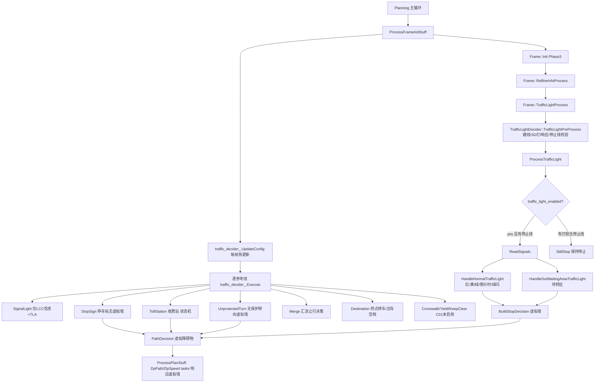

# 子模块3：traffic_rules 与 traffic_light_decider 交通规则子模块

> 分支基线：perception/planning/driver @ Stable_Master_4.0_new（当前检出）。所有结论附代码证据；推断/未验证均显式标注。

## 1. 子模块定位与职责

交通规则子模块由两部分组成，**分工在当前版本已经发生架构迁移**：

- **traffic_rules**（24 个文件）：`TrafficRule` 抽象基类 + `TrafficDecider` 规则注册/调度器 + 9 类具体规则。输出方式统一为：在参考线上**添加虚拟停车障碍物（virtual stop obstacle）或限速**，即"决策产物是虚拟墙/限速，而非轨迹"。
- **traffic_light_decider**（2 个文件，cpp 3494 行）：`TrafficLightDecider` 红绿灯专项判定器。**红绿灯停车的真正判定逻辑已从 traffic_rules/signal_light.cpp 迁移至此**（signal_light 仅保留轻量壳函数，见 §3.3），由 Frame 持有并驱动。

> 文件路径：/sandbox/planning/planning/traffic_rules/traffic_rule.h  
> 类名：TrafficRule  
> 核心逻辑：
> 
> ```cpp
> class TrafficRule {
>  public:
>   explicit TrafficRule(const deeproute::planning::TrafficRuleConfig &config)
>       : config_(config) { vehicle_param_ = ...GetVehicleConfig().vehicle_param(); }
>   virtual bool ApplyRule(Frame *const frame,
>                          ReferenceLineInfo *const reference_line_info) = 0;
>   void UpdateConfig(const deeproute::planning::TrafficRuleConfig &config) { config_ = config; }
>   static bool is_green_light_;           // 静态绿灯标志（供 UnprotectedTurn 等读取）
>  protected:
>   deeproute::planning::TrafficRuleConfig config_;
>   deeproute::common::VehicleParam vehicle_param_;
> };
> ```
> 
> 逻辑说明：基类极简——纯虚 `ApplyRule(Frame*, ReferenceLineInfo*)` 是唯一契约；配置为 protobuf（TrafficRuleConfig，rule_id + 子规则开关/参数）。

**规则清单（以 RegisterRules 与配置文件为准）**：

| RuleId | 规则类 | 功能（中文） | C01 启用状态\* |
|-|-|-|-|
| TRAFFIC_LIGHT | SignalLight | 红绿灯（判定逻辑在 TrafficLightDecider） | ✅ enabled=true（子开关 true） |
| CROSSWALK | Crosswalk | 人行横道行人让行/限速 | ⚠️ 顶层 true 但 crosswalk.enabled=false → 不生效 |
| STOP_SIGN | StopSign | 停车标志（停满再走） | ✅ 两级开关均 true |
| YIELD | Yield | 停车让行线 | ❌ enabled=false，且 ApplyRule 全注释 |
| TOLL_STATION | TollStation | 收费站停车取卡 | ✅ 两级开关均 true |
| KEEP_CLEAR | KeepClearZone | 禁停区（网状线） | ❌ enabled=false |
| UNPROTECTED_TURN | UnprotectedTurn | 无保护转向（左转/右转让直行） | ✅ enabled=true |
| MERGE | Merge | 汇流让行 | ✅ enabled=true |
| DESTINATION | Destination | 到达终点停车/选泊车空档 | ✅ enabled=true |
| BACKSIDE_VEHICLE / REFERENCE_LINE_END / REROUTING | 无类 | （配置占位） | ❌ false，且 RegisterRules 不支持，打 WARN |

\* C01 启用状态依据：/sandbox/planning/planning/config/share/traffic_rule_config.jsonnet；C01T/C01 的 planning_internal_C01T_config.jsonnet 直接 `import "traffic_rule_config.jsonnet"` 无车型级覆盖（grep 证据），故 C01 = share 配置。

## 2. 核心类结构与成员变量

### 2.1 TrafficDecider：规则注册与调度

> 文件路径：/sandbox/planning/planning/traffic_rules/traffic_decider.h  
> 类名：TrafficDecider  
> 核心逻辑：
> 
> ```cpp
> class TrafficDecider {
>  public:
>   bool Init(const deeproute::planning::TrafficRuleConfigs &config);
>   bool Execute(Frame *frame, ReferenceLineInfo *reference_line_info);
>   void UpdateConfig(const deeproute::planning::TrafficRuleConfigs &config);
>  private:
>   void RegisterRules();
>   deeproute::planning::TrafficRuleConfigs rule_configs_;
>   std::unordered_map<deeproute::planning::TrafficRuleConfig_RuleId,
>                      std::`unique_ptr<TrafficRule>`, std::`hash<int>`> traffic_rules_;
> };
> ```
> 
> 逻辑说明：容器为 RuleId→规则对象的哈希表；规则对象**只创建一次**（Init 时 traffic_rules\_.empty() 才 RegisterRules），运行期配置变更走 `UpdateConfig()` 原地更新（不重建对象，保留规则内部状态机，如 StopSign 的 stage 状态）。

### 2.2 TrafficLightDecider：红绿灯状态中枢

> 文件路径：/sandbox/planning/planning/traffic_light_decider/traffic_light_decider.h  
> 类名：TrafficLightDecider（成员摘要）  
> 核心逻辑：
> 
> ```cpp
> class TrafficLightDecider {
>  public:
>   bool TrafficLightPreProcess(...);            // 预处理: 建线/3D灯/响应解析/停止线校验
>   bool ProcessTrafficLight(...);               // 主逻辑: 读灯色→决定是否停车
>   bool IsGreenLightStartShouldSwitchDp(...) const; // 绿灯起步是否切 DP
>   bool IsWaitingAreaShouldSwitchDp() const;    // 待转区是否切 DP
>   bool SwitchDpForTrafficLight(...) const;
>   void SerializeMsgToContext(FrameContext* write_frame_context); // 状态落帧上下文
>  private:
>   bool GetInfoRelateToStopLine();              // 停止线 s/距离计算
>   bool ReadSignals();                          // 灯色分发 + 例外短路 + 建停车决策
>   void HandleNormalTrafficLight(...);          // 红绿黄/倒计时/绿闪 分支
>   void HandleOutWaitingAreaTrafficLight(...);  // 待转区(左转待转)分支
>   bool StopForCountdowns(...);                 // 倒计时能否舒适刹停
>   bool GreenBlinkProcess();                    // 绿灯闪烁处理
>   bool BuildStopDecision();                    // 生成虚拟墙
>   std::`shared_ptr<ReferenceLineInfo>` reference_line_info_;
>   deeproute::perception::TrafficLight valid_tl_result_, tl_result_;
>   CachedTrafficLight last_cached_traffic_light_;   // 上一帧缓存(跨帧记忆)
>   WaitingAreaInfo waiting_area_info_;              // 待转区信息
>   // 常量: kFlagYellowLightTime=2.0s, kFlagLongYellowLightTime=6.0s,
>   //       kComfortableDeceleration=2.25, kMaxStopDeceleration=5.0
> };
> ```
> 
> 逻辑说明：该类是**带跨帧记忆的大状态对象**——`last_cached_traffic_light_`（上一帧灯色/倒计时/绿灯起步标志）、`adc_static_frames_`（静止帧计数）、`cached_stopline_tl_status_`（按停止线 id 的灯色缓存）均在 FrameContext 中序列化（`SerializeMsgToContext`），实现跨帧粘滞（viscous）逻辑。规则常量以类内 constexpr 固化。

### 2.3 Frame 与 Planning 的挂接成员

- `Planning::traffic_decider_`（planning.h:646）——traffic_rules 的宿主。
- `Frame::traffic_light_decider_`（frame.h:5048，shared_ptr）——traffic_light_decider 的宿主，`Frame::GetTrafficLightDecider()` 供各模块读取灯色结果（如 signal_light_tla.cpp:25）。

## 3. 核心处理流程与函数调用链（规则的挂接点）

### 3.1 TrafficDecider：配置初始化 + 帧初始化阶段逐参考线执行

> 文件路径：/sandbox/planning/planning/planning_core.cpp  
> 函数名：Planning::InitPlanning()（1942 行附近）  
> 核心逻辑：
> 
> ```cpp
>   reference_line_provider_->Start(major_thread_pool_);
>   traffic_decider_.Init(traffic_rule_configs_);   // ← 规则注册(一次性)
> ```
> 
> 逻辑说明：traffic_rules 在 Planning 初始化（进程级）时注册，早于任何帧处理。

> 文件路径：/sandbox/planning/planning/planning_frame_management.cpp  
> 函数名：Planning::ProcessFrameInitStuff()  
> 核心逻辑：
> 
> ```cpp
>   // update traffic config too.
>   traffic_decider_.UpdateConfig(
>       planning_input_mapper_->selected_traffic_rules_cofig()); // 每帧热更新配置
>   ...
>   for (auto& ref_line_info : frame_->GetEmReferenceLineInfo()) {
>     ref_line_info->set_normal(true);
>     ProcessHpiDestinationPoint(hpi_data, ref_line_info);
>     ref_line_info->set_new_config(planning_input_mapper_->new_config());
>     bool status = traffic_decider_.Execute(frame_.get(), ref_line_info.get()); // ← 主挂接点
>     if (!status) ref_line_info->set_normal(false);
>   }
> ```
> 
> 逻辑说明：**每帧、每条参考线**调用一次 `TrafficDecider::Execute`（VPA/trace 参考线另有两次调用，planning_frame_management.cpp:108-124）；若某规则失败，参考线被标记 `set_normal(false)`（降权/弃用，推断）。执行时序在 Frame::Init 之后、ProcessPlanStuff（planner 执行）之前——规则产出的虚拟墙先于 DP path/speed 优化进入 PathDecision。

> 文件路径：/sandbox/planning/planning/traffic_rules/traffic_decider.cpp  
> 函数名：TrafficDecider::Execute() / RegisterRules()  
> 核心逻辑：
> 
> ```cpp
> bool TrafficDecider::Execute(Frame *frame, ReferenceLineInfo *reference_line_info) {
>   ...
>   for (auto &rule : traffic_rules_) { rule.second->ApplyRule(frame, reference_line_info); }
>   return true;
> }
> void TrafficDecider::RegisterRules() {
>   for (const auto &cfg : rule_configs_.config()) {
>     if (cfg.enabled()) {  // ← 顶层 enabled 才注册
>       switch (cfg.rule_id()) {
>         case ..._TRAFFIC_LIGHT: traffic_rules_[cfg.rule_id()] = std::`make_unique<SignalLight>`(cfg); break;
>         case ..._CROSSWALK:     ... `make_unique<Crosswalk>`(cfg); ...
>         case ..._STOP_SIGN / YIELD / TOLL_STATION / KEEP_CLEAR /
>              UNPROTECTED_TURN / MERGE / DESTINATION: ...
>         default: MLOG(WARN) << "... is not supported.";
>       } } }
> }
> ```
> 
> 逻辑说明：注册 = 按配置逐条 switch-case 构造；`std::unordered_map` 无序遍历意味着**规则间无固定执行顺序**（规则间不依赖执行序，仅共享 ReferenceLineInfo 上的虚拟障碍物列表，推断）。

### 3.2 TrafficLightDecider：Frame 初始化阶段执行 + 虚拟墙落图

> 文件路径：/sandbox/planning/planning/frame/frame_lifecycle.cpp  
> 函数名：Frame::InitCoreInfrastructure()（185 行附近）
> 
> ```cpp
> traffic_light_decider_ = std::`make_shared<TrafficLightDecider>`(traffic_rule_configs);
> ```

> 文件路径：/sandbox/planning/planning/frame/frame_traffic_light.cpp  
> 函数名：Frame::TrafficLightProcess()  
> 核心逻辑：
> 
> ```cpp
> bool Frame::TrafficLightProcess() {
>   std::`vector<common::hdmap::RouteSegments>` segments;
>   reference_line_provider_->GetRouteSegmentsFromLocalRouting(&segments);
>   traffic_light_decider_->TrafficLightPreProcess(tl_response_, GetConstContext().FrameContext(),
>       segments, obstacles_list_, road_mask_decoder_, vehicle_state_,
>       planning_start_point_time_, GetL2StatusType(), planner_config_, IsHighway());
>   traffic_light_decider_->ProcessTrafficLight([this](...){...});
>   ...
>   const auto &tl_virtual_stop_point = traffic_light_decider_->GetVirtualStopPoint();
>   if (tl_virtual_stop_point == nullptr) return true;   // 无需停车
>   for (const auto &ref_line_info : em_reference_line_info_) {
>     AddVirtualStopWallForTrafficLight(virtual_obstacle_id, kFlagStopDistance,
>         *tl_virtual_stop_point, STOP_REASON_SIGNAL, "stop for traffic light",
>         ref_line_info.get());                            // ← 虚拟停车墙落图
>   }
>   return true;
> }
> ```
> 
> 逻辑说明：调用点在 `Frame::ReflineInfoProcess()`（frame_init_utils.cpp:125，场景检测之后）；判定结果以**虚拟停止墙**（STOP_REASON_SIGNAL，距离 1m buffer）加入**所有参考线**的 PathDecision，后续 ST/速度优化天然响应。

### 3.3 SignalLight 规则的实际职责（架构迁移痕迹）

> 文件路径：/sandbox/planning/planning/traffic_rules/signal_light.cpp  
> 函数名：SignalLight::ApplyRule()  
> 核心逻辑：
> 
> ```cpp
> bool SignalLight::ApplyRule(Frame *const frame, ReferenceLineInfo *const reference_line_info) {
>   bool traffic_light_enabled = config_.enabled() && config_.traffic_light().enabled();
>   if (!traffic_light_enabled) {
>     SignalLightTLA tla;
>     tla.Display(frame, reference_line_info);   // 规则关闭时仅做 TLA 灯色显示
>   }
>   // For LCC Mode, not considering traffic_light_enabled
>   UpdateLccModeStoplineDis(frame, reference_line_info);  // 更新 LCC 停止线距离
>   return true;   // ← 不构建任何停车决策
> }
> ```
> 
> 逻辑说明：SignalLight 已退化为"LCC 模式停止线信息更新 + TLA 兜底"，红绿灯停车完全由 TrafficLightDecider 承担。这是本子模块最重要的架构结论：**读代码时不要被 signal_light.cpp 的文件名误导**。

### 3.4 Mermaid 全景流程



## 4. 核心算法入口与关键逻辑（核心规则深入）

### 4.1 HandleNormalTrafficLight：红绿灯主判定（最核心）

> 文件路径：/sandbox/planning/planning/traffic_light_decider/traffic_light_decider.cpp  
> 函数名：TrafficLightDecider::HandleNormalTrafficLight()  
> 核心逻辑：
> 
> ```cpp
> if (tl_result.color() == TrafficLight::GREEN) {
>   if (ValidCountDowns(tl_result)) {                       // 绿灯带倒计时
>     // 倒计时+黄灯时长2s 内无法通过 → 提前减速停车
>     if (StopForCountdowns(tl_result.color(), tl_result.countdowns() + kFlagYellowLightTime)) {
>       *build_stop_decision = true; signal_light_stop_reason_ = COUNTDOWNS; return; }
>     // 上一帧已因倒计时停车 → 粘滞保持停车
>     if (last_stop_reason == COUNTDOWNS) { *build_stop_decision = true; return; }
>   } else if (tl_result.blink()) {                         // 绿灯闪烁
>     bool make_stop_decision = GreenBlinkProcess();        // 按舒适刹停距离判断
>     green_blink_stop_decision_ = make_stop_decision;      // 决策缓存 2s 粘滞
>     *build_stop_decision = make_stop_decision; return;
>   } else { *build_stop_decision = false; return; }        // 正常绿灯通过
> }
> if (tl_result.color() == TrafficLight::YELLOW) {
>   constexpr double kFlagYellowDelayTime = 0.5;
>   if (ValidCountDowns(tl_result)) {                       // 黄灯倒计时-0.5s 判停
>     if (StopForCountdowns(tl_result.color(), tl_result.countdowns() - kFlagYellowDelayTime)) {
>       *build_stop_decision = true; signal_light_stop_reason_ = GREEN_TO_YELLOW; return; }
>     pass_yellow_light_decision_ = true; return;           // 判定冲黄灯
>   }
>   ... // 闪黄(keep_time>6s 且灯真实)放行; 红灯前静止(pre_light_red&&adc_static)保持红灯决策;
>       // pre_light_green 时按 2s 黄灯窗口倒计时判停, 否则 pass_yellow
> }
> if (tl_result.color() == TrafficLight::RED) {
>   *build_stop_decision = true;                            // 红灯必停
>   constexpr int kRedCountdownStartThreshold = 3;
>   // 红灯倒计时<3s → 撤销虚拟墙允许提前起步(倒计时0不允许);
>   if (tl_result.has_countdowns() && tl_result.countdowns() > 0 &&
>       tl_result.countdowns() < kRedCountdownStartThreshold &&
>       AllowRedCountdownStartByShape(tl_result.countdowns())) {
>     *build_stop_decision = false; signal_light_stop_reason_ = COUNTDOWNS; return; }
>   ...
> }
> ```
> 
> 逻辑说明：判定树要点——**绿灯**：无倒计时直接通过；带倒计时则"倒计时+2s 黄灯窗口"内能否舒适刹停（`StopForCountdowns` 按舒适减速度 2.25 m/s² 反算）决定减速或通过；绿闪走独立分支并缓存决策 2s。**黄灯**：倒计时模式 -0.5s 容差判停，否则区分"由绿转黄（按 2s 窗口判停）"与"长闪黄（>6s 视为持续黄闪放行）"；`pre_light_red && adc_static` 时保持红灯停止状态。**红灯**：一律停车，唯一豁免是"感知红灯倒计时 <3s 且灯形允许"（四方向箭头灯≥2 或箭头+圆盘混合时收紧为 1s，`AllowRedCountdownStartByShape`，注释指明阈值可在 traffic_rule_config.jsonnet 配置）。所有分支产出 `SignalLightStopReason`，供调试与 DP 切换判断（`SwitchDpForTrafficLight`）。

### 4.2 TrafficLightPreProcess：灯组-车道匹配与停止线有效性

> 文件路径：/sandbox/planning/planning/traffic_light_decider/traffic_light_decider.cpp  
> 函数名：TrafficLightDecider::TrafficLightPreProcess()  
> 核心逻辑：
> 
> ```cpp
>   last_cached_traffic_light_.CopyFrom(frame_context.cached_traffic_light()); // 跨帧缓存装载
>   if (!CreateTrafficLightReferenceLine(segments, obstacles_list, vehicle_state, em_planner_config))
>     return false;                                  // 用 local routing 段建独立参考线
>   if (!ProcessTrafficLight3DInfo(em_planner_config)) MLOG(WARN)...; // 3D 灯信息
>   if (!ProcessTrafficLightResponse(tl_response)) return false;      // 感知灯响应解析
>   bool has_valid_stop_line = GetValidStopLine(&stop_line_id, &stop_line_s);
>   bool cache_valid = IsTrafficLightCacheValid(has_valid_stop_line, &stop_line_id, &stop_line_s);
>   ...
>   deeproute::map::LaneTurn lane_turn = LaneTurn::INVALID;
>   if (l2_type == L2StatusType::L2_NCA && traffic_light_mp_vaild && mp_stopline.traffic_type_size()==1)
>     lane_turn = TrafficLightTrafficTypeToLaneTurn(mp_stopline.traffic_type(0)); // MP 停止线直取
>   else if (!GetCurTurnType(l2_type, has_valid_stop_line, stop_line_id<0, cache_valid, stop_line_s, &lane_turn)) {
>     has_valid_stop_line = false; cache_valid = false; ... }  // 转向与停止线失配→作废
>   deeproute::perception::TrafficLightType tl_type = TrafficLightLaneTurnToTrafficType(lane_turn);
>   if (tl_type != UNKNOWN && cur_tl_response_map_.count(tl_type)) tl_result.CopyFrom(cur_tl_response_map_.at(tl_type));
>   else { tl_result.CopyFrom(cur_tl_response_map_[FORWARD]); tl_succeed_to_link_lane = false; } // 兜底取直行灯
> ```
> 
> 逻辑说明：预处理回答"该看哪盏灯"：由转向类型（直行/左转/右转/掉头）匹配感知灯组 `cur_tl_response_map_`；NCA 模式优先用红绿灯 MP（MpStopline）的单转向信息；转向-停止线失配时整体作废（保守降级到取直行灯并标记 `tl_succeed_to_link_lane=false`）。`ReadSignals()` 中的三类例外短路同样在此层语义下：收费站附近不停车（`DISABLE_IN_TOLL_AREA`）、高速停止线与路口不匹配不停车（`DISABLE_IN_HIGHWAY`）、红绿灯 MP 忽略（`DISABLE_BY_TRAFFIC_LIGHT_MP`）。

### 4.3 StopSign：停车标志"停满再走"状态机

> 文件路径：/sandbox/planning/planning/traffic_rules/stop_sign.cpp  
> 函数名：StopSign::MakeDecisions()  
> 核心逻辑：
> 
> ```cpp
>   const std::`vector<OverlapPtr>` &stop_sign_overlaps =
>       reference_line_info->GetOverlapArrayByType(OverlapType::OVERLAP_TYPE_STOP_LINE_STOP_SIGN);
>   for (const auto &stop_sign_overlap : stop_sign_overlaps) {
>     const double adc_to_stop_line_distance = stop_sign_overlap->s_begin - adc_front_edge_s;
>     constexpr common::TimeSecond kFlagWaitStopTime = 10.0;
>     if (stopsign_status_.done_stop_sign_overlap_id != stop_sign_overlap->element_id) {
>       build_stop_decision = true;
>       if (adc_to_stop_line_distance < 0.0 || adc_to_stop_line_distance > 25.0) {
>         build_stop_decision = false; continue; }        // 已过线或 >25m 不处理
>       switch (stopsign_status_.stage_index) {
>         case StageIndex::UNKNOWN: stopsign_status_.Update(vs_timestamp, StageIndex::STOP); break;
>         case StageIndex::STOP:
>           if ((ToSecond(vs_timestamp - stopsign_status_.stage_start_time) > kFlagWaitStopTime) &&
>               frame->GetVehicleState().speed() < kStaticAdcSpeedThreshold) {
>             stopsign_status_.Clear();
>             stopsign_status_.done_stop_sign_overlap_id = stop_sign_overlap->element_id; // 标记完成
>             build_stop_decision = false;
>           } else { /* keep stop decision */ }
>           break; } }
>     if (build_stop_decision)
>       Renderer::AddVirtualStopObstacle(virtual_obstacle_id, stop_sign_overlap->s_begin, 0.0,
>           STOP_REASON_STOP_SIGN, RuleId_Name(config_.rule_id()), frame, reference_line_info);
>   }
> ```
> 
> 逻辑说明：**进入** = 前方 25m 内存在 STOP_SIGN 停止线重叠（overlap）；**退出** = 在停止线后静止（speed < 静止阈值）累计超过 10s，且以 `done_stop_sign_overlap_id` 记忆"该停止线已完成"防止重复停车。产物为 `STOP_REASON_STOP_SIGN` 虚拟墙。规则对象内 stage 状态跨帧存活（TrafficDecider 只 Init 一次，见 §2.1）。

### 4.4 TollStation：收费站三阶段状态机 + 杆检测

> 文件路径：/sandbox/planning/planning/traffic_rules/toll_station.cpp  
> 函数名：TollStation::MakeDecisions() / PoleDetection()  
> 核心逻辑：
> 
> ```cpp
>   constexpr double kFlagTollStationConsiderRange = 35.0;
>   if (adc_to_stop_line_distance < 0.0 || adc_to_stop_line_distance > 35.0) { ...Clear; return; }
>   const bool has_lead_vehicle = TrafficRulesHelper::CheckAdcHasLeadVehicle(...);
>   const bool pole_detected = PoleDetection(reference_line_info, toll_station_overlap);
>   switch (toll_station_status_.stage_index) {
>     case StageIndex::UNKNOWN:  // 自车静止且无前车 → 进入 STOP
>       if (frame->GetVehicleState().speed() < kStaticAdcSpeedThreshold && !has_lead_vehicle)
>         toll_station_status_.Update(seconds, StageIndex::STOP);
>       break;
>     case StageIndex::STOP:     // 停满 pre_stop_time(3s) 且杆未抬起 → CREEP
>       if ((seconds - toll_station_status_.stage_start_time > config_.toll_station().pre_stop_time())
>           && !pole_detected)
>         toll_station_status_.Update(seconds, StageIndex::CREEP);
>       break;
>     case StageIndex::CREEP:    // CREEP 超 after_stop_time(3s) → 完成
>       if (seconds - toll_station_status_.stage_start_time > config_.toll_station().after_stop_time()) {
>         toll_station_status_.Clear();
>         toll_station_status_.done_toll_station_overlap_id = toll_station_overlap->element_id;
>         build_stop_decision = false; } break; }
>   if (build_stop_decision) Renderer::AddVirtualStopObstacle(..., STOP_REASON_TOLL_STATION, ...);
> // PoleDetection: 收费站多边形内存在 UNKNOWN_UNMOVABLE 障碍物 → 视为杆(未抬)
> ```
> 
> 逻辑说明：**进入** = 前方 35m 内出现收费广场重叠；**状态机** = 停车（等待抬杆）→ 杆抬起（多边形内 UNKNOWN_UNMOVABLE 消失，PoleDetection 返回 false）蠕行 → 3s 后完成并记忆 overlap id。若前方有领航车（has_lead_vehicle），不进入 STOP（跟随即可，推断为避免跟车误停）。

### 4.5 Destination：终点选位与停车（摘要）

> 文件路径：/sandbox/planning/planning/traffic_rules/destination.cpp  
> 函数名：Destination::MakeDecisions()  
> 核心逻辑（关键分支摘要）：
> 
> ```cpp
>   SlowDownNearDestination(reference_line_info);            // 终点前限速(所有参考线)
>   if (!reference_line_info->IsMainRoute()) return false;   // 仅主路参考线
>   if (manual模式 || 距终点 > config.search_distance(300m)) return false;
>   if (已到达终点) return AddDestinationStop(..., adc_end_s); // 原地停车
>   if (vpa_driving_) { ...VPA 目标点跳变平滑制动; AddRampSpeedLimit(...); }
>   if (!CheckLastSelectedGap(...)) {                        // 泊车空档搜索
>     ConstructIllegalAreas(reference_line_info);            // 路口/人行横道/禁停区=非法区
>     CalculateParkingGaps(reference_line_info);             // 计算可行空档
>     if (parking_gaps_.empty()) AddDoubleParkingStop(...);  // 无空档→双闪停车线
>     RankAndPickBestGap(); }
> ```
> 
> 逻辑说明：终点规则同时承担"限速 + 选停车空档 + 终点停车墙"三件事，最小/最优空档长度按车长自适应修正（构造函数：`minimum_gap_length_ + (车长 - baseline_length)`）。C01 启用（enabled=true）。

### 4.6 已停用/迁移规则的现状（防误读）

- **Yield**：traffic_rules/yield.cpp 的 ApplyRule **主体全部被注释**，函数直接 `return true`；配置层 enabled=false。历史逻辑（25m 停车、10m 让行 fence）仅存于注释。
- **Crosswalk**：规则类实现完整（1826 行：行人检测、跨参考线限速、stitching 越线判断等），但 C01 配置 `crosswalk.enabled=false` 使 ApplyRule 首行短路（`if (!config_.crosswalk().enabled()) return false;`）。**规则代码在库但车型未启用**。
- **KeepClearZone**：实现完整（网状线内静止前车 → 停墙），配置 enabled=false 未启用。
- **UnprotectedTurn**：启用中。核心条件：路口有灯且 `is_green_light_`（读静态 `TrafficRule::is_green_light_`，由 SignalLight 域外更新，推断）时，自车处于无保护转向车道且对向/交叉来车未清空 → 在冲突点前加虚拟墙（AddStopForUnprotectedTurn）。

## 5. 输入输出数据结构

| 组件 | 输入 | 输出 |
|-|-|-|
| TrafficDecider | `TrafficRuleConfigs`（protobuf，Init/UpdateConfig）；每帧 `Frame*` + `ReferenceLineInfo*` | 修改 ReferenceLineInfo：`PathDecision` 增加虚拟障碍物与纵向 Stop 决策（Renderer::AddVirtualStopObstacle）；`ReferenceLine` 增加速率限制（AddSpeedLimit）；规则对象内部状态机跨帧保持 |
| TrafficLightDecider | `TrafficLightResponse`（感知灯色+倒计时+多灯组）、`FrameContext`（上一帧缓存/拓扑）、`RouteSegments`（local routing）、`obstacles_list`、`VehicleState`、`EMPlannerConfig`、`l2_type`、`is_highway` | `GetVirtualStopPoint()`（虚拟墙点位）→ Frame 加 `STOP_REASON_SIGNAL` 虚拟墙；`GetValidTrafficLightResult()` 等全套 Getter（供 TLA、DP 切换、文言信号）；`SerializeMsgToContext()` 写回 FrameContext 供下一帧 |
| SignalLight（壳） | Frame + ReferenceLineInfo | LCC 停止线 id/距离/点（`SetLCCModeStopLine*`）；TLA 时更新 TrafficLightDecider 的灯色结果 |

**关键下游**：虚拟墙进入 `PathDecision::AddLongitudinalDecision` 后，由 tasks 侧 ST 图（st_graph）与 DP/QP 速度优化消费（属其他子Agent范围）。TrafficLightDecider 另向模式切换输出 `IsGreenLightStartShouldSwitchDp / IsWaitingAreaShouldSwitchDp / IsStopShouldSwitchDp / SwitchDpForTrafficLight`（绿灯起步 1s 内未达 0.5m/s、待转区内、刹停场景 → 触发 DP 重规划，注释见 traffic_light_decider.h:92-100）。

## 6. 代码证据与关键片段（补充）

**片段1：ReadSignals 的例外短路链（停车豁免优先级）**

> 文件路径：/sandbox/planning/planning/traffic_light_decider/traffic_light_decider.cpp  
> 函数名：TrafficLightDecider::ReadSignals()
> 
> ```cpp
>   if (!arrived_waiting_area_ignore_tl_) {
>     if (use_in_waiting_area_tl_ && FindWaitingAreaStopLine(&stop_point, &stop_line_id))
>       HandleOutWaitingAreaTrafficLight(stop_point, stop_line_id, &build_stop_decision);
>     else HandleNormalTrafficLight(tl_result, &build_stop_decision);
>   }
>   if (IsCloseToToll()) { build_stop_decision = false;   // 收费站附近不按灯停
>     signal_light_stop_reason_ = DISABLE_IN_TOLL_AREA; }
>   if (is_highway_ && !TrafficLightIsStoplineMatchCrossing(adc_to_stop_line_distance_)) {
>     build_stop_decision = false;                        // 高速停止线-路口失配
>     signal_light_stop_reason_ = DISABLE_IN_HIGHWAY; }
>   if (GetTrafficLightMpIgnoreStopline()) { build_stop_decision = false;  // MP 指示忽略
>     signal_light_stop_reason_ = DISABLE_BY_TRAFFIC_LIGHT_MP; }
>   ...
>   traffic_light_build_stop_decision_ = build_stop_decision;
>   if (build_stop_decision) return BuildStopDecision();
> ```
> 
> 逻辑说明：待转区分支优先于普通灯色处理；收费站/高速失配/MP 忽略三类豁免短路在前，任一命中即撤销停车决策。原因码全量落 Debug。

**片段2：绿灯起步能力检查（切 DP 触发）**

> 文件路径：/sandbox/planning/planning/traffic_light_decider/traffic_light_decider.cpp  
> 函数名：TrafficLightDecider::IsGreenLightStartShouldSwitchDp()
> 
> ```cpp
>   //（头注释）绿灯起步能力检查：若自车为头车且绿灯，speed data 在 1s 内
>   // 未提速到 0.5m/s，则返回 true
> ```
> 
> 逻辑说明：与 `IsWaitingAreaShouldSwitchDp`、`IsStopShouldSwitchDp` 一起构成 `SwitchDpForTrafficLight`，用于交通灯相关场景触发 DP（动态规划）重新求解——红绿灯模块对规划器模式有反向控制（推断：经 planning_frame_management 的 DP/MP 切换流程消费）。

**片段3：虚拟墙落图统一出口**

> 文件路径：/sandbox/planning/planning/frame/frame_traffic_light.cpp  
> 函数名：Frame::AddVirtualStopWallForTrafficLight()
> 
> ```cpp
>   ObjectDecisionType stop;
>   auto *stop_decision = stop.mutable_stop();
>   stop_decision->set_reason_code(stop_reason_code);         // STOP_REASON_SIGNAL
>   stop_decision->set_distance_s(-stop_distance);            // -1.0m buffer
>   stop_decision->mutable_stop_point()->set_x(stop_point.x);
>   ...
>   path_decision->AddLongitudinalDecision(decision_tag, stop_wall_id, stop);
> ```
> 
> 逻辑说明：红绿灯停车墙 = "参考线上挂虚拟障碍物 + 纵向 Stop 决策"双重写入，虚拟障碍物供 ST 边界计算，Stop 决策供速度优化直接响应。

**片段4：规则配置热更新路径（不重建规则对象）**

> 文件路径：/sandbox/planning/planning/traffic_rules/traffic_decider.cpp  
> 函数名：TrafficDecider::UpdateConfig()
> 
> ```cpp
> void TrafficDecider::UpdateConfig(const deeproute::planning::TrafficRuleConfigs &config) {
>   rule_configs_ = config;
>   for (const auto &cfg : rule_configs_.config())
>     for (auto &rule : traffic_rules_) {
>       if (rule.first != cfg.rule_id()) continue;
>       rule.second->UpdateConfig(cfg);     // 仅更新已有规则对象配置
>     }
> }
> ```
> 
> 逻辑说明：每帧 `selected_traffic_rules_cofig()` 变化可即时生效；因不重建对象，StopSign/TollStation 的跨帧 stage 状态不丢失（与 §2.1 结论互证）。

**片段5：TLA 灯色选择与 3 帧缓存**

> 文件路径：/sandbox/planning/planning/traffic_rules/signal_light_tla.cpp  
> 函数名：SignalLightTLA::Display()
> 
> ```cpp
>   // 由 local routing 转向 / 车道标线(直行>左转>右转) 确定应看灯组类型
>   if (has_straight) lane_turn_ = LaneTurn::STRAIGHT;
>   else if (has_left) lane_turn_ = LaneTurn::LEFT;
>   else if (has_right) lane_turn_ = LaneTurn::RIGHT;
>   traffic_light_decider->SetTlaLaneMarkInfo(adc_lane_id, lane_turn_);
>   // 目标灯组无结果/UNKNOWN 时, 用上一帧缓存灯色, 最多缓存 3 次
>   if (cure_response_map.count(traffic_light_type) == 0 ||
>       cure_response_map[traffic_light_type].color() == TrafficLight::UNKNOWN) {
>     if (cached_traffic_light.tla_cache_times() < 3 &&
>         cached_traffic_light.cached_tl_result().traffic_type() == traffic_light_type) {
>       use_cached = true;
>       traffic_light_decider->SetTrafficLightResult(cached_traffic_light.cached_tl_result());
>       traffic_light_decider->SetCacheTlaCount(cached_traffic_light.tla_cache_times() + 1); } }
> ```
> 
> 逻辑说明：TLA（Traffic Light Assignment，灯组分配）解决"多灯组路口看哪盏灯"；感知缺失时以缓存灯色粘滞 3 帧（约 0.3s@10Hz，推断）防抖。

**片段6：SpeedCaution 与收费站限速联动（traffic_rules ↔ scene_decider 交叉点）**

> 文件路径：/sandbox/planning/planning/tasks/dp_speed/dp_speed_optimizer.cpp  
> 函数名：DpSpeedOptimizer::Execute()（309-315 行）
> 
> ```cpp
>     if (!area_info_close_to_toll_area &&
>         speed_caution_scene_decider->IsNarrowScene()) {
>       close_to_toll_area = true;
>       MLOG(WARN) << "[dp_speed] Reset close to toll area flag and limit the max "
>                     "acceleration since narrow scene!";
>     }
> ```
> 
> 逻辑说明：scene_decider 的窄道判定可覆盖"临近收费站"标志，限制加速度——两子模块在 DpSpeed 汇聚，是二者的主要交互点之一。
