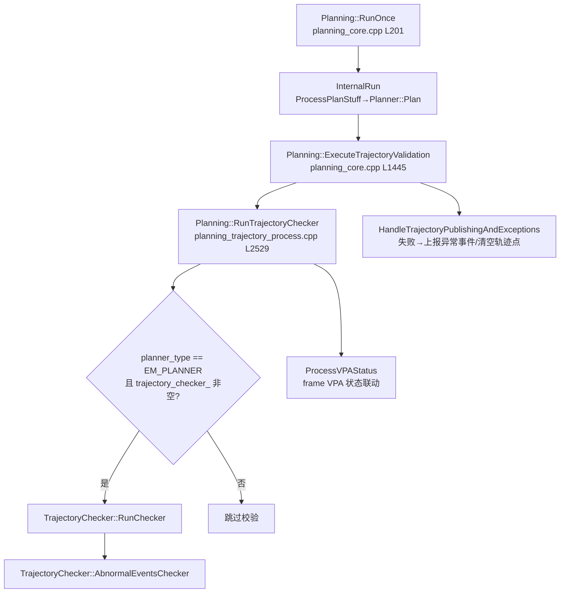

# 子模块4：trajectory_checker 轨迹校验子模块

> 分析对象：/sandbox/planning/planning/trajectory_checker（9 文件：trajectory_checker.h/.cpp、safety_checker.h/.cpp、safety_checker_utils.h/.cpp、BUILD.bazel、CMakeLists.txt、trajectory_checker_test/ 目录）  
> 分支基线：Stable_Master_4.0_new（当前检出即目标分支）

## 1. 子模块定位与职责

trajectory_checker 是规划主进程内**最后一道独立安全防线**：不参与轨迹生成，只在每帧规划输出 `ADCTrajectory` 之后、发布给控制之前，对**最终下发轨迹**做可行性/碰撞/可控性复检。它独立于 EmPlanner 任务链（tasks/trajectory_safety 是任务链内的"代价型"安全检查，本模块是任务链外"门卫型"硬校验，两者互补）。

模块构成（9 文件，已验证）：

| 文件 | 内容 |
|-|-|
| trajectory_checker.h/.cpp | 主类 `TrajectoryChecker`（269/1736 行）：校验项编排、失败处置、异常事件、调试输出 |
| safety_checker.h/.cpp | 子类 `SafetyChecker`（179/965 行）：NOA-AEB 主动安全动作（碰撞→重算制动速度曲线） |
| safety_checker_utils.h/.cpp | `SafetyChecker` 工具函数（440 行，box/时间同步辅助） |
| trajectory_checker_test/ | 测试目录 |

唯一对外入口是 `TrajectoryChecker::RunChecker()`（trajectory_checker.h L77）与 `AbnormalEventsChecker()`，由 Planning 根类持有（planning.h L629 `std::unique_ptr<TrajectoryChecker> trajectory_checker_`）。

## 2. 核心类结构与成员变量

### 2.1 TrajectoryChecker：结果枚举 + 校验配置 + 状态

> 文件路径：/sandbox/planning/planning/trajectory_checker/trajectory_checker.h  
> 函数名：TrajectoryChecker（类定义 L23-265）  
> 核心逻辑：
> 
> ```cpp
> class TrajectoryChecker {
>  public:
>   enum TRAJECTORY_FEASIBILITY {
>     SUCCESS = 0, UNMOVEABLE_COLLISION = 1, MOVING_OBJ_COLLISION = 2,
>     OFF_LANE = 3, LANE_COLLISION = 4, NOT_CONTROLABLE = 5, NOT_ENOUGH_POINT = 6,
>     PLANNER_FAILED = 7, TRAJECTORY_PERCEPTION_TIME_UNMATCHED = 8,
>     UPSTREAM_MODULE_FAILED = 9, MAP_ERROR = 10, FRONT_MOVING_OBJ_COLLISION = 11,
>     LAT_UNCOMFORTABLE = 12, LON_HARD_BRAKE = 13, WIBBLE_TRAJECTORY = 14,
>     STEER_SHAKING = 15, STEER_JERKY = 16, SAFETY_CHECKER = 17,
>     CHECKER_INTERNAL_FAULT = 101,
>   };
>   enum SECURITY_WARNING_LEVEL { PASS = 0, WARNING_LEVEL1 = 1, ..., WARNING_LEVEL5 = 5 };
>   bool RunChecker(..., deeproute::planning::ADCTrajectory *trajectory,
>                   deeproute::planning::ADCTrajectory *trajectory_bag);
>   void AbnormalEventsChecker(const deeproute::planning::ADCTrajectory *trajectory);
>  private:
>   bool is_traj_feasible_;                 // 本帧总体可行性
>   std::`unordered_set<TRAJECTORY_FEASIBILITY>` trajectory_result_;        // 失败原因集合
>   std::`unordered_set<TRAJECTORY_FEASIBILITY>` trajectory_abnormal_events_; // 事件型（不判失败）
>   std::`unordered_map<TRAJECTORY_FEASIBILITY, TrajectoryDebugInfo>` trajectory_debug_;
>   TrajectoryChecker::SECURITY_WARNING_LEVEL security_warning_level_{PASS};
>   std::`unique_ptr<SafetyChecker>` safety_checker_;
>   std::`vector<common::Box2d>` adc_boxes_;              // 轨迹逐点 ADC 包围盒（含后视镜）
>   std::`vector<common::Box2d>` adc_boxes_without_mirror_; // 去后视镜版（锥筒校验用）
>   deeproute::taskconfig::TrajectoryCheckerConfig checker_config_;
> };
> ```
> 
> 逻辑说明：每个校验项对应一个枚举值；失败写入 `trajectory_result_` 并触发 `FailureHandler`；舒适度/方向盘抖动等只记入 `trajectory_abnormal_events_`（上报事件，不拦截轨迹）。配置来自 `EMPlannerConfig.trajectory_checker_config`（经 PlanningInputMapper 按 L2 状态切换，`UpdateTrajectoryCherkerConfig` 仅在 L2 状态变化时整体重载，trajectory_checker.cpp L1722-1733）。

### 2.2 SafetyChecker：AEB 动作子检查器

> 文件路径：/sandbox/planning/planning/trajectory_checker/safety_checker.h  
> 函数名：SafetyChecker（类定义 L18-176）  
> 核心逻辑：
> 
> ```cpp
> class SafetyChecker {
>  public:
>   bool Init(const deeproute::taskconfig::TrajectorySafetyActionChecker &config);
>   bool UpdateInfo(const deeproute::common::VehicleState &vehicle_state,
>                   const PathDecision *path_decision, const double planning_start_time,
>                   deeproute::planning::ADCTrajectory *trajectory);
>   bool Process(deeproute::planning::ADCTrajectory *output_trajectory);
>  private:
>   bool CollisionCheck(ObstacleId obj_id);      // 逐障碍物预测轨迹碰撞
>   bool BrakeDecision(bool is_collied);         // ttc/dtc + 连续帧计数 → 触发
>   bool RegenerateSpeedPath(...);               // 碰撞时重新生成制动速度曲线
>   bool CombinePathAndSpeedProfile(...);        // 重合成输出轨迹
>   int32_t aeb_counter_ = 0;                    // 连续碰撞帧计数（外部只能减）
>   double brake_dist_ = 0.0; double ttc_ = 0.0; double dtc_ = 0.0;
>   bool is_trigger_ = false;                    // 外部只能置 false
> };
> ```
> 
> 逻辑说明：`aeb_counter_`/`is_trigger_` 的注释明确"外部只能减 counter，不能加"，防止误置位；触发需连续多帧碰撞计数超过 `aeb_counter_thres`（BrakeDecision，safety_checker.cpp L312-331），实现防抖。

## 3. 核心处理流程与调用链

### 3.1 被谁调用（上行）



> 文件路径：/sandbox/planning/planning/planning_trajectory_process.cpp  
> 函数名：Planning::RunTrajectoryChecker（L2529-2580）  
> 核心逻辑：
> 
> ```cpp
> bool is_em_planner = (planner_->planner_type() == PlannerType::EM_PLANNER);
> const bool use_parking_model_object = frame_->GetHpiData().vpa_driving_;
> if (is_em_planner && trajectory_checker_) {
>   trajectory_passed_checker = trajectory_checker_->RunChecker(
>       vehicle_state, perception_obstacles,
>       frame_->selected_reference_line_info()->GetPathDecision(),
>       planning_input_mapper_, use_parking_model_object,
>       visibility_map_->upstream_camera_status(), stitch_time, run_success,
>       trajectory_obj, trajectory_bag);
>   if (trajectory_checker_->HasInternalFault()) {
>     trajectory_passed_checker = true;   // 检查器自身故障时放行（降级）
>   }
>   trajectory_checker_->AbnormalEventsChecker(trajectory_obj);
> }
> ```
> 
> 逻辑说明：**只有 EM_PLANNER 走本模块**（OpenSpace/ReverseTracking 不校验，未验证其替代机制）。输入 `upstream_module_status` 取自上游相机状态（visibility_map\_），`stitch_time` 取自缝合点调试信息。实例化在 Planning 初始化中（planning_misc_utils.cpp L1255，`make_unique<TrajectoryChecker>(vehicle_config, selected_planner_config.trajectory_checker_config(), planning_config.abnormal_event_config())`）。

### 3.2 RunChecker 校验编排（内部顺序）

> 文件路径：/sandbox/planning/planning/trajectory_checker/trajectory_checker.cpp  
> 函数名：TrajectoryChecker::RunChecker（L34-192）  
> 核心逻辑：
> 
> ```cpp
> is_traj_feasible_ = true;
> trajectory->mutable_checker_result()->set_checker_failed(false);
> // critical checks：失败即 return false，立即终止
> if (checker_config_.enable_point_size_check()) {
>   if (!TrajectorySizeCheck(trajectory)) {
>     if (vehicle_state.velocity_flu().x() < kStopSpeedThres) {   // 0.1 m/s
>       FillStopSpeedIntoTrajectory(...);   // 低速时补停车轨迹
>     }
>     return false;
>   }
> }
> GetTrajectoryLaneIds(trajectory);
> if (!ConstructAdcBoxes(trajectory)) { FailureHandler(CHECKER_INTERNAL_FAULT, ...); return false; }
> if (!GetInitvelAndAcc(trajectory))  { FailureHandler(CHECKER_INTERNAL_FAULT, ...); return false; }
> if (!run_success) { /* 规划本身失败 */ FailureHandler(PLANNER_FAILED, true, kDefaultBrakingAccel, true, trajectory); return false; }
> if (checker_config_.enable_traj_perception_time_match_check() &&
>     !TrajectoryPerceptionTimeMatchCheck(perception_obstacles, trajectory)) return false;
> if (checker_config_.enable_controlable_check()) {
>   if (!ControlableCheck(vehicle_state, trajectory)) return false;
> }
> // non-critical checker：失败继续跑完，收集全部失败原因
> if (checker_config_.enable_upstream_module_failure_handle())
>   UpstreamModuleFailureHandle(upstream_module_status, trajectory);
> if (checker_config_.enable_unmoveable_check())
>   UnmoveableCollisionCheck(perception_obstacles, use_parking_model_object, trajectory);
> if (checker_config_.enable_moving_obj_check())
>   MovingObjectCollisionChecker(perception_obstacles, trajectory);
> if (checker_config_.enable_off_lane_check())       OffLaneChecker(trajectory);
> if (checker_config_.enable_lane_collision_check()) LaneCollisionChecker(trajectory);
> if (checker_config_.security_warning_config().enable_security_warning())
>   SteeringWheelChecker(vehicle_state);
> // SafetyChecker（NOA-AEB）：触发时原地改写轨迹
> if (checker_config_.trajectory_safety_action_checker().enable() && ...) {
>   if (safety_checker_->UpdateInfo(...)) {
>     if (safety_checker_->Process(trajectory)) {
>       trajectory_abnormal_events_.insert(SAFETY_CHECKER);
>       FailureHandler(SAFETY_CHECKER, false, 0.0, false, trajectory);
>     }
>   }
> }
> return is_traj_feasible_;
> ```
> 
> 逻辑说明：校验分**critical**（点数/规划失败/时戳失配/可控性，失败即刻返回）与**non-critical**（各类碰撞/出车道/车道线碰撞，跑完全部以收集完整失败原因集合）。每项是否启用由 `checker_config_` 开关控制（按 L2 状态配置）。

## 4. 校验项清单与关键逻辑（以代码为准）

| 校验项 | 枚举 | 类型 | 失败处置 |
|-|-|-|-|
| 点数检查 TrajectorySizeCheck | NOT_ENOUGH_POINT | critical | 清空轨迹点；车速<0.1m/s 时改填全 0 停车轨迹（trajectory_type=COMBINE_PATH_SPEED_FAILED，brake_acc=-1.0） |
| 规划失败透传 | PLANNER_FAILED | critical | set_checker_fail=true、清空轨迹点、默认制动减速度 |
| 感知-轨迹时戳匹配 | TRAJECTORY_PERCEPTION_TIME_UNMATCHED | critical | FailureHandler |
| 可控性 ControlableCheck | NOT_CONTROLABLE | critical | kappa/theta_rate/dkappa/纵向/位置连续性计数超 15 帧即失败，**清空轨迹点** |
| 上游模块状态 | UPSTREAM_MODULE_FAILED | non-critical | 记录，由上层联动 |
| 静止物碰撞 UnmoveableCollisionCheck | UNMOVEABLE_COLLISION | non-critical | checker_failed=true + 依 s 位置查表制动减速度 |
| 动态物碰撞 MovingObjectCollisionChecker | MOVING_OBJ_COLLISION | non-critical | 同上 |
| 出车道 OffLaneChecker | OFF_LANE | non-critical | 同上 |
| 车道线碰撞 LaneCollisionChecker | LANE_COLLISION / MAP_ERROR | non-critical | 连续帧 buffer 超限才判失败；地图异常时记 MAP_ERROR |
| 方向盘抖动/画龙 SteeringWheelChecker | STEER_SHAKING / STEER_JERKY（安全告警级别） | non-critical | 记入 security_warning_level\_ |
| 前向动态物/横摆不适/急刹 AbnormalEventsChecker | FRONT_MOVING_OBJ_COLLISION / LAT_UNCOMFORTABLE / LON_HARD_BRAKE | 事件型 | 仅上报，不改轨迹 |
| NOA-AEB SafetyChecker | SAFETY_CHECKER | 动作型 | **改写轨迹**为制动曲线 |

### 4.1 碰撞类校验证据（UnmoveableCollisionCheck）

> 文件路径：/sandbox/planning/planning/trajectory_checker/trajectory_checker.cpp  
> 函数名：TrajectoryChecker::UnmoveableCollisionCheck（L653-794）  
> 核心逻辑：
> 
> ```cpp
> for (const auto &obj : perception_objs) {
>   if (obj.predictions_size() == 0) {                 // 无预测 ⇒ 视为静止物
>     if (obj.tracking_time() < kUnmovableObjectTrackingTime) continue;
>     // 过滤：开启的闸机、VPA 超声波物、减速带、盲区低置信物等
>     unmove_obj_boxes.emplace_back(Point2d(obj.position().x(), obj.position().y()),
>                                   obj.theta(), obj.length(), obj.width(), false);
>   }
> }
> for (int index = 0; index < trajectory->trajectory_point_size(); ++index) {
>   const auto &cur_traj_point = trajectory->trajectory_point(index);
>   if (!IsPointDownSampledTarget(cur_traj_point.relative_time(), planning_start_time_,
>           kPlanningTimeResolution,
>           checker_config_.unmoveable_collision_check_time() / 1000.0)) continue;
>   // 锥筒用去后视镜 box，其余用完整 box
>   const common::Box2d &adc_box_for_check =
>       (obj_types[obj_index] == TRAFFIC_CONE) ? adc_boxes_without_mirror_[index]
>                                              : adc_boxes_[index];
>   if (adc_box_for_check.HasOverlap(*obj_box)) {
>     FailureHandler(UNMOVEABLE_COLLISION, true,
>                    GetBrakeAcc(cur_traj_point.path_point().s()), false, trajectory);
>     return false;
>   }
> }
> ```
> 
> 逻辑说明：静止物碰撞按**时间窗降采样**逐点建 ADC 包围盒与障碍物 box 做重叠判定；`GetBrakeAcc(s)` 按碰撞点纵向位置插值出合理制动减速度写进 `checker_result().brake_acc` 供控制降级参考。

### 4.2 可控性校验证据（ControlableCheck）

> 文件路径：/sandbox/planning/planning/trajectory_checker/trajectory_checker.cpp  
> 函数名：TrajectoryChecker::ControlableCheck（L1373-1444）  
> 核心逻辑：
> 
> ```cpp
> const int kMaxFailCntBuffer = 15;
> for (int index = 0; index < trajectory->trajectory_point_size(); ++index) {
>   if (cur_traj_point.relative_time() >= checker_config_.controlable_checker_time_length()) break;
>   if (KappaCheckFailCnt(vehicle_state, cur_traj_point, &kappa_failed_cnt) >= kMaxFailCntBuffer) {
>     is_controlable = false; break;
>   }
>   // 逐对相邻点：theta 变化率、kappa 变化率(dkappa)、纵向 LonCheckFailCnt、位置连续 isPosCheckPass
> }
> if (!is_controlable) {
>   FailureHandler(NOT_CONTROLABLE, true,
>                  GetBrakeAcc(traj_point_last_uncontrollable_point.path_point().s()),
>                  true /* clear_trajectory_points */, trajectory);
> }
> ```
> 
> 逻辑说明：对规划时域内轨迹点做曲率、航向变化率、曲率变化率、纵向一致性（v/a 跳变）与位置连续性检查，各计数器连续失败≥15 点才判不可控（抗单点噪声），失败即清空整条轨迹点。

### 4.3 NOA-AEB 动作证据（SafetyChecker::Process）

> 文件路径：/sandbox/planning/planning/trajectory_checker/safety_checker.cpp  
> 函数名：SafetyChecker::Process（L51-77）/ BrakeDecision（L312-331）  
> 核心逻辑：
> 
> ```cpp
> deeproute::planning::ADCTrajectory temp_traj = *output_trajectory;
> if (!RegenerateSpeedPath(&temp_traj)) { DecCounter(); return false; }
> bool is_collied = false;
> for (const auto *obstacle : path_decision_->path_obstacles().Items()) {
>   if (!IsObjFilterPass(obstacle)) continue;
>   is_collied |= CollisionCheck(obstacle->GetId());     // 逐障碍物沿预测轨迹扫掠碰撞
> }
> is_trigger_ = BrakeDecision(is_collied);
> if (is_trigger_) {
>   *output_trajectory = temp_traj;                       // 用重算的制动轨迹替换输出
>   output_trajectory->mutable_vehicle_signal()->set_emergency_light(true);
> }
> return is_trigger_;
> ```
> 
> ```cpp
> bool SafetyChecker::BrakeDecision(bool is_collied) {
>   if (is_collied && ttc_ < safety_checker_config_.ttc_thres() + safety_checker_config_.ttc_buffer()
>       && dtc_ < brake_dist_ + safety_checker_config_.dtc_buffer()) {
>     IncCounter();
>     is_trigger = aeb_counter_ > safety_checker_config_.aeb_counter_thres();
>   } else { DecCounter(); }
>   return is_trigger;
> }
> ```
> 
> 逻辑说明：SafetyChecker 沿每条障碍物预测轨迹做时间对齐碰撞检查，`ttc/dtc/brake_dist` 三条件满足且连续帧计数超阈值才触发；触发后用 `GenerateSpeedProfile→CombinePathAndSpeedProfile` 重新生成减速轨迹并**原地替换输出轨迹**、点亮双闪。这是全模块唯一会"改写"而非"拒绝"轨迹的校验项。

## 5. 失败后果与降级联动

> 文件路径：/sandbox/planning/planning/trajectory_checker/trajectory_checker.cpp + planning_trajectory_process.cpp + planning_core.cpp  
> 函数名：FailureHandler / AddTrajectoryAbnormalEvent / HandleTrajectoryPublishingAndExceptions  
> 核心逻辑（FailureHandler，trajectory_checker.cpp L1706-1720）：
> 
> ```cpp
> void TrajectoryChecker::FailureHandler(const TRAJECTORY_FEASIBILITY &failure_reason,
>                                        bool set_checker_fail, double brake_acc,
>                                        bool clear_trajectory_points,
>                                        deeproute::planning::ADCTrajectory *trajectory) {
>   lane_collision_buffer_ = 0;
>   is_traj_feasible_ = false;
>   trajectory_result_.insert(failure_reason);
>   if (set_checker_fail) {
>     trajectory->mutable_checker_result()->set_checker_failed(true);
>     trajectory->mutable_checker_result()->set_brake_acc(brake_acc);   // 给控制的制动请求
>   }
>   if (clear_trajectory_points) trajectory->mutable_trajectory_point()->Clear();
> }
> ```
> 
> 逻辑说明（联动链，均已验证调用点）：
> 
> 1. **轨迹体内联标记**：`checker_result.checker_failed + brake_acc` 随 ADCTrajectory 下发，控制侧可读取（下游消费方式属 control 模块，未验证）。
> 2. **发布侧拦截**：HandleTrajectoryPublishingAndExceptions（planning_core.cpp L1490-1518） 中 `if (trajectory_checker_ && !trajectory_passed_checker)`：run_success=false 时上报 `PLANNING_OUTPUT_PLANNING_FAILD`，否则 `AddTrajectoryAbnormalEvent()`；且规划失败时直接 `clear_trajectory_point()/clear_path_point()` 不发布轨迹点。
> 3. **异常事件上报**：AddTrajectoryAbnormalEvent（planning_trajectory_process.cpp L1616-1655） 将 UNMOVEABLE_COLLISION→`PLANNING_OUTPUT_UNMOVEABLE_COLLISION`、FRONT_MOVING_OBJ_COLLISION→`PLANNING_OUTPUT_FRONT_MOVING_OBJ_COLLISION`、OFF_LANE→`PLANNING_OUTPUT_OFF_LANE`、NOT_CONTROLABLE→`PLANNING_OUTPUT_NOT_CONTROLABLE`、NOT_ENOUGH_POINT→`PLANNING_OUTPUT_NOT_ENOUGH_POINT`、时戳失配→`PLANNING_OUTPUT_TRAJECTORY_PERCEPTION_TIME_UNMATCHED`、SAFETY_CHECKER→`PLANNING_OUTPUT_TRAJECTORY_SAFETY_ACTION`。
> 4. **VPA 状态联动**：ExecuteTrajectoryValidation（planning_core.cpp L1464）`frame_->ProcessVPAStatus(trajectory_checker_fail_reasons)`（VPA 内部状态机细节属其他子 Agent 边界）。
> 5. **检查器自保护**：`HasInternalFault()`（枚举 101）时 `trajectory_passed_checker=true` 强制放行（RunTrajectoryChecker L2560-2562），避免检查器自身缺陷导致行车中断——"宁放行、不自毙"的降级策略。
> 6. **低速兜底**：点数检查失败且车速<0.1m/s 时用 `FillStopSpeedIntoTrajectory` 生成原地停车轨迹替代（trajectory_checker.cpp L210-254），保证静止场景仍有合法轨迹下发。

## 6. 代码证据与关键片段

见第 3.1、3.2、4.1、4.2、4.3、5 节 6 段带路径/函数名/行号的代码证据（RunTrajectoryChecker 调用点、RunChecker 编排、UnmoveableCollisionCheck、ControlableCheck、SafetyChecker::Process+BrakeDecision、FailureHandler），此处不再重复。

---

## 附：与基线/其他子模块的边界说明

- 与 tasks/trajectory_safety（子模块1 文档 4.5/6.6 节）的关系：前者是任务链内**代价型**安全检查（碰撞→refline 加 FALLBACK 代价→影响选线），本模块是选线与轨迹生成完成后**门卫型**硬校验（碰撞→拦截/改写下发轨迹），两者输入不同（前者 `ReferenceLineInfo`，后者最终 `ADCTrajectory`）。
- platform/church（dev_master）分支差异未比对（未验证）。
