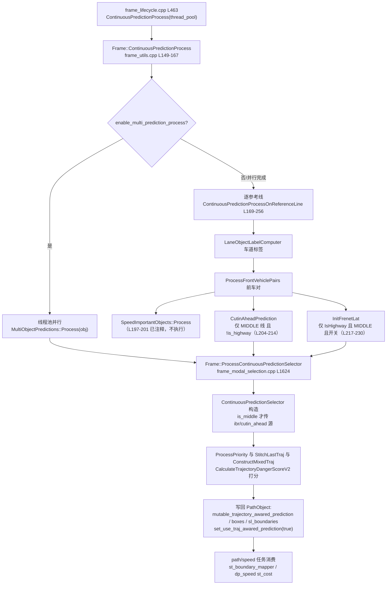

# 子模块6：continuous_object_prediction 目标预测子模块

> 分析对象：`/sandbox/planning/planning/continuous_object_prediction/`（14 文件），关联 Frame 侧调用 `frame/frame_utils.cpp`、`frame/frame_modal_selection.cpp`、`frame/frame_lifecycle.cpp`  
> 代码分支：perception/planning/driver @ Stable_Master_4.0_new

## 1. 子模块定位与职责

**连续目标预测**（Continuous Object Prediction）是 Planning 侧对感知预测结果的**二次加工层**：它不生成原始轨迹，而是把感知输出的多模态轨迹（每目标多条候选轨迹及概率）加工成 path/speed 任务可直接消费的"轨迹感知预测"。

### 1.1 与感知 tracker 的关系

- **感知侧**（不在本仓库分析范围）：tracker 完成目标跟踪与轨迹预测，输出 `PerceptionObstacle`，其中携带 `GetTrajectories()`（多模态候选轨迹）与 `GetAllModalProb()`（各模态概率）。
- **planning 侧（本子模块）：不做跟踪、不做轨迹生成**，只做四类加工：

  1. **时序对齐**：感知预测与规划时钟存在延迟，按 `latency_index = latency_time_ / kPlanningTimeResolution` 删除预测序列前缀（`ExtractPredFromLatencyIndex`）；
  2. **多模态选择/混合**：为每个动态目标挑选/构造一条"混合轨迹"（mixed trajectory），替代感知多模态进入 ST 图；
  3. **外推补齐**：轨迹长度不足规划步长时匀速外推（`AppendResidualTrajectory` 补齐至 `kTotalPlanningSteps`）；
  4. **危险度评分**：对目标-自车交互打分（`TrajectoryDangerScore`），驱动预测保守化。

> 推断：该命名中的 "continuous" 指**逐帧连续/时序连续的预测处理**（对上帧预测做拼接续算，`StitchLastTraj`），区别于一次性（discrete）预测消费。

### 1.2 文件清单（14 文件，共约 3960 行）

| 文件 | 行数 | 角色 |
|-|-|-|
| continuous_prediction_selector.h/.cpp | 205/1166 | **核心选择器**：汇总各源预测，挑混合轨迹 |
| cutin_ahead_objects.h/.cpp | 76/638 | cut-in / 前车预测加工 |
| speed_important_objects.h/.cpp | 76/547 | 速度关键目标预测（**调用点已被注释**） |
| init_frenet_lat_object_prediction.h/.cpp | 49/499 | 高速初始 Frenet 横向预测 |
| multi_object_prediction.h/.cpp | 35/110 | 多模态第二轨迹加工（并行入口） |
| base_object_prediction.h/.cpp | 326/**0** | 单目标预测容器（**header-only**） |
| ibr_object_prediction.h/.cpp | 80/**0** | IBR 交互异常类型定义（**header-only**） |
| BUILD.bazel / CMakeLists.txt | 118/35 | 构建 |

## 2. 核心类结构与成员变量

### 2.1 BaseObjectPrediction（单目标预测容器，header-only）

> 文件路径：/sandbox/planning/planning/continuous_object_prediction/base_object_prediction.h  
> 函数名：struct BaseObjectPrediction  
> 核心逻辑：
> 
> ```cpp
> struct BaseObjectPrediction {
>   std::`vector<common::Box2d>` boxes;             // 逐时刻包围盒
>   std::`vector<SLBoundary>` sl_boundaries;        // 逐时刻 SL 投影
>   common::Box2d init_box;                       // 初始时刻框
>   SLBoundary init_sl_boundary;
>   void GenSpeeds();        // 中心差分：速度/朝向/加速度
>   // 插值访问（按浮点时刻）：
>   SpeedPoint GetSpeedAtIndexWithInterp(...) const;
>   Box2d GetBoxAtIndexWithInterp(...) const;
>   SLBoundary GetSLBoundaryAtIndexWithInterp(...) const;
>   bool CalcCollisionWithRoadEdge(...) const;    // 与路沿碰撞
>   // latency 补偿：删除预测前 latency_index 个点
>   static void ExtractPredFromLatencyIndex(BaseObjectPrediction*, int latency_index);
>   // 残差外推：匀速补齐到 kTotalPlanningSteps
>   static void AppendResidualTrajectory(BaseObjectPrediction*);
> };
> ```
> 
> 逻辑说明：所有预测源（IBR/cutin/多模态等）加工后统一落到该容器。SL 投影依赖子模块5 `ReferenceLine::GetSLBoundaryWithCacheNotThreadSafe`（带缓存版，单帧单线程约束）。`base_object_prediction.cpp` 为 0 行空文件，实现全部在头文件内。

### 2.2 ContinuousPredictionSelector（核心选择器）

> 文件路径：/sandbox/planning/planning/continuous_object_prediction/continuous_prediction_selector.h  
> 函数名：class ContinuousPredictionSelector  
> 核心逻辑：
> 
> ```cpp
> class ContinuousPredictionSelector {
>  public:
>   ContinuousPredictionSelector(
>       const std::`unordered_map<ObjectId, BaseObjectPrediction>`& dict_ibr_preds,
>       const std::`unordered_map<ObjectId, BaseObjectPrediction>`& speed_important_preds,
>       const std::`unordered_map<ObjectId, BaseObjectPrediction>`& cutin_ahead_preds,
>       const std::`unordered_map<ObjectId, BaseObjectPrediction>`& init_frenet_lat_preds,
>       const std::`unordered_map<ObjectId, BaseObjectPrediction>`& multi_object_preds,
>       ..., // nudge_slow_decider / 三个 invasive 集合 / init_sl_point / adc_sl_boundary
>       ..., // keep_intention_thres / dynamic_adjust_stitch_time_coeff / ref_pos
>       bool is_highway, bool is_vpa_driving);
>   void ProcessPriority(...);
>   void StitchLastTraj(...);          // 与上帧预测拼接
>   void OverwriteMixedTraj(...);
>   bool FindDangerousTraj(...) const;
>   void ConstructMixedTraj(...);      // 构造混合轨迹
>   std::`pair<double, double>` CalculateTrajectoryDangerScoreV2(...) const;
>   // 输出
>   std::`unordered_map<ObjectId, BaseObjectPrediction>` mixed_preds_;
>  private:
>   struct TrajectoryDangerScore {     // 字典序比较：min_dist 越小越危险
>     double min_dist = DBL_MAX;       // 最小间距
>     double stop_time = 0.0;          // 自车停车时间
>     bool operator<(const TrajectoryDangerScore&) const;
>   };
> };
> ```
> 
> 逻辑说明：五种预测源按优先级（`ProcessPriority`）合并；对每目标计算危险度（最小间距 `min_dist` + 自车停车时间 `stop_time` 的二元组，字典序比较——间距越小越危险、同等间距下自车停车越久越危险），危险者被赋予保守预测；最终输出 `mixed_preds_`。

### 2.3 其他预测源

- **MultiObjectPredictions**（多模态加工，见证据2）：全量动态目标通用处理，线程池并行。
- **CutinAheadPrediction**（`cutin_ahead_objects.h`）：`ProcessCrossingObjects`（横向切入目标）、`UpdateFrontVehiclePrediction`（前车预测更新）。
- **SpeedImportantObject**（`speed_important_objects.h`）：`ObjectType{NEXT_FRONT_VEHICLE, CUTIN_VEHICLE, CONCERN}` 三类速度关键目标；**其 Process 调用在 frame_utils 中被注释**（死代码路径）。
- **IBR**（`ibr_object_prediction.h`）：`IBRInteractionType` 枚举 8 种交互异常类型（用于交互异常标记与保守化）；80 行头文件仅含类型定义与接口，实现为空（0 行 cpp）。
- **InitFrenetLat**（`init_frenet_lat_object_prediction.h`）：高速场景下按初始 Frenet 横向状态外推的预测源。

## 3. 核心处理流程与函数调用链



latency 对齐发生在 OnReferenceLine 内：`latency_index = latency_time_ / kPlanningTimeResolution`（L177-178），预测容器构造后统一执行 `ExtractPredFromLatencyIndex`。

## 4. 核心算法入口与关键逻辑

### 4.1 MultiObjectPredictions::ProcessObj：多模态第二轨迹选择

对每目标：过滤静态/不可动/路沿/豁免目标后，**取感知多模态的第二条轨迹**（概率次高者）构造备选预测——用于防"感知第一模态预测错误"的保守化。

> 文件路径：/sandbox/planning/planning/continuous_object_prediction/multi_object_prediction.cpp  
> 函数名：MultiObjectPredictions::ProcessObj()  
> 核心逻辑：
> 
> ```cpp
> // L37-109（节选）
> if (object->IsRoadEdge() || object->IsUnmovable() || object->IsStatic())
>   return false;                                  // 静态类不处理
> if (ShouldExemptFromMixTraj(*object)) return false;  // 豁免清单
> if (IsFrontVehicleOfEgo(...)) return false;      // 前车另由 cutin_ahead 处理
> if (object->GetTrajectories().size() <= 1) return false; // 单模态跳过
> const double multi_prob = object->GetAllModalProb()[1];
> if (multi_prob < 0.3) return false;              // 第二模态概率过低放弃
> BaseObjectPrediction pred;
> for (const auto& pt : object->GetTrajectories()[1].trajectory_point()) {
>   // 逐点 Box2d + reference_line->GetSLBoundaryWithCacheNotThreadSafe
>   // 倒退（heading 反转）时做 heading 翻转 patch
> }
> AppendResidualTrajectory(&pred);                 // 补齐规划步长
> ```
> 
> 逻辑说明：0.3 概率阈值防止低概率模态干扰；倒退目标的朝向翻转保证 SL 投影与包围盒一致。

### 4.2 危险度评分 CalculateTrajectoryDangerScoreV2

返回 `{min_dist, stop_time}`：遍历预测轨迹点与自车状态，计算最小间距；`stop_time` 为自车按当前减速刹停所需时间。`TrajectoryDangerScore` 字典序比较用于"哪条轨迹/哪个目标更危险"的排序，进而决定 `OverwriteMixedTraj`（保守预测覆盖普通预测）与 keep_intention（意图保持）阈值判断。

### 4.3 时序对齐与外推

- `ExtractPredFromLatencyIndex`：预测点序列按 `latency_time_/kPlanningTimeResolution` 删除前缀，使"预测第 i 点"对应规划第 i 拍。
- `AppendResidualTrajectory`：轨迹点数不足 `kTotalPlanningSteps`（规划总步数，约 50 拍）时按末端速度匀速外推，保证 ST 图全时域覆盖。

### 4.4 C01 L2_driving 下的启用矩阵（以代码为准）

| 预测源 | 启用条件 | 状态 |
|-|-|-|
| MultiObjectPredictions | `enable_multi_prediction_process()`，线程池并行 | 启用 |
| LaneObjectLabel / FrontVehiclePairs | 无条件 | 启用 |
| SpeedImportantObjects | 调用被注释 | **死代码** |
| CutinAhead | MIDDLE 参考线 且 `!is_highway` | 城市道路启用 |
| InitFrenetLat | `IsHighway()` 且 MIDDLE 且 `enable_init_frenet_lateral_prediction` | 高速启用 |
| IBR | 仅 `is_middle` 参考线传入 selector | 启用（受限） |

## 5. 输入输出数据结构

**输入**：

- `PerceptionObstacles`（含 `GetTrajectories()` 多模态轨迹、`GetAllModalProb()` 概率、静态/可动/路沿等标签）；
- `ReferenceLine`（SL 投影，来自子模块5）、`adc_sl_boundary_`/`init_sl_point`（自车状态）；
- `latency_time_`（时钟补偿量）、`kTotalPlanningSteps`/`kPlanningTimeResolution`（时序网格）；
- 配置：`enable_multi_prediction_process`、`enable_init_frenet_lateral_prediction`、`keep_intention_thres`、`dynamic_adjust_stitch_time_coeff`、`is_highway`、`is_vpa_driving`。

**输出**：

- 每参考线上每个动态目标的 `BaseObjectPrediction`（boxes / sl_boundaries / speeds），写入 `PathObject::mutable_trajectory_awared_prediction()` 并 `set_use_traj_awared_prediction(true)`、`SetAwaredPredType(...)`；
- 侵入集合（三个 invasive 集合，供 nudge/慢车决策）。

**下游消费**（不越界展开）：`tasks/st_graph/st_boundary_mapper.h` 与 `tasks/dp_speed/st_cost.h` 直接 include 本模块头文件——ST 边界映射与速度 DP 代价均消费 `trajectory_awared_prediction`；`tasks/ilqr/bicycle_model.cpp` 中相关调用已被注释（**推断**：ILQR 当前不直接消费该预测，走 ST 图间接消费）。

## 6. 代码证据与关键片段

### 证据1：Frame 侧调用链与启用条件

> 文件路径：/sandbox/planning/planning/frame/frame_utils.cpp  
> 函数名：Frame::ContinuousPredictionProcessOnReferenceLine()  
> 核心逻辑：
> 
> ```cpp
> // L169-256（节选）
> const int latency_index = latency_time_ / kPlanningTimeResolution; // L177-178
> LaneObjectLabelComputer(...);            // 1. 车道标签
> ProcessFrontVehiclePairs(...);           // 2. 前车对
> // 3. SpeedImportant（L197-201 调用被注释）
> // if (... SpeedImportantObjects::Process ...)
> if (!is_highway && reference_line_position == MIDDLE) {   // 4. L204-214
>   cutin_ahead_predicator.ProcessCrossingObjects(...);
> }
> if (IsHighway() && reference_line_position == MIDDLE &&
>     enable_init_frenet_lateral_prediction) {              // 5. L217-230
>   init_frenet_lat_predicator.Process(...);
> }
> CalculateObjectDangerScore(...);
> ProcessContinuousPredictionSelector(...);  // 7. L254-255
> ```
> 
> 逻辑说明：一次调用完成全部预测源加工与选择器汇总；被注释的 SpeedImportant 表明该源已从链路摘除。

### 证据2：选择器结果写回目标

> 文件路径：/sandbox/planning/planning/frame/frame_modal_selection.cpp  
> 函数名：Frame::ProcessContinuousPredictionSelector()  
> 核心逻辑：
> 
> ```cpp
> // L1624-1730（节选）
> ContinuousPredictionSelector selector(
>     /* is_middle 才传 ibr / cutin_ahead 源 */ ...,
>     init_sl_point, adc_sl_boundary, keep_intention_thres,
>     dynamic_adjust_stitch_time_coeff, ref_pos, is_highway, is_vpa_driving);
> selector.ProcessPriority(...);
> object->set_last_stitched_traj(...);
> for (auto& [id, pred] : selector.dict_base_object_predictions()) {
>   auto* aware = path_object->mutable_trajectory_awared_prediction();
>   // 写入 mixed traj 的 boxes / sl_boundaries / sl_info
>   // 补齐至 kTotalPlanningSteps
>   path_object->set_use_traj_awared_prediction(true);
>   path_object->SetAwaredPredType(...);
> }
> ```
> 
> 逻辑说明：这是预测层与 path/speed 任务的**唯一交接点**——此后 ST 图看到的是规划侧定稿的单一混合轨迹，而非感知多模态。

### 证据3：latency 补偿与外推（容器级能力）

> 文件路径：/sandbox/planning/planning/continuous_object_prediction/base_object_prediction.h  
> 函数名：BaseObjectPrediction::ExtractPredFromLatencyIndex() / AppendResidualTrajectory()  
> 核心逻辑：
> 
> ```cpp
> // 头文件声明（实现在同文件，cpp 为空）
> static void ExtractPredFromLatencyIndex(BaseObjectPrediction* pred,
>                                         int latency_index) {
>   // 删除 boxes/sl_boundaries 前 latency_index 个元素
> }
> static void AppendResidualTrajectory(BaseObjectPrediction* pred) {
>   // 以末端状态匀速外推，补齐至 kTotalPlanningSteps
> }
> ```
> 
> 逻辑说明：两函数保证所有预测源输出**时序网格统一**（长度、相位一致），是 ST 图正确性的前提。

## 附：未验证/推断项汇总

- `CalculateTrajectoryDangerScoreV2` 内部的完整打分公式（1166 行 .cpp 未逐行核验，核心二元组语义已确认）——**推断**部分细节。
- IBR 8 种交互异常类型各自触发后果（依赖 nudge_slow_decider 联动，属交互决策范畴）——**未验证**。
- `cutin_ahead_objects.cpp`（638 行）中 `UpdateFrontVehiclePrediction` 的前车更新策略细节——**未验证**。
