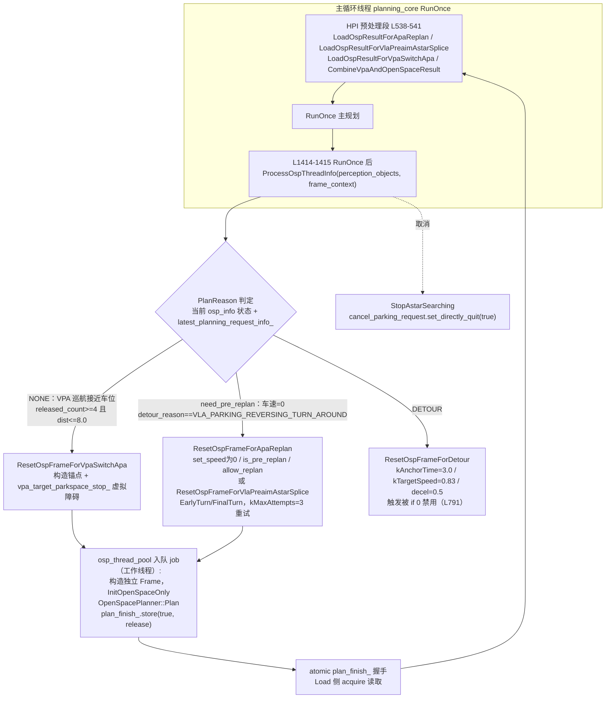

# 子模块7：mission_planner 与 open_space 泊车规划子模块

> 分析对象：根级 `mission_planner.h/.cpp`（126/0 行）；`open_space_planning_async_manager.h/.cpp`（232/915 行）  
> 代码分支：perception/planning/driver @ Stable_Master_4.0_new  
> **重要前置结论**：经全量检索，`mission_planner` 当前为**死代码**（见第6节证据1）；真正承担"巡航与泊车衔接"异步规划的是 `OpenSpacePlanningAsyncManager`。本文按"先证伪、后实证"组织。

## 1. 子模块定位与职责

### 1.1 mission_planner：任务规划角色（证伪结论：死代码）

任务先验假设 `mission_planner.cpp/.h` 承担"巡航到泊车切换"的任务规划角色。**代码证据不支持**：

- `mission_planner.cpp` 为 **0 行空文件**；
- `mission_planner.h`（126 行）**无任何 `#include`、无 `#pragma once`**，仅定义 `Node`（图节点）与 `AStar`（车道级 A\* 搜索雏形）两个类，且 `AStar::Search()` 内存在未定义变量（`Node::Ptr node = std::make_shared<Node>(lid, ...)` 中 `lid` 无定义），无法编译通过；
- 全仓库 grep：该头文件仅被 `BUILD.bazel`（L56-58 注册 target）引用，**无任何源码 include**。

**结论**：mission_planner 是未完成、未接线的车道级 A\* 搜索原型，与"巡航到泊车切换"无关（该切换实际由 HPI 请求体系 + OSP 状态机承担，见第4节）。

### 1.2 OpenSpacePlanningAsyncManager：异步开放空间规划管理器（泊车）

**开放空间规划**（Open Space Planning，无结构化参考线的自由空间规划，用于泊车）计算量大（Hybrid A\* + 平滑），不能阻塞 10Hz 主循环。本管理器职责：

1. 监测泊车触发条件，**把开放空间规划任务投递到独立线程池异步执行**；
2. 为每次规划构造独立的 `Frame`（`InitOpenSpaceOnly`，仅初始化开放空间所需部分）；
3. 规划完成后在主循环**装载结果**合并进主轨迹。

触发原因枚举（`PlanReason`）：`NONE / VPA_SWITCH_APA / APA_REPLAN / DETOUR / VLA_PREAIM_ASTAR_SPLICE`。

- **VPA_SWITCH_APA**：VPA（Vision Parking Assist，视觉泊车辅助）巡航接近目标车位后切换 APA（Auto Parking Assist，自动泊车）；
- **APA_REPLAN**：泊车中重规划（车辆停稳）；
- **VLA_PREAIM_ASTAR_SPLICE**：VLA（Vision-Language-Action 模型）预瞄准段的 A\* 拼接；
- **DETOUR**：绕行，**当前触发代码被 `if (0 && ...)` 禁用**（见第6节证据2）。

### 1.3 与外部通道/状态的关系（以代码为准）

| 对象 | 关系 | 证据位置 |
|-|-|-|
| `/planner/request`（BLC 泊车请求） | 上游输入：`parking_request / cancel_parking_request / pre_plan_parking_request / vpa_driving_request / auto_feature_requests` 经 planning_request_calculator 解析为 HPI 请求 | planning_request_calculator.cc L45-75、L203 |
| `/perception/ras_map_parking` | 泊车语义地图输入：`boundary()/lanes()/road_polygons()` 写入 `frame_context_` 的 `parking_lanes / vpa_perception_lanes / vpa_road_polygons`，供泊车帧使用 | planning_input_preprocess_calculator.cc L593-604 |
| E2E out parking | 出库场景：`osp_info().is_out_parking && enable_e2e_out_parking` 启用 first-stage check；`open_space_optimizer.cpp` L2155-2161 置位 `check_e2e_out_parking_first_stage_path_`（细节属 tasks 子模块，仅引用） | st_boundary_mapper.cpp L491-499 |
| HPI 泊车请求流 | `UsePrePlanParkingResult`：\`has_pre_plan_parking_request |  |

## 2. 核心类结构与成员变量

### 2.1 OpenSpacePlanningAsyncManager

> 文件路径：/sandbox/planning/planning/open_space_planning_async_manager.h  
> 函数名：class OpenSpacePlanningAsyncManager  
> 核心逻辑：
> 
> ```cpp
> enum class PlanReason {           // L26-32
>   NONE = 0, VPA_SWITCH_APA, APA_REPLAN, DETOUR, VLA_PREAIM_ASTAR_SPLICE
> };
> class OpenSpacePlanningAsyncManager {
>  public:
>   OpenSpacePlanningAsyncManager(Planning* planning, HpiManager*,
>                                 std::`shared_ptr<ReferenceLineProvider>`, ...);
>   void ProcessOspThreadInfo(const PerceptionObstacles&,
>                             const FrameContext&);        // L93-101 状态机入口
>   void StopAstarSearching();                             // 取消异步规划
>   bool LoadResultForApaReplan(...);                      // 装载重规划结果
>   bool LoadResultForVpaSwitchApa(...);                   // 装载切换结果
>   bool LoadResultForVlaPreaimAstarSplice(...);
>  private:
>   std::`unique_ptr<deeproute::common::ThreadPool>` osp_thread_pool_;  // 3 线程
>   std::`unique_ptr<Frame>` osp_frame_;                     // 异步专用帧
>   std::`unique_ptr<OpenSpacePlanner>` osp_planner_;        // 异步专用规划器
>   std::`atomic<bool>` plan_finish_ = false;                // 完成标志
>   int apa_replan_seq_ = 0;
>   PlanningRequest latest_planning_request_info_;         // L199-229 最近请求
> };
> ```
> 
> 逻辑说明：**每个 manager 独享**一个 `Frame` + `OpenSpacePlanner` + 3 线程池；`plan_finish_` 是跨线程握手点。`latest_planning_request_info_` 保存最近一次 BLC 请求上下文供触发判断。

### 2.2 mission_planner.h（死代码原文）

> 文件路径：/sandbox/planning/planning/mission_planner.h  
> 函数名：AStar::Search()  
> 核心逻辑：
> 
> ```cpp
> // 全文无 #include / #pragma once，仅以下两个类（节选）
> class Node {
>  public:
>   using Ptr = std::`shared_ptr<Node>`;
>   Node(int lid, Node::Ptr parent = nullptr) ...   // 车道级图节点
>   int lane_id; Node::Ptr parent; double g, h, f;
> };
> class AStar {
>  public:
>   bool Search(...) {
>     ...
>     Node::Ptr node = std::`make_shared<Node>`(lid, ...);  // lid 未定义，编译不过
>     ...
>   }
> };
> ```
> 
> 逻辑说明：车道级 A\* 搜索原型，未接任何数据源；`mission_planner.cpp` 为空，target 仅在 BUILD.bazel 注册。**与基线"任务规划角色（巡航到泊车切换等）"不符**，实际切换逻辑见第 4 节。

## 3. 核心处理流程与函数调用链（异步线程模型）



**线程模型要点**：

1. `osp_thread_pool_ = std::make_unique<ThreadPool>(3, "open_space_worker")`（构造 L20-21）；
2. 触发侧（主循环线程）调用 `Reset*` 系列函数准备 `osp_frame_` 后投递 job；job 内部完整独立：构造 `Frame` → `InitOpenSpaceOnly` → `OpenSpacePlanner::Plan` → `plan_finish_.store(true, std::memory_order_release)`；
3. 装载侧（主循环线程，下一帧 L538-541）以 `plan_finish_.load(std::memory_order_acquire)` 确认完成后读取结果，写入 `vpa_info->mutable_vpa_open_space_data()/vpa_open_space_planner_info()` 并 `set_open_space_has_result(...)`；
4. **确定性模式**（`IsDeterministicMode()`，仿真/回放）下触发后**同步等待**规划完成，保证回放确定性；
5. 取消：`StopAstarSearching()` 直接置 `cancel_parking_request().set_directly_quit(true)` 通知规划器退出。

## 4. 核心算法入口与关键逻辑

### 4.1 ProcessOspThreadInfo：触发状态机（C01 下的实际启用逻辑）

> 文件路径：/sandbox/planning/planning/open_space_planning_async_manager.cpp  
> 函数名：OpenSpacePlanningAsyncManager::ProcessOspThreadInfo()  
> 核心逻辑：
> 
> ```cpp
> // L723-838（节选）
> switch (cur_plan_reason) {
>   case PlanReason::NONE: {
>     const bool is_vpa_driving = hpi_->human_planning_interface().vpa_driving_;
>     const int released_count =
>         frame_->VPADrivingInfo().target_parkspace_released_count();
>     const double dist = ...dist_to_target_parkspace_stop;
>     if (vpa_enable_destination_dynamic_switch && is_vpa_driving &&
>         released_count >= kSwitchApaCountThres /* =4 */ &&
>         dist <= kFarToSpotThres /* =8.0m */) {
>       cur_plan_reason = PlanReason::VPA_SWITCH_APA;   // 巡航切泊车触发
>     }
>     break;
>   }
>   ...
>   case PlanReason::DETOUR:  // L791
>     if (0 && /* 绕行触发条件 */) { ... }   // DETOUR 触发被禁用
> }
> // need_pre_replan 分支：
> if (frame_->GetOpenSpaceInfo().need_pre_replan()) {
>   if (detour_reason == VLA_PARKING_REVERSING_TURN_AROUND)
>     ResetOspFrameForVlaPreaimAstarSplice(...);
>   else
>     ResetOspFrameForApaReplan(...);
> }
> ```
> 
> 逻辑说明：**C01（L2_driving）下开放空间泊车不是常开的**——由 VPA 驾驶态 + 接近目标车位（车位连续释放 4 拍且距离不超 8m）触发 VPA 切 APA；或由 HPI 侧 `need_pre_replan`（泊车中倒车掉头等）触发重规划。调用点参数（`vpa_driving_`、`target_parkspace_released_count()`、`need_pre_replan()`）来自 planning_core.cpp L2283-2312 的 `Planning::ProcessOspThreadInfo` 包装。

### 4.2 异步 job、锚点与车位换算

> 文件路径：/sandbox/planning/planning/open_space_planning_async_manager.cpp  
> 函数名：OpenSpacePlanningAsyncManager::ResetOspFrameForVpaSwitchApa()  
> 核心逻辑：
> 
> ```cpp
> // L70-201（节选）
> if (!vpa_config().enable_destination_dynamic_switch()) return;  // 开关
> // 锚点：target_parkspace 中心 XYToSL，kAnchorS=1.0，
> // kFixedForwardDistance=2.0m 前向固定距离处放虚拟停车障碍
> // vpa_target_parkspace_stop_；并把车位四顶点换算为 HPI 数据：
> MapParkingSpaceToHpi(...);   // L861-912：
>   // HpiOpenSpaceData::PARKING / ParkingRequestReason::REASON_VPA_ROUTING
>   // 中心=4顶点平均，朝向=atan2(vertex[0]-vertex[3])
> osp_thread_pool_->Enqueue([this, ...]() {          // job：工作线程
>   auto osp_frame = std::`make_unique<Frame>`(...);
>   osp_frame->InitOpenSpaceOnly(...);                // 仅初始化开放空间部分
>   auto result = osp_planner_->Plan(*osp_frame, ...);// Hybrid A* + 平滑
>   ReleaseHybridAStarSearchStateAfterAsyncPlan(...);
>   plan_finish_.store(true, std::memory_order_release);  // 发布完成
> });
> if (IsDeterministicMode()) { /* 同步等待结果 */ }
> ```
> 
> 逻辑说明：`InitOpenSpaceOnly` 保证异步帧不重复做主循环已完成的参考线/障碍物全量初始化；`MapParkingSpaceToHpi` 把感知车位框（数据链路源头即 `/perception/ras_map_parking` 写入 frame_context 的泊车车道/边界）换算成 HPI 开放空间数据。`ResetOspFrameForApaReplan`（L244-335）额外做 `vehicle_state_.set_speed(0.0)`、`is_pre_replan=true`、`allow_replan=true`；`ResetOspFrameForVlaPreaimAstarSplice`（L337-452）处理 EarlyTurn/FinalTurn 两类预瞄准位姿，失败重试 `kMaxAttempts=3`；`ResetOspFrameForDetour`（L588-720）以 `kAnchorTime=3.0s` 轨迹评估、`kTargetSpeed=0.83m/s`、`comfortable_decel=0.5` 为参数，但触发已禁用。

### 4.3 BLC 泊车请求链路（/planner/request）

> 文件路径：/sandbox/planning/planning/calculators/planning_request_calculator.cc  
> 函数名：PlanningRequestCalculator::Process()  
> 核心逻辑：
> 
> ```cpp
> // L203：从输入包中提取 BLC 泊车请求
> auto planning_request_msg = find_first_message("/planner/request");
> // L45-75 DebugPlanningRequestSummary 打印：
> //   parking_request / cancel_parking_request /
> //   vpa_driving_request / auto_feature_requests
> ```
> 
> 逻辑说明：`/planner/request` 是 BLC 泊车请求进入 Planning 的通道，经本 calculator 落到 HPI 请求体系，再由 `planning_parking.cpp` 消费（L1535-1551：`use_realtime_parking_space || has_pre_plan_parking_request || has_parking_request` 时进入泊车流程；L1038-1066：`has_pre_plan_parking_request || vpa_on` 清理上帧 pre-plan 结果）。

### 4.4 E2E out parking（基线线索核对）

> 文件路径：/sandbox/planning/planning/tasks/st_graph/st_boundary_mapper.cpp  
> 函数名：StBoundaryMapper::（E2E out parking 判定段）  
> 核心逻辑：
> 
> ```cpp
> // L491-499（节选，tasks 子模块仅引用不展开）
> const bool is_vpa_out_parking =
>     /* HpiOpenSpaceData::OUT_PARKING 判定 */;
> if (reference_line_info_.osp_info().is_out_parking &&
>     frame_.open_space_planner_config().enable_e2e_out_parking() &&
>     !is_vpa_out_parking) {
>   // E2E out parking：出库第一段用 E2E 模型路径做 first-stage 检查
> }
> // 另 open_space_optimizer.cpp L2155-2161：
> //   check_e2e_out_parking_first_stage_path_ = true;
> ```
> 
> 逻辑说明：出库（OUT_PARKING）场景下，非 VPA 出库且 `enable_e2e_out_parking` 打开时，开放空间轨迹第一段需通过 E2E 模型路径检查，与基线提交线索一致。细节属 tasks/open_space 子模块（其他子Agent范围）。

## 5. 输入输出数据结构

**输入**：

- `latest_planning_request_info_`（`PlanningRequest`：parking / cancel_parking / pre_plan_parking / vpa_driving / auto_feature 子请求，源自 `/planner/request`）；
- `PerceptionObstacles`（车位框；`target_parkspace_released_count` 判定依据）；
- `FrameContext`（含 `/perception/ras_map_parking` 写入的 `parking_lanes/vpa_perception_lanes/vpa_road_polygons`；`open_space_planner_info`/`pre_plan_open_space_planner_infos`）；
- `VehicleState`、配置（`vpa_config().enable_destination_dynamic_switch()`、`open_space_planner_config().enable_e2e_out_parking()`）。

**中间**：

- `HpiOpenSpaceData`（`PARKING/OUT_PARKING` 请求类型、车位 4 顶点/中心/朝向、`is_pre_replan`、`allow_replan`）；
- 独立 `Frame`（`InitOpenSpaceOnly`）+ `OpenSpacePlanner`。

**输出**：

- `vpa_open_space_data` / `vpa_open_space_planner_info`（`LoadResultFor*` 写入、`set_open_space_has_result`），经 `CombineVpaAndOpenSpaceResult` 并入主轨迹 `/planner/trajectory`；
- 取消动作：`cancel_parking_request().set_directly_quit(true)`。

## 6. 代码证据与关键片段

### 证据1：mission_planner 死代码判定

> 文件路径：/sandbox/planning/planning/mission_planner.cpp  
> 函数名：（无）  
> 核心逻辑：
> 
> ```bash
> $ wc -l /sandbox/planning/planning/mission_planner.cpp
> 0 /sandbox/planning/planning/mission_planner.cpp
> $ grep -rn "mission_planner.h" /sandbox/planning --include=*.cc --include=*.cpp --include=*.h
> # 仅 BUILD.bazel L56-58 注册 target，无源码引用
> ```
> 
> 逻辑说明：.cpp 为空、头文件无 include 与 pragma once、`AStar::Search()` 含未定义变量 `lid`（无法编译），且无任何调用方，判定为**死代码**。

### 证据2：异步线程池与 DETOUR 禁用

> 文件路径：/sandbox/planning/planning/open_space_planning_async_manager.cpp  
> 函数名：OpenSpacePlanningAsyncManager::OpenSpacePlanningAsyncManager() / ProcessOspThreadInfo()  
> 核心逻辑：
> 
> ```cpp
> // L20-21
> osp_thread_pool_ =
>     std::`make_unique<deeproute::common::ThreadPool>`(3, "open_space_worker");
> // job lambda 内
> plan_finish_.store(true, std::memory_order_release);
> // L791（DETOUR 分支）
> if (0 && /* 绕行触发条件 */) { ... }
> ```
> 
> 逻辑说明：3 个 "open_space_worker" 线程，`release/acquire` 配对保证结果可见；DETOUR 触发整段被 `if (0 && ...)` 包裹，当前不可触发。

### 证据3：结果装载（acquire 侧）

> 文件路径：/sandbox/planning/planning/open_space_planning_async_manager.cpp  
> 函数名：OpenSpacePlanningAsyncManager::LoadResultForVpaSwitchApa()  
> 核心逻辑：
> 
> ```cpp
> // L203-241（节选）
> if (!plan_finish_.load(std::memory_order_acquire)) return false;
> auto* vpa_info = frame_->mutable_vpa_info();
> vpa_info->mutable_vpa_open_space_data();
> vpa_info->mutable_vpa_open_space_planner_info();
> vpa_info->set_open_space_has_result(plan_success_);
> ```
> 
> 逻辑说明：装载函数在主循环 HPI 预处理段（planning_core.cpp L538-541）逐个调用；成功后由 `CombineVpaAndOpenSpaceResult` 合成主轨迹。

### 证据4：C01 L2_driving 下的泊车启用条件（HPI 请求驱动）

> 文件路径：/sandbox/planning/planning/planning_parking.cpp  
> 函数名：Planning::UsePrePlanParkingResult()  
> 核心逻辑：
> 
> ```cpp
> // L1038-1066（节选）
> const auto& requests = hpi_->human_planning_interface().new_planning_requests_;
> const bool has_pre_plan_parking_request = std::find_if(
>     requests.begin(), requests.end(), [](const auto& request) {
>       return request.has_pre_plan_parking_request();
>     }) != requests.end();
> const bool vpa_on = /* auto_feature_requests 中 VPA 且 feature_on */;
> if (has_pre_plan_parking_request || vpa_on) {
>   context_.MutableFrameContext()
>       ->mutable_pre_plan_open_space_planner_infos()->Clear();
> }
> // 按 HpiOpenSpaceData::PARKING 状态续用/清理 open_space_planner_info
> ```
> 
> 逻辑说明：泊车/开放空间活动的驱动源是 **HPI 请求（BLC 下发的泊车/预规划泊车/VPA feature）**，而非 task_type 本身，印证"C01 L2_driving 下 open_space 泊车仅在收到泊车请求/VPA 激活时启用"。`ParkingRequestReason`（如 `REASON_VPA_ROUTING`）标注请求来源。

### 证据5：/perception/ras_map_parking 的实际用途

> 文件路径：/sandbox/planning/planning/calculators/planning_input_preprocess_calculator.cc  
> 函数名：PlanningInputPreprocessCalculator::Process()  
> 核心逻辑：
> 
> ```cpp
> // L593-604
> message = FindFirstMessage(input_msgs, "/perception/ras_map_parking");
> if (message) {
>   auto ras_map_parking_ptr =
>       std::`dynamic_pointer_cast<const deeproute::perception::RASMap>`(
>           message->payload());
>   frame_context_->mutable_parking_lanes()->CopyFrom(
>       ras_map_parking_ptr->boundary());
>   frame_context_->mutable_vpa_perception_lanes()->CopyFrom(
>       ras_map_parking_ptr->lanes());
>   frame_context_->mutable_vpa_road_polygons()->CopyFrom(
>       ras_map_parking_ptr->road_polygons());
> }
> ```
> 
> 逻辑说明：`/perception/ras_map_parking`（RASMap 泊车语义地图）在输入预处理阶段被拆成三部分注入 `FrameContext`，供后续泊车相关处理（含 VPA 车位识别）按需读取，并非 open_space 规划器直连输入。

## 与基线不符/差异点（本子模块）

1. `mission_planner` 非任务规划器，是未完成的车道级 A\* 原型（死代码）；"巡航到泊车切换"实际载体为 HPI 请求 + `ProcessOspThreadInfo` 状态机（VPA_SWITCH_APA 条件：VPA 驾驶 + 车位连续释放不少于 4 拍 + 距离不超 8m）。
2. DETOUR（绕行）触发被 `if (0 && ...)` 禁用，仅保留实现。
3. `/perception/ras_map_parking` 的实际用途是给 frame_context 注入泊车车道/边界/路面多边形（供泊车帧消费），不是 open_space 规划器的直接输入。
4. platform/church（dev_master）侧本文件差异**未验证**（本次仅检出 planning 仓库 Stable_Master_4.0_new）。
