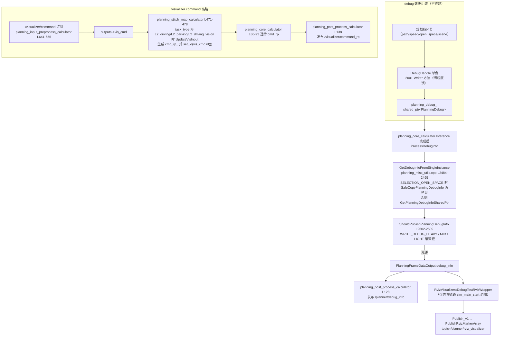

# 子模块8：visualizer 与 planning_debug 调试可视化子模块

> 分析对象：`/sandbox/planning/planning/visualizer/`（2 文件：rviz_visualizer.h 794 行、rviz_visualizer.cpp 13135 行）；`/sandbox/planning/planning/planning_debug/`（11 文件）  
> 代码分支：perception/planning/driver @ Stable_Master_4.0_new

## 1. 子模块定位与职责

本组两个目录共同构成 Planning 的**调试数据出口**，但服务对象不同：

- **planning_debug（11 文件）**：车端主链路的调试数据**组装与发布层**。各规划算法在执行中通过 `DebugHandle` 单例写入 `PlanningDebug` proto，最终以 `/planner/debug_info` 通道发布——这是回放工具（bag_parser/topics.ini 中列出）和排查的主要数据源。
- **visualizer（2 文件）：仿真链路专用**的 RViz Marker 可视化器（`RvizVisualizer`），把 PlanningDebug 转成 rviz marker 数组发往 `/planner/rviz_visualizer`；**车端主链路不调用它**（调用方仅 `sim_planning_interface/sim_main_start.cpp`，见第6节证据3）。

`/visualizer/command`（下游调试指令输入）与 `/visualizer/command_rp`（回执输出）链路则不在上述目录中实现，而由 calculators 层处理（见第4节）——本节按"通道视角"一并说明。

planning_debug 11 文件清单：`planning_debug_handle.h/.cpp`（997/6816 行）、`ilqr_debug_handle.h/.cpp`（183/1070 行）、`ilqr_debug_utils.h/.cpp`、`product_business_processor.h/.cpp`（93 行）、`obstacle_cost_recorder.h`（68 行）、`debug_test.cpp`。

## 2. 核心类结构与成员变量

### 2.1 DebugHandle（调试数据组装单例）

> 文件路径：/sandbox/planning/planning/planning_debug/planning_debug_handle.h  
> 函数名：class DebugHandle  
> 核心逻辑：
> 
> ```cpp
> class DebugHandle {
>  public:
>   void InitPlanningDebugInfo(...);          // 每帧初始化 PlanningDebug
>   void WriteSafetyTrajectory(...);          // 安全轨迹
>   void WriteTrajectoryChecker(...);         // 轨迹校验结果
>   void WriteLaneChangeCost(...);            // 变道代价
>   void WriteModelReflineInfo(...);          // 模型参考线
>   void WriteTrafficLightDebug(...);         // 红绿灯
>   // ... 200+ 个 Write* 方法，覆盖 path/speed/open_space/scene 各环节
>  private:
>   std::`shared_ptr<deeproute::planning::debug::PlanningDebug>` planning_debug_;
>   // 50+ 细粒度互斥锁（多线程写入保护）：
>   std::mutex mtx_safety_trajectory_, mtx_trajectory_checker_, ...;
>   // open_space 相关 13 个细粒度锁（L963-980）：
>   std::mutex mtx_open_space_boundary_, mtx_open_space_trajectory_, ...;
>   ProductBusinessProcessor product_business_processor_;  // 业务化处理器
> };
> DECLARE_SINGLEINSTANCE(DebugHandle);        // L988-993 单例
> ```
> 
> 逻辑说明：单例 + **每字段独立 mutex** 的写法，允许规划管线各任务并发写各自字段而互不阻塞。`PlanningDebug` proto（offboard/planning/planning_debug_info.pb.h）结构大体与规划输出对应：`trajectory`（多参考线各一条）、`reference_line`（多参考线各一条）、路径/速度决策、ST 图、open_space、critical objects 等。`MessageSizeCheck`（planning_debug_handle.cpp L103-116）校验 `trajectory_size == reference_line_size == num_ref_line`，保证多线对齐。

### 2.2 辅助处理器

- **ProductBusinessProcessor**（product_business_processor.h，93 行）：`PopulateCriticalObjects/ProcessCriticalObjects/RetrieveStoplineReason/ProcessBroadcastInfo`；成员 `closest_overtake_/soft/follow/stop_object_id_distance_`、`critical_object_id_`、`vru_obj_id_`、`stopline_reason_`、`broadcast_info_`——把原始规划中间量加工成"业务可读"字段（最近超越目标、停车线原因、广播信息等）。
- **IlqrDebugHandler**（ilqr_debug_handle.h，183 行）：持有 `IlqrDebugInfo`/`IlqrSolverDebugInfo`（ILQR 求解器专调数据：初值轨迹、输出轨迹、代价明细）；枚举 `ObjectType{ROAD_EDGE,STATIC,DYNAMIC}`、`TrajType{ILQR,RAW,EM}`、`PolylineType{CENTER,LEFT_BOUNDARY,...}`。
- **ObstacleCostRecorder**（obstacle_cost_recorder.h，68 行，ilqr 命名空间）：线程安全的三层 map 记录器 `records_[index][obstacle_id][cost_type] = value`（轨迹 index 0-49 → 障碍物 ID → 代价类型 → 值，`RecordCost/GetRecords/Clear`），支持"第 i 拍上哪个障碍物贡献了哪类代价"的逐拍定位。

### 2.3 RvizVisualizer（仿真可视化单例）

> 文件路径：/sandbox/planning/planning/visualizer/rviz_visualizer.h  
> 函数名：class RvizVisualizer  
> 核心逻辑：
> 
> ```cpp
> class RvizVisualizer {
>  public:
>   DECLARE_SINGLEINSTANCE(RvizVisualizer);   // L55
>   RvizVisualizer();   // L59-73 构造时发布 vehicle→lidar 静态 TF
>   bool DebugTestRvizWrapper(const PlanningDebug&,
>                             const RoutingResponse&, const bool); // 总入口
>   // L76：id_map_ 按 ReferenceLinePosition 7 种位置建 id 段
>   // 能力：DrawRoadDebugImage / DrawTrajectory / DrawStBoundary /
>   //       DrawSTGridWrapper / DrawVSValue / DrawVisInputAndHpiStatus ...
>  private:
>   std::`map<...>` id_map_;                    // marker id 分配
>   uint32_t chosen_trajectory_id_ = 0;       // 选中的轨迹
> };
> ```
> 
> 逻辑说明：构造即挂静态 TF（车体→激光雷达坐标系），说明其 rviz 场景按车体坐标组织；`id_map_` 用参考线位置（LEFT/MIDDLE/RIGHT 等 7 类）分配 marker id，便于 rviz 端按 ns 过滤。

## 3. 核心处理流程与函数调用链



**降采样与一致性**：`planning_debug_handle.cpp` 匿名空间提供 `PopulatePolylineIfValid`（参考线/模型路径抽稀，间隔10）、`GetSampleInterval5()`（`WRITE_DEBUG_HEAVY` 定义时=1，否则=5）、`CopyPolylineWithDownsampling/CopyTrajectoryPointsWithDownsampling/CopySpeedPointsWithDownsampling`（均保证末点必含）——proto 体积与性能的平衡手段。

## 4. 核心算法入口与关键逻辑

### 4.1 /planner/debug_info 的组装结构

每帧流程：`DebugHandle::InitPlanningDebugInfo` 重置 → 各环节 `Write*` 填充 → `GetDebugInfoFromSingleInstance` 取出（open_space 选中时**深拷贝**，因 open_space 在独立线程写 debug，直接转发共享指针会与下一帧写入竞态）→ 大小校验/降采样 → 输出。`PlanningDebug` 主要区块：`trajectory[]`/`reference_line[]`（多参考线对齐）、path/speed 决策、ST 图、open_space（13 个锁对应的细分字段）、`critical_objects`、ilqr solver debug、业务化字段（`stopline_reason` 等）。

### 4.2 /visualizer/command 输入 → /visualizer/command_rp 输出

- **输入**：`planning_input_preprocess_calculator.cc` L641-655 订阅 `VisualizerCommand` 放入 `outputs->vis_cmd`（可选输入，无消息时整段跳过）。
- **消费**：`planning_stitch_map_calculator.cc` L471-478——`vis_cmd.ByteSizeLong() > 0` 且 `task_type ∈ {L2_driving, L2_parking, L2_driving_vision}` 时调用 `UpdateVisInput()`，把指令逐项映射为 `VisInput`（`sdlane_type` 的 OPEN_SDLANE/CLOSE_SDLANE、`entry_lane_type`、`perception_follow/pnc_follow_virtual_lane_type`、`ilc_or_auto_turn`、`l2_status_type`、`dynamic_obstacle_type`、`static_obstacle_tpe`、`sonar_type`），写入 frame_context 供规划使用；同时生成回执 `cmd_rp_ = make_unique<VisualizerCommandRP>(); cmd_rp_->set_id(input_data.vis_cmd.id())`。
- **输出**：`cmd_rp` 经 `planning_core_calculator`（L86-93 可选透传）→ `planning_post_process_calculator` L138 发布 `/visualizer/command_rp`，下游以 `id` 对应确认指令已生效。

### 4.3 debug 数据如何辅助排查

| 排查场景 | 使用的 debug 数据 | 来源 |
|-|-|-|
| 某障碍物为何避让/绕行 | `critical_objects`、逐拍障碍物代价 `ObstacleCostRecorder` 三层 map | ProductBusinessProcessor / ilqr |
| 减速/停车原因 | `stopline_reason`、follow/stop 目标距离 | ProductBusinessProcessor |
| 参考线选错/质量差 | `reference_line[]` 与 `trajectory[]` 对齐的多线数据、`WriteLaneChangeCost`、模型参考线 `WriteModelReflineInfo` | DebugHandle |
| ILQR 解不收敛/轨迹跳变 | `IlqrSolverDebugInfo`（初值/输出轨迹、代价曲线） | IlqrDebugHandler |
| 泊车失败 | open_space 细分字段（边界/轨迹/状态，13 个独立锁对应字段） | DebugHandle |
| ST 边界异常 | ST 图 / StBoundary 绘制数据 | DebugHandle（rviz 端 DrawSTGrid） |

## 5. 输入输出数据结构

**输入**：

- 规划管线各环节的中间结果（经 `DebugHandle::Write*`，如 SafetyTrajectory、TrajectoryChecker、LaneChangeCost、ModelRefline、TrafficLight、open_space 边界/轨迹）；
- `/visualizer/command`（`VisualizerCommand` proto，下游调试指令，可选输入）；
- 仿真链路：`PlanningDebug` + `RoutingResponse`（`DebugTestRvizWrapper` 入参）。

**输出**：

- `/planner/debug_info`（`PlanningDebug` proto，主链路每帧发布，受编译宏/降采样控制）；
- `/visualizer/command_rp`（`VisualizerCommandRP`，携带原命令 `id` 的回执）；
- `/planner/rviz_visualizer`（rviz `MarkerArray`，仅仿真链路）。

## 6. 代码证据与关键片段

### 证据1：debug 单例取出与发布条件

> 文件路径：/sandbox/planning/planning/planning_misc_utils.cpp  
> 函数名：GetDebugInfoFromSingleInstance() / ShouldPublishPlanningDebugInfo()  
> 核心逻辑：
> 
> ```cpp
> // L2484-2509（节选）
> std::`shared_ptr<PlanningDebug>` GetDebugInfoFromSingleInstance() {
>   FlushPendingDetourReverseReferenceLine();
>   if (planner_selection == SELECTION_OPEN_SPACE) {
>     return DebugHandle::Instance()->SafeCopyPlanningDebugInfo(); // 深拷贝
>   }
>   return DebugHandle::Instance()->GetPlanningDebugInfoSharedPtr();
> }
> bool ShouldPublishPlanningDebugInfo() {
> #if defined(WRITE_DEBUG_HEAVY) || defined(WRITE_DEBUG_MID) || \
>     defined(WRITE_DEBUG_LIGHT)
>   return true;   // 按编译宏分级；否则按降采样间隔发布
> #endif
>   ...
> }
> ```
> 
> 逻辑说明：open_space 选中时必须深拷贝——因为异步 open_space 线程可能仍在写 debug 共享对象；普通巡航路径直接转发共享指针以省一次拷贝。

### 证据2：calculator 链路的 debug 取出与发布

> 文件路径：/sandbox/planning/planning/calculators/planning_core_calculator.cc  
> 函数名：PlanningCoreCalculator::ProcessDebugInfo()  
> 核心逻辑：
> 
> ```cpp
> // L199-215（节选）
> void ProcessDebugInfo(PlanningFrameDataOutput& output_data) {
>   auto debug_info = DeepRoute::planning::GetDebugInfoFromSingleInstance();
>   const bool should_publish_planning_debug_info =
>       DeepRoute::planning::ShouldPublishPlanningDebugInfo();
>   if (debug_info && should_publish_planning_debug_info) {
>     output_data.debug_info = *debug_info;   // 填入输出包
>   }
> }
> // planning_post_process_calculator.cc L128：
> //   将 output_data.debug_info 发布到 "/planner/debug_info"
> ```
> 
> 逻辑说明：与基线一致，`/planner/debug_info` 是 `PlanningFrameDataOutput.debug_info` 的落点，位于 planning_post_process_calculator 输出映射段。

### 证据3：RvizVisualizer 仅仿真链路调用

> 文件路径：/sandbox/planning/planning/visualizer/rviz_visualizer.cpp  
> 函数名：RvizVisualizer::DebugTestRvizWrapper() / Publish_v1()  
> 核心逻辑：
> 
> ```cpp
> // L34-66（节选）
> bool RvizVisualizer::DebugTestRvizWrapper(const PlanningDebug& debug,
>     const RoutingResponse& routing, const bool xx) {
>   if (!MessageSizeCheck(debug, num_ref_line)) return false;
>   DrawPlanningDebugInfo(debug, routing);   // 参考线/轨迹/ST 图等
>   ...
>   Publish_v1();                            // L68-221
> }
> // Publish_v1 内（L197）：
> DeepRoute::adapter::FactoryCenter::PublishRvizMarkerArray(markerArray_to_publish_);
> // topic = "/planner/rviz_visualizer"（sim_main_start.cpp L566 注册）
> // 调用方：sim_planning_interface/sim_main_start.cpp L239/401（仅仿真）
> ```
> 
> 逻辑说明：`Publish_v1` 按 `chosen_trajectory_id_` 把选中轨迹 marker 命名为 `ref_line_best`/`Debug` 命名空间、候选黄色、碰撞红色，再合并 ref_line_0\~3 与 frame marker 发布。**车端主链路（planning_core 等）不调用 RvizVisualizer**——车端调试依赖 `/planner/debug_info` + 离线回放工具；grep 全仓库调用点仅 `sim_planning_interface`。

### 证据4：/visualizer/command → command_rp 回执生成

> 文件路径：/sandbox/planning/planning/calculators/planning_stitch_map_calculator.cc  
> 函数名：PlanningStitchMapCalculator::Process()  
> 核心逻辑：
> 
> ```cpp
> // L471-478（节选）
> if (input_data.vis_cmd.ByteSizeLong() > 0) {
>   if (task_type_ == "L2_driving" || task_type_ == "L2_parking" ||
>       task_type_ == "L2_driving_vision") {
>     UpdateVisInput(input_data.vis_cmd, ...);   // 指令 → VisInput（写 frame_context）
>   }
>   cmd_rp_ = std::`make_unique<deeproute::visualizer::VisualizerCommandRP>`();
>   cmd_rp_->set_id(input_data.vis_cmd.id());    // 回执携带原 id
> }
> ```
> 
> 逻辑说明：C01（L2_driving）在支持列表内，`/visualizer/command` 指令生效并回执；`UpdateVisInput` 支持的指令类别见 4.2 节列表（sdlane 开闭、跟车模式、sonar 等调试注入）。

### 证据5：多线对齐校验

> 文件路径：/sandbox/planning/planning/planning_debug/planning_debug_handle.cpp  
> 函数名：MessageSizeCheck()  
> 核心逻辑：
> 
> ```cpp
> // L103-116
> bool MessageSizeCheck(const PlanningDebug& planning_debug_info,
>                       const size_t num_ref_line) {
>   if (planning_debug_info.trajectory_size() != (int)num_ref_line ||
>       planning_debug_info.reference_line_size() != (int)num_ref_line) {
>     MLOG(WARN) << planning_debug_info.trajectory_size() << ' '
>                << planning_debug_info.reference_line_size() << ' ' << num_ref_line;
>     return false;
>   }
>   return true;
> }
> ```
> 
> 逻辑说明：`PlanningDebug` 的 `trajectory`/`reference_line` 都是按参考线条数组织的 repeated 字段，此校验保证"第 i 条参考线 ↔ 第 i 条轨迹"的下标对齐，是回放工具正确渲染多线数据的前提。

## 附：未验证/推断项

- `ilqr_debug_handle.cpp`（1070 行）/`ilqr_debug_utils.*` 的字段级填充逻辑未逐行核验（接口与数据结构已确认）——**未验证**。
- `ShouldPublishPlanningDebugInfo` 非宏路径的降采样间隔具体值（依赖 gflags/配置）——**未验证**。
- `RvizVisualizer` 各 Draw\* 的 marker 细节（13135 行 .cpp 未全读，仅核验主链路与发布点）——**推断**为常规 rviz marker 封装。
- platform/church（dev_master）侧这两个目录的差异——**未验证**。
