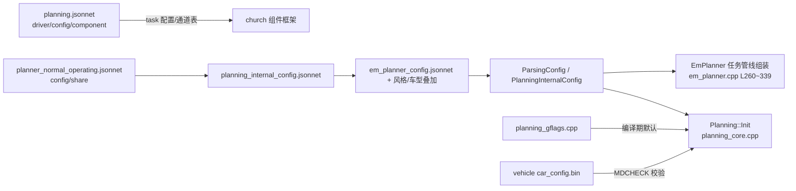

# 03 关键数据结构与参数配置

> 适用范围：C01（orinx 平台 C01PT，`/task/task_type=L2_driving`）E2E 主进程 perception mainboard 中的 PlanningComponent。  
> 代码根目录：`/sandbox/planning/planning/`。本文所有结论均给出代码证据，推断处已标注。

---

## 1. 核心结构体

### 1.1 PlanningFrameData（单帧输入装配结果）

Planning 子图输入节点的输出产物，把一帧内收集到的所有上游消息打包成一份"帧数据"。

> 文件路径：/sandbox/planning/planning/planning_api.h  
> 函数名：struct PlanningFrameData（第 51\~79 行）  
> 核心逻辑：
> 
> ```cpp
> struct PlanningFrameData {
>   bool plan_with_context;
>   deeproute::visualizer::VisualizerCommand vis_cmd{};
>   deeproute::common::VehicleState vehicle_state_{};
>   std::`shared_ptr<const deeproute::localization::message::LidarMatchingMessage>`
>       map_msg{nullptr};
>   std::`shared_ptr<const deeproute::perception::TrafficLightResponse>`
>       tl_response_{nullptr};
>   std::`shared_ptr<deeproute::planning::FrameContext>` frame_context_{nullptr};
>   std::`shared_ptr<deeproute::planning::FrameContext>` last_frame_context_{nullptr};
>   std::`shared_ptr<deeproute::map::RASMapPlus>` rasmap_plus_{nullptr};
>   std::shared_ptr<std::`map<uint64_t, deeproute::perception::RASMap>`>
>       cached_rasmap_{nullptr};
>   std::`shared_ptr<deeproute::perception::PerceptionObstacles>`
>       perception_obstacles_{nullptr};
>   std::`shared_ptr<deeproute::perception::PerceptionObstacles>`
>       perception_objects_extra_{nullptr};
>   std::`shared_ptr<const deeproute::localization::message::GlobalRoutingInfo>`
>       global_routing_info_{nullptr};
>   std::`shared_ptr<const deeproute::map::FusionSdMap>` fusion_map_{nullptr};
>   std::`shared_ptr<const deeproute::map::SdHorizonMap>` sd_horizon_map_{nullptr};
>   std::`shared_ptr<deeproute::perception::MagicCarpetPerception>`
>       magic_carpet_perception_{nullptr};
>   bool has_new_rasmap() { return rasmap_plus_ != nullptr; }
> };
> ```
> 
> 逻辑说明：所有字段几乎都是 `std::shared_ptr`，属于**共享所有权**（详见第 2 节）。字段生命周期 = 从 planning_input_preprocess_calculator.cc 的 `Process()` 装配开始，沿图流经 `PlanningStitchMapCalculator` → `PlanningCoreCalculator`，到后处理结束被 Consume（移动）销毁。

装配证据（`FindFirstMessage` 从 church 图注入的消息向量里按 topic 取第一条）：

> 文件路径：/sandbox/planning/planning/calculators/planning_input_preprocess_calculator.cc  
> 函数名：PlanningInputPreprocessCalculator::Process()  
> 核心逻辑：
> 
> ```cpp
> auto input_msgs =
>     cc->Inputs().Tag(kInPlanningInput).`Get<OnboardMessageConstPtrVector>`();
> auto outputs = std::`make_unique<DeepRoute::planning::PlanningFrameData>`();
> ...
> message = FindLastMessage(input_msgs, "/perception/objects");
> if (message) {
>   perception_obstacles_->CopyFrom(*message->payload());
>   ::common::ModelBasedDecisionFlatConverter::EnsureNestedFromFlat(
>       perception_obstacles_.get(), nullptr);
> }
> ...
> outputs->plan_with_context = plan_with_context;
> outputs->vehicle_state_ = vehicle_state_;
> outputs->frame_context_ = frame_context_;
> outputs->perception_obstacles_ = perception_obstacles_;
> outputs->fusion_map_ = fusion_map_;
> outputs->sd_horizon_map_ = sd_horizon_map_;
> cc->Outputs().Tag(kOutPlanningFrame)
>     .Add(outputs.release(), cc->InputTimestamp());
> ```
> 
> 逻辑说明：注意感知障碍物用的是 `FindLastMessage("/perception/objects")`（取该帧窗口内最后一条），而大部分其他输入用 `FindFirstMessage`；这是**与基线描述"FindFirstMessage→PlanningFrameData"的细微差异**——实际是按 topic 混用 First/Last。

对应的输出结构体 `PlanningFrameDataOutput`（同文件 81\~101 行）承载 `/planner/trajectory`、`/planner/debug_info`、`/planner/context`、`/planner/response`、`/planner/event`、`/safety/request`、`/planner/stop_objects` 等**所有下游发布物**，同样以 `shared_ptr` 持有。

### 1.2 FrameContext（跨帧上下文，proto）

**FrameContext（帧上下文）**是 planning 自己产生的、回环到下一帧输入的 protobuf 大消息，通过 `/planner/context` 通道发布、又被本组件以 `back_edge` 形式订阅，是 E2E 场景下"上一帧记忆"的载体。

> 文件路径：/sandbox/proto_msg/proto_offboard/offboard/planning/planning_frame_context.proto  
> 函数名：message FrameContext（第 1884 行起）  
> 核心逻辑：
> 
> ```proto
> message FrameContext {
>   repeated RefLineSummary ref_line_summary = 1;   // 各参考线选择/代价摘要
>   optional deeproute.common.VehicleState last_vehicle_state = 3;
>   optional deeproute.planning.ADCTrajectory last_selected_trajectory = 4; // 上一帧最终轨迹
>   optional int64 last_selected_trajectory_start_point_time = 5;
>   optional int64 perception_header_timestamp = 6;
>   optional HpiData hpi_data = 10;                 // 人机接口/泊车请求等
>   optional uint32 last_selected_ref_line_info_position = 13;
>   optional LastFramePathInfo last_frame_path_info = 18;
>   optional TopoInfo topo_info = 36;               // 模型匹配车道/参考线拓扑
>   optional StatusMachineInfo status_machine_info = 37; // L2 状态机
>   optional bool only_use_start_point = 51 [default = false];
>   optional VPADrivingInfo vpa_driving_info = 61;
>   ...
> };
> ```
> 
> 逻辑说明：关键字段含义——`last_selected_trajectory` 供下一帧做轨迹拼接起点；`ref_line_summary` 记录每条参考线是否被选中/最小代价；`only_use_start_point` 决定下一帧只继承起点信息。生命周期：由 PlanningCoreCalculator 输出 → 图回边送回 PlanningInputPreprocessCalculator（`FRAME_CONTEXT` 流，`back_edge: true`，见 planning_sub_graph.cfg 第 24\~27 行）→ 同时经 `/planner/context` 发布给下游（含仿真闭环）。

C++ 侧封装类 `Context`（注意与 proto 的 FrameContext 区分）带互斥锁保护：

> 文件路径：/sandbox/planning/planning/frame/context.h  
> 函数名：class Context（第 34\~91 行）  
> 核心逻辑：
> 
> ```cpp
> class Context {
>  public:
>   deeproute::planning::FrameContext* MutableFrameContext();
>   // 线程安全的轨迹读写接口
>   // 从 Context 中安全读取轨迹（返回拷贝，避免竞争）
>   deeproute::planning::ADCTrajectory GetLastSelectedTrajectorySafe() const;
>   void SetLastSelectedTrajectorySafe(
>       const deeproute::planning::ADCTrajectory& trajectory);
>  private:
>   std::`shared_ptr<deeproute::planning::FrameContext>` frame_context_ = nullptr;
>   ProcessedContext processed_context_;
>   // 保护 frame_context_ 的互斥锁
>   mutable std::mutex context_mutex_;
> };
> ```
> 
> 逻辑说明：同进程内 open-space 异步线程与主规划线程都会访问 Context，因此提供带锁的轨迹读写接口（返回拷贝而非引用，见第 2 节）。

### 1.3 Frame（帧内规划世界模型）

**Frame** 是单帧内所有规划计算的世界模型：参考线列表、障碍物、自车状态、拼接轨迹等。

> 文件路径：/sandbox/planning/planning/frame/frame.h  
> 函数名：class Frame（第 477 行起）  
> 核心逻辑：
> 
> ```cpp
> class Frame {
>  public:
>   using ReferenceLineInfoList = std::list<std::`shared_ptr<ReferenceLineInfo>`>;
>   using ReferenceLineInfoPtr = std::`shared_ptr<ReferenceLineInfo>`;
>   Frame(ReferenceLineProvider* reference_line_provider,
>         const deeproute::perception::PerceptionObstacles& perception_obstacles,
>         const deeproute::perception::PerceptionObstacles& perception_extra_obstacles,
>         const deeproute::localization::message::LidarMatchingMessage& map_msg,
>         const deeproute::common::VehicleState& vehicle_state,
>         const deeproute::perception::TrafficLightResponse& tl_response,
>         const Context& context, const HPIData& hpi_data,
>         const deeproute::planning::VisInput& vis_input,
>         ...
>         const std::`shared_ptr<deeproute::common::ThreadPool>`&
>             stitch_map_thread_pool = nullptr,
>         std::`shared_ptr<::common::ArenaManager>` frame_arena_manager = nullptr,
>         ...);
>   // Defined in frame_lifecycle.cpp where ArenaManager is a complete type.
>   ~Frame();
> ```
> 
> 关键成员（同文件 4685\~4755 行）：
> 
> ```cpp
>   deeproute::perception::PerceptionObstacles* perception_obstacles_ptr_{nullptr};
>   std::`unique_ptr<deeproute::perception::PerceptionObstacles>`
>       perception_obstacles_heap_holder_;
>   std::`shared_ptr<::common::ArenaManager>` frame_arena_manager_;
>   std::list<std::`shared_ptr<ReferenceLineInfo>`> em_reference_line_info_;
>   std::list<std::`shared_ptr<ReferenceLineInfo>`> extra_reference_line_info_;
>   std::`unordered_map<ObstacleId, ObjectPtr>` obstacles_;
>   std::`vector<ObjectPtr>` obstacles_list_;
>   std::`vector<deeproute::common::TrajectoryPoint>` stitching_points_;
>   bool is_first_frame_ = false;
>   ...
> ```
> 
> 逻辑说明：Frame 构造即一帧的开始，析构即一帧结束（生命周期严格单帧，见 frame_lifecycle.cpp 的 `Frame::Init` 拆分函数 `InitCoreInfrastructure / ProcessTrajectoryAndContext / CreateAndProcessReferenceLines / GenerateSpeedDataAndFinalize`，同文件 4479\~4494 行注释"Core initialization phases - Frame::Init refactoring"）。`frame/` 目录 29 个文件按主题拆分 Frame 的实现（frame_lane_change / frame_parking / frame_traffic_light / frame_reference_line 等）。

### 1.4 ReferenceLineInfo（单条参考线上的完整规划状态）

**ReferenceLineInfo（参考线信息）**是 EM 规划的核心工作对象：每条候选参考线各对应一个实例，其上完成障碍物投影、路径规划、速度规划、轨迹合成与代价评估。

> 文件路径：/sandbox/planning/planning/reference_line_info/reference_line_info.h  
> 函数名：class ReferenceLineInfo（第 789 行起）  
> 核心逻辑：
> 
> ```cpp
> class ReferenceLineInfo {
>  public:
>   ReferenceLineInfo(
>       const deeproute::common::VehicleState& vehicle_state,
>       const deeproute::common::TrajectoryPoint& adc_planning_point,
>       const std::`shared_ptr<ReferenceLine>`& reference_line,
>       const std::`shared_ptr<common::hdmap::RouteSegments>`& segments);
> 
>   bool Init(int32_t id, const deeproute::common::VehicleState& vehicle_state,
>             const deeproute::taskconfig::EMPlannerConfig& em_planner_config,
>             const Context* context = nullptr);
> 
>   bool AddObstacles(const std::`vector<ObjectPtr>`& obstacles);
>   bool AddObstacle(const std::`shared_ptr<Object>`& obstacle);
>   PathData* mutable_path_data() { return &path_data_; }       // L1534
>   SpeedData* mutable_speed_data() { return &speed_data_; }    // L1552
>   const PathData* last_path_data() const { return last_path_data_.get(); }
> ```
> 
> 关键成员（同文件 4537 行起 private 段）：
> 
> ```cpp
>   std::`unique_ptr<ReferenceLineInfoDataProcessor>` reference_line_info_task_;
>   PathData path_data_;            // 离散路径 + frenet 路径（推断，按 mutable_path_data 接口）
>   SpeedData speed_data_;          // 速度曲线（ST 图采样点）
>   DiscretizedTrajectory trajectory_; // 合成后的轨迹
>   ...
> ```
> 
> （后三个成员的确切声明位置在 5159 行的巨大头文件中部，此处标注：`path_data_`/`speed_data_` 为推断命名，getter 证据见上）  
> 逻辑说明：生命周期 = Frame 构造参考线时创建（`em_reference_line_info_` 列表）→ 各 Task 在其上执行 → 帧选线后 `selected_reference_line_info()` 被用于生成 ADCTrajectory → 帧结束销毁。`reference_line_info/` 目录 45 个文件还包含参考线平滑器（qp_reference_line_smoother、astar_reference_line_regulator）与 reference_line_provider.cpp（参考线提供者，负责从地图/路由生成参考线）。

### 1.5 ADCTrajectory proto（规划输出轨迹）

> 文件路径：/sandbox/proto_msg/proto/planning/planning.proto  
> 函数名：message ADCTrajectory（第 119 行起）  
> 核心逻辑：
> 
> ```proto
> message ADCTrajectory {
>   optional deeproute.common.Header header = 1;
>   optional double total_path_length = 2;  // in meters
>   optional double total_path_time = 3;    // in seconds
>   // path data + speed data
>   repeated deeproute.common.TrajectoryPoint trajectory_point = 12;
>   optional EStop estop = 6;
>   // path point without speed info
>   repeated deeproute.common.PathPoint path_point = 13;
>   // is_replan == true mean replan triggered
>   optional bool is_replan = 9 [default = false];
>   optional string replan_reason = 22;
>   optional deeproute.canbus.Chassis.GearPosition gear = 10;
>   optional deeproute.taskconfig.DecisionResult decision = 14;
>   optional LatencyStats latency_stats = 15;   // 含 total_time_ms 整帧耗时
>   optional RightOfWayStatus right_of_way_status = 17;
>   enum TrajectoryType {
>     UNKNOWN = 0; NORMAL = 1;
>     PATH_FALLBACK = 2; SPEED_FALLBACK = 3; COMBINE_PATH_SPEED_FAILED = 4;
>   }
>   optional TrajectoryType trajectory_type = 21 [default = UNKNOWN];
> }
> ```
> 
> 逻辑说明：`trajectory_point` = 路径+速度离散点；`path_point` = 无速度信息的纯路径（供控制侧路径跟踪）；`trajectory_type` 直接编码了"正常/路径降级/速度降级"语义，与异常降级文档（06）强相关。单点结构 `TrajectoryPoint`（/sandbox/proto_msg/proto/common/pnc_point.proto 第 81\~101 行）：`path_point(x,y,z,theta,kappa…)+v+a+relative_time+da+steer+kappa_dot/kappa_ddot`。

### 1.6 DiscretizedTrajectory（轨迹的 C++ 表达）

> 文件路径：/sandbox/planning/planning/common/trajectory/discretized_trajectory.h  
> 函数名：class DiscretizedTrajectory : public Trajectory（第 15 行起）  
> 核心逻辑：
> 
> ```cpp
> class DiscretizedTrajectory : public Trajectory {
>  public:
>   explicit DiscretizedTrajectory(
>       const deeproute::planning::ADCTrajectory& trajectory); // proto → C++
>   bool EvaluateByRelativeTime(
>       const common::TimeSecond time,
>       deeproute::common::TrajectoryPoint* trajectory_point) const;
>   bool PrependTrajectoryPoints(
>       const std::`vector<deeproute::common::TrajectoryPoint>`& stitching_points,
>       double* gap_distance);                       // 轨迹拼接（前置点）
>   bool TruncateTrajectorybyIndex(const uint32_t index,
>                                  const double start_relative_time,
>                                  const double start_s); // 从起点截断（换起帧）
>   deeproute::planning::ADCTrajectory ToADCTrajectory() const; // C++ → proto
>  protected:
>   std::`vector<deeproute::common::TrajectoryPoint>` trajectory_points_;
>   std::`vector<deeproute::common::PathPoint>` path_points_;
>   // Polyline index for fast nearest point query (mutable for lazy rebuild)
>   mutable bool use_polyline_index_ = false;
>   mutable std::`shared_ptr<common::polyline_index::AVC_NA6_RS_JO>` polyline_index_;
> };
> ```
> 
> 逻辑说明：它是规划内部轨迹的标准容器（上一帧轨迹、各参考线轨迹、OSP 轨迹都用它），提供按时间/弧长插值（Evaluate 系列）、最近点查询（带惰性重建的折线索引加速）。生命周期：从上一帧 `/planner/context` 的 `last_selected_trajectory` 构造（换起帧），或在 task 管线中合成，最终由 `Planner::GenerateAdcTrajectory` 转回 proto 发布。

### 1.7 其他辅助结构（简要）

| 结构 | 文件 | 要点 |
|-|-|-|
| `LaneWaypoint/LaneSegment` | /sandbox/planning/planning/shared_structure.h L20\~99 | 车道定位段，`LaneSegment::Join` 合并同车道相邻段 |
| `ExtendedStitchingTrajectoryInfo` | 同上 L101\~125 | 拼接轨迹信息：`stitching_points`、首末时间、前轮转角速率 |
| `ProcessedContext` | /sandbox/planning/planning/frame/context.h L9\~32 | 轻量化帧间统计（EM 参考线计数等），注释明确"replaced em_ref_line_summaries vector with lightweight counters to avoid deep copying large protobuf" |
| `PlanningFrameDataOutput` | planning_api.h L81\~101 | 全部输出消息的 shared_ptr 打包 |

---

## 2. 数据所有权与拷贝策略

规划数据的传递策略可总结为：**输入层共享指针（零拷贝读），中間层原地写，输出层移动语义，跨线程拷贝**。

1. **图内流转：unique_ptr/移动优先**。Calculator 间大对象用 `Consume`（mediapipe 移出）：

> 文件路径：/sandbox/planning/planning/calculators/planning_core_calculator.cc  
> 函数名：PlanningCoreCalculator::Process()
> 
> ```cpp
> auto input_data = cc->Inputs()
>                       .Tag(kInPlanningFrame)
>                       .Value()
>                       .`Consume<DeepRoute::planning::PlanningFrameData>`()
>                       .ValueOrDie();   // 把上游 PlanningFrameData 移动过来
> ```
> 
> 逻辑说明：`Consume` 使流包的所有权被独占移动，避免大 proto 拷贝；`PlanningPostProcessCalculator::Process()`（planning_post_process_calculator.cc L80\~85）同样对 `PlanningFrameDataOutput` Consume。

1. **PlanningFrameData 内部：shared_ptr 共享读**。所有上游消息成员都是 `shared_ptr`（planning_api.h L51~~79），Frame/Preprocess 只读解引用；感知 obstacles 拷贝一次到成员（`perception_obstacles_->CopyFrom`，见 1.1）后共享。Frame 中则用裸指针 + 堆持有者双轨（frame.h L4690~~4700：`perception_obstacles_ptr_` 与 `perception_obstacles_heap_holder_`），并引入 `ArenaManager`（protobuf arena，减少重复分配）。
2. **跨帧上下文：拷贝 + 锁保护读**。FrameContext 是值语义 proto：每帧由 `CopyFrom` 继承（planning_input_preprocess_calculator.cc L173 `frame_context_->CopyFrom(*last_frame_context_)`），而并发访问点（Context）用 mutex + 返回拷贝接口（frame/context.h `GetLastSelectedTrajectorySafe` 注释："从 Context 中安全读取轨迹（返回拷贝，避免竞争）"）。
3. **跨线程：任务闭包捕获 this，结果用 atomic 标志**。open-space 异步线程把 `plan_finish_` 设为 release，主线程 acquire 读取（open_space_planning_async_manager.cpp L192、L214）。
4. **障碍物：`shared_ptr<Object>`（ObjectPtr）**。`std::unordered_map<ObstacleId, ObjectPtr> obstacles_`（frame.h L4719），参考线只 AddObstacle 挂引用，不做深拷贝；`PathDecision` 内以指针集合持有（推断，依据 path_decision.h 存在 mutex 与指针 Items() 接口）。
5. **protobuf 修辞性拷贝仍存在**：输入预处理器对 `/perception/objects`、`/map/fusion_map` 等做 `CopyFrom`（planning_input_preprocess_calculator.cc L360、L563），这是因为 church 图消息为 const payload，需要可变本地副本。

---

## 3. 参数配置体系

### 3.1 配置加载链（jsonnet → ParsingConfig → Planning）

> 文件路径：/sandbox/planning/planning/calculators/planning_stitch_map_calculator.cc  
> 函数名：PlanningStitchMapCalculator::Open()  
> 核心逻辑：
> 
> ```cpp
> FLAGS_parse_config =
>     deeproute::base::GetDeeproutePath() + FLAGS_parse_config;
> LoadConfigFiles(FLAGS_parse_config, &parsing_config_);
> planning_->Load(parsing_config_, task_type_);
> ```
> 
> 逻辑说明：`FLAGS_parse_config` 默认值来自 gflags 定义（下 3.3），指向 `planner_normal_operating.jsonnet`——**配置地图**：

> 文件路径：/sandbox/planning/planning/config/share/planner_normal_operating.jsonnet
> 
> ```jsonnet
> local planning_internal_config = import "/opt/deeproute/planning/config/planning/planning_internal_config.jsonnet";
> {
> "car_config_path": "/opt/deeproute/vehicle-config/onboard/car_config.bin",
> "planning_internal_config": planning_internal_config
> }
> ```
> 
> 而 `planning_internal_config.jsonnet`（/sandbox/planning/planning/config/share/，70 行）聚合了约 30 个子配置：
> 
> ```jsonnet
> local em_planner_config = import "em_planner_config.jsonnet";
> ...
> {
>     "em_planner_config": em_planner_config + rulebase_driving_ilqr_config,
>     "model_em_planner_config": em_planner_config + driving_ilqr_config + model_config,
>     "casual_config": em_planner_config + rulebase_driving_ilqr_config + casual_config,
>     ...
> }
> ```
> 
> 逻辑说明：**jsonnet 叠加（+）是驾驶风格/车型参数注入的核心手段**——基础 em 配置 + 风格包（casual/standard/sports）或车型包（driving_ilqr、model）。`config/` 目录按品牌组织（share/ 通用，geely/、gwm/、hw/、lp/、seres/、smart/ 车型专属覆盖），`config/planning_sub_graph.cfg` 是图的子图定义（见 04 篇）。加载结果统一装入 `ParsingConfig`（parse_config.pb.h，含 `planning_internal_config`），随后在 `planning_->Load()` 分发给 Planning::Init（planning_core.cpp L1821\~1853，逐个 `CopyFrom` 到 `em_planner_config_` 等成员）。

### 3.2 运行期关键开关（em_planner_config.jsonnet）

> 文件路径：/sandbox/planning/planning/config/share/em_planner_config.jsonnet
> 
> ```jsonnet
> "use_multithreading_planning": true,   // L7：决定是否创建 plan_worker 线程池
> "enable_e2e_refline_framework": true,  // L10：E2E 参考线框架
> "use_qp_path_obtimizer": true,         // L13（拼写如此）
> "use_qp_speed_optimizer": true,        // L14
> "use_dp_path": true,                   // L5612（model_trajectory 配置段）
> "enable_model_speed": false,           // L5609
> "enable_decision_making": true,        // L5620
> ```
> 
> 逻辑说明：这些开关直接决定 task 管线组装（见 07 篇"任务管线动态注册"）与线程池创建（planning_core.cpp L1917：`if (em_planner_config_.use_multithreading_planning())`）。

### 3.3 planning_gflags 的 gflags 清单（关键 18 个）

gflags 分三处定义：`planning_gflags/planning/common/planning_gflags.cpp`（517 行，主清单）、`params_gflags.cpp`（10 行）、`tests/run_gflags.cpp`（解析配置路径等）。下表全部有代码出处（文件均为 /sandbox/planning/planning/planning_gflags/ 下）：

| flag | 默认值 | 含义（摘自代码注释/语义） |
|-|-|-|
| `default_lane_width` | 3.048 m | 默认车道宽（planning_gflags.cpp L23） |
| `replan_lateral_distance_threshold` | 1.0 m | replan 横向阈值（L26） |
| `replan_longitudinal_distance_threshold` | 2.5 m | replan 纵向阈值（L28） |
| `efficiency_weight` / `safety_weight` 等 | 1.0 | AbsReferenceLineCost 各代价权重（L37\~49） |
| `global_speed_limit` | 30.0 m/s | 全局限速（L52；shared_structure.h L13 亦 DECLARE） |
| `max_lateral_acceleration_ratio` | 1.2 | 最大横向加速度比例（L60） |
| `use_multi_prediction` | false | 使用多假设预测（L88） |
| `enable_RSS_check` | false | RSS 安全性校验开关（L96） |
| `get_debug_info_from_bag` | true | 从 bag 取 debug（L120） |
| `enable_multi_change_lane_remain_s` | true | 多次变道剩余 s 使能（L127） |
| `follow_speed_limit_min` | 2.0 m/s | 跟车最低限速（L143） |
| `max_abs_speed_when_stopped` | 0.1 m/s | 停车态最大速度（L171） |
| `enable_crossing_deceleration` | true | 交叉车减速（L169） |
| `behind_vehicle_deceleration` | -1.5 | 后车减速参数（L110） |
| `enable_debug_info_object_debug_publish/retrieve` | true | debug_info 对象级发布/读取开关（L150/L152） |
| `debug_test_mode` | 0 | 调试模式（L165） |
| `parse_config` | "/planning/config/planning/planner_normal_operating.jsonnet" | **配置入口**（run_gflags.cpp L52，"input all config for planning"） |
| `map_path` / `car_config_path` | semantic-lmdb / mkz_config.json | 语义地图路径 / 车辆参数（run_gflags.cpp L40\~48） |

> 说明：C01 实车运行时 `FLAGS_parse_config` 等可能被上层启动参数覆盖；表中默认值即代码默认值（已验证）。

### 3.4 参数运行时一致性校验（配置 ↔ 车辆配置）

> 文件路径：/sandbox/planning/planning/planning_core.cpp  
> 函数名：Planning::Init()  
> 核心逻辑：
> 
> ```cpp
> MDCHECK_LE(max_acceleration - 1.0e-6, adc_param.max_acceleration())
>     << "pnc dp speed config max acceleration : " << max_acceleration
>     << " exceeds vehicle max acceleration : " << adc_param.max_acceleration();
> MDCHECK_LE(adc_param.max_deceleration() - 1.0e-6,
>            dp_speed_config.max_deceleration())
>     << "pnc qp speed config ...";
> ```
> 
> 逻辑说明：初始化时强校验速度规划配置的加速度/减速度不得超过车辆控制配置（VehicleConfigRetriever），违反直接 MDCHECK 终止——这是"配置与代码对应关系"的最硬一层。

---

## 4. 配置与代码的对应关系



| 配置文件（/sandbox/planning/planning/config/ 下） | 消费代码 | 对应 proto |
|-|-|-|
| `planning_sub_graph.cfg` | church 图调度（executor "planning_executor"） | — |
| `share/em_planner_config.jsonnet` | `PlannerManager::Init` / `EmPlanner` 组装 tasks_stage\_ | taskconfig/EMPlannerConfig |
| `share/open_space_planner_config.jsonnet` | `OpenSpacePlanner` / `OpenSpacePlanningAsyncManager` | taskconfig/OpenSpacePlannerConfig |
| `share/reference_line_provider.jsonnet` | `ReferenceLineProvider` 构造 | ReferenceLineProviderConfig |
| `share/info_preprocess_config.jsonnet` | `Planning::Init`（info_preprocess_config\_） | InfoPreprocessConfig |
| `share/abnormal_event_config.jsonnet` | `TrajectoryChecker`（异常事件阈值） | AbnormalEventConfigs |
| `share/open_space_e2e_manufacture_data_config.jsonnet` | `PlanningInputPreprocessCalculator::LoadE2EManufactureDataConfig()`（直接读文件，L803\~817） | E2EManufactureDataConfig |

> 证据（配置→构造函数一一对应）：
> 
> ```cpp
> // planning_core.cpp L1933~1934
> reference_line_provider_ =
>     std::`make_unique<ReferenceLineProvider>`(reference_line_provider_config_);
> ```
> 
> 逻辑说明：每个 jsonnet 子配置都能在 `Planning::Init` 签名（planning_core.cpp L1821\~1834，9 个 config 入参）中找到同名承接对象，一一映射清晰。

---

## 小结

1. **单帧数据主干**：PlanningFrameData（shared_ptr 输入包）→ Frame（含 ReferenceLineInfo 列表与 obstacles）→ PlanningFrameDataOutput（shared_ptr 输出包）。
2. **跨帧记忆**：FrameContext proto（/planner/context 回环），C++ 侧 Context 类带锁。
3. **配置三层**：gflags（代码默认值）→ jsonnet 叠加链（车型/风格注入）→ MDCHECK 运行期校验。
4. **关键文件**：planning_api.h、frame/frame.h、frame/context.h、reference_line_info/reference_line_info.h、common/trajectory/discretized_trajectory.h、config/share/planning_internal_config.jsonnet、planning_gflags/planning/common/planning_gflags.cpp。
