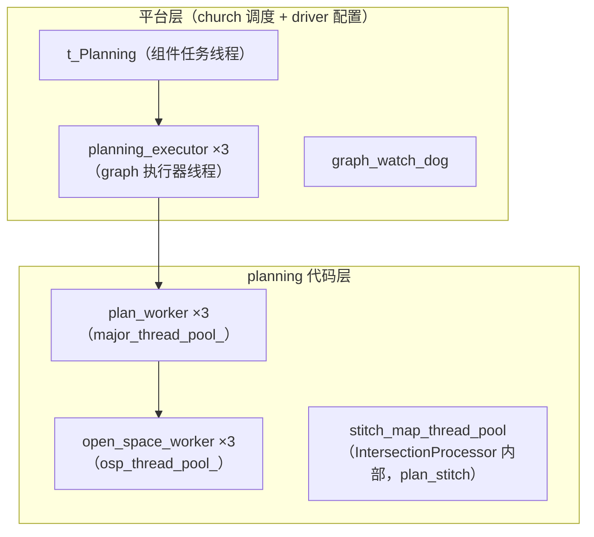
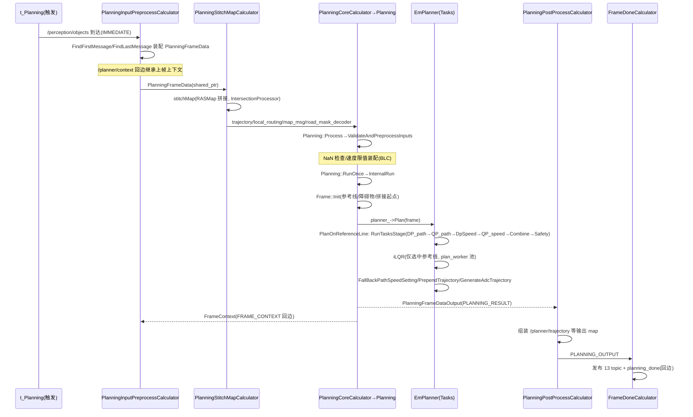

# 04 线程调度与规划周期

> 前置：C01 E2E 主进程为 perception mainboard，Planning 以 `PlanningComponent` 挂载，调度器为 church（graphpipe/mediapipe 类图）。本文聚焦：线程从哪来、一帧多久跑一次、一帧内部怎样流动、如何保证线程安全。

---

## 1. 线程模型

C01 上与 planning 相关的线程/线程池共 6 类，分属"平台层"与"planning 代码层"。

### 1.1 线程总览



### 1.2 t_Planning 与 planning_executor（平台层）

> 文件路径：/sandbox/driver/config/thread_config/C01/perception.json  
> 函数名：threads 数组条目（L17~~21、L185~~195）  
> 核心逻辑：
> 
> ```json
> { "name": "t_Planning",        "policy": "SCHED_RR", "priority": 5, "cpuset": "1-5" },
> { "name": "plan_main",         "policy": "SCHED_RR", "priority": 5, "cpuset": "1-5" },
> { "name": "plan_worker",       "policy": "SCHED_RR", "priority": 5, "cpuset": "1-5" },
> { "name": "plan_stitch",       "policy": "SCHED_RR", "priority": 5, "cpuset": "1-5" },
> { "name": "planning_executor", "policy": "SCHED_RR", "priority": 5, "cpuset": "1-5" },
> { "name": "open_space_worker", "policy": "SCHED_RR", "priority": 5, "cpuset": "1-5" }
> ```
> 
> 逻辑说明：线程库按**线程名匹配**配置（/sandbox/common/base/thread/thread_manager.cc L10：`const char kThreadConfigEnv[] = "THREAD_CONFIG_PATH"`，经环境变量 THREAD_CONFIG_PATH 指向上述 JSON），故 planning 侧只要把线程池/线程命名为 plan_worker 等，即自动获得 SCHED_RR/优先级 5/CPU 亲和 1-5。

图执行器线程在图配置里声明：

> 文件路径：/sandbox/driver/config/component/planning_graph.cfg  
> 函数名：executor 块（L39\~47）
> 
> ```text
> executor {
>   name: "planning_executor"
>   options: {
>     [mediapipe.ThreadPoolExecutorOptions.ext] {
>         num_threads: 3
>         thread_name_prefix: "planning_executor"
>     }
>   }
> }
> ```
> 
> 逻辑说明：子图 5 个 calculator 节点均声明 `executor: "planning_executor"`（planning_sub_graph.cfg L36/63/84/104/116），即整条 planning 子图（输入装配→stitch map→core→request→后处理）跑在这 3 条执行器线程上；`max_queue_size: 5` 限制积压。

### 1.3 plan_worker（EM 规划内部并行池）

> 文件路径：/sandbox/planning/planning/planning_core.cpp  
> 函数名：Planning::Init()  
> 核心逻辑：
> 
> ```cpp
> if (em_planner_config_.use_multithreading_planning()) {
>   constexpr std::size_t kMaxThreadNum = 3;
>   major_thread_pool_ = std::`make_shared<deeproute::common::ThreadPool>`(
>       kMaxThreadNum, "plan_worker");
> }
> ...
> if (reference_line_provider_) {
>   MLOG(INFO) << "reference line provider start";
>   reference_line_provider_->SetEnableE2eReflineFramework(
>       em_planner_config_.enable_e2e_refline_framework());
>   reference_line_provider_->Start(major_thread_pool_);
> }
> ```
> 
> 逻辑说明：`use_multithreading_planning: true`（em_planner_config.jsonnet L7）时创建 **3 线程的 plan_worker 池**。该池有两个使用者：
> 
> 1. `ReferenceLineProvider`：参考线平滑并行。  
> 文件路径：/sandbox/planning/planning/reference_line_info/reference_line_provider.cpp  
> 函数名：ReferenceLineProvider::Start() / 内部平滑调度
> 
> ```cpp
> void ReferenceLineProvider::Start(
>     const std::`shared_ptr<deeproute::common::ThreadPool>`& thread_pool) {
>   MLOG(INFO) << "Use multithreading refline provider.";
>   thread_pool_ = thread_pool;
> }
> ...
> thread_pool_->Enqueue(SmoothAndShrinkWorker);   // L470
> thread_pool_->WaitUntilWorkComplete();          // L472
> ```
> 
> 1. ILQR task（`CreateIlqrOptimizationTask(..., thread_pool_, ...)`，em_planner.cpp L400~~403/L315~~317），把 iLQR 求解 fan-out 到池内。  
> **差异标注**：基线中"plan_main"在本仓库 planning 代码内 grep 不到创建点（perception.json 有该名字），推断为主任务线程（t_Planning 内组件 Process 的执行线程）或旧版本遗留配置名——**未验证**。  
> **差异标注**：基线提到 plan_stitch；实际 `stitch_map_thread_pool` 的线程名来自 IntersectionProcessor（tests 目录创建示例用 `"plan_stitch"`，/sandbox/planning/planning/tests/intersection_processor/intersection_processor.cpp L48），生产路径经 `MapStitchPreProcess::get_stitch_map_thread_pool()`（preprocess.cpp L29\~36）从 IntersectionProcessor 获取同名池——语义一致，但创建点在 intersection_processor（**推断**）。

### 1.4 open_space_worker（异步泊车池）

> 文件路径：/sandbox/planning/planning/open_space_planning_async_manager.cpp  
> 函数名：OpenSpacePlanningAsyncManager::OpenSpacePlanningAsyncManager()  
> 核心逻辑：
> 
> ```cpp
> osp_thread_pool_ = std::`make_unique<deeproute::common::ThreadPool>`(
>     3, "open_space_worker");
> MLOG(INFO) << "[OSP Async] Manager initialized with thread pool";
> ```
> 
> 逻辑说明：见第 5 节。

### 1.5 定位：哪些线程属于"planning"本体

| 线程名 | 数量 | 创建代码位置 | 职责 |
|-|-|-|-|
| t_Planning | 1 | church 组件任务（平台） | 组件 Process 入口（触发→图注入） |
| planning_executor | 3 | planning_graph.cfg L39\~47 | 5 个 calculator 的图调度执行 |
| plan_worker | 3 | planning_core.cpp L1917\~1921 | 参考线平滑 + ILQR 并行 |
| open_space_worker | 3 | open_space_planning_async_manager.cpp L20\~21 | 异步泊车搜索 |
| plan_stitch（池） | ≥1 | IntersectionProcessor（经 preprocess.cpp 暴露） | RASMap 路网拼接 |
| graph_watch_dog | 1 | /sandbox/platform/church/graph/watch_dog.h L13 | 帧停滞告警（非 planning 独有） |

---

## 2. 触发与规划周期

### 2.1 触发配置（跟随式，非固定周期）

> 文件路径：/sandbox/driver/config/component/planning.jsonnet  
> 函数名：components[0].config.task（L7\~19）  
> 核心逻辑：
> 
> ```json
> "task": {
>     "name": "t_Planning",
>     "expected_proc_duration_ms": 500,
>     "graph_config_path": "planning/config/planning_graph.cfg",
>     "trigger_channels": [ "/perception/objects" ],
>     "fatal_on_stream_throttle": false,
>     "context_config": { "channel_name": "/planner/context", "dump_frame_interval": 1 },
>     "trigger_policy": "IMMEDIATE",
>     ...
> ```
> 
> 逻辑说明：**planning 没有定时器触发**，`trigger_channels=[/perception/objects]` + `IMMEDIATE`：感知每发一帧（约 10Hz），图立即被触发一次（数据到达即跑，帧率=感知帧率，波动跟随上游）。基线"TRIGGER=/perception/objects IMMEDIATE"与此一致；planning_graph.cfg 中亦可见 `input_stream: "TRIGGER:0:perception__objects"`（L53）。

### 2.2 expected_proc_duration 的真实语义（超时监控，非节流）

> 文件路径：/sandbox/platform/church/component/proc_time_unit.cc  
> 函数名：ComProcTimeUnit::Initialize() / ComponentProcTimeoutCallback()  
> 核心逻辑：
> 
> ```cpp
> if (!component->config().task().has_expected_proc_duration_ms()) { ... continue; }
> uint64_t proc_duration =
>     component->config().task().expected_proc_duration_ms();
> ...
> uint64_t duration = now - record.begin_time;
> if (duration >= component_timeout()) {   // expected_duration_*1000 µs
>   timeout_records.push_back(...);
> }
> ...
> MLOG(WARN) << name << " proc time out !!! " << ", proc run id: " << proc_id
>            << ", duration: " << duration / 1000
>            << " ms, expected duration: " << cs->expected_duration() << " ms";
> deeproute::common::ReportEvent(dr::common::Module::CHURCH,
>                                dr::common::Event::CHURCH_PROC_TIMEOUT_EVENT, ...);
> ```
> 
> 逻辑说明：planning 的 `expected_proc_duration_ms: 500` 是**异常监控阈值**：单帧 Process 超过 500ms 会上报 `CHURCH_PROC_TIMEOUT_EVENT`，并不主动杀死帧或降级。规划侧自身的整帧耗时另走 profiling（见 3.3）。

### 2.3 帧停滞看门狗（graph_watch_dog）

> 文件路径：/sandbox/platform/church/graph/watch_dog.h  
> 函数名：WatchDog::PipelineStatusMonitor()  
> 核心逻辑：
> 
> ```cpp
> constexpr uint64_t kWaitMsgArrivedMaxTimeNs = 999999999;  // ns（≈1s）
> while (!stop_running_) {
>   uint64_t elapsed_time = current_time - prev_timestamp_.load();
>   prev_timestamp_ = current_time;
>   if (elapsed_time > kWaitMsgArrivedMaxTimeNs) {
>     MLOG(WARN) << "There is no incoming frame" << " Running Process"
>                << ::common::Container2Str(GetRunningProcess());
>   }
>   sleeper_.SleepFor(std::chrono::seconds(1));
> }
> ```
> 
> 逻辑说明：每秒检查一次"距上一帧到齐是否 >1s"，超过则打印仍在运行的节点列表（`graph_->GetRunningNodes()`），用于发现卡帧/死节点。启用点：/sandbox/platform/church/task/component_task_ddl.cc L487\~501（`watch_dog_.SetGraph(graph_); watch_dog_.Start();` 每帧 `watch_dog_.Reset()`）。注意 platform/church 检出分支为 dev_master（与基线标注一致），perception/planning 在 Stable_Master_4.0_new——**差异已标注**。

### 2.4 规划周期小结

- 名义周期：跟随 `/perception/objects`（约 10Hz）。
- 单帧预算：无硬实时截止；`expected_proc_duration_ms=500` 仅做超时事件上报；整帧 wall 耗时随轨迹发布（`latency_stats.total_time_ms`，见 3.3）。
- 队列约束：主图 `max_queue_size: 15`（planning_graph.cfg L36；planning_sub_graph.cfg 子图为 5，见 §2.4），上游积压时按 ImmediateInputStreamHandler 丢弃旧包（推断，mediapipe 语义）。

---

## 3. 单帧规划主流程时序

### 3.1 图级时序

> 文件路径：/sandbox/planning/planning/config/planning_sub_graph.cfg  
> 函数名：节点连线（L18\~118）
> 
> ```text
> planning_input_node(PlanningInputPreprocessCalculator)
>   ├─ PLANNING_FRAME → PlanningStitchMapCalculator
>   └─ FRAME_CONTEXT ← back_edge ← PlanningCoreCalculator
> PlanningStitchMapCalculator
>   ├─ TRAJECTORY/LOCAL_ROUTING/MAP_MSG/ROAD_MASK_DECODER → PlanningCoreCalculator
>   └─ PLANNING_FRAME → PlanningCoreCalculator
> PlanningCoreCalculator
>   ├─ PLANNING_RESULT → planning_post_process_node
>   └─ FRAME_CONTEXT → 回边 planning_input_node
> planning_post_process_node(PlanningPostProcessCalculator) → PLANNING_OUTPUT
> ```
> 
> （顶层 planning_graph.cfg 再包一层：planning_assemble_node 收集 8 路输入 → PlanningSubgraph → FrameDoneCalculator 发布 13 个 topic 并回写 `planning_done` 触发下一轮装配。）

### 3.2 Mermaid 时序图（单帧）



### 3.3 关键函数证据

**RunOnce 主干**：

> 文件路径：/sandbox/planning/planning/planning_core.cpp  
> 函数名：Planning::RunOnce()（L201\~275）  
> 核心逻辑：
> 
> ```cpp
>   // 1. 核心规划执行
>   bool run_success = false;
>   if (InternalRun(*perception_obstacles, perception_extra_obstacles, map_msg,
>                   vehicle_state, tl_response, hpi_data, assembled_local_routing,
>                   magic_carpet_perception, trajectory_obj)) {
>     run_success = true;
>   }
>   // 3. 轨迹检查和VPA状态处理
>   bool trajectory_passed_checker = ExecuteTrajectoryValidation(...);
>   // 4. 规划意图和语义信息处理
>   ProcessPlanningIntentionAndSemantics(...);
>   // 5. 轨迹发布和异常处理
>   HandleTrajectoryPublishingAndExceptions(run_success, trajectory_passed_checker,
>                                           trajectory_obj);
>   // 7. Trigger事件处理 / 9. 最终清理
>   FrameHistory::GetInstance()->Add(planned_frame_num_++, frame_);
>   return run_success;
> ```
> 
> 逻辑说明：`PLAN_PROF_SCOPE(FrameRunOnce)` 打点整帧；步骤编号即代码注释原文。

**核心规划 InternalRun 的三段（FramePre/FrameMid/FramePost 打点）**：

> 文件路径：/sandbox/planning/planning/planning_core.cpp  
> 函数名：Planning::InternalRun()（L1684\~1819）  
> 核心逻辑：
> 
> ```cpp
>   _frame_seg.emplace(profiling::Node::FramePre);
>   ProcessDebugAndTimestamp();
>   InitializeAndConfigureHpiRelatedComponents(...);
>   planner_ = planner_manager_->mutable_planner();
>   if (!CheckPlannerAndRouting()) { return false; }
>   _frame_seg.reset();
>   if (!ProcessFrameInitStuff(...)) { run_success = false; }   // Frame Init/Decide
>   _frame_seg.emplace(profiling::Node::FrameMid);
>   ...
>   _frame_seg.reset();  // stop FrameMid → ProcessPlanStuff 内是 Plan
>   if (run_success && !ProcessPlanStuff()) { run_success = false; }
>   _frame_seg.emplace(profiling::Node::FramePost);
>   ...
>   SetPlanCompletionStatus();
>   if (!ProcessFinalTrajectoryOperations(...)) { run_success = false; }
> ```
> 
> `ProcessPlanStuff`（同文件 L138\~199）核心一行：`const bool _plan_ok = planner_->Plan(frame_.get());`，失败时（非 open-space）上报 `PLANNING_OUTPUT_PLANNING_FAILD`。

**EM 任务管线的并行性**：

> 文件路径：/sandbox/planning/planning/planner/em_planner.cpp  
> 函数名：EmPlanner::Plan()（L472~~585）与 MultiThreadingPlan()（L464~~470）  
> 核心逻辑：
> 
> ```cpp
> bool EmPlanner::Plan(Frame* frame) {
>   ...
>   res = MultiThreadingPlan(frame);
>   if (!res) { MLOG(WARN) << "[planning] MultiThreadingPlan failed"; return res; }
>   ...
>   res = frame->PrependTrajectory(frame->selected_reference_line_info(), true);
>   ...
>   res = GenerateAdcTrajectory(frame, frame->selected_reference_line_info(), true);
>   if (!res) { MLOG(ERROR) << "generate trajectory failed"; return res; }
>   return res;
> }
> ```
> 
> 逻辑说明：任务阶段串行执行（RunTasksStage 循环内 `task->Execute(frame, reference_line_info)`，L674），并行发生在两个点：多参考线 fan-out（PlanOnReferenceLine 内 `use_multithreading_` 分支）与 iLQR 求解内部线程池（`CreateIlqrOptimizationTask(..., thread_pool_)` L400\~403，经 plan_profiler.h 注释"主线程 + plan_worker / DT 等同步 fan-out 池"——/sandbox/planning/planning/common/profiling/plan_profiler.h L10）。

**整帧耗时随轨迹输出**：

> 文件路径：/sandbox/planning/planning/planner/planner.cpp  
> 函数名：Planner::GenerateAdcTrajectory()（L268\~275）
> 
> ```cpp
>   // 整帧超时监控:把上一帧完整整帧 wall(PlanProfiler)填进 latency_stats.total_time_ms,
>   // 随 /planner/trajectory 输出,供 grading lua 算子(lua_frame_overtime)读取判阈值 → trigger。
>   adc_trajectory_.mutable_latency_stats()->set_total_time_ms(
>       ::DeepRoute::planning::profiling::PlanProfiler::GetInstance()
>           ->LastFrameElapsedUs() / 1000.0);
> ```

**帧收尾**：

> 文件路径：/sandbox/platform/church/graph/calculators/frame_done_calculator.cc  
> 函数名：FrameDoneCalculator::GetContract()（L81\~112）
> 
> ```cpp
> cc->Inputs().Tag(kInputTag).`Set<ProtoBaseMsgPtrVectorMap>`();   // 后处理输出
> cc->Outputs().Tag(kTriggerTag).`Set<int>`();                     // planning_done 回边
> cc->Outputs().Tag(kAllOutputsTag).`Set<OnboardMessageConstPtrVector>`();
> ```
> 
> 逻辑说明：把 PostProcess 的 topic→消息 map 逐个发布（planning_graph.cfg L98\~110 的 OUTPUT:0..12），并触发 `planning_done`，使顶层 `planning_assemble_node` 的 FINISHED 回边闭合，等待下一帧。

---

## 4. 锁机制与线程安全

规划主线是"单写者"模型（t_Planning→planning_executor 串行一帧），加锁集中在**跨线程共享资源**处，实例：

**实例 1：Context（主线程 ↔ OSP 异步线程共享 FrameContext）**

> 文件路径：/sandbox/planning/planning/frame/context.h  
> 函数名：Context::Clear() / GetLastSelectedTrajectorySafe()
> 
> ```cpp
> void Clear() {
>   std::`lock_guard<std::mutex>` lock(context_mutex_);
>   frame_context_->Clear();
>   processed_context_.Clear();
> }
> // 线程安全的轨迹读写接口（返回拷贝，避免竞争）
> deeproute::planning::ADCTrajectory GetLastSelectedTrajectorySafe() const;
> ```

**实例 2：ReferenceLineProvider（plan_worker 池写 VPA 数据）**

> 文件路径：/sandbox/planning/planning/reference_line_info/reference_line_provider.h L437~~443 与 reference_line_provider.cpp L7270~~7278  
> 函数名：ReferenceLineProvider::UpdateVpaGroundLines()
> 
> ```cpp
> std::mutex vpa_ground_lines_mtx_;
> std::mutex vpa_parking_spaces_mtx_;
> ...
> bool ReferenceLineProvider::UpdateVpaGroundLines(
>     const deeproute::perception::PerceptionObstacles& perception_obstacles) {
>   std::`lock_guard<std::mutex>` lock(vpa_ground_lines_mtx_);
>   if (vpa_ground_lines_ptr_ == nullptr) {
>     vpa_ground_lines_ptr_ = std::make_unique<std::`unordered_map<int, ...>`>();
>   } else { vpa_ground_lines_ptr_->clear(); }
> ```

**实例 3：DebugHandle（多线程写 debug_info）**

> 文件路径：/sandbox/planning/planning/planning_debug/planning_debug_handle.h  
> 函数名：成员声明（L916\~924）
> 
> ```cpp
> std::mutex mtx_trajectory_;
> std::mutex mtx_raw_trajectory_;
> std::mutex mtx_em_trajectory_;
> std::mutex mtx_double_ilqr_init_trajectory_;
> std::mutex mtx_safety_trajectory_;
> ...
> // Thread-safe copy; holds all OpenSpace mutexes (same set as InitPlanningDebugInfo). L750
> ```
> 
> 逻辑说明：debug_info 由 plan_worker 内任务与主线程同时写入，按"每个轨迹槽一把细粒度锁"保护；`SafeCopyPlanningDebugInfo()` 提供整体快照（planning_post_process_calculator.cc L249 使用）。

另有多线程容器工具 /sandbox/planning/planning/common/concurrency/sharded_map.h（分片锁 map，用于障碍物代价记录等，推断其使用场景）。

---

## 5. 异步机制：open_space 异步泊车规划

### 5.1 异步规划任务

> 文件路径：/sandbox/planning/planning/open_space_planning_async_manager.cpp  
> 函数名：OpenSpacePlanningAsyncManager::ResetOspFrameForApaReplan()（L244\~335）  
> 核心逻辑：
> 
> ```cpp
>   // 将任务加入线程池
>   auto job = [this, osp_info]() {
>     MLOG(WARN) << "start osp plan";
>     osp_frame_ = std::`make_unique<Frame>`(nullptr, perception_obstacles_, ...);
>     auto res = osp_frame_->InitOpenSpaceOnly(nullptr);
>     if (res == Frame::INIT_RESULT::INIT_SUCCESS) {
>       osp_planner_ = std::`make_unique<OpenSpacePlanner>`(
>           open_space_planner_config_, em_planner_config_);
>       plan_success_ = osp_planner_->Plan(osp_frame_.get());
>     }
>     ...
>     // note(haoqin): job must exit after plan_finish_ set
>     plan_finish_.store(true, std::memory_order_release);
>   };
>   osp_thread_pool_->Enqueue(job);
>   if (IsDeterministicMode() || FLAGS_open_space_pre_replan_debug_mode) {
>     osp_thread_pool_->WaitUntilWorkComplete();   // 确定性模式退化为同步
>   }
>   return true;
> ```
> 
> 逻辑说明：*泊车重规划/VPA 切 APA 在独立线程上跑完整 Frame(InitOpenSpaceOnly)+OpenSpacePlanner::Plan（Hybrid A + QP）*\*，主帧继续行驶规划不阻塞；结果用 `plan_finish_`（atomic，release/acquire 配对，L192/L214）与 `osp_result_loaded_` 标志同步。主线程经 `LoadResultForVpaSwitchApa()`（L203~~241）在后续帧回捞结果；未完成时若切回 EM 或退出 VPA，则 `StopAstarSearching()`（构造 cancel 请求，L57~~61）+ `WaitUntilWorkComplete()` 强停。VPA_SWITCH_APA、APA_REPLAN、VLA_PREAIM 等 4 处 job 均同模式（L195/L328/L450/L713）。

### 5.2 同步兜底

确定性模式（`IsDeterministicMode()`，回放/仿真）与调试 flag 下，异步 job 提交后立即 `WaitUntilWorkComplete()`，保证结果可复现（L330~~332）。析构时同样先 Stop 再等待（L26~~29），防泄漏。

---

## 小结

1. **两层调度**：church 图（IMMEDIATE 跟随 /perception/objects）负责帧节奏；planning 内部 3 个自建池（plan_worker/open_space_worker/plan_stitch）负责算子并行。
2. **周期本质**：无固定周期，帧率=感知帧率；500ms 的 expected_proc_duration 与 1s 的 graph_watch_dog 只是"卡帧探测器"。
3. **线程安全**：主写者串行 + 三处细粒度 mutex（Context/VPA 数据/DebugHandle）+ atomic 标志同步异步结果。
4. **未验证项**：plan_main 线程的创建点；mediapipe ImmediateInputStreamHandler 的具体丢包策略（依赖平台代码细节）。
