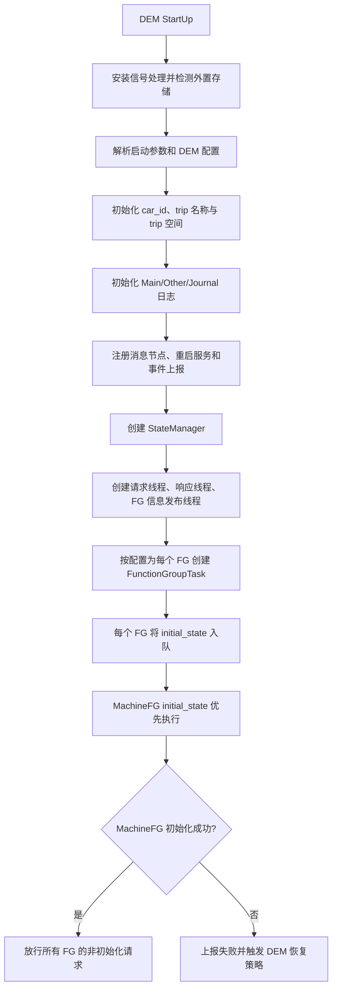
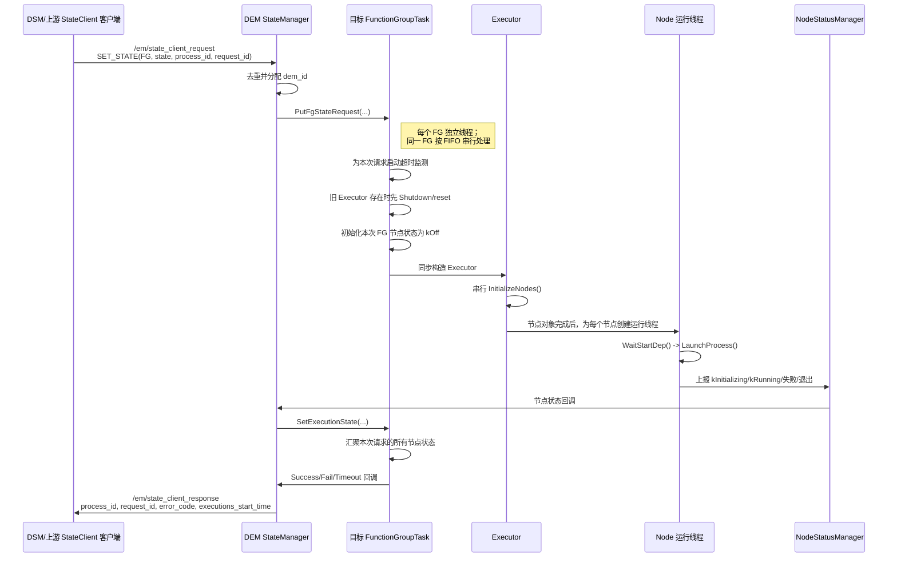
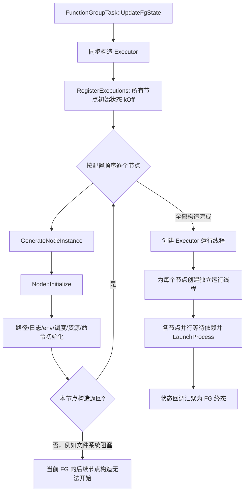

# DSM 模式切换 127 秒超时根因分析

## 基本信息

| 项目 | 内容 |
| --- | --- |
| 行程 | `SILYR-LPD19A-2068599_20260922_163610` |
| 分析对象 | `WORKING/GWM_SENTINEL_MODE -> WORKING/ALL_FUNCTION` |
| DSM 记录 | `16:42:07.817695 ... time_cost: 127s` |
| DSM 超时阈值 | 25 秒 |
| 结论置信度 | 高：外置 USB 文件系统阻塞是 127 秒延迟的主因；中低：尚不能由现有日志确定具体阻塞系统调用及底层 USB/介质原因。 |
| 证据范围 | 行程中的 DSM、DEM、perf collector 日志，以及 `/sandbox/onboard_application/dem` 源码；DSM 源码暂缺。 |

## 结论先行

此次 127 秒并非 DSM 状态机计算耗时，也不符合 CPU 饱和特征。主因是 DEM 在创建新节点时，同步访问外置 USB 文件系统 `/fs/usb0-0`，AEB 节点初始化在 `16:40:03.081` 至 `16:41:54.923` 间停滞约 **111.8 秒**。DEM 的节点创建处于同步、串行的关键路径，AEB 构造未返回前，后续节点不能继续创建，功能组无法返回成功，DSM 因而一直等待到 `16:42:07.817` 才完成模式切换。

`/fs/usb0-0` 是本行程的外部日志、触发文件和 DEM env 文件所在挂载点。现有日志尚不能把 111.8 秒精确归因到某一条系统调用；可疑范围包括文件/目录存在性检查、建目录、日志文件打开、env 文件打开/写入/关闭、权限修改等外置存储元数据操作。更底层的 USB 存储介质慢响应、BOT/SCSI 排队或重试、文件系统元数据阻塞、并发外置写入等是合理候选，但均需进一步 trace 证实。

## 事件经过

### 关键时间线

| 时间 | 观察到的事件 | 证据与含义 |
| --- | --- | --- |
| 16:40:00.822 | DSM 收到 `ALL_FUNCTION` 请求。 | [日志] `dsm/dr_dsm.INFO:962`。 |
| 16:40:00.825-16:40:02.927 | 原功能组停止。 | [日志] 停止过程约 2.1 秒，未见长停顿。 |
| 16:40:03.029 | DEM 开始创建 `IDriverFG`、`CalibrationFG` 的新状态及 RuntimeProperty。 | [日志] `dem.log...:2457` 附近。 |
| 16:40:03.066 | Calibration 节点的 env 文件写入日志出现，路径位于 `/fs/usb0-0`。 | [日志] `dem_other.log...:6905`。 |
| 16:40:03.081 | AEB 已完成多项外部 log/trigger 路径配置；最后一批日志仍指向 `/fs/usb0-0`。 | [日志] `dem.log...:2485-2495`。 |
| 16:40:03.081-16:41:54.920 | AEB 初始化日志出现约 111.8 秒空窗。期间 DEM 定期提示三个请求已存在、仍在处理。 | [日志] `dem.log...` 中 10 秒一次的 `Request ... already exists`；说明请求没有完成，也没有被 CPU 计算占满。 |
| 16:41:54.920 | AEB 的 env 文件日志终于出现，文件在 `/fs/usb0-0/.../logs/dem/other/`。 | [日志] `dem_other.log...:6995`。 |
| 16:41:54.923 | AEB 显示 `is created in executor`；DEM 才继续初始化其他节点。 | [日志] `dem.log...:2545-2546`。 |
| 16:41:57.719 | `VanguardFG` 成功。 | [日志] `dem.log...:2962`。 |
| 16:42:01.085 | `CalibrationFG` 成功。 | [日志] `dem.log...:3002-3010`。 |
| 16:42:07.817 | `IDriverFG` 成功；DSM 记录本次切换耗时 127 秒并上报超时。 | [日志] `dem.log...:3018-3030`、`dsm/dr_dsm.INFO:1193,1198`。 |

### 耗时拆分

```text
16:40:00.822  DSM 收到请求
   |-- 约 2.1 s -- 原状态停止
16:40:03.081  AEB 已进入包含外置路径/env 文件的初始化区间
   |-- 约 111.8 s -- 外置 USB 文件系统相关同步操作停滞（主耗时）
16:41:54.923  AEB 创建返回，DEM 恢复初始化并拉起节点
   |-- 约 12.9 s -- 节点启动、依赖就绪和功能组完成
16:42:07.817  DSM 完成切换
```

三段合计与 DSM 的 `127s` 一致。停顿后的模块启动时间多为秒级，例如 AEB 在构造完成后于 `16:42:00.071` 进入运行状态；这进一步表明主耗时发生在 DEM 的节点构造阶段，而非 AEB 算法运行阶段。

## 因果链

```text
外置 USB 文件系统 /fs/usb0-0 响应长时间阻塞
                 |
                 v
DEM 在 AEB 初始化中执行外置 log/trigger/env 路径的同步文件操作
                 |
                 v
Executor::InitializeNodes() 串行创建节点，AEB 构造未返回
                 |
                 v
后续节点创建、启动和 Function Group 成功结果全部后移
                 |
                 v
DSM 等待 DEM 状态响应，最终记录 127 秒模式切换超时
```

其中“外置文件系统操作阻塞”有日志和代码路径共同支撑；“底层 USB 为什么慢”没有直接的内核级证据，不能据此把根因定为某个盘、驱动或 `online_recorder`。

## DEM 源码如何放大该问题

### 状态切换和节点构造是同步关键路径

| 调用点 | 代码事实 | 对本问题的影响 |
| --- | --- | --- |
| `src/state_managers/fg_task.cc:190` | 已有 `Executor` 会同步 `Shutdown()` 并 `reset()`。 | 功能组状态更新并非立即返回。 |
| `src/state_managers/fg_task.cc:224` | 直接 `std::make_unique<Executor>(...)`。 | 新 Executor 的构造耗时位于状态切换路径。 |
| `src/state_managers/executor.cc:27-38` | `Executor` 构造函数先执行 `InitializeNodes()`，再创建执行线程。 | 节点初始化完成前不能进入正常异步执行阶段。 |
| `src/state_managers/executor.cc:64-88` | `InitializeNodes()` 对 `node_names_` 使用普通 `for` 循环逐个 `GenerateNodeInstance()`。 | 单个节点被 I/O 卡住，会阻塞该 Executor 内随后的节点。 |
| `src/node/executable_node_base.cc:98-104` | 节点 `Initialize()` 依序执行 `InitializePaths()`、`InitializeLogger()`、`InitializeEnv()` 等。 | 路径、日志和环境文件的同步文件操作在节点构造期间执行。 |

### 外置文件系统操作路径

1. [源码] `executable_node_base.cc:143-164` 的 `InitializePaths()` 基于 `dr_log_dir` 构造节点日志路径，并调用 `CreateDir()`、`ExistFile()`。
2. [源码] `executable_node_base.cc:192-220` 的 `InitializeLogger()` 将节点日志文件设为该目录下的文件，并构造 `NodeLogger`；其文件打开可能触及外置路径。
3. [源码] `executable_node_base.cc:237-289` 的 `InitializeEnv()` 会遍历每个数据存储路径，执行 `ExistFile()`、`CreateDir()`、`std::filesystem::permissions()`；本行程的模块日志和外部 trigger 目录均落在 `/fs/usb0-0`。
4. [源码] `executable_node_base.cc:357-367` 生成 `env_file_*`，随后调用 `WriteEnvFile()`。
5. [源码] `common/environment.cc:164-167` 中 `WriteEnvFile()` 调用 `WriteFile()` 后才记录 env 文件内容；`common/file.cc:337-369` 的 `WriteFile()` 包含父目录检查、打开、写入、关闭和权限设置。该调用默认 `sync_after_write=false`，因此不能将本次 env 文件写入直接归咎为 `fsync`。

本行程启动时，DEM 已明确选择 `/fs/usb0-0` 作为 `DR_EXTERNAL_MOUNT_POINT`，而 trip、节点日志、DEM 日志目录均在该挂载点下：

- [日志] `dem/dem_prefix.log.20260922.083610.715326-20260922.083610.895811:56`：`Select /fs/usb0-0 as DR_EXTERNAL_MOUNT_POINT`。
- [日志] 同文件 `:63-74`：trip/log/DEM log 目录均指向 `/fs/usb0-0`。

因此，AEB 初始化空窗紧邻外置路径配置，且空窗结束时正好出现外置位置的 `env_file_aeb_kFullFunction_30`，是判断文件系统阻塞的关键关联证据。

## 为什么 CPU 不高仍会卡 112 秒

低 CPU 与“线程阻塞在 I/O 或文件系统服务上”完全一致。等待内核、设备驱动或文件系统回复的线程通常不消耗用户态 CPU；因此 CPU 利用率不能排除长 I/O 等待。

- [日志] `perf_collector/deep_os_monitor_log/thread_logs/thread_info.log.20260922.163612.781103.tmp:1749`：`devb-umass` 约 12.68%。
- [日志] 同文件 `:1762`：`io-usb-otg` 约 36.36%。
- [日志] 同文件 `:1758`：`dr_dsm` 约 0.14%。
- [日志] `perf_collector` 的 `systrace.log` 在该时段显示整机负载约 11%-12%、idle 约 88%-89%。

这些数据支持“DSM 没有因 CPU 饱和而延迟”，也显示 USB 存储栈存在可见活动；但仅凭 CPU 占比，不能证明 USB 驱动一定发生故障。

## 并非单次偶发

同一行程随后两次模式切换都出现接近 112 秒的 DEM 初始化空窗，形态与本次一致：

| 目标模式 | DEM 停顿区间 | 停顿时长 | DSM 最终耗时 | DSM 证据 |
| --- | --- | ---: | ---: | --- |
| `ALL_FUNCTION` | 16:40:03.081-16:41:54.923 | 约 111.8 s | 127 s | `dr_dsm.INFO:1198` |
| `ONLINE_CALIBRATION` | 16:44:12.917-16:46:04.597 | 约 111.7 s | 136 s | `dr_dsm.INFO:1712` |
| `DATA_COLLECTOR_PARKING` | 16:47:28.406-16:49:20.576 | 约 112.2 s | 133 s | `dr_dsm.INFO:2093` |

[日志] 后两次的停顿起止可在 `dem.log...:4927-4945` 和 `:6286-6321` 对应观察到。近乎固定的约 112 秒模式，更像底层 I/O 等待/重试窗口或共享存储资源阻塞，而不是单个业务模块的随机计算慢。

## 证据分级与结论边界

| 结论 | 级别 | 依据 |
| --- | --- | --- |
| DSM 本次切换实际耗时 127 秒，超过 25 秒阈值。 | [日志事实] | `dr_dsm.INFO:1193,1198`。 |
| AEB 构造阶段存在约 111.8 秒空窗，之后才继续创建节点。 | [日志事实] | AEB 外置路径日志、env 文件日志、`is created in executor` 的时间差。 |
| DEM 在节点构造期同步、串行初始化节点，并做路径/日志/env 文件 I/O。 | [源码事实] | `fg_task.cc`、`executor.cc`、`executable_node_base.cc`、`environment.cc`、`file.cc`。 |
| AEB 的停顿经 DEM 串行初始化传递为 FG/DSM 切换延迟。 | [高置信推断] | 时间顺序与同步调用链闭合，且停顿结束后各 FG 依次成功。 |
| 阻塞发生在某一个具体调用（如 `stat`、`mkdir`、`open`、`write`、`close` 或 `chmod`）。 | [未证实] | 现有 DEM 日志缺少单操作耗时、errno 与系统调用 trace。 |
| USB 盘、USB 驱动、BOT/SCSI 重试、并发外部写入中哪一项是第一触发者。 | [未证实] | 未找到保留日志中的 USB reset/disconnect/EIO/SCSI timeout 直接证据。 |

### 已排除或暂不作为主因的项

- [日志事实] `Fsync directory failed: /opt/map/data/oem/cache/dsm, errno: Invalid argument` 在正常和异常切换中均出现，且路径为内部目录；目前没有证据把它与 112 秒空窗关联，应作为独立告警处理。
- [日志事实] 保留日志未见 GPU fault、OOM、WDT、进程崩溃等能解释该固定停顿的事件。
- [推断] `online_recorder` 可能参与外置 USB 并发写入，但目前只具备“同用外置存储”的相关性，不能作为确认触发源。

## 建议的验证方案

1. **存储位置 A/B 实验（优先级最高）**：仅将 DEM 的 `env_file_*`、DEM other 日志、节点日志和外置 trigger 目录切换到内部存储（如 `/opt/map/data/oem`，或受控的 `/tmp`）后重跑同类切换。若 112 秒空窗消失且切换回到阈值内，可强力确认外置文件系统是直接原因。
2. **减少并发外置写入**：单独停止或限流写 USB 的服务（包括 `online_recorder`），保持 DEM 路径不变重试。该实验只能验证竞争影响，不应预设某进程是根因。
3. **补齐 DEM 操作级观测**：为 `InitializePaths()`、`InitializeLogger()`、`InitializeEnv()`、`ExistFile()`、`CreateDir()`、日志文件 open、`WriteFile()` 的 open/write/close/permissions 逐项记录单调时钟耗时、目标路径、返回值和 errno。日志应避免打印完整 env 内容。
4. **使用 QNX `tracelogger`/SAT 复现采样**：关联 DEM 线程的 `SEND/REPLY`/阻塞状态、文件系统服务和 `devb-umass`/`io-usb-otg`，确定实际卡住的系统调用及服务端等待链。
5. **存储链路关联**：同步采集 USB 设备、BOT/SCSI 事件、reset/retry、介质健康与写入吞吐，并按时间对齐 112 秒窗口。

## 修复建议

| 优先级 | 建议 | 目的 |
| --- | --- | --- |
| P0 | 将模式切换关键路径上的 DEM env/config 文件移到内部存储，或在内存中生成后交给子进程；不要依赖 USB 可用性。 | 消除外设 I/O 对状态切换时延的直接影响。 |
| P0 | 将外置日志/trigger 目录创建、权限修复、日志初始化延后或异步化；外置存储不可用或慢时降级到内部目录。 | 使模式切换仍可在时限内完成。 |
| P1 | 对所有文件系统操作增加耗时、errno、路径类别（内部/外置）遥测和超时告警。 | 下次可直接定位卡点，避免只能从日志空窗反推。 |
| P1 | 预创建目录、缓存已验证目录状态，并避免每次节点初始化重复 `exists`/权限修改。 | 减少 USB 元数据访问次数。 |
| P2 | 在完成 I/O 隔离后再评估节点并行初始化。 | 并行化可减少独立初始化耗时，但无法解决共享 USB 本身的阻塞，且可能加剧竞争。 |

## 责任边界建议

- **DEM**：消除关键路径对外置存储的同步依赖；补齐操作级 telemetry 和内部存储降级机制。
- **平台/存储**：通过 trace 确认 USB 文件系统服务、驱动、介质或队列的实际等待点，并排查 112 秒固定等待的来源。
- **集成侧**：盘点所有 `/fs/usb0-0` 并发写入者，构造“DEM 初始化 + 实际业务写盘”的复现矩阵。

在未完成 A/B 实验和 QNX trace 前，建议将问题定性为：**DEM 模式切换关键路径被外置 USB 文件系统长时间阻塞；USB 低层触发机制待证实。**

## 附录：DEM 启动与模式切换执行流程（源码走读）

本节基于 `/sandbox/onboard_application/dem` 当前检出版本（分支 `zyf/stderr_env_set`，提交 `b16119c`）的源码整理。DEM 源码能够证明其接收单个 Function Group（FG）状态请求、构造节点、拉起进程、汇聚节点状态并回包的流程；DSM 源码未提供，故不对 DSM 如何把整车模式拆分为多个 FG、如何聚合多个 FG 回包作源码级断言。文中涉及“DSM 等待多个 FG”的描述均以本行程 DSM/DEM 时序为依据，明确标为推断。

### 1. 关键对象与职责

| 对象 | 源码位置 | 职责 |
| --- | --- | --- |
| `StateManager` | `src/state_managers/state_manager.cc` | 订阅 StateClient 请求、为请求分配 DEM ID、路由至目标 FG、汇聚回包并发布响应。 |
| `FunctionGroupTask` | `src/state_managers/fg_task.cc` | 每个 FG 一个任务对象和请求处理线程；同一 FG 的请求按 FIFO 串行处理。 |
| `Executor` | `src/state_managers/executor.cc` | 针对“一次 FG 状态切换”构造该状态所需的节点实例，并为节点创建运行线程。 |
| `ExecutableNodeBase` / 平台节点 | `src/node/executable_node_base.cc`、`src/node/platform/qnx/executable_node_platform.cc` | 完成单节点的路径、日志、环境、调度、资源和启动命令初始化；QNX 上再以 `posix_spawnp()` 拉起进程。 |
| `NodeStatusManager` | `src/state_managers/node_status_manager.cc` | 接收节点的 `kInitializing`、`kRunning`、失败或退出状态，并通过回调送回 `StateManager`。 |
| `FunctionGroupStatusManager` | `src/state_managers/fg_runtime_status.cc` | 维护 FG 运行态及 Success/Fail/Timeout 等汇聚结果。 |

DEM 不直接以 `WORKING/ALL_FUNCTION` 这类 DSM 整车模式名作为执行单位。它对外订阅 `/em/state_client_request`，接收 `SET_STATE(function_group_name, state_name)`；完成后向 `/em/state_client_response` 发布 `ExecutionManagementResponse`（`state_manager.cc:50-53, 517-539`）。因此，DSM 或其他上游 StateClient 客户端必须已经把整车模式转换为了一个或多个 FG 状态请求，DEM 才能执行。

### 2. DEM 进程启动流程

`main.cc:64-222` 的 `StartUp()` 先完成 DEM 自身的初始化，再创建 `StateManager`。其中包括外置存储探测、参数与配置解析、trip 名与空间管理、主/other/journal 日志、消息节点、重启服务和事件上报服务。`StateManagerSingleton::GetInstance()` 创建后，DEM 进入等待退出信号的主循环；后续的状态请求由各工作线程处理，而不是主线程同步处理。



这里有两个容易混淆的门槛：

1. `machine_config` 中必须存在 `MachineFG`，且必须包含 `kStartUp`；各 FG 的 `initial_state` 由配置读取（`machine_config.cc:80-145`）。
2. `FunctionGroupTask` 创建时立即把自身 `initial_state` 放入队列；但业务 FG 收到的后续外部请求会在 `ProcessPendingStateRequest()` 中等待 `start_request_flag_`。只有 `MachineFG` 初始化得到 Success 后，`StateManager::SendMachineInitState()` 才遍历所有 task，调用 `StartProcessPendingStateRequest()` 放行（`fg_task.cc:34-50, 70-125`；`state_manager.cc:229-270`）。

也就是说，DEM “进程已启动、已经能接收消息”不等于所有业务 FG 已经允许执行模式切换；MachineFG 初始化成功是业务请求的前置条件。

### 3. 一次 FG 状态切换的请求与回包流程



具体处理如下：

1. `StateManager::PutStateRequest()` 用 `(process_id, request_id)` 做重复请求检查，生成内部 `dem_id`，校验 FG 名称后将请求投递给目标 `FunctionGroupTask`（`state_manager.cc:88-141`）。因此 DEM 日志中的 `DEM_ID [x] Receive request` 是 DEM 已接收并路由请求的时间点，不是节点已经启动成功的时间点。
2. 每个 `FunctionGroupTask` 有独立的 `fg_task_proc_<fg_name>` 线程；不同 FG 可并行处理，而同一 FG 的 `pending_state_request_` 采用 FIFO 队列（`fg_task.cc:28-32, 52-58, 70-87`）。这解释了本行程中 `IDriverFG`、`CalibrationFG`、`VanguardFG` 可以同时推进，但不能说明同一 FG 内所有节点也是并行初始化。
3. 对 `SET_STATE`，任务线程先启动本次请求的超时监测，然后调用 `UpdateFgState()`（`fg_task.cc:116-125`）。若原状态已有 `Executor`，该函数会同步 `Shutdown()` 和 `reset()`；随后设置节点初始状态、初始化 FG runtime status，并直接同步构造新的 `Executor`（`fg_task.cc:190-225`）。
4. 节点的状态变化经 `NodeStatusManager` 回调到 `StateManager::UpdateFgTaskExecutionState()`，再进入 `FunctionGroupTask::SetExecutionState()` 汇聚（`state_manager.cc:213-220`；`fg_task.cc:329-344`）。
5. 汇聚规则是：任一节点为 `kInitFailed` 或 `kAbnormalExit` 则 Fail；任一节点仍为 `kInitializing` 或 `kOff` 则结果保持 Unknown；只有所有节点都脱离这些未完成/失败状态后才能得到 Success。Unknown 不会触发回包（`fg_task.cc:259-305`）。
6. 得到终态后，`SendSetStateResponse()` 将上游原始的 `process_id/request_id`、错误码和各 execution 的开始时间放入响应队列；响应线程将其发布至 `/em/state_client_response`（`state_manager.cc:371-423, 541-580`）。

### 4. 同一 FG 内：串行构造与并行拉起是两个阶段

这是理解本次 127 秒问题最关键的 DEM 行为。



- `Executor` 构造函数严格按 `InitializeNodes()`、`InitializeExecuteThread()` 的顺序执行（`executor.cc:27-39`）。
- `InitializeNodes()` 对 `node_names_` 使用普通 `for` 循环逐个 `GenerateNodeInstance()`；单个节点的 `Initialize()` 没有返回前，下一个节点不会进入构造（`executor.cc:64-88`）。
- 仅当所有节点对象构造完毕后，`InitializeExecuteThread()` 才为节点建立独立的 `*_node` 线程（`executor.cc:91-122`）。它等待的是“创建节点运行线程”的执行器线程结束，并不等待子进程结束；节点的实际 `Run()` 在各自线程里进行。
- 节点运行线程先等待启动依赖 `WaitStartDep()`，再进入 `LaunchProcess()`（`executable_node_base.cc:924-928`）。因此，“`is created in executor`”表示节点对象构造完成，既不等于依赖已满足，也不等于进程已进入 `kRunning`。

这也说明了并行化的边界：**FG 之间可以并行；一个 FG 内的进程运行可以并行；但节点对象的构造和构造期间的文件系统操作目前是串行关键路径。**

### 5. 单个可执行节点在构造时具体做什么

`ExecutableNodeBase::Initialize()` 的固定顺序为：配置校验、`InitializePaths()`、`InitializeSignal()`、`InitializeLogger()`、`InitializeEnv()`、`InitializeScheduling()`、`InitializeResourceLimit()`、`InitializeCommand()`（`executable_node_base.cc:67-105`）。其中与本问题最相关的是路径、日志和环境初始化：

| 阶段 | 主要操作 | 与 USB 阻塞的关系 |
| --- | --- | --- |
| `InitializePaths()` | 根据日志和 other 路径构造节点目录、检查/创建目录。 | `ExistFile()`、`CreateDir()` 等目录元数据访问会直接触达挂载路径。 |
| `InitializeLogger()` | 按节点日志路径创建 `NodeLogger`。 | 可能打开/创建日志文件，路径位于外置挂载时会访问 USB 文件系统。 |
| `InitializeEnv()` | 从当前环境复制变量；遍历数据存储路径；对节点目录执行存在性检查、创建、`chown` 和 `std::filesystem::permissions()`；合并 machine/start 配置环境。 | 本行程的模块存储、日志和 trigger 路径位于 `/fs/usb0-0` 时，检查目录、建目录和改权限均处于同步构造期。 |
| `WriteEnvFile()` | 构造排序后的环境内容，写入 `env_file_*`；非 root 场景还写 `export_env_file_*`。 | `WriteFile()` 中的父目录检查、打开、写入、关闭和权限设置可能等待外置文件系统。 |
| 调度、资源和命令 | 读取调度/资源配置，拼接最终启动命令。 | 一般不需要访问外置文件系统，但仍发生在进程启动前。 |

`InitializeEnv()` 中生成 env 文件的路径是 `node_log_other_/env_file_<node>_<state>_<fg_id>`，然后直接调用 `WriteEnvFile()`（`executable_node_base.cc:357-367`）。`WriteEnvFile()` 在调用 `WriteFile()` **之后**才由 `DemOtherLogger` 打印 env 内容（`environment.cc:164-167`）。所以本行程中 “AEB 的 env 文件日志出现在 16:41:54.920” 只能证明写操作已返回，不能证明 `WriteFile()` 是空窗的唯一或第一个阻塞调用；阻塞还可能发生在更早的目录检查、建目录、权限修复或日志文件初始化。

### 6. 节点进程如何真正启动

节点完成构造并进入运行线程后，`LaunchProcess()` 先置节点为 `kInitializing`，再调用平台实现的 `ExecuteCommand()`；成功后记录 PID、设置资源限制。若该节点关闭了 `report_state`，DEM 会直接置为 `kRunning`，否则等待进程自身的状态上报（`executable_node_base.cc:634-706`）。

QNX 平台的 `ExecuteCommand()` 会：构造 `envp/argv`、配置进程组和工作目录、把 stdout/stderr 重定向到节点日志文件，并调用 `posix_spawnp()`；启动失败时最多重试 5 次、每次间隔 1 秒（`executable_node_platform.cc:132-282`）。这条路径同样可能访问节点日志目录，但它发生在“节点构造完成之后”。本次约 111.8 秒空窗出现在 AEB `is created in executor` 之前，因此现有证据将主卡点定位在构造期，而不是 `posix_spawnp()` 重试期。

### 7. 与本次 127 秒事件逐项对应

| 行程现象 | DEM 源码中的位置 | 因果解释 |
| --- | --- | --- |
| `IDriverFG` 内 AEB 在 16:40:03.081-16:41:54.923 没有继续初始化日志。 | `FunctionGroupTask::UpdateFgState()` 同步构造 `Executor`；`Executor::InitializeNodes()` 串行构造节点。 | AEB 的节点构造未返回，会阻塞 `IDriverFG` 内后续节点构造，也会推迟所有节点运行线程的创建。 |
| 空窗结束后才出现 AEB 的 `env_file_*` 记录和 `is created in executor`。 | `InitializeEnv()` 末尾同步调用 `WriteEnvFile()`；`Executor` 仅在 `GenerateNodeInstance()` 返回后打印 created 日志。 | 时间顺序把卡点收敛到 AEB 构造期的路径/日志/env 文件系统操作范围；不能仅凭 env 日志锁定为 write。 |
| `VanguardFG`、`CalibrationFG` 先完成，`IDriverFG` 最后在 16:42:07.817 成功。 | 不同 `FunctionGroupTask` 有独立处理线程。 | 各 FG 可并行推进；`IDriverFG` 的串行构造阻塞不会阻止其他 FG 成功，但会使其自身回包后移。 |
| DSM 在 `IDriverFG` 成功时记录整车模式切换完成，合计 127 秒。 | DEM 只能证明单个 FG 回包；DSM 聚合代码缺失。 | **基于日志的高置信推断**：DSM 等待与 `ALL_FUNCTION` 有关的 FG 结果，最慢的 `IDriverFG` 决定了本次整车模式完成时间。 |

从 DEM 视角，本次时序可概括为：

```text
ALL_FUNCTION 对应的多个 FG 请求到达 DEM
  -> 各 FG 并行进入各自的 FunctionGroupTask
  -> IDriverFG 同步构造 AEB 时，在 /fs/usb0-0 相关文件操作范围内等待约 111.8 s
  -> IDriverFG 尚未创建完全部节点，不能进入节点并发运行和状态收敛
  -> 其他 FG 可以先回包；IDriverFG 延后回包
  -> DSM 最终在 IDriverFG 成功的同一时刻完成 ALL_FUNCTION（日志高置信关联）
```

因此，修复和观测应优先覆盖 **`ExecutableNodeBase::Initialize()` 的构造期**，而不能只测 `posix_spawnp()` 或只测 AEB 主进程启动耗时。最有效的打点层级是 `InitializePaths()`、`InitializeLogger()`、`InitializeEnv()` 中每一个路径操作，以及 `WriteFile()` 内的目录检查、open、write、close、权限设置；每项采用单调时钟记录开始/结束、路径类别、返回值和 errno，异步写日志即可，不应在关键路径上同步刷盘。
